# Java笔记

* [0.编程规范](#0编程规范)
* [1.计算机的诞生与发展](#1计算机的诞生与发展)
* [2.计算机基础知识](#2计算机基础知识)
* [3.Java语言概述](#3java语言概述)
* [4.Java程序详解](#4java程序详解)
* [5.二进制的原/反/补码](#5二进制的原反补码)
* [6.Java中的关键字](#6java中的关键字)
* [7.Java中的标识符](#7java中的标识符)
* [8.Java中的变量（成员变量：类的第一成员）](#8java中的变量成员变量类的第一成员)
* [9.Java中的常量](#9java中的常量)
* [10.Java中的数据类型](#10java中的数据类型)
  * [**整数类型**](#整数类型)
  * [浮点数类型](#浮点数类型)
  * [字符类型](#字符类型)
  * [数据类型的转换](#数据类型的转换)
  * [大数](#大数)
* [11.Java中的运算符](#11java中的运算符)
  * [**算术运算符**](#算术运算符)
  * [赋值运算符](#赋值运算符)
  * [关系运算符](#关系运算符)
  * [逻辑运算符](#逻辑运算符)
  * [位运算符](#位运算符)
  * [三元运算符](#三元运算符)
  * [运算符优先级](#运算符优先级)
* [12.从键盘获取输入](#12从键盘获取输入)
* [13.流程控制语句](#13流程控制语句)
  * [顺序结构](#顺序结构)
  * [分支结构](#分支结构)
    * [**if-else**](#if-else)
    * [switch-case](#switch-case)
    * [程序实例](#程序实例)
  * [循环结构](#循环结构)
    * [for循环](#for循环)
    * [while循环](#while循环)
    * [do...while循环](#dowhile循环)
    * [嵌套循环](#嵌套循环)
    * [程序实例](#程序实例-1)
    * [循环总结](#循环总结)
  * [三个关键字](#三个关键字)
    * [break](#break)
    * [continue](#continue)
    * [return](#return)
    * [关键字和嵌套循环](#关键字和嵌套循环)
* [14.方法(函数)（方法：类的第三成员）](#14方法函数方法类的第三成员)
  * [方法的定义](#方法的定义)
    * [返回值类型](#返回值类型)
    * [参数列表](#参数列表)
  * [方法的调用](#方法的调用)
  * [递归（了解）](#递归了解)
  * [方法的重载](#方法的重载)
* [15.数组](#15数组)
  * [创建数组](#创建数组)
  * [使用数组](#使用数组)
  * [实例演示](#实例演示)
  * [总结](#总结)
  * [其他细节](#其他细节)
    * [数组的初始化](#数组的初始化)
    * [数组中数据类型的默认值](#数组中数据类型的默认值)
    * [数组的参数传递](#数组的参数传递)
    * [Arrays工具类](#arrays工具类)
    * [可变参数](#可变参数)
* [16.二维数组](#16二维数组)
  * [创建数组](#创建数组-1)
  * [使用数组](#使用数组-1)
  * [动态初始化](#动态初始化)
  * [静态初始化](#静态初始化)
* [17.开发工具IDE](#17开发工具ide)
  * [工具类型](#工具类型)
  * [Eclipse安装](#eclipse安装)
  * [Eclipse的使用](#eclipse的使用)
  * [Eclipse的基本设置及快捷键](#eclipse的基本设置及快捷键)
* [18.面向对象](#18面向对象)
  * [面向对象简述](#面向对象简述)
  * [类和对象的关系](#类和对象的关系)
  * [如何创建对象（构造器：类的第二成员）](#如何创建对象构造器类的第二成员)
  * [如何使用对象](#如何使用对象)
  * [对象小结](#对象小结)
  * [类小结](#类小结)
  * [this关键字](#this关键字)
  * [实例展示](#实例展示)
* [19.封装（面向对象第一大特性）](#19封装面向对象第一大特性)
* [20.代码块（代码块：类的第四成员）](#20代码块代码块类的第四成员)
* [21.静态（static）](#21静态static)
  * [定义](#定义)
  * [static修饰属性](#static修饰属性)
  * [static修饰方法](#static修饰方法)
  * [static修饰代码块](#static修饰代码块)
  * [类中初始化顺序](#类中初始化顺序)
* [22.继承（面向对象第二大特性）](#22继承面向对象第二大特性)
  * [定义以及实例](#定义以及实例)
  * [子类对象实例化过程（继承的过程）](#子类对象实例化过程继承的过程)
  * [super关键字](#super关键字)
    * [super修饰构造器](#super修饰构造器)
    * [super修饰属性](#super修饰属性)
    * [super修饰方法](#super修饰方法)
* [23.多态（面向对象第三大特性）](#23多态面向对象第三大特性)
  * [概念](#概念)
  * [向上转型](#向上转型)
  * [向下转型](#向下转型)
    * [instanceof关键字](#instanceof关键字)
* [24.final关键字](#24final关键字)
  * [final 修饰类（太监类）](#final-修饰类太监类)
  * [final修饰属性（常量）](#final修饰属性常量)
  * [final修饰方法](#final修饰方法)
* [25.抽象类（abstract关键字）](#25抽象类abstract关键字)
  * [定义](#定义-1)
  * [抽象方法](#抽象方法)
  * [抽象类](#抽象类)
  * [实例：抽象类演示](#实例抽象类演示)
  * [实例：创建抽象类对象](#实例创建抽象类对象)
* [26.接口（interface）](#26接口interface)
  * [如何定义接口](#如何定义接口)
  * [如何实现接口](#如何实现接口)
  * [使用接口进行开发的意义](#使用接口进行开发的意义)
    * [意义](#意义)
    * [关系](#关系)
  * [抽象类实例](#抽象类实例)
* [27.内部类（内部类：类的第五成员）](#27内部类内部类类的第五成员)
  * [内部类定义](#内部类定义)
  * [内部类分类](#内部类分类)
    * [局部内部类](#局部内部类)
    * [匿名内部类](#匿名内部类)
* [28.权限修饰符](#28权限修饰符)
  * [public 公共权限](#public-公共权限)
  * [default 默认权限（不加修饰符）](#default-默认权限不加修饰符)
  * [protected 受保护权限](#protected-受保护权限)
  * [private 私有权限](#private-私有权限)
* [29.Java中的包](#29java中的包)
* [30.Object类](#30object类)
  * [Object类中的结构](#object类中的结构)
  * [toString()方法](#tostring方法)
  * [equals(Object obj)方法](#equalsobject-obj方法)
  * [hashCode()方法（详情在集合）](#hashcode方法详情在集合)
* [31.String类](#31string类)
  * [编码表（字符集）](#编码表字符集)
  * [String构造器](#string构造器)
    * [**常用构造方法**](#常用构造方法)
  * [String方法](#string方法)
    * [常用方法](#常用方法)
  * [String面试题](#string面试题)
  * [StringBuffer类](#stringbuffer类)
    * [StringBuffer构造器](#stringbuffer构造器)
    * [StringBuffer方法](#stringbuffer方法)
      * [常用方法](#常用方法-1)
  * [StringBuilder类](#stringbuilder类)
* [32.基本数据类型的包装类](#32基本数据类型的包装类)
  * [定义和介绍](#定义和介绍)
  * [包装类中常用的方法](#包装类中常用的方法)
  * [拆箱和装箱](#拆箱和装箱)
* [33.Math类](#33math类)
  * [Math常用方法](#math常用方法)
* [34.Random类](#34random类)
  * [Random构造器](#random构造器)
  * [Random方法](#random方法)
    * [常用方法](#常用方法-2)
* [35.System类](#35system类)
  * [System方法](#system方法)
    * [常用方法](#常用方法-3)
* [36.Date类](#36date类)
  * [Date构造器](#date构造器)
  * [Date方法](#date方法)
    * [Date常用方法](#date常用方法)
  * [SimpleDateFormat类](#simpledateformat类)
    * [常用构造器](#常用构造器)
    * [常用方法](#常用方法-4)
  * [Calendar类](#calendar类)
    * [Calendar字段](#calendar字段)
    * [常用方法](#常用方法-5)
  * [LocalDate本地日期](#localdate本地日期)
    * [Period和Duration类](#period和duration类)
      * [Period计算日期之间的偏差](#period计算日期之间的偏差)
      * [Duration计算时间之间的偏差](#duration计算时间之间的偏差)
      * [DateTimeFormatter](#datetimeformatter)
* [37.正则表达式](#37正则表达式)
  * [Pattern类](#pattern类)
    * [Pattern字段](#pattern字段)
    * [Pattern方法](#pattern方法)
  * [正则表达式匹配套路](#正则表达式匹配套路)
  * [正则表达式的书写](#正则表达式的书写)
    * [字符内容](#字符内容)
    * [字符类](#字符类)
    * [字符数量](#字符数量)
    * [边界匹配器](#边界匹配器)
  * [练习](#练习)
* [38.阶段性练习](#38阶段性练习)
* [39.异常](#39异常)
  * [异常的概念](#异常的概念)
  * [异常的分类](#异常的分类)
    * [常用的运行时异常](#常用的运行时异常)
    * [查询其他运行时异常的方法](#查询其他运行时异常的方法)
  * [异常生成机制](#异常生成机制)
  * [异常的处理方案](#异常的处理方案)
    * [热处理异常](#热处理异常)
    * [冷处理编译时异常](#冷处理编译时异常)
  * [自定义异常](#自定义异常)
* [40.集合](#40集合)
  * [概念](#概念-1)
    * [特点](#特点)
    * [定义](#定义-2)
  * [集合类体系](#集合类体系)
    * [Collection](#collection)
      * [List接口](#list接口)
        * [ArrayList(常用)](#arraylist常用)
        * [LinkedList](#linkedlist)
      * [Set接口](#set接口)
        * [HashSet（HashMap）](#hashsethashmap)
        * [TreeSet（TreeMap）](#treesettreemap)
        * [LinkedHashSet](#linkedhashset)
      * [Collections工具类](#collections工具类)
      * [单列集合转数组](#单列集合转数组)
      * [遍历Collection（迭代器）](#遍历collection迭代器)
      * [获得迭代器](#获得迭代器)
      * [操作迭代器](#操作迭代器)
      * [常用方法](#常用方法-6)
      * [方法的搭配](#方法的搭配)
      * [注意事项](#注意事项)
    * [Map](#map)
      * [遍历Map](#遍历map)
        * [方式一(常用)](#方式一常用)
        * [方式二](#方式二)
        * [方式三(须知)](#方式三须知)
      * [HashMap(常用)](#hashmap常用)
      * [LinkedHashMap](#linkedhashmap)
      * [Hashtable](#hashtable)
      * [Vector](#vector)
      * [TreeMap](#treemap)
      * [Properties](#properties)
  * [超级for循环](#超级for循环)
    * [优缺点](#优缺点)
  * [泛型](#泛型)
    * [出现之前](#出现之前)
    * [安全机制](#安全机制)
    * [初识泛型](#初识泛型)
    * [使用须知](#使用须知)
    * [注意事项](#注意事项-1)
* [41.阶段性练习](#41阶段性练习)
* [42.多线程](#42多线程)
  * [进程](#进程)
  * [线程（Thread）](#线程thread)
    * [相关概念](#相关概念)
  * [Java实现线程程序](#java实现线程程序)
    * [Thread类](#thread类)
    * [Thread类方法](#thread类方法)
    * [线程优先级(了解)](#线程优先级了解)
    * [Runnable接口](#runnable接口)
  * [线程安全问题](#线程安全问题)
    * [典例：售票问题](#典例售票问题)
    * [方案：同步代码块(synchronized)](#方案同步代码块synchronized)
      * [同步代码块保证线程安全的原理](#同步代码块保证线程安全的原理)
    * [同步方法：常见的一种表示方法](#同步方法常见的一种表示方法)
  * [死锁问题](#死锁问题)
  * [Lock 接口(锁接口)](#lock-接口锁接口)
  * [线程通信的方法](#线程通信的方法)
  * [生产者与消费者案例](#生产者与消费者案例)
    * [多生产和多消费](#多生产和多消费)
    * [sleep()和wait()的区别](#sleep和wait的区别)
    * [生产者和消费者案例性能问题](#生产者和消费者案例性能问题)
      * [阻塞队列方案(两大接口优化)](#阻塞队列方案两大接口优化)
    * [Lock锁的实现原理](#lock锁的实现原理)
  * [单例设计模式](#单例设计模式)
    * [定义](#定义-3)
    * [创建方法](#创建方法)
      * [懒汉式单例模式](#懒汉式单例模式)
        * [懒汉式的安全问题](#懒汉式的安全问题)
      * [饿汉式单例模式](#饿汉式单例模式)
  * [关键字volatile](#关键字volatile)
  * [线程池ThreadPool](#线程池threadpool)
    * [Executors类](#executors类)
    * [线程池的使用](#线程池的使用)
    * [Callable接口](#callable接口)
    * [ConcurrentHashMap](#concurrenthashmap)
    * [线程的状态图-生命周期](#线程的状态图-生命周期)
* [43.File类(操作文件夹，文件和路径)](#43file类操作文件夹文件和路径)
  * [File类的构造方法](#file类的构造方法)
  * [File类的判断方法](#file类的判断方法)
    * [绝对/相对路径](#绝对相对路径)
  * [File类的创建方法](#file类的创建方法)
  * [File类的删除方法](#file类的删除方法)
  * [File类的获取方法](#file类的获取方法)
  * [File类的遍历方法](#file类的遍历方法)
* [44.I/O流(操作文件中的数据)](#44io流操作文件中的数据)
  * [相关概念](#相关概念-1)
  * [I/O流对象的分类](#io流对象的分类)
    * [按照操作的文件类型分类](#按照操作的文件类型分类)
    * [按照数据流向分类](#按照数据流向分类)
    * [I/O流对象的分类归纳](#io流对象的分类归纳)
  * [字节流](#字节流)
    * [字节输出流](#字节输出流)
      * [FileOutputStream 实现类](#fileoutputstream-实现类)
      * [字节输出流异常处理](#字节输出流异常处理)
    * [字节输入流](#字节输入流)
      * [FileInputStream 实现类](#fileinputstream-实现类)
    * [文件复制](#文件复制)
    * [字节流的缓冲流](#字节流的缓冲流)
      * [BufferedOutputStream 构造方法](#bufferedoutputstream-构造方法)
      * [BufferedInputStream 构造方法](#bufferedinputstream-构造方法)
      * [字节缓冲流实现文件复制](#字节缓冲流实现文件复制)
  * [字符流](#字符流)
    * [Writer类](#writer类)
      * [OutputStreamWriter 实现类](#outputstreamwriter-实现类)
    * [Reader类](#reader类)
      * [InputStreamReader 实现类](#inputstreamreader-实现类)
    * [便捷类](#便捷类)
    * [字符流的缓冲流](#字符流的缓冲流)
      * [BufferedWriter 构造方法](#bufferedwriter-构造方法)
      * [BufferedReader 构造方法](#bufferedreader-构造方法)
    * [禁止使用字符流复制文本文件](#禁止使用字符流复制文本文件)
  * [打印流](#打印流)
  * [基本数据流](#基本数据流)
  * [对象的序列化](#对象的序列化)
    * [JavaBeans](#javabeans)
      * [概念](#概念-2)
      * [优点](#优点)
      * [规范](#规范)
    * [ObjectOutputStream 对象的序列化](#objectoutputstream-对象的序列化)
    * [ObjectInputStream 对象的反序列化](#objectinputstream-对象的反序列化)
    * [不能序列化的情况](#不能序列化的情况)
    * [序列号](#序列号)
* [45.网络编程](#45网络编程)
  * [软件结构](#软件结构)
  * [网络通信协议](#网络通信协议)
    * [TCP/IP协议参考模型](#tcpip协议参考模型)
    * [TCP与UDP协议](#tcp与udp协议)
  * [网络编程三要素](#网络编程三要素)
    * [协议](#协议)
    * [IP地址](#ip地址)
    * [端口号](#端口号)
  * [InetAddress类](#inetaddress类)
  * [TCP:Socket和ServerSocket](#tcpsocket和serversocket)
    * [上传服务器死循环问题](#上传服务器死循环问题)
    * [文件名重复问题](#文件名重复问题)
    * [图片上传案例](#图片上传案例)
  * [UDP:DatagramSocket](#udpdatagramsocket)
    * [示例代码](#示例代码)
* [46.枚举](#46枚举)
  * [枚举的概述](#枚举的概述)
  * [为什么要使用枚举](#为什么要使用枚举)
  * [枚举格式](#枚举格式)
    * [成员变量和成员方法](#成员变量和成员方法)
  * [枚举示例：交通灯](#枚举示例交通灯)
* [47.反射](#47反射)
  * [类加载（了解）](#类加载了解)
    * [类的加载过程](#类的加载过程)
    * [类加载的情况](#类加载的情况)
    * [类不加载的情况](#类不加载的情况)
    * [类加载器](#类加载器)
  * [java文件转换为Class对象的过程](#java文件转换为class对象的过程)
  * [什么是反射](#什么是反射)
  * [为什么要用反射](#为什么要用反射)
  * [获取Class对象的方式](#获取class对象的方式)
  * [反射的应用](#反射的应用)
    * [获取类型的详细信息（了解）](#获取类型的详细信息了解)
    * [创建任意引用类型的对象（重点）](#创建任意引用类型的对象重点)
      * [相关方法](#相关方法)
      * [任意类型框架设计](#任意类型框架设计)
    * [操作任意类型的属性（重点）](#操作任意类型的属性重点)
    * [操作任意类型的方法（重点）](#操作任意类型的方法重点)
    * [Type接口的介绍和获取（了解）](#type接口的介绍和获取了解)
      * [使用反射获取Type](#使用反射获取type)
      * [Type的分类](#type的分类)
    * [使用反射创建和操作任意类型数组](#使用反射创建和操作任意类型数组)
      * [相关方法](#相关方法-1)
* [48.注解](#48注解)
  * [什么是注解](#什么是注解)
  * [注解的作用](#注解的作用)
  * [JDK提供的三个基本注解](#jdk提供的三个基本注解)
  * [自定义注解（重点）](#自定义注解重点)
    * [注意点](#注意点)
  * [元注解](#元注解)
    * [常用元注解](#常用元注解)
  * [注解解析](#注解解析)
    * [AnnotatedElement 接口](#annotatedelement-接口)
* [49.Junit——单元测试](#49junit单元测试)
  * [Junit相关介绍](#junit相关介绍)
  * [单元测试](#单元测试)
    * [注意事项](#注意事项-2)
    * [Junit常用注解(Junit-4.xxx版本)](#junit常用注解junit-4xxx版本)
    * [Junit常用注解(Junit-5.xxx版本)](#junit常用注解junit-5xxx版本)
    * [断言](#断言)
* [50.Lambda表达式](#50lambda表达式)
  * [函数式编程思想](#函数式编程思想)
  * [函数式接口及其分布](#函数式接口及其分布)
    * [自定义函数式接口](#自定义函数式接口)
    * [消费型接口Consumer](#消费型接口consumer)
    * [供给型接口Supplier](#供给型接口supplier)
    * [断言型接口Funtion](#断言型接口funtion)
    * [功能型接口Predicate](#功能型接口predicate)
  * [Lambda表达式语法](#lambda表达式语法)
  * [Lambda表达式练习](#lambda表达式练习)
    * [无参无返回值形式](#无参无返回值形式)
    * [消费型接口](#消费型接口)
    * [供给型接口](#供给型接口)
    * [功能型接口](#功能型接口)
    * [断言型接口](#断言型接口)
  * [方法引用与构造器引用](#方法引用与构造器引用)
    * [方法引用](#方法引用)
    * [构造器引用](#构造器引用)
* [51.Stream流](#51stream流)
  * [Stream流的优势](#stream流的优势)
  * [Stream流的使用步骤](#stream流的使用步骤)
    * [创建Stream](#创建stream)
      * [创建 Stream方式一：通过集合](#创建-stream方式一通过集合)
      * [创建 Stream方式二：通过数组](#创建-stream方式二通过数组)
      * [创建 Stream方式三：通过Stream的of()](#创建-stream方式三通过stream的of)
      * [创建 Stream方式四：创建无限流](#创建-stream方式四创建无限流)
    * [中间操作](#中间操作)
      * [filer过滤](#filer过滤)
      * [distinct去重](#distinct去重)
      * [limit截断](#limit截断)
      * [skip跳过](#skip跳过)
      * [peek对每个元素进行Lambda操作](#peek对每个元素进行lambda操作)
      * [sorted排序](#sorted排序)
      * [map映射成新元素](#map映射成新元素)
      * [所有中间操作方法列表](#所有中间操作方法列表)
    * [终结操作](#终结操作)
      * [forEach迭代](#foreach迭代)
      * [count返回流中元素总数](#count返回流中元素总数)
      * [allMatch检查是否匹配所有元素](#allmatch检查是否匹配所有元素)
      * [anyMatch检查是否至少匹配一个元素](#anymatch检查是否至少匹配一个元素)
      * [findFirst返回第一个元素](#findfirst返回第一个元素)
      * [max返回流中最大值](#max返回流中最大值)
      * [reduce可以将流中元素反复结合操作起来，得到一个值](#reduce可以将流中元素反复结合操作起来得到一个值)
      * [collect将流转换为其他形式(很重要)](#collect将流转换为其他形式很重要)
      * [所有总结操作的方法列表](#所有总结操作的方法列表)
    * [练习](#练习-1)
* [52.Optional类](#52optional类)
  * [创建Optional对象](#创建optional对象)
  * [从Optional容器中取出所包装的对象](#从optional容器中取出所包装的对象)
  * [练习](#练习-2)
* [53.JDK8新特性](#53jdk8新特性)
  * [前言](#前言)
  * [收集器Collectors](#收集器collectors)
    * [求平均值averagingXXX](#求平均值averagingxxx)
    * [次序操作collectingAndThen](#次序操作collectingandthen)
    * [计数counting](#计数counting)
    * [内容拼接joining](#内容拼接joining)
    * [最值maxBy&minBy](#最值maxbyminby)
    * [求累加和summingXXX](#求累加和summingxxx)
    * [转换mapping&flatMapping](#转换mappingflatmapping)
  * [编解码器Base64](#编解码器base64)
    * [内部类](#内部类)
    * [静态方法](#静态方法)
    * [用法示例](#用法示例)
  * [接口默认方法](#接口默认方法)
    * [JDK8之前的接口](#jdk8之前的接口)
    * [JDK8之后的接口](#jdk8之后的接口)
  * [Nashorn JavaScript](#nashorn-javascript)
  * [日期时间API](#日期时间api)
    * [本地日期时间](#本地日期时间)
    * [时区日期时间](#时区日期时间)
    * [格式化](#格式化)
* [54.JDK9新特性](#54jdk9新特性)
  * [模块化](#模块化)
    * [模块化的概念](#模块化的概念)
    * [创建一个 Java 9 模块](#创建一个-java-9-模块)
  * [REPL（JShell）](#repljshell)
    * [运行JShell](#运行jshell)
    * [查看JShell默认导入哪些包](#查看jshell默认导入哪些包)
    * [使用import命令导入某个包或文件](#使用import命令导入某个包或文件)
    * [使用JShell进行一些简单的数学运算](#使用jshell进行一些简单的数学运算)
    * [JShell中默认的上下文](#jshell中默认的上下文)
    * [在JShell中定义一些方法](#在jshell中定义一些方法)
    * [退出JShell](#退出jshell)
  * [改进JavaDocs](#改进javadocs)
    * [旧的JavaDoc文档格式](#旧的javadoc文档格式)
    * [新的JavaDoc文档格式](#新的javadoc文档格式)
  * [多版本共存JAR](#多版本共存jar)
    * [JAR多版本共存原理](#jar多版本共存原理)
    * [多版本编译示例](#多版本编译示例)
  * [集合不可变实例工厂方法](#集合不可变实例工厂方法)
    * [旧的创建不可变集合的方法](#旧的创建不可变集合的方法)
    * [新的创建不可变集合的方法](#新的创建不可变集合的方法)
  * [接口的私有方法](#接口的私有方法)
    * [Java8之前的接口](#java8之前的接口)
    * [Java8的接口](#java8的接口)
    * [Java9的接口](#java9的接口)
  * [改进进程管理API](#改进进程管理api)
    * [ProcessHandle类](#processhandle类)
    * [范例](#范例)
  * [增强流(Stream)API](#增强流streamapi)
    * [takeWhile(Predicate Interface)](#takewhilepredicate-interface)
    * [dropWhile(Predicate Interface)](#dropwhilepredicate-interface)
    * [iterate()](#iterate)
    * [ofNullable()](#ofnullable)
  * [try-with-resources语句](#try-with-resources语句)
  * [增强@Deprecated注解](#增强deprecated注解)
  * [内部类的方块操作符](#内部类的方块操作符)
  * [增强Option类](#增强option类)
    * [steam()方法](#steam方法)
    * [ifPresentOrElse()方法](#ifpresentorelse方法)
    * [or()方法](#or方法)
  * [多分辨率图像API](#多分辨率图像api)
  * [增强CompletableFuture API](#增强completablefuture-api)
    * [支持延误和超时机制](#支持延误和超时机制)
    * [CompletableFuture类的子类化](#completablefuture类的子类化)
      * [defaultExecutor() 方法](#defaultexecutor-方法)
      * [newIncompleteFuture() 方法](#newincompletefuture-方法)
    * [工厂方法](#工厂方法)
      * [completedFuture(U value) 工厂方法](#completedfutureu-value-工厂方法)
      * [completedStage(U value) 工厂方法](#completedstageu-value-工厂方法)
      * [failedStage(Throwable ex) 工厂方法](#failedstagethrowable-ex-工厂方法)
  * [其他特性](#其他特性)
* [55.JDK10新特性](#55jdk10新特性)
  * [基于时间的发布版本控制](#基于时间的发布版本控制)
    * [Java10 基于时间的发布版本控制](#java10-基于时间的发布版本控制)
    * [JDK 版本格式](#jdk-版本格式)
    * [Java10版本控制的示例](#java10版本控制的示例)
  * [局部变量类型推断](#局部变量类型推断)
    * [声明局部变量的新旧用法](#声明局部变量的新旧用法)
    * [局部变量类型推断的示例](#局部变量类型推断的示例)
  * [新的功能和选项](#新的功能和选项)
    * [主要增强功能](#主要增强功能)
    * [新的API的示例](#新的api的示例)
  * [删除或弃用的功能和选项](#删除或弃用的功能和选项)
  * [JIT编译器](#jit编译器)
  * [应用程序类数据共享](#应用程序类数据共享)
  * [增强垃圾收集](#增强垃圾收集)
  * [Unicode语言标签扩展](#unicode语言标签扩展)
  * [替代内存设备上的堆分配](#替代内存设备上的堆分配)
  * [合并JDK多个代码仓库](#合并jdk多个代码仓库)
  * [根证书](#根证书)
  * [线程本地握手](#线程本地握手)
* [56.JDK11新特性](#56jdk11新特性)
  * [标准HttpClient](#标准httpclient)
    * [使用 HttpClient 的步骤](#使用-httpclient-的步骤)
    * [使用 HttpClient的示例](#使用-httpclient的示例)
  * [免编译启动](#免编译启动)
  * [增强String的API](#增强string的api)
  * [增强集合转换为数组](#增强集合转换为数组)
  * [增强文件API](#增强文件api)
  * [增强Optional类](#增强optional类)
  * [增强Predicate接口](#增强predicate接口)
  * [Lambda中使用var关键字](#lambda中使用var关键字)
  * [嵌套类的使用](#嵌套类的使用)
  * [删除或弃用的API](#删除或弃用的api)
    * [删除的API](#删除的api)
    * [弃用的API](#弃用的api)

# 0.编程规范

- 全部的内容不能写中文（学习时除外）；
- 一定要使用**包**来分类，包名的编写：**`公司域名的反写+.+功能名`**；
- 类名的规范：一定要以大写字母开头，多个单词之间使用驼峰命名法；
- 变量名规范：一定要以小写字母开头，变量名尽量具备可读性，同样遵循驼峰命名法；
- 常量名规范：常量全部大写，多单词之间使用下划线分割；

# 1.计算机的诞生与发展

**早期的计算机科学家**：图灵、冯诺依曼；

**第一台电子计算机的名字**：埃利亚克（ENIAC）；

**计算机的发展阶段**：电子管计算机 --> 晶体管计算机 --> 集成电路计算机 --> 大规模和超大规模集成电路计算机；

**现代计算机的分类**：$\begin{cases}巨型机(超级计算机)\\小巨型机\\大型主机\\小型机\\工作站\\个人计算机(PC机)\end{cases}$

**计算机的五个部分**：==运算器、控制器、存储器、输入设备和输出设备==

**什么是程序**：==程序是一组指令和数据的组合==

# 2.计算机基础知识

1. **计算机介绍**

  - 电子计算机，俗称电脑。是一种能够按照程序运行，自动、高速处理海量数据的现代化只能电子设备。由硬件和软件所组成，没有安装任何软件的计算机称为裸机。常见的形式由台式机、笔记本计算机、大型计算机等。

2. **计算机硬件**

   - 组成一台计算机的实实在在的物件。
   - 计算机通常由CPU、主板、内存、电源、主机箱、硬盘、显卡、键盘、鼠标、显示器等多个部件组成。

3. **计算机软件**

   - ==软件就是一些程序或功能，计算机装了软件才能实现某种功能。==

   - ==软件分成系统软件，应用软件：==

     1. ==系统软件：操作系统（windows，mac，linux）……==

     2. ==应用软件：QQ，微信……==

4. **软件开发中的关键字**

   - 软件：一组指令和数据的集合；

   - 开发：制作软件的过程；

   - 软件开发：使用工具和计算机语言制作软件；

   - 语言：人与人之间交流的工具；

   - 计算机语言：人与计算机之间交流的工具；

     列举：C语言（面向过程的语言），C++（面向对象的语言），Java（面向对象的语言）……；

5. **常用的功能键**

   - tab ------ 制表符
   - shift / ctrl / alt / 空格 / enter / windows / 上下左右

6. **两种基本的概念解释**

   - 图灵机：软件硬件分开，用软件运行软件；
   - 冯诺依曼体系：计算机应该由运算器，控制器，存储器，输入设备和输出设备；

7. **==常用的 dos 命令==**

   1. 找到命令提示符工具 `windows + R` 输入 `cmd`

   2. 输入dos命令来实现想要的效果：

      - 切换盘符(以D盘为例) ------ `d:`

        

      - 查看当前路径下的所有内容 ------ `dir`

        

        有 `<DIR>` 代表这是一个文件夹；

      - 进入到文件夹 ------ `cd 文件夹名字`

        

      - 创建文件夹 ------ `mkdir 文件夹名` 或者 `md 文件夹名`

        

      - 返回上一层 ------ `cd..`

        

      - 去往具体的盘符下的某一个文件夹 ------ `cd d:/.../.../.../...`

        

      - 删除一个文件夹 ------ `rd 文件夹名`

        

      - 创建文件 ------ `type nul> 文件名`

        
        
      - 复制文件 ------ `copy 文件名 目标路径名`
      
        
      
      - 返回到根盘符 ------ `cd\`
      
        
      
      - 删除文件 ------ `del 文件名/*.后缀`
      
        
      
      - 退出 dos 程序 ------ `exit`
      
      - 清屏 ------ `cls`

# 3.Java语言概述

**创立者**：詹姆斯·高斯林；

**语言开发平台版本**：J2SE基础语法版、J2ME移动版（已经不用了）、J2EE企业版（主流）；

**特点**：==简单性==、解释性、==面向对象==、高性能、分布式处理、多线程、健壮性、动态、结构中立、安全性、==开源==、==跨平台==；

**Java跨平台的实现**：Java语言不是运行在操作系统上的，而是运行在Java虚拟机上（JVM），Java为各个操作系统都开发了相对应的平台

==**Java开发工具**==：

**JDK下载：**

- JDK （Java Development Kit）：Java开发工具集；
- 下载官网：www.oracle.com

**JDK卸载：**

在控制面板中找到“程序和功能”，找到Java SE development kit ，点击卸载；

**JRE**：

java runtime environment ：java 运行环境（java 虚拟机在其中），JDK 中自带有 JRE；

**验证JDK是否成功安装**：

用命令提示符来运行 Java 安装包里 bin 文件夹中的 javac.exe，如果看到大篇幅的提示文字，就代表安装成功；

**配置环境变量**：

- 环境变量的作用：

  为了让在文件系统的任意位置都能使用`JDK`中的命令，也就是说，当在命令提示符中输入`java`命令时，系统就会去环境变量中的变量名时`Path`的值中的各个路径中去寻找“`java.exe`”，从上往下找，找到就执行，找不到就报错；

- 配置 `JAVA_HOME` 的作用：

  我们在使用第三方开发工具需要有`JDK`，这些工具会自动去环境变量中找变量名是 `JAVA_HOME` 的变量，如果找不到，这些工具就没有办法使用；

  

  

**Java程序的运行机制**：

图解如下：


编译：把程序员写的 `java` 程序编译成机器能看懂的二进制（字节码）文件，就必须用到 `javac 源文件` 命令，此时会产生一个字节码文件（.class 文件）；

运行：使用 `Java 源文件` 命令，把字节码文件运行在虚拟机上；

# 4.Java程序详解

```java
public class HelloWorld{
    public static void main(string[] args){
        System.out.println("Hello World!");
    }
}
```

**图解**：


**注意**：

1. 任何一个 `java` 程序都是一个 `class` (类)；

2. 类的内容由一对`{}`包裹；

3. 设计 `java` 类，实际上就是设计类的内容，类的内容有：

   - 入口函数：`JVM` 要运行此程序的入口；

     ```java
     public static void main(String[] args){
     
     }
     ```

     <center><mark>这个写法是固定的</mark></center>

4. `java` 每一条语句都是以 `;` 结束；

5. 一个 `.java` 文件中可以有多个 `class` 声明的类；

6. 当编译一个 `java` 文件时，会根据文件中的类，生成相对应的类的字节码文件，也就是说编译产生的 ·`.class` 文件就是一个描述类的文件；

7. 一个类可以被 `public` 修饰，也可以不修饰，如果一个类被 `public` 修饰，那么该类所在文件的文件名必须和该类的类名完全相同；

8. 一个 `.java` 文件中只能有一个类被 `public` 修饰，以防出错；

9. 一个 `.java` 文件可以有多个入口函数；

10. 一个类中不可能出现多个入口函数；

11. `.java` 程序对大小写敏感；

12. Java的注释；

    我们一定要养成写注释的习惯；

    - 单行注释

      ```java
      //这是单行注释，注释的范围就是后面的单行内容
      ```

    - 多行注释

      ```java
      /*
      这是多行注释
      注释的范围是注释所包含的内容
      */
      ```

    - 文档注释

      ```java
      /**
      这是一个文档注释，当将Java程序形成说明文档时，此时文档注释的内容将被收集
      */
      ```

# 5.二进制的原/反/补码

**补码**：底层所存储的字符码；

**原码**：适用于做二进制和十进制之间转换的码；

**反码**：适用于转换补码和原码；

负数的八位二进制转十进制例如下：

`1000 0001（补码）` == `补码 - 1` ==> `1000 0000（反码）` == `符号位外，所有位取反` ==> `1111 1111（原码）` ==> `-127` 

`1011 0011（补码）` == `补码 - 1` ==> `1011 0010（反码）` == `符号位外，所有位取反` ==> `1100 1101（原码）` ==> `-77`

`1001 0011（补码）` == `补码 - 1` ==> `1001 0010（反码）` == `符号位外，所有位取反` ==> `1110 1101（原码）` ==> `-109`

负数的十进制转八位二进制例如下：

`-16` ==> `1001 0000（原码` == `符号位外，按位取反` ==> `1110 1111（反码）` == `反码 + 1` ==> `1111 0000（补码）` 

# 6.Java中的关键字

**用于定义数据类型的关键字：**

| **class** | **interface** | **byte**   | **short** | **int**     |
| --------- | ------------- | ---------- | --------- | ----------- |
| **long**  | **float**     | **double** | **char**  | **boolean** |
| **void**  |               |            |           |             |

**用于定义数据类型值得关键字：**

| true | false | null |      |      |
| ---- | ----- | ---- | ---- | ---- |

**用于定义流程控制的关键字：**

| **if**     | **else** | **switch** | **case**  | **default**  |
| ---------- | -------- | ---------- | --------- | ------------ |
| **while**  | **do**   | **for**    | **break** | **continue** |
| **return** |          |            |           |              |

**用于定义访问权限修饰符的关键字：**

| private | protected | public |      |      |
| ------- | --------- | ------ | ---- | ---- |

**用于定义类，函数，变量修饰符的关键字：**

| abstract | final | static | synchronized |      |
| -------- | ----- | ------ | ------------ | ---- |

**用于定义类与类之间关系的关键字：**

| extends | implements |      |      |      |
| ------- | ---------- | ---- | ---- | ---- |

**用于定义建立实例及引用实例，判断实例的关键字：**

| new  | this | super | instanceof |      |
| ---- | ---- | ----- | ---------- | ---- |

**用于异常处理的关键字：**

| try  | catch | finally | throw | throws |
| ---- | ----- | ------- | ----- | ------ |

**用于包的关键字：**

| package | import |      |      |      |
| ------- | ------ | ---- | ---- | ---- |

**其他修饰符关键字：**

| native | strictfp | transient | volatile | assert |
| ------ | -------- | --------- | -------- | ------ |

**保留字（目前不启用，仅作为保留字存在）：**

| goto | const |      |      |      |
| ---- | ----- | ---- | ---- | ---- |

**关键字的注意点：**

1. 定义：被赋予了特定含义的单词，这些单词已经拥有了固定的功能，只能用这些单词来实现某一功能，例如：
   - 声明一个类，只能用 `class`
   - 声明公共类，只能用 `public`
2. Java中所有的关键字都是小写；
3. goto，const 这两个关键字在Java中极其罕见，可以把它们看成Java语言设计者对于C/C++语言的致敬吧，goto关键字的作用一般被标签式break所替代了；

# 7.Java中的标识符

Java程序中所有能够自己取名字的地方就是标识符；

例如：类名，方法名，变量名，接口名，枚举名……

1. **标识符的命名规则：**

   - 标识符只能由一下几个部分组成：

     -字母（大小写都可）

     -数字

     -下划线 `_` 和美元符号 `$`

   - 数字不能用来开头；

   - 标识符中不能有空格；

   - 标识符不能是Java中的关键字；

2. **标识符的命名规范和建议：**

   - 取名字时做到见名知意，尽量使用英文单词；

   - 在不同的地方，使用的单词尽量采用驼峰式命名：

     ```java
     class MyInformationAboutLearn;
     //对于类，接口，枚举来说，每个单词首字母大写，其他字母小写
     int myName;
     //对于方法名，变量名来说，第一个单词的首字母是小写，其他单词的首字母是大写
     ```

   - 常量名：

     ```java
     int MY_NAME = 10;
     //每个单词的所有字母都是大写，每个单词之间使用小写分隔
     ```

   - 包名：

     包名是公司域名的反写，例如 1900sharehome.top；

     ```java
     top.1900sharehome;
     ```

# 8.Java中的变量（成员变量：类的第一成员）

**定义**：存放在内存中连续空间的可变值，但是变化范围是固定的数据类型；

**格式**：`数据类型 变量名 = 变量值;`

- 如何创建变量：

  ```java
  //变量的创建
  class demo {
      public static void main(String[] args){
          //1.如何创建变量
          int a = 10;
          //1.1.变量的声明
          int b ;
          //1.2.变量的赋值
          b = 20;
      }
  }
  ```

- 如何使用变量：

  ```java
  //变量的使用
  class demo {
      public static void main(String[] args){
          //变量的初始化
          int a = 10;
          //变量的使用
          System.out.println(a);
      }
  }
  ```

  打印效果如下：

  

**意义**：

- 用来不断的存放统一类型的数据，并可以反复使用；
- 变量的类型是固定的，其值是可以被改变的；
- 有了变量我们才能定义方法，然后编程；

**定义变量的注意事项：**

- 变量的作用域：在变量所在的最近的那一对大括号内；

- 变量的初始化值：

  可以在创建时赋值，也可以在创建后赋值，如果一个变量没有赋值，那么该变量就不能被使用，但是对于成员变量来说，这个情况就不一样了；

**变量的分类：**

- $\bf{按照变量的声明位置来划分}\begin{cases}\bf{成员变量}\\\bf{局部变量}\end{cases}$

  **成员变量**：在定义一个类时，定义在类的内部，方法的外部的变量就是成员变量；

  ```java
  class demo{
  	static int a = 10;//成员变量
      public static void main(String[] args){
          System.out.println("hello world");
      }
  ```

  **局部变量**：定义一个类时，定义在方法的内部的变量就是成员变量；

  ```java
  class demo{
      public static void main(String[] args){
      	int a = 10;//局部变量
          System.out.println("hello world");
      }
  ```
  
  **区别：**
  
  1. 定义的位置不同，一个在方法外部，一个在方法内部，它们的作用域不同；
  2. 初始化值问题：局部变量在使用前必须显式地为其赋值初始化；
  3. 成员变量有访问权限修饰符，但局部变量没有，局部变量的访问权限跟所在方法相同；
  4. 当局部变量和成员变量相同时，局部优先；
  
- $\bf{按照数据类型来划分}\begin{cases}\bf{基本数据类型}\begin{cases}\bf{整数类型}\begin{cases}byte\\short\\int\\long\end{cases}\\\bf{浮点数类型}\begin{cases}float\\doudle\end{cases}\\\bf{布尔值类型:boolean}\begin{cases} true\\false\end{cases}\\\bf{字符类型:char(只放一个字符，使用单引号'w')}\end{cases}\\\bf{引用数据类型:除了基本数据类型之外的就是引用}\\\bf{例如类(字符串)，接口，数组，枚举；}\end{cases}$

  **举例如下**：

  ```java
  int a = 10;
  double b = 10.5;
  boolean bool = true;
  char c = '你';
  String str = "你我他";
  ```

# 9.Java中的常量

意义：常量是固定不变的量，也就是说开辟的空间内的值不能改变；

格式：`final 数据类型 常量名 = 常量值;`

以 `final int A = 10;` 为例：

- 常量 `A`：

  

  <center>即常量不能被改变</center>

- 常量值 `10`：

  字符常量，字符串常量，整数常量，小数常量，布尔常量，空常量；

**总结案例：**

```java
/* 
关键字
标识符，命名规则，命名规范
变量
常量
*/
class demo{
    public static void main(String[] args){
        //具体的要执行的程序
        int a = 10;
        int b = 20;
        int c = a + b;
        System.out.println(c);
    }
}
```

打印效果如下：


# 10.Java中的数据类型

## **整数类型**

$Q_1.$对于一个整数，为什么 Java 会给出 `int byte short long` 四个选择：

$A_1.$在创建变量时，因为不同数据类型整数，开辟的空间大小是不一样的，所以就要根据实际的情况来决定开辟多少大小的空间，在实际情况允许下，开辟尽量小的空间，能够节省内存的开销；

**实际情况**：要存放在变量中的数值的大小；例如我们要存放的值最多不超过127，那么就可以使用byte去定义变量；

|  **类型**   |  **占用存储空间**   |         **表数范围**          |
| :---------: | :-----------------: | :---------------------------: |
|  **byte**   |      **1字节**      |       **$-128\sim127$**       |
|  **short**  |      **2字节**      |   **$-2^{15}\sim2^{15}-1$**   |
|   **int**   |      **4字节**      |   **$-2^{31}\sim2^{31}-1$**   |
|  **long**   |      **8字节**      |   **$-2^{63}\sim2^{63}-1$**   |
|  **float**  |      **4字节**      |  **$-3.403E38\sim3.403E38$**  |
| **double**  |      **8字节**      | **$-1.798E308\sim1.798E308$** |
|  **char**   |      **2字节**      |       **$0\sim65535$**        |
| **boolean** | **理论上 1/8 字节** |                               |

一般情况下，对于整数来说我们都用 `int` ；

**对于long类型的注意事项**：

当我们已经给一个 `int` 型变量赋值后，JVM 会默认给所有整数类型设置为 `int` 型，这是赋值一个 超过 `int` 型内存的 `long` 型的整数就会报错；


<center style="font-size:12px;color:grey">报错反例</center>

为了避免这样一个报错，我们需要在 `long` 型整数后面加上一个大写 `L` ；


## 浮点数类型

`JVM` 默认的是 `double` ，如果想要 `float` 型浮点数，那么需要在浮点数后面加上 `f` ；


<center style="color:grey;font-size:12px">浮点数反例</center>

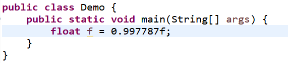

<center style="color:grey;font-size:12px">浮点数举例</center>

```java
//在Java的浮点运算中，这三种的打印结果如下：
10.0/0.0  ==>  Infinity
-10.0/0.0 ==>  -Infinity
0.0/0.0   ==>  NaN
```

## 字符类型

`char` :一个字符型变量只能存放一个字符，不能存放多个字符；

字符类型用单引号包裹，字符串类型用双引号包裹；

注意：`String` 这个不是基础数据类型，而是引用数据类型；

==强烈建议在程序中不要使用char类型，除非确实需要处理UTF-16代码单元，原因参考《Java核心技术 卷Ⅰ》==

## 数据类型的转换

当不同数据类型变量之间进行运算时就会涉及到数据类型转换；

- **自动类型转换**：

  容量小的数据类型允许被转换成容量大的数据类型，这一动作是自动完成的；

  容量大的数据类型不被允许转换成容量小的数据类型；

  这里的容量指的是数据类型的==表数范围==

  ```java
  class demo{
      public static void main(String[] args){
          int a = 10;
          //long b = a; 自动类型转换成功
          //byte c = a; 自动类型转换失败
      }
  }
  ```

  **自动转换的大小顺序**：

  ```mermaid
  flowchart LR
  byte --> short
  short-->int
  char-->int
  int-->long
  long-->float
  float-->double
  ```

  但是这里要注意 `byte short char` :

   `byte short char` 之间进行运算时，会先转换成 `int` ；

  因为在 Java 中，整数类型默认的是 int 型，所以如果要如下运算就不行;

  ```java
  byte a = 10;
  char b = a + 10;//a 是 byte ，10 默认的是 int ，int 的容量比 char 大，所以赋值会失败 
  char c = 10 + 20;//这里则能够将其看成 10+20 后自动转换成 char
  ```

  自动类型转换没有布尔值（boolean）；

- **强制类型转换**：

  如果容量大的数据转换成容量小的就必须得通过强转符 `()` 实现强制类型转换；

  ```
  double
  ```
  
  打印效果如下：
  
  
  
  解释：高位转 byte 是 -128~127 的循环；高位转 char 是对应的 ASCII 码，显然 199 超出了 ASCII 码范围；

==数值类型之间的转换补充：==


6个实线箭头，表示无信息丢失的转换，另外三个虚线箭头，表示可能有精度损失的转换；这九个箭头均表示可以进行数据类型的”自动“转换，但是不能逆箭头”自动“转换，或者无箭头”自动“转换，若需转换则应该使用强制转换的方式；

基本类型之间可以互相转换，转换结果无论错对，至少程序可以进行，但是引用类型之间的互相转换可能会报错；

## 大数

大数这个概念是第二次复习Java所补充的笔记，如果你是第一次看到这个笔记，那么请继续读下去，下面会对在此之前没有提到的概念进行说明；

这个元素确切来说并不是Java中的数据类型，但是它能够解决一些关键性的问题，比如当基本的整数和浮点数精度不能满足我们程序的要求时，我们就需要用到 java.math 包中的两个类（类这个概念后面会有介绍）：BigInteger和BigDecimal，这两个类可以处理包含任意长度数字序列的数值，其中BigInteger类能实现任意精度的整数运算，BigDecimal类能实现任意精度的浮点数运算，大数可以使用`valueOf()`方法将整数和浮点数转换为大数类型：

```java
import java.math.BigDecimal;
import java.math.BigInteger;

/**
 * @author AntonyCheng
 * @date 2022/8/28 17:32
 */

public class Demo {
    public static void main(String[] args) {
        int a = 100;
        double b = 200.2;
        BigInteger c = BigInteger.valueOf(a);
        BigDecimal d = BigDecimal.valueOf(b);
        System.out.println("c = " + c);
        System.out.println("d = " + d);
    }
}
```

当然，当我们需要更大的数据（像一个 long 都没办法表示的数据），我们可以使用一个带字符串（字符串这个引用数据类型在后面会有介绍）参数的构造器（构造器这个概念在后面会有介绍）创造出来：

```java
import java.math.BigDecimal;
import java.math.BigInteger;

/**
 * @author AntonyCheng
 * @date 2022/8/28 17:32
 */

public class Demo {
    public static void main(String[] args) {
        BigInteger bigInteger = new BigInteger("99999999999999999999999999999999999");
        String a = bigInteger.toString();
        BigDecimal bigDecimal = new BigDecimal("99999999999999999999999999.9999999999999999");
        String b = bigDecimal.toString();
        System.out.println("a = " + a);
        System.out.println("b = " + b);
    }
}
```

在大数类中的计算并不是我们平时那样直接用 **`+`	`-` 	`*`	`/`** 去计算，而是需要用到类中的方法（方法这个概念后面也会提到）：

```java
import java.math.BigDecimal;
import java.math.BigInteger;

/**
 * @author AntonyCheng
 * @date 2022/8/28 17:32
 */

public class Demo {
    public static void main(String[] args) {
        BigDecimal a = new BigDecimal("9999999999999999999999999999");
        BigDecimal b = new BigDecimal("1111111111111111111111111111");
        //大数之间相加
        BigDecimal addResult = a.add(b);
        System.out.println("addResult = " + addResult);
        //大数之间相减
        BigDecimal subtractResult = a.subtract(b);
        System.out.println("subtractResult = " + subtractResult);
        //大数之间相乘
        BigDecimal multiplyResult = a.multiply(b);
        System.out.println("multiplyResult = " + multiplyResult);
        //大数之间相除
        BigDecimal divideResult = a.divide(b);
        System.out.println("divideResult = " + divideResult);
    }
}
```

==其实大数主要是用来处理浮点精度不准确问题的，例如2.0-1.9得到的结果并不是0.1，因为在二进制中无法整处理0.1；==

# 11.Java中的运算符

## **算术运算符**

| **符号** | **意义** |
| :------: | :------: |
| **`+`**  | **加法** |
| **`-`**  | **减法** |
| **`*`**  | **乘法** |
| **`/`**  | **取整** |
| **`%`**  | **取余** |
| **`++`** | **累加** |
| **`--`** | **类减** |

- **取整/取余**

  注意 `double` 类型和 `float` 类型取整取余的计算；

  ```java
  package top.sharehome.Bag;
  
  public class Demo {
  	public static void main(String[] args) {
  		double a = 12.99;
  		float b = 12.99f;
  		double DF1 = b / 2;
  		double DF2 = b % 2;
  		float FF1 = b / 2;
  		float FF2 = b % 2;
  		double DD1 = a / 2;
  		double DD2 = a % 2;
  		float FD1 = (float) a / 2; // 这里要强转
  		float FD2 = (float) a % 2; // 这里要强转
  		double DI = 12 / 5;
  		float FI = 12 / 5;
  		System.out.println("DtoF1=" + DF1);
  		System.out.println("DtoF2=" + DF2);
  		System.out.println("FtoF1=" + FF1);
  		System.out.println("FtoF2=" + FF2);
  		System.out.println("DtoD1=" + DD1);
  		System.out.println("DtoD2=" + DD2);
  		System.out.println("FtoD1=" + FD1);
  		System.out.println("FtoD2=" + FD2);
  		System.out.println("DtoI=" + DI);
  		System.out.println("FtoI=" + FI);
  	}
  }
  
  ```

  打印效果如下

  

  如果想要 `double` 的结果，就需要在参与运算的一方变成 `double` 即可：

  ```
  double a = (double)12/5;
  ```

  这样整个结果就是一个 `double`；

- **加法**

  特殊用法：字符串的连接符；

  注意：

    - 当基本数据类型和字符串之间使用 `+` 作运算符，此时该 `+` 是字符串连接符，当运算中含有整数时，`+` 后面不能接字符，否则是做ASCII值的加法运算；
  - 运算时还要注意计算的顺序，要想清楚是先计算还是先转码：


- **`++` / `--` 自增/自减**

  首先得牢记的是，赋值也是一种运算；

  ```java
  package top.sharehome.Bag;
  
  public class Demo {
  	public static void main(String[] args) {
  		int i = 10;
  		int b = i++;    //先赋值10，再加得i=11
  		int c = ++i;    //先加得i=12，再赋值12
  		System.out.println(b);
  		System.out.println(c);
  	}
  }
  ```
  
  打印效果如下：
  
  
  
  记忆：看谁离等号近，就先运算谁；
  
  ==建议在表达式中不要使用++或者--，这样的代码会让人困惑，而且可能会带来烦人的bug，主要原因参考《Java核心技术 卷Ⅰ》==

## 赋值运算符

- **`=` 赋值运算符**

  ```java
  int a = 10;
  ```

- **`+=` 加等运算符**

  ```java
  int a = 10;
  a += 10; //等同于 a = a + 10 == 20
  ```

- **`+=` 减等运算符**

  ```java
  int a = 10;
  a -= 10; //等同于 a = a - 10 == 0
  ```

- **笔试题：**

  ```java
  //判断下列式子是否会报错？
  short a = 10;
  a = a + 1; 	//会报错
  a += 1;		//不会报错
  a++;		//不会报错
  ```


## 关系运算符

关系运算会产生 `boolean` 的结果： `true` `false` 

| **符号** |   **意义**   |
| :------: | :----------: |
| **`>`**  |   **大于**   |
| **`<`**  |   **小于**   |
| **`==`** |   **等于**   |
| **`>=`** | **大于等于** |
| **`<=`** | **小于等于** |
| **`!=`** |  **不等于**  |

## 逻辑运算符

关系运算会产生 `boolean` 的结果： `true` `false` ;

逻辑运算是可以让多个关系运算组合在一起，生成相应的结果，因此参与逻辑运算的双方都应该是一个布尔值的表达式，即运算结果是一个 `boolean` ;

| **符号** |   **意义**   |
| :------: | :----------: |
| **`&`**  |  **逻辑与**  |
| **`|`**  |  **逻辑或**  |
| **`^`**  | **逻辑异或** |
| **`!`**  |  **逻辑非**  |
| **`&&`** |  **短路与**  |
| **`||`** |  **短路或**  |

- **逻辑与 `&`** 

  `T & T = T` 

  `T & F = F`

  `F & F = F` 

- **逻辑或 `|`**

  `T | F = T`

  `T | T = T`

  `F | F = F`

- **逻辑异或 `^`**

  `T ^ F = T`

  `T ^ T = F`

  `F ^ F = F`

- **逻辑非 `!`**

  `!T = F`

  `!F = T`

- **短路与 `&&`**

  短路与和逻辑与的运算规则是相同的，也就是两边都是 `true` 才是 `true` ，只要有一边是 `false` ，结果必然是 `false`；

  但是短路与可以大大提高程序的效率，因为只要左边是 `false` ，右边就不会再运算，因为结果必然是 `false`；

- **短路或 `||`**

  短路或和逻辑或的运算规则是相同的，也就是两边都是 `false` 才是 `false` ，只要有一边是 `true` ，结果必然是 `true`；

  但是短路与可以大大提高程序的效率，因为只要左边是 `true` ，右边就不会再运算，因为结果必然是 `true`；


## 位运算符

当符号两边是整数时，则是位运算符；当符号两边是 `boolean` ，则是逻辑运算符；

- `&` 按位与

  有 0 得 0，其他得 1；

  ```
  6 & 2
    0000 0110
  & 0000 0010
  -------------
    0000 0010  == 2
  ```

- `|` 按位或

  有 1 得 1，其他得 0；

  ```
  6 | 2
    0000 0110
  | 0000 0010
  -------------
    0000 0110  == 6
  ```

- `^` 按位异或

  1 ^ 1 == 0;

  0 ^ 0 == 0;

  1 ^ 0 == 1;

  ```
  6 ^ 2
    0000 0110
  ^ 0000 0010
  -------------
    0000 0100 == 4
  ```

- `~` 按位取反

  按位取反会改变符号位：

  ~0 == 1；

  ~1 == 0；

  ```
  ~6
    0000 0110
  -------------
    1111 1001
  ```

- `>>` 有符号右移

  实现二进制的右移；

  ```
  6 >> 2
  0000 0110 >> 2 == 0000 0001 == 1 //正数补 0
  -7 >> 2
  1111 1001 >> 2 == 1111 1110 == -2 //负数补 1
  ```

- `<<` 有符号左移

  实现二进制的左移；

  ```
  6 << 2
  0000 0110 << 2 == 0001 1000 == 24
  ```

- `>>>` 无符号右移

  正负号均补 0；

  ```
  6 >>> 2
  0000 0110 >>> 2 == 0001 1000 == 24
  -7 >>> 2
  1111 1001 >>> 2 == 0011 1110 == 62
  ```

- **面试题：**

  如何最快的求得 $8×2^3$ ?

  ```
  8 << 3
  0000 1000 << 3 == 0100 0000 == 64
  ```

## 三元运算符

**格式如下：**

```java
int a = 10;
int b = 20;
int m = a>b? a:b;
```

问号前面是条件表达式，条件为 `true` 则赋值 `a` ，否则赋值 `b`；

**示例如下：**

用三元运算符比较三个数得大小：

```java
package top.sharehome.Bag;

import java.util.Scanner;  //从键盘获取，下一节内容

public class Demo {
	public static void main(String[] args) {
		Scanner sc = new Scanner(System.in);  //键盘获取，下一节内容
		int a,b,c;	
		a = sc.nextInt();					  //键盘获取，下一节内容
		b = sc.nextInt();					  //键盘获取，下一节内容
		c = sc.nextInt();					  //键盘获取，下一节内容
		System.out.println(a>b? (a>c? a+"最大":c+"最大"):(b>c?b+"最大":c+"最大"));
		sc.close();
	}
}
```

打印效果如下：


## 运算符优先级


提示说明：

（1）表达式不要太复杂

（2）先算的使用()

大体的排序：算术 ==> 位 ==>  比较 ==> 逻辑 ==> 三元 ==> 赋值

# 12.从键盘获取输入

**获取整数的固定格式：**

```java
//导入类
import java.util.Scanner;
class demo{
    public static void main(String[] args){
        //创建一个键盘输入对象
        Scanner sc = new Scanner(System.in);
        //调用方法获取
        Scanner sc = new Scanner(System.in);
		byte b = sc.nextByte();
		char c = sc.next().charAt(0);
		short s = sc.nextShort();
		int i = sc.nextInt();
		long l = sc.nextLong();
		float f = sc.nextFloat();
		double d = sc.nextDouble();
		String s = sc.next();
        //关闭键盘输入
        sc.close();
    }
}
```

# 13.流程控制语句

$$
\bf{流程控制语句}\begin{cases} \bf{顺序结构}\\\bf{分支结构}\\\bf{循环结构} \end{cases}
$$

很多流程里都是循环里包含着分支，分支和循环都是以顺序结构为基础；

## 顺序结构

程序最基本的执行结构就是顺序结构，即程序是顺序执行的，从上到下；

## 分支结构

```java
import java.util.Scanner;
class demo{
    public static void main(String[] args){
        System.out.println("请输入一个年龄：");
        Scanner sc = new Scanner(System.in);
        int age = sc.nextInt();
        if(age<18){
            System.out.println("未成年!");
        }else if(age<30){
            System.out.println("已成年!");
        }else if(age<45){
            System.out.println("已壮年!");
        }else{
            System.out.println("已老年!");
        }
    }
}
```

程序提供了多条分支，但在执行时，根据实际情况只会选择其中一条分支来执行；

### **if-else**

语法结构：

```
if(条件一){
	执行语句一;
}else if(条件二){
	执行语句二;
}else if(条件三){
	执行语句三;
}else{
	执行语句四;
}
```

示例如下：

```java
class demo{
    public static void main(String[] args){
        int a = 10;
        int b = 20;
        if(a>b){
            System.out.println("a>b");
        }
        else if(a<b){
            System.out.println("a<b");
        }
        else {
            System.out.println("a=b");
        }
    }
}
```

打印效果如下：


**注意：**

1. `if(条件)` 之后的内容，可以是一条语句，也可以是多条语句组成的语句块，语句块就必须用 `{}` 包裹，如果没有使用 `{}` 包裹，那么就只能有一条语句，作为 `if(语句)` 之后的内容；

   ```java
   package top.sharehome.Bag;
   
   public class Demo {
   	public static void main(String[] args) {
   		int a = 3, b = 4;
   		if(a>b)
   			System.out.println("a.hello world");
   			System.out.println("b.hello world");
   	}
   }
   ```

   打印效果如下：

   

   上例说明，第二条 `hello world` 没有被包含在 `if` 语句之内，所以被打印了出来；

2. 条件一定是 boolean 表示；

**案例一：**

只有年龄超过18岁的学生才能玩游戏，现在编写一个程序，来判断一个学生是否可以玩游戏；

示例如下：

```java
import java.util.Scanner;
class demo{
    public static void main(String[] args){
        System.out.println("请输入你的年龄:");
        Scanner sc = new Scanner(System.in);
        int age = sc.nextInt();
        if(age<18){
            System.out.println("不可以玩游戏");
        }else{
            System.out.println("可以玩游戏");
        }
    }
}
```

打印效果如下：


**案例二：**

如果成绩大于 90 ，男生的话送一台 Xbox，女生的话送一只口红；

示例如下：

```java
import java.util.Scanner;
class demo{
    public static void main(String[] args){
        Scanner sc = new Scanner(System.in);
        System.out.println("请输入你的成绩:");
        double score = sc.nextDouble();
        System.out.println("请输入你的性别（男/女==1/2）:");
        int sex = sc.nextInt();
        if (score<90){
            System.out.println("没有礼物!");
        }else{
            if(sex == 1){
                System.out.println("送你Xbox!");
            }else if(sex == 2){
                System.out.println("送你口红!");
            }
            else{
                System.out.println("请输入切确性别!");
            }
        }
    }
}
```

打印效果如下：


**案例三：**

妻子嘱咐丈夫回家是买十个苹果，如果碰到卖西瓜的买一个，变成模拟场景；

示例如下：

```java
import java.util.Scanner;
class demo{
    public static void main(String[] args){
        System.out.println("首先，你想有卖西瓜的人么？有/无 == 1/0");
        Scanner sc = new Scanner(System.in);
        int sellWM = sc.nextInt();
        System.out.println("丈夫回家了，但水果店还开着，需要去买苹果！");
        System.out.println("...");
        System.out.println("挑苹果……");
        System.out.println("挑了 10 个苹果！");
        if (sellWM == 1){
            System.out.println("有西瓜，买一个吧！");
            System.out.println("和自己媳妇儿一起吃西瓜！");
        }else{
            System.out.println("没西瓜，算了！");
            System.out.println("给自己媳妇说没有西瓜，然后上床睡觉去了！");
        }
    }
}
```

打印效果如下：


**案例四：**

从键盘输入一个成绩，根据成绩的情况给出等级，要求顺序书写和嵌套书写；

顺序写法：

```java
import java.util.*;
class demo{
    public static void main(String[] args){
        System.out.println("请输入你的成绩：");
        Scanner sc = new Scanner(System.in);
        double score = sc.nextDouble();
        if(score < 60){
            System.out.println("不及格!");
        }
        else if(score < 70){
            System.out.println("中下等!");
        }
        else if(score < 80){
            System.out.println("中上等!");
        }
        else if(score < 90){
            System.out.println("良等!");
        }
        else if(score < 100){
            System.out.println("优等!");
        }
        else{
            System.out.println("最佳!");
        }
    }
}
```

嵌套写法：

```java
import java.util.*;
class demo{
    public static void main(String[] args){
        System.out.println("请输入你的成绩(0-100)：");
        Scanner sc = new Scanner(System.in);
        double score = sc.nextDouble();
        if (score < 60){
            System.out.println("不及格！");
        }
        else{
            if(score <70){
                System.out.println("中下等！");
            }
            else{
                if(score <80){
                    System.out.println("中上等！");
                }
                else{
                    if(score <90){
                        System.out.println("良等！");
                    }
                    else{
                        if(score <100){
                            System.out.println("优等！");
                        }
                        else{
                            System.out.println("最佳！");
                        }
                    }
                }
            }
        }
    }
}
```

打印效果如下：


**案例五：**

年龄程序，让用户输入年龄，告诉用户结论；

示例如下：

```java
import java.util.*;
class demo{
    public static void main(String[] args){
        System.out.println("请输入你的年龄:");
        Scanner sc = new Scanner(System.in);
        int age = sc.nextInt();
        if(age<0){
            System.out.println("输入错误！");
        }else if(age<18){
            System.out.println("你未成年！");
        }else if(age<25){
            System.out.println("年龄轻轻！");
        }else if(age<35){
            System.out.println("青壮年！");
        }else if(age<45){
            System.out.println("正值壮年！");
        }else if(age<55){
            System.out.println("正值中年！");
        }else if(age<65){
            System.out.println("将步入老年！");
        }else if(age<100){
            System.out.println("已经老年！");
        }
    }
}
```

打印效果如下：


**案例六：**

完成如下打印；


示例如下：

```java
import java.util.*;
class demo{
    public static void main(String[] args){
        Scanner sc = new Scanner(System.in);
        System.out.println("请输入T恤价格：");
        double TPrice = sc.nextDouble();
        System.out.println("请输入网球鞋价格：");
        double TennisShoePrice = sc.nextDouble();
        System.out.println("请输入网球拍价格：");
        double TennisPrice = sc.nextDouble();
        System.out.println("请输入购买T恤购买数量：");
        int TQuantity = sc.nextInt();
        System.out.println("请输入购买网球鞋的数量：");
        int TennisShoeQuantity = sc.nextInt();
        System.out.println("请输入购买网球拍的数量：");
        int TennisQuantity = sc.nextInt();
        double all = TennisPrice + TPrice + TennisShoePrice;
        double Discount = 0;
        if(all<1000){
            Discount = 10;
        }else if(all<2000){
            Discount = 8;
        }else if(all<3000){
            Discount = 7.5;
        }else if(all<4000){
            Discount = 6;
        }else{
            Discount = 5;
        }
        System.out.println("***************消费单***************");
        System.out.println("购买物品\t单价\t个数\t金额");
        System.out.println("T恤\t\t"+TPrice+"\t"+TQuantity+"\t"+TPrice*TQuantity);
        System.out.println("网球鞋\t\t"+TennisShoePrice+"\t"+TennisShoeQuantity+"\t"+TennisShoePrice*TennisShoeQuantity);
        System.out.println("网球拍\t\t"+TennisPrice+"\t"+TennisQuantity+"\t"+TennisPrice*TennisQuantity);
        System.out.println("***********************************");
        System.out.println("折扣:\t"+Discount+"折");
        System.out.println("消费总额：\t"+"￥"+(TPrice*TQuantity+TennisPrice*TennisQuantity+TennisShoePrice*TennisShoeQuantity));
        System.out.println("实际消费：\t"+"￥"+((TPrice*TQuantity+TennisPrice*TennisQuantity+TennisShoePrice*TennisShoeQuantity)*(Discount*0.1)));
    }
}
```

打印效果如下：


注意：`\t` 是制表符，即 `Tab` ;

### switch-case

语法结构：

```
swich(表达式){
	case 条件一 :
        语句一;
        break;
    case 条件二 :
        语句二;
        break;
    default :
        语句三;
        break;
}
注意：break 是为了防止 case 穿透；
     表达式是一个能够产生值的语句，可能是变量，也可以是语句；
     如果表达式都不满足以下条件，则运行 default 语句；
```

**注意：**

表达式的种类：`byte` , `short` , `char` , `int` , `枚举` , `String`；

`case` 后跟的必须是一个固定的值，不能是范围；

`case` 穿透指的是

**案例一：**

输入一个月份，判断当前月份是属于哪一个季节，只能用 `swich` 来做；

```java
import java.util.*;
class demo{
    public static void main(String[] args){
        Scanner sc = new Scanner(System.in);
        System.out.println("请输入当前月份：");
        int month = sc.nextInt();
        switch (month){
            case 2:
            case 3:
            case 4:
            System.out.println("春天");
            break;
            case 5:
            case 6:
            case 7:
            System.out.println("夏季");
            break;
            case 8:
            case 9:
            case 10:
            System.out.println("秋季");
            break;
            case 11:
            case 12:
            case 1:
            System.out.println("冬季");
            break;
        }
    }
}
```

打印效果如下：


**案例二：**

使用 `swich` 语句改写判断学生成绩的等级；

```java
import java.util.*;
class demo{
    public static void main(String[] args){
        Scanner scanner = new Scanner(System.in);
        System.out.println("写出学生的成绩(0-100)：");
        double score = scanner.nextDouble();
        int result = (int)score/10;
        switch(result){
            case 0:
            case 1:
            case 2:
            case 3:
            case 4:
            case 5:
            System.out.println("不及格");
            break;
            case 6:
            case 7:
            System.out.println("中");
            break;
            case 8:
            System.out.println("良");
            break;
            case 9:
            case 10:
            System.out.println("优");
            break;
            default:
            System.out.println("请重新输入！");
            break;
        }
    }
}
```

打印效果如下：


**案例三：**

利用 `switch` 实现一个计算机操作：第一次输入一个整数，第二次输入一个运算符，第三次输入一个整数；

```java
import java.util.*;
class demo{
    public static void main(String[] args){
        Scanner scanner = new Scanner(System.in);
        System.out.println("请输入第一个整数：");
        double a = scanner.nextDouble();
        System.out.println("请输入运算符：");
        String c = scanner.next();
        System.out.println("请输入第二个整数：");
        double b = scanner.nextDouble();
        double result = 0;
        switch(c){
            case "+":
            result = a+b;
            System.out.println(result);
            break;
            case "-":
            result = a-b;
            System.out.println(result);
            break;
            case "*":
            result = a*b;
            System.out.println(result);
            break;
            case "/":
            result = a/b;
            System.out.println(result);
            break;
        }
    }
}
```

打印效果如下：


### 程序实例

**示例一：**

定义三个整型变量 x , y , z ，并且从键盘初始化变量值，判断三个变量的大小，将较大的值赋给变量 max ，将 max 输出，注意输入使用 scanner 输入；

```java
import java.util.*;
class demo{
    public static void main(String[] args){
        int a;
        int b;
        int c;
        Scanner sc = new Scanner(System.in);
        System.out.println("请输入第一个数：");
        a = sc.nextInt();
        System.out.println("请输入第二个数：");
        b = sc.nextInt();
        System.out.println("请输入第三个数：");
        c = sc.nextInt();
        int max = 0;
        if(a>=b&&a>=c){
            max = a;
        }else if(b>=a&&b>=c){
            max = b;
        }else if(c>=a&&c>=b){
            max = c;
        }
        System.out.println("最大值:"+max);
    }
}
```

也可以用三元运算符获得这样的结论：

```java
import java.util.*;
class demo{
    public static void main(String[] args){
        int a;
        int b;
        int c;
        Scanner sc = new Scanner(System.in);
        System.out.println("请输入第一个数：");
        a = sc.nextInt();
        System.out.println("请输入第二个数：");
        b = sc.nextInt();
        System.out.println("请输入第三个数：");
        c = sc.nextInt();
        int max = 0;
        max = a > c ? a > b ? a : b : c > b ? c : b;
        // a>c? (a>b?a:b) : (c>b?c:b);
        System.out.println("最大值：" + max);
    }
}
```

打印效果如下：


**实例二：**

饭店里面有五道菜：黄花鱼200块；烤鸭100块；红烧肉60块；小炒肉40块；白水豆腐10块；一个客人进了饭店，根据身上的钱来决定吃哪一道菜，编程模拟：

```java
import java.util.*;
class demo{
    public static void main(String[] args){
        int a = 10;
        int b = 40;
        int c = 60;
        int d = 100;
        int e = 200;
        Scanner scanner = new Scanner(System.in);
        System.out.println("请输入你现在有的钱：");
        int MY_MONEY = scanner.nextInt();
        if(MY_MONEY>=200){
            System.out.println("上黄花鱼！");
            MY_MONEY -= 200;
        }else if(MY_MONEY>=100){
            System.out.println("上烤鸭！");
            MY_MONEY -= 100;
        }else if(MY_MONEY>=60){
            System.out.println("上红烧肉！");
            MY_MONEY -= 60;
        }else if(MY_MONEY>=40){
            System.out.println("上小炒肉！");
            MY_MONEY -= 40;
        }else if(MY_MONEY>=10){
            System.out.println("上白水豆腐！");
            MY_MONEY -= 10;
        }else{
            System.out.println("你没钱！");
        }
        System.out.println("你还有"+MY_MONEY+"块钱！");
    }
}
```

打印效果如下：


**实例三：**

编写程序，判断给定的某个年份是否为闰年（闰年能被4整除，不能被100整除，但能被400整除）

```java
import java.util.*;
class demo{
    public static void main(String[] args){
        Scanner scanner = new Scanner(System.in);
        System.out.println("请输入一个年份：");
        int Year = scanner.nextInt();
        if((Year%4==0 && Year%100!=0) || (Year%400==0)){
            System.out.println(Year+"是一个闰年！");
        }else{
            System.out.println(Year+"不是一个闰年！");
        }
    }
}
```

打印效果如下：


**实例四：**

编程实现已知某人的工资(要求输入)，求他应该缴纳的个人所得税以及最后得到的工资。个人所得税计算方法计算方法:

全月应纳税所得额=工资薪金所得-3500

应纳税额=应纳税所得额*税率-速算扣除数

| **级数** | **全月应交税所得额(x)** | **税率（%）** | **速算扣除数** |
| :------: | :---------------------: | :-----------: | :------------: |
|  **1**   |       **x<=500**        |     **5**     |     **0**      |
|  **2**   |     **500<x<=2000**     |    **10**     |     **25**     |
|  **3**   |    **2000<x<=5000**     |    **15**     |    **125**     |
|  **4**   |    **5000<x<=20000**    |    **20**     |    **375**     |
|  **5**   |   **20000<x<=40000**    |    **25**     |    **1375**    |
|  **6**   |   **40000<x<=60000**    |    **30**     |    **3375**    |
|  **7**   |   **60000<x<=80000**    |    **35**     |    **6375**    |
|  **8**   |   **80000<x<=100000**   |    **40**     |   **10375**    |
|  **9**   |      **x>100000**       |    **45**     |   **15375**    |

```java
import java.util.*;

public class demo {
	public static void main(String[] args) {
		Scanner sc = new Scanner(System.in);
		System.out.print("请输入你的月薪：");
		double salary = sc.nextDouble();
		double should = salary - 3500;
		if(should<=500) {
			System.out.println("你应该交 "+(should*0.05)+"块钱！");
			System.out.println("你能够得到 "+(should-(should*0.05)+3500)+"块钱！");
		}else if(should>500&&should<=2000) {
			System.out.println("你应该交 "+(should*0.1-25)+"块钱！");
			System.out.println("你能够得到 "+(should-(should*0.1-25)+3500)+"块钱！");
		}else if(should>2000&&should<=5000) {
			System.out.println("你应该交 "+(should*0.15-125)+"块钱！");
			System.out.println("你能够得到 "+(should-(should*0.15-125)+3500)+"块钱！");
		}else if(should>5000&&should<=20000) {
			System.out.println("你应该交 "+(should*0.2-375)+"块钱！");
			System.out.println("你能够得到 "+(should-(should*0.2-375)+3500)+"块钱！");
		}else if(should>20000&&should<=40000) {
			System.out.println("你应该交 "+(should*0.25-1375)+"块钱！");
			System.out.println("你能够得到 "+(should-(should*0.25-1375)+3500)+"块钱！");
		}else if(should>40000&&should<=60000) {
			System.out.println("你应该交 "+(should*0.30-3375)+"块钱！");
			System.out.println("你能够得到 "+(should-(should*0.30-3375)+3500)+"块钱！");
		}else if(should>60000&&should<=80000) {
			System.out.println("你应该交 "+(should*0.35-6375)+"块钱！");
			System.out.println("你能够得到 "+(should-(should*0.35-6375)+3500)+"块钱！");
		}else if(should>80000&&should<=100000) {
			System.out.println("你应该交 "+(should*0.40-10375)+"块钱！");
			System.out.println("你能够得到 "+(should-(should*0.40-10375)+3500)+"块钱！");
		}else {
			System.out.println("你应该交 "+(should*0.45-15375)+"块钱！");
			System.out.println("你能够得到 "+(should-(should*0.45-15375)+3500)+"块钱！");
		}
		sc.close();
	}
}
```

打印效果如下：


**实例五：**

模拟用户登录，提示用户输入用户名和密码，和本地的数据进行比对，如果成功提示登陆成功，否则提示失败，然后循环用户是否再次输入；

```java
import java.util.*;

public class demo {
	public static void main(String[] args) {
        Scanner scanner = new Scanner(System.in);
		String username = "陈如颖";
        String password = "020114";
        boolean b = false;
        while(true) {
            System.out.println("请输入用户名：");
            String user = scanner.next();
            System.out.println("请输入密码：");
            String passwd = scanner.next();
            if(username.equals(user)&&password.equals(passwd)){
                System.out.println("登陆成功！");
                break;
            }else{
                System.out.println("请选择是否继续登录？（true/false）");
                b = scanner.nextBoolean();
            }
        }
    }
}
```

打印效果如下：


## 循环结构

定义：满足一定的条件下，可以重复执行的语句；

`java` 中的循环语句：

1. `for` 循环
2. `while` 循环
3. `do...while` 循环

循环语句的组成成分：任何一个循环语句都由四个部分组成；

举例说明：

```java
for (int i = 0;i < 4;i++){
    System.out.println("Hello World!");
}
```

1. 循环条件：能够让循环终止的条件，如果循环条件设计得不好，就很容易造成死循环；
2. 循环变量：变量中存的数据，该数据会发生变化，当数据达到一定条件时触发终止条件；
3. 迭代部分：让循环变量进行更新迭代，如果没有迭代部分，循环变量永远不会变化，也就不会让循环条件终止；
4. 循环体：每次循环要做的事情；

### for循环

语法结构：

```
for (循环变量;循环条件;迭代部分){
	循环体;
}
```

注意：

1. 循环变量的定义位置：可以在 `for` 循环小括号之内，也可以在 `for` 循环外部，尽量写在小括号之内，因为该变量只存在于此循环之内；
2. 循环条件在每次循环之前都要判断一次，当循环条件为 `true` 时，循环体才会被执行，否则循环结束；
3. 迭代部分：对循环变量的更新并不是固定的 `i++` ，也可以是 `i += 2`； 

**案例一：**

打印 0-100 之间的所有数；

```java
import java.util.*;

class demo {
	public static void main(String[] args) {
		int i = 0;
		int count = 0;
		for (i = 0; i <= 100; i++) {
			System.out.print(i + "\t");
			count++;
			if(count == 8) {
				System.out.println();
				count = 0;
			}
		}
	}
}
```

打印效果如下：


**案例二：**

计算 0-100 的和；

```java
import java.util.*;
class demo{
    public static void main(String[] args){
        int i = 0;
        int sum = 0;
        for (i = 0;i <= 100;i++){
            sum += i;
        }
        System.out.println(sum);
    }
}
```

打印效果如下：


**案例三：**

打印 0-100 之间的偶数；

```java
import java.util.*;
class demo{
    public static void main(String[] args){
        int i = 0;
        for (i = 0;i <= 100;i+=2){
            System.out.println(i);
        }
    }
}
```

或者 ：

```java
import java.util.*;
class demo{
    public static void main(String[] args){
        int i = 0;
        for (i = 0;i <= 100;i++){
            if (i%2==0){
                System.out.println(i);
            }
        }
    }
}
```

打印效果如下：


**案例四：**

打印完数；

```java
import java.util.*;
class demo{
    public static void main(String[] args){
        Scanner scanner = new Scanner(System.in);
        System.out.print("请输入你想求完数的范围：0~");
        int num = scanner.nextInt();
        System.out.println("该范围里的完数有：");
        for(int i=1; i<=num; i++){
            int sum = 0;
            for(int j=1; j<i; j++){
                if(i%j==0){
                    sum += j;
                }
            }
            if(sum == i){
                System.out.print(i+"");
            }
        }
    }
}
```

打印效果如下：


### while循环

语法结构：

```
循环变量
while(循环变量){
	循环体;
}
```

**案例一：**

打印 0-100 之间所有的奇数；

```java
import java.util.*;
class demo{
    public static void main(String[] args){
        int i = 0;
        while(i<=100){
            if(i%2!=0){
                System.out.println(i);
            }
            i++;
        }
    }
}
```

打印效果如下：


### do...while循环

语法格式：

```
do{
	循环体;
	迭代部分;
}while(循环条件);
```

特点：无论循环条件是否成立，`do...while` 循环都会先执行一遍，在进行循环条件的判断！

### 嵌套循环

**定义**：一个循环充当另一个循环的循环体，也就是说循环里还有循环；(多重循环)

**关键：**内层循环条件往往和外层循环的循环变量有着紧密关系；

**练习一：**

打印五行 0-10 ；

```java
import java.util.*;
class demo{
    public static void main(String[] args){
        for (int i=0; i<5 ;i++){
            for (int j=0; j<11;j++){
                System.out.print(j+"\t");
            }
            System.out.println();
        }
    }
}
```

打印效果如下：


**练习二：**

打印如下图形：

\*\*\*\*\*
\*\*\*\*\*
\*\**\*\*
\*\*\*\*\*
\***\*\*

```java
import java.util.*;
class demo{
    public static void main(String[] args){
        for (int i=0; i<5 ;i++){
            for (int j=0; j<5;j++){
                System.out.print("*");
            }
            System.out.println();
        }
    }
}
```

打印效果如下：


**练习三：**

**打印如下图形：**

*
*\*
*\*\*
*\*\*\*
*\*\*\*\*

```java
import java.util.*;
class demo{
    public static void main(String[] args){
        for (int i=0; i<5 ;i++){
            for (int j=0; j<=i;j++){
                System.out.print("*");
            }
            System.out.println();
        }
    }
}
```

打印效果如下：


**练习四：**

打印如下图形：

*\*\*\*\*
*\*\*\*
*\*\*
*\*
*

```java
import java.util.*;
class demo{
    public static void main(String[] args){
        for (int i=0; i<5 ;i++){
            for (int j=0; j<5-i;j++){
                System.out.print("*");
            }
            System.out.println();
        }
    }
}
```

打印效果如下：


**练习五：**

打印如下图形：

*
*\*
*\*\*
*\*\*\*
*\*\*\*\*
*\*\*\*
*\*\*
*\*
*

```java
import java.util.*;
class demo{
    public static void main(String[] args){
        for (int i=0; i<9 ;i++){
            if(i<5){
                for(int j=0; j<i+1;j++){
                    System.out.print("*");
                }
                System.out.println();
            }else{
                for(int j=0; j<9-i;j++){
                    System.out.print("*");
                }
                System.out.println();
            }
        }
    }
}
```

打印效果如下：


**练习六：**

打印如下图形：

​      \*
​    *\*\*
  *\*\*\*\*
*\*\*\*\*\*\*

```java
import java.util.*;
class demo{
    public static void main(String[] args){
        for (int i = 0; i < 4;i++){
            for (int k = 0; k < 4-i;k++){
                //打印空格
                System.out.print(" ");
            }
            for(int j = 0; j < 2*i+1; j++){
                //打印 *
                System.out.print("*");
            }
            System.out.println();
        }
    }
}
```

打印效果如下：


**练习七：**

打印如下图形：

*\*\*\*\*\*\*
  *\*\*\*\*
    *\*\*
      *

```java
import java.util.*;
class demo{
    public static void main(String[] args){
        for (int i = 0; i < 5;i++){
            for (int j = 0; j < i;j++){
                System.out.print(" ");
            }
            for (int k = 0; k < 2*(3-i)+1; k++){
                System.out.print("*");
            }
            System.out.println();
        }
    }
}
```

打印效果如下：


**练习八：**

打印如下图形：

​      *
​    \*  \*
  \*  \*  \*
\*  \*  \*  \*

```java
import java.util.*;
class demo{
    public static void main(String[] args){
        for (int i = 0; i < 4;i++){
            for (int j = 0; j < 3-i;j++){
                System.out.print(" ");
            }
            for (int k = 0; k < i+1;k++){
                System.out.print("* ");
            }
            System.out.println();
        }
    }
}
```

打印效果如下：


### 程序实例

**实例一：**

在控制台输出 `100-999` 之间所有的“水仙花数”；

所谓的水仙花数是指一个三位数，其各个位数字的立方和等于该数本身；

```
import java.util.*;
class demo{
    public static void main(String[] args){
        int i = 0;
        for(i = 100;i<1000;i++){
            int a = i%10;
            int b = (i/10)%10;
            int c = i/100;
            if(a*a*a+b*b*b+c*c*c == i){
                System.out.println(i+"是水仙花数！");
            }
        }
    }
}
```

打印效果如下：


**实例二：**

一张纸的厚度是 0.2 mm，多少张纸叠加可以达到珠穆朗玛峰的高度(8848.13m);

```java
import java.util.*;

class demo {
	public static void main(String[] args) {
		int pepar = 2;
		int count = 0;
        int mountain = 88484300;
        int i = 0;
        for(i = 0; pepar < mountain; i++){
            pepar += 2;
            count += 1;
        }
        System.out.println(count);
	}
}
```

打印效果如下：


**实例三：**

计算一个整数的阶层；

```Java
import java.util.*;
class demo{
    public static void main(String[] args){
        Scanner scanner = new Scanner(System.in);
        System.out.println("请输入一个整数：");
        int num = scanner.nextInt();
        int a = 1;
        for (int i = 1; i <= num; i++){
            a *= i;
        }
        System.out.println(a);
    }
}
```

打印效果如下：


**实例四：**

打印 100 以内能被 4 整除但不能被 7 整除的数据，每行打印 6 个；

```java
import java.util.*;
class demo{
    public static void main(String[] args){
        int count = 0;
        for (int i = 0; i <= 100; i++) {
            if (i%4==0&&i%7!=0){
                System.out.print(i+"\t");
                count++;
                if (count == 6){
                    System.out.println("\n");
                    count = 0;
                }
            }
        }
    }
}
```

打印效果如下：


**实例五：**

打印1000以内的所有素数，每20个一行；

```java
import java.util.*;
class demo{
    public static void main(String[] args){
        int count = 0;
        for (int i = 1; i < 1000; i++){
            boolean b = false;
            for (int j = 2; j < i; j++){
                if(i%j==0){
                    b = true;
                }
            }
            if(!b){
                System.out.print(i+" ");
                count++;
                if(count==20){
                    System.out.println();
                    count = 0;
                }
            }
        }
    }
}
```

打印效果如下：


**实例六：**

求 1-3+5-7+……-99+101 的值；

```java
import java.util.*;

public class demo {
	public static void main(String[] args) {
        boolean b = true;
        int n = 0;
        for(int i = 1; i < 102; i+=2) {
            if(b==true) {
                n+=i;
                b=false;
            }else if(b==false) {
                n-=i;
                b=true;
            }
        }
        System.out.println(n);
    }
}
```

打印效果如下：


**实例七：**

百钱买百鸡：公鸡五元一只，母鸡三元一只，小鸡一元三只，如果用100元钱，不欠不赊，可以买公鸡，母鸡，小鸡各多少只？

```java
import java.util.*;

public class demo {
	public static void main(String[] args) {
        for (int i = 0; i <21;i++ ){
            for(int j = 0; j < 34;j++ ){
                int k = 100-i-j;
                if(i*5+j*3+k*(1/3f)==100){
                    System.out.println("公鸡"+i+" 母鸡"+j+" 小鸡"+k);
                }
            }
        }
    }
}
```

打印效果如下：


### 循环总结

$Q：$循环语句能帮助我们解决说明问题？

$A：$解决要重复写的代码（循环体），循环是一定要有终止的（循环条件，循环变量迭代）；

**补充：死循环；**

`while(true){}` 和 `for( ; ; ){}`

**任务一：**

求 1-1000 之间满足“用 3 除余 2 ；用 5 除余 3 ；用 7 除余 2 ”的数，且一行只打印5个数；

```java
import java.util.*;
class demo{
    public static void main(String[] args){
        int count = 0;
        for (int i = 1; i < 1001; i++){
            if(i%3==2&&i%5==3&&i%7==2){
                System.out.print(i+"\t");
                count++;
                if(count==5){
                    System.out.println("\n");
                    count = 0;
                }
            }
        }
    }
}
```

打印效果如下：


**任务二：**

输出 99 乘法表；

```java
import java.util.*;
class demo{
    public static void main(String[] args){
        int i = 0;
        int j = 0;
        for (i = 1; i < 10;i++){
            for (j = 1; j <= i;j++){
                System.out.print(j+" * "+i+" = "+(i*j)+" "); 
            }
            System.out.println();
        }
    }
}
```

打印效果如下：


## 三个关键字

### break

- 在 switch 中使用，用来防止 case 穿透；

- 在循环中使用，用来跳出整个循环；

  循环有两个终止的情况：一是循环条件不满足，二是遇到了`break`

### continue

- 在循环中使用，用来结束本次循环，继续下一次循环；

### return

- 在方法里经常看到 return ，方法里的 return 起到的是返回的作用；
- 目前在循环中出现的 return ，它不只是结束了循环，而是结束了整个循环所在的方法；

### 关键字和嵌套循环

break：结束最近的那个整个循环；

continue：结束最近的那个当次循环；

return：结束掉循环所在的整个函数；

**实例再证：**

打印出1000以内的素数：

```java
import java.util.*;
class demo{
    public static void main(String[] args){
        int count = 1;
        for(int i=1; i < 1000;i++){
        boolean b = false;
            for(int j=2; j < i;j++){
                if (i%j==0){
                    b = true;
                    break; //能够提前结束循环，简化运算
                }
            }
            if (!b){
                System.out.print(i+" ");
                count++;
                if(count==20){
                    System.out.println();
                    count = 1;
                }
            }
        }
    }
}
```

打印效果如下：


**循环标签：**

只适用于给循环打上标签，目的是使用 break 或 continue 时选择性打破循环；

break 正常代码：

```java
import java.util.*;
class demo{
    public static void main(String[] args){
        for (int i=1; i < 10;i++){
            for (int j=1; j <= 10;j++){
                if (j%4==0){
                    break;
                }
                System.out.print(j+" ");
            }
            System.out.println();
        }
    }
}
```

打印效果如下：


break 强制代码（需要加一个标识符，符名自取）：

```java
import java.util.*;
class demo{
    public static void main(String[] args){
        good:for (int i=1; i < 10;i++){ //循环标识符添加在循环之前
            for (int j=1; j <= 10;j++){
                if (j%4==0){
                    break good; //结束时也要带上标识符
                }
                System.out.print(j+" ");
            }
            System.out.println();
        }
    }
}
```

打印效果如下：


continue 正常代码：

```java
import java.util.*;
class demo{
    public static void main(String[] args){
        for (int i=1; i < 10;i++){ 
            for (int j=1; j <= 10;j++){
                if (j%4==0){
                    continue; 
                }
                System.out.print(j+" ");
            }
            System.out.println();
        }
    }
}
```

打印效果如下：


continue 强制代码：

```java
import java.util.*;
class demo{
    public static void main(String[] args){
        good:for (int i=1; i < 10;i++){ //循环标识符添加在循环之前
            for (int j=1; j <= 10;j++){
                if (j%4==0){
                    continue good; //结束时也要带上标识符
                }
                System.out.print(j+" ");
            }
            System.out.println();
        }
    }
}
```

打印效果如下：


# 14.方法(函数)（方法：类的第三成员）

一般情况下，在面向过程的语言中，称为函数，在面向对象的语言中称为方法，所以 java 中我们称之为方法，通过方法将代码封装在一起，能够提高代码的效率；

我们通过统计学校人数这样一个示例来初识方法：

```java
import java.util.*;
class demo{
    public static void main(String[] args){
        Scanner scanner = new Scanner(System.in);
        System.out.println("你想知道我们学校的人数么（想/不想=1/0）：");
        int agree  = scanner.nextInt();
        if(agree == 1){
            ThePeopleAmount(); //这里是方法的调用
        }else if(agree == 0){
            System.out.println("ok!");
        }else{
            System.out.println("错误！请重新输入!");
        }
    }
    public static void ThePeopleAmount(){ //这是一个方法
        //我们来统计一个学校的人数
        int gradeOne = 1000; //高一
        int gradeTwo = 1200; //高二
        int gradeThree = 800; //高三
        int all = gradeThree+gradeTwo+gradeOne;
        System.out.println("我们学校一共有"+all+"人！");
    }
}
```

打印效果如下：


## 方法的定义

**定义格式：**

```
权限修饰符 (静态)标识 返回值类型 方法名(参数列表){
	方法的内容
}
```

注意：权限修饰符可有可无，标识处也可以不为静态的标识；

示例如下：

```java
public static int method(int a,int[] arr){
	//方法内容如下：……
}
```

### 返回值类型

- 所谓的返回值就是方法执行完后，要返回的值；

- 返回给方法的调用处；

- 定义方法时，方法的返回值类型必须和具体的返回值类型完全相同；

  ```java
  public static int name(){ //方法数据类型是 int
  	//方法的内容
  	return 10;			  //返回值数据类型是 int
  }
  ```

- return 之后不能有语句，因为程序是顺序执行的；

- 如果方法的返回值处事具体的数据类型，那么方法里必须有 return + 具体类型的值；

依然以统计人数举例：

```java
import java.util.*;
class demo{
    public static void main(String[] args){
        Scanner scanner = new Scanner(System.in);
        System.out.println("你想知道我们学校的人数么（想/不想=1/0）：");
        int agree  = scanner.nextInt(); //此时数据类型和方法数据类型一致
        if(agree == 1){
            int all = ThePeopleAmount(); //这里是方法的调用
            System.out.println("我们学校一共有"+all+"人！");
        }else if(agree == 0){
            System.out.println("ok!");
        }else{
            System.out.println("错误！请重新输入!");
        }
    }
    public static int ThePeopleAmount(){ //这是一个整数方法
        //我们来统计一个学校的人数
        int gradeOne = 1000; //高一
        int gradeTwo = 1200; //高二
        int gradeThree = 800; //高三
        int all = gradeThree+gradeTwo+gradeOne;
        return all; // 让ThePeopleAmount() == 300;
    }
}
```

打印效果如下：


**示例：**

打印金字塔：

```java
import java.util.*;
class demo{
    public static void main(String[] args){
        Scanner scanner = new Scanner(System.in);
        System.out.println("你确定要打印金字塔吗?（是/否=1/0）");
        int agree = scanner.nextInt();
        if(agree == 1){
            System.out.println("请问你要打印几个金字塔?");
            int x = scanner.nextInt();
            if (x <= 0){
                System.out.println("请输入正确数据！");
            }else{
                System.out.println("这是你的金字塔:");
                for(int i = 0; i < x; i++){
                    TheBeautiful();
                }
            }
        }else if( agree == 0){
            System.out.println("okk！");
        }else{
            System.out.println("请输入正确的数字！");
        }
    }
    public static void TheBeautiful(){
        for(int i=0; i<3;i++){
            for(int j=0; j<2-i;j++){
                System.out.print(" ");
            }
            for(int k = 0; k<i+1;k++){
                System.out.print("* ");
            }
            System.out.println();
        }
    }
}
```

打印效果如下：


### 参数列表

参数列表是为了暴露出在调用方法时，可以传入方法内部，供方法内部使用的值；

参数列表是由多个参数组成的列表，多个参数之间使用 ”,“ 隔开；

```java
public static int addParam(int a,int b){
	int sum = a+b;
	return sum;
}
```

参数列表有两个维度：

1. 形式参数列表：在方法定义时使用的参数列表；
2. 实际参数列表：在方法调用时使用的参数列表；

## 方法的调用

使用一个方法就是所谓方法的调用，让方法中的方法体运行，这就是方法的调用；

方法定义好以后没有调用，方法是不会执行的；

- 方法的调用格式：

  方法名(实参列表)；

- 实参列表该怎么写：

  实参列表的写法必须参看形参列表，也就是说实参列表的个数，数据类型，顺序必须和形参列表完全相同；

示例一：

```java
public static void main(String[] args){
	MethodOne(10); //只要是一个 int 就行
	MethodTwo(1,2);
	MethodTwo(3,"name");
}
public static void MethodOne(int a){
	System.out.println("MethodOne");
}
public static void MethodTwo(int a,int b){
	System.out.println("MethodTwo");
}
public static void MethodThree(int a,String name){
	System.out.println("MethodThree");
}
```

打印效果如下：


示例二：

创建一个两数相乘的方法，将两数作为参数，调用此方法获得结果并且打印此结果；

```java
import java.util.*;
class demo{
    public static void main(String[] args){
        Scanner scanner = new Scanner(System.in);
        System.out.println("请输入第一个数：");
        int a = scanner.nextInt();
        System.out.println("请输入第二个数：");
        int b = scanner.nextInt();
        System.out.println(Method(a,b));
    }
    public static int Method(int a,int b){
        System.out.println("你的答案是：");
        int result = a*b;
        return result;
    }
}
```

打印效果如下：


## 递归（了解）

**定义**：程序调用自身的编程技巧称为递归，方法内调用的方法执行的动作恰好和本方法一样，我们就可以调用这个方法本身，根据不同参数再执行一遍；

**注意：**为了防止无休止的调用，递归程序必须有一个结束的点，即不再执行程序的条件；

**示例一：**求阶乘；

```java
import java.util.*;
class demo{
    public static void main(String[] args){
        //求阶乘
        Scanner scanner = new Scanner(System.in);
        System.out.println("你要计算的阶乘：");
        int num = scanner.nextInt();
        System.out.println(Method(num));
    }
    public static int Method(int num){
        if(num==1){  //不再执行程序的条件
            return 1;
        }else{
            return num * Method(num - 1);
        }
    }
}
```

打印效果如下：


而上述代码只能运行到 16 的阶乘，因为 int 类型是 32 位，最高达到 $2^{31}-1$；

所以我们可以把代码改写成 long 型；

```java
import java.util.*;
class demo{
    public static void main(String[] args){
        //求阶乘
        Scanner scanner = new Scanner(System.in);
        System.out.println("你要计算的阶乘：");
        long num = scanner.nextInt();
        System.out.println(Method(num));
    }
    public static long Method(long num){
        if(num==1){
            return (long)1;
        }else{
            return num * Method(num - 1);
        }
    }
}
```

打印效果如下：

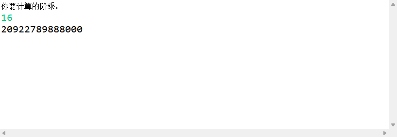

**示例二：**求斐波那契数列；

```java
import java.util.*;
class demo{
    // 1 1 2 3 5 8 13 21 34...
    public static void main(String[] args){
        Scanner scanner = new Scanner(System.in);
        System.out.println("请输入第一个数：");
        int a = scanner.nextInt();
        System.out.println("请输入第二个数：");
        int b = scanner.nextInt();
        fbnq(a,b);
    }
    public static int fbnq(int a,int b){
        if((a+b)<100){
            System.out.print(a+" ");
            return fbnq(b,a+b);
        }else{
            return 0;
        }
    }
}
```

打印效果如下：


## 方法的重载

**定义：**

在一个类中，多个方法的方法名相同，但方法的参数列表不同，是可以同时存在的，并且构成了方法的重载；

**参数列表不同指的是参数的数据类型不同：**

- 方法名相同，参数列表的个数不同
- 方法名相同，参数列表的数据类型不同
- 方法名相同，参数列表的顺序不同
- 方法的重载和返回值类型，权限修饰符无关

```java
public static void m1(int a){}
public static void m1(int b){}
//以上两种不互为重载
public static void m2(int a,double b){}
public static void m2(double a,int a){}
//以上两种互为重载
public static void m3(int a){}
public static int m3(int a){}
//以上两种不互为重载
```

**示例如下：**

```java
import java.util.*;
class demo{
    public static void main(String[] args){
        Method(1,2);
        Method();
    }
    public static void Method(int a,int b) {
        System.out.println("int a,int b");
    }
    public static void Method(){
        System.out.println("void");
    }
}
```

打印效果如下：


**方法重载的意义：**

让开发者更加直观方便地使用一个方法，实现一种固定的功能，但是参数是可选的；

# 15.数组

**定义：数组 == 容器**

- 组就是指多个的意思，在之前我们的代码中使用的数据类型都是单个的，为了将多个相同类型的数据存储在一起，这时候就引出了组的概念；
- 数组是存储同一种数据类型多个元素的集合，也可以看成是一个容器；
- 数组可以存储基本数据类型，也可以存储引用将数据类型；
- 数组是 Java 中的唯一底层存储容器；

## 创建数组

**基本格式一：**

```
int[] arr = new int[10];
数据类型[] 数组名 = new 数据类型[容量值];
```

**基本格式二：**

```java
int arr[] = new int[10];
```

**容量值：**

创建一个存放多个元素的容器（内存要开辟这样的空间来存放多个元素，关键在于内存开辟多大的空间给你？）

例如：

```
int a = 10;  				32位
int[] arr = new int[4];		32*4位
```

示例：创建一个存放五个 double 的数据；

```java
double[] arr = new double[5];
```

**数组底层的存储模样：**

数组在底层是一个连续的空间；

内存中任何任何一个空间都会有自己的地址，那么将连续的第一位的地址称为首地址，在使用时通过首地址来找到这篇空间；

数组名中将会存放 jvm 开辟的这篇空间的首地址；

## 使用数组

$Q:$ 如何指定数组连续空间中具体的某一个元素？

$A:$ 通过数组的下标：是从 0 开始的一个数； arr[0] 指定的是数组的第一个元素；

**下标的使用规范：**

下标从 0 开始，最多到 `数组长度 - 1`

**数组的长度：**

任何一个数组，都有一个 length 属性，用于标识数组的长度： `arr.length`

```java
import java.util.*;
class demo{
    public static void main(String[] args){
        int arr[] = new int[100];
        System.out.println(arr.length);
    }
}
```

打印效果如下：


**数组的遍历：**

```java
import java.util.*;
class demo{
    public static void main(String[] args){
        int arr[] = new int[10]; //数组的创立
        for(int i=1; i<11; i++){
            arr[i-1] = i;
        }  //数组的赋值
        for(int j=0; j<arr.length; j++){
            System.out.print(arr[j] + " ");
        }  //数组的遍历
    }
}
```

打印效果如下：


## 实例演示

**实例一：**

键盘输入15个学生的年龄，查找固定年龄的学生的位置；

```java
import java.util.*;
class demo{
    public static void main(String[] args){
        Scanner scanner = new Scanner(System.in);
        System.out.println("请输入十五个学生的年龄：");
        int age[] = new int[15];
        for (int i = 0; i < age.length; i++){
            age[i] = scanner.nextInt();
        }
        System.out.println("请指定要查询的年龄：");
        int staticAge = scanner.nextInt();
        for (int j = 1; j < age.length+1; j++){
            if(age[j-1] == staticAge){
                System.out.println("第"+j+"位");
            }
        }
    }
}
```

打印效果如下：


**实例二：**

键盘输入 10 个数，并且求出最大值；

```java
import java.util.*;
class demo{
    public static void main(String[] args){
        Scanner scanner = new Scanner(System.in);
        int arr[] = Arr();
        System.out.println("你输入的数组是：");
        for (int i=0; i<arr.length; i++){
            System.out.print(arr[i]+" ");
        }
        System.out.println();
        System.out.println("请问你要比较的是这个数组么？（是/否 = 1/0）");
        int agree = scanner.nextInt();
        if (agree == 1){
            int max = arr[0];
            for(int j=0; j<arr.length; j++){
                if (max <= arr[j]){
                    max = arr[j];
                }
            }
            System.out.println(max);
        }else if (agree == 0){
            System.out.println("请重新运行程序！");
        }else{
            System.out.println("输入错误，请重新运行程序！");
        }
    }
    public static int[] Arr(){
        Scanner scanner = new Scanner(System.in);
        int arr[] = new int[10];
        System.out.println("请输入十个整数(用空格隔开)：");
        for(int i=0; i<arr.length; i++){
            arr[i] = scanner.nextInt(); 
        }
        return arr;
    }
}

```

打印效果如下：


**实例三：**

用空方法的方式实现两值互换，要求方法中不能有打印动作；

该实例解释在 数组的参数传递 一节；

错误示范：

```java
import java.util.*;
class demo{
    public static void main(String[] args){
        int a = 1;
        int b = 2;
        changeNumb(a,b);
        System.out.println(a+" "+b);
    }
    public static void changeNumb(int a,int b){
        int t = a;
        a = b;
        b = t;
    }
}
```

打印效果如下：


正确示范：

```java
import java.util.*;
class demo{
    public static void main(String[] args){
        int a = 1;
        int b = 2;
        int arr[] = new int[] {a,b};
        changeNumb(arr);
        for(int i = 0; i < arr.length; i++){
            System.out.print(arr[i]+" ");
        }
    }
    public static void changeNumb(int[] a){
        int t = a[0];
        a[0] = a[1];
        a[1] = t;
    }
}

```

打印效果如下：


**实例四：**

用空方法的方式实现求最大值，要求方法中不能有打印动作；

```java
import java.util.*;
class demo{
    public static void main(String[] args){
        int[] arr = new int[10];
        setNum(arr);
        maxNum(arr);
    }
    public static void setNum(int[] arr){
        Random rand = new Random(); //随机获得一个随机对象
        for(int i=0; i<arr.length; i++){
            arr[i]= rand.nextInt(1000); //rand.nextInt(1000)会产生0-999随机数
        }
    }
    public static void maxNum(int[] arr){
        int t = arr[0];
        for(int i=0; i<arr.length; i++){
            if(t<=arr[i]){
                t = arr[i];
            }
        }
        System.out.println(t);
    }
}

```

打印效果如下：


**实例五：**

数组内容反转；

```java
import java.util.*;
class demo{
    public static void main(String[] args){
        Scanner scanner = new Scanner(System.in);
        System.out.println("请输入您要操作的数字个数：");
        int num = scanner.nextInt();
        int arr[] = new int[num];
        System.out.println("请输入所要操作的"+num+"位整数：");
        for (int i = 0; i < arr.length; i++){
            arr[i] = scanner.nextInt();
        }
        System.out.println("你的数组是：");
        for (int i = 0; i < arr.length; i++){
            System.out.print(arr[i]+" ");
        }
        System.out.println();
        System.out.println("反转后：");
        for (int i = 0; i< arr.length; i++){
            if(arr.length%2==0){
                if(i<(arr.length/2)){
                    int t = arr[i];
                    arr[i] = arr[arr.length - 1 - i];
                    arr[arr.length - 1 - i] = t; 
                }else{
                    break;
                }
            }else if(arr.length%2!=0){
                if(i<((arr.length-1)/2)){
                    int t = arr[i];
                    arr[i] = arr[arr.length - 1 - i];
                    arr[arr.length - 1 - i] = t; 
                }else{
                    break;
                }
            }
        }
        for (int i = 0; i< arr.length; i++){
            System.out.print(arr[i]+" ");
        }
    }
}

```

打印效果如下：


**实例六：**

求俩数的最大公约数和最小公倍数；

```java
import java.util.*;

public class demo {
	public static void main(String[] args) {
        Scanner scanner = new Scanner(System.in);
        System.out.println("输入两个数，求他们的最大公约数和最小公倍数！");
        System.out.println("输入两数中第一个数：");
        int m = scanner.nextInt();
        System.out.println("输入两数中第二个数：");
        int n = scanner.nextInt();
        if(m>n){
            int arr[] = new int[m]; 
            for(int i=1;i<(m+1);i++){
                if(m%i==0&&n%i==0){
                    arr[i] = i;
                }
            }
            Arrays.sort(arr);
            int max = arr[m-1];
            System.out.println("最大公约数是"+max);
            int min = (m*n)/max;
            System.out.println("最小公倍数是"+min);
        }else if(m<n){
            int arr[] = new int[n]; 
            for(int i=1;i<(n+1);i++){
                if(m%i==0&&n%i==0){
                    arr[i] = i;
                }
            }
            Arrays.sort(arr);
            int max = arr[n-1];
            System.out.println("最大公约数是"+max);
            int min = (m*n)/max;
            System.out.println("最小公倍数是"+min);
        }else{
            System.out.println("最大公约数是"+n);
        }
    }
}
```

打印效果如下：


## 总结

- 数组是一片连续的内存空间，用来存放多个元素；
- 数组的创建需要考虑两个方面：数据类型，长度；
- 数组通过下标（索引）来定位到这个连续空间中的某一个具体的空间；
- 下标从 0 开始，最多到 `数组的长度 - 1`；
- 任何数组都有一个 length 属性，方便我们在循环中使用；

## 其他细节

### 数组的初始化

1. 动态初始化

   先开辟好空间，里面元素是默认值，并没有填入我们要填的值，等使用时再填入，这是一个动态的过程；

   ```java
   int arr[] = new int[10];
   ```

2. 静态初始化

   在创建数组时，直接给数组里的每一个空间的赋值；

   ```java
   //方法一
   int arr[] = new int[]{1,2,3,4,5};
   //注意中括号里面没有数字（长度）;
   
   //方法二
   int arr[] = {1,2,3,4,5};
   
   //方法三
   int arr[];
   arr = new int[]{1,2,3,4,5}
   //注意以下这样不行：
   int[] arr;
   arr = {1,2,3,4,5};
   ```

### 数组中数据类型的默认值

`byte`  `short`  `int`  `long`  的默认值都为 `0`；

`float`  `double`  的默认值都为 `0.0`；

`char`  的默认值为 `' '（空格字符）`；

`boolean`  的默认值为 `false`；

`String`  的默认值为 `null`；

### 数组的参数传递

当方法中的参数是传递数组时，传递的是地址值，就是数组指向的那一块内存空间的首地址；

基本数据类型在方法中进行参数传递时，传的是具体的值；

### Arrays工具类

**Arrays.toString();**

打印数组；

此处的Arrays.toString()方法是Arrays类的静态方法；

```java
import java.util.Arrays;
public class Test {
    public static void main(String args[]) {
        int[] a = { 1, 2 };
        System.out.println(a); // 打印数组引用的值；
        System.out.println(Arrays.toString(a)); // 打印数组元素的值；
    }
}
```

打印效果如下：


**Arrays.equals(int[] a, int[] a2);**

比较两个数组是否相同；

```java
import java.util.*;
class demo{
    public static void main(String[] args){
        int [] arrA={23,34,345,234};
        int [] arrB={23,34,345,234};
        //两个数组以相同的顺序包含相同的元素
        System.out.println(Arrays.equals(arrA, arrB));//true
    }
}

```

打印效果如下：


**Arrays.copyOf(int[] original, int newLength);**

复制指定的数组---效率低，会重新开辟新的数组空间original - 要复制的数组;newLength - 要返回的副本的长度；

```java
import java.util.*;
class demo{
    public static void main(String[] args){
        int [] arrA={23,34,345,234};
        int [] arrB=new int[5];//默认值0
        System.out.println("拷贝前："+arrB);
        System.out.println(Arrays.toString(arrA));
        arrB=Arrays.copyOf(arrA, 5);  //重新开辟空间
        System.out.println("拷贝后："+arrB);
        System.out.println(Arrays.toString(arrB));
    }
}

```

打印效果如下：


**Arrays.fill(int[] a, int val)/Arrays.fill(int[] a, int fromIndex, int toIndex, int val);**

填充数组；

```java
import java.util.*;
class demo{
    public static void main(String[] args){
        int[] a= {1,2,323,23,543,12,59};
        System.out.println(Arrays.toString(a));
        Arrays.fill(a, 2, 4, 100);  //将2到4索引的元素替换为100;前闭后开
        System.out.println(Arrays.toString(a));
        Arrays.fill(a, 55);
        System.out.println(Arrays.toString(a));
    }
}

```

打印效果如下：


**Arrays.sort(int[] a);**

对数组进行升序排序；

```java
import java.util.*;
class demo{
    public static void main(String[] args){
        int[] a = {1,2,323,23,543,12,59};
        System.out.println(Arrays.toString(a));
        Arrays.sort(a);
        System.out.println(Arrays.toString(a));
    }
}

```

打印效果如下：


**Arrays.binarySearch(int[] a, int key);**

二分法查找；

```java
import java.util.*;
class demo{
    public static void main(String[] args){
        int[] a = {1,2,323,23,543,12,59};
        System.out.println(Arrays.toString(a));
        Arrays.sort(a);   //使用二分法查找，必须先对数组进行排序;
        System.out.println(Arrays.toString(a));
        //返回排序后新的索引位置,若未找到返回负数。
        System.out.println("该元素的索引："+Arrays.binarySearch(a, 12)); 
    }
}
```

打印效果如下：


### 可变参数

在定义方法时，允许实参的个数是任意的，但是数据类型是固定的，那么这时就可以使用可变参数；

基本格式：

```java
public static void m1(int...args){

}
```

在调用方法时，无论多少个参数，都会传给 args 数组，也就是说， args 数组里存放了所有的实参；

注意：在定义方法时，可变参数要写在所有方法之后；

示例如下：

```java
import java.util.*;
class demo{
    public static void main(String[] args){
        m1(1,2,3,4,5,6,7,8,9);
    }
    public static void m1(int a,int b,int c,int... args){
        System.out.println(a);
        System.out.println(b);
        System.out.println(c);
        System.out.println(args);
        System.out.println(Arrays.toString(args));
    }
}

```

打印效果如下：


# 16.二维数组

## 创建数组

**基本格式：**

```java
//方法一：
int[][] arr = new int[4][3];

//方法二：
int arr[][] = new int[4][3];

//方法三：
int arr[][] = new int[4][];
arr[0] = new int[3]
arr[1] = new int[3]    
arr[2] = new int[3]    
arr[3] = new int[3]    
```

## 使用数组

**调用二维数组中的某一空间**：使用双下标确定数据位置`arr[3][1]`；

**下标是从 0 开始，最多是 `数组的长度 - 1`**；

**数组的长度**：

1. 一维数组是 `arr.length`；
2. 二维数组是 `arr[1].length`；

**二维数组的遍历**：

多用双层循环进行遍历，外层循环行数，内层循环列数；

示例如下：

全班一共有4个小组，每个小组有3个人；

```java
import java.util.*;
class demo{
    public static void main(String[] args){
        Scanner scanner = new Scanner(System.in);
        String[][] students = new String[4][3];
        // 元素的堆放
        System.out.println("请输入每一组学生的具体名称：");
        for(int i = 0; i < students.length; i++){
            System.out.println("第"+(i+1)+"组：");
            for(int j = 0; j < students[1].length; j++){
                students[i][j] = scanner.next();
            }
        }
        // 元素的遍历
        System.out.println("您的班级成员如下：");
        for(int k = 0; k < students.length; k++){
            for (int l = 0; l < students[k].length; l++){
                System.out.print(students[k][l]+"   ");
            }
            System.out.println();
        }
    }
}

```

打印效果如下：


## 动态初始化

```java
//方法一
int[][] arr = new int[3][5];

//方法二
int[][] arr = new int[3][]; 
//此时内存只开辟了一维数组，这个一维数组里面的每个元素是用来存放另一个数组的地址;
//目前第二维数组还没创建，因此里面存放的是 null;

//方法三
int arr[][] = new int[3][5];

//方法四
int arr[][] = new int[3][];
```

**“方法二”实例：**

```java
import java.util.*;
class demo{
    public static void main(String[] args){
        int[][] arr = new int[3][];
        arr[0] = new int[3];
        arr[1] = new int[5];
        arr[2] = new int[7];
        for(int i=0; i<arr.length; i++){
            System.out.println(Arrays.toString(arr[i]));
        }
    }
}

```

打印效果如下：


**实例：**

一个班级有35名同学，
第一组有5名，位置分别为 A1 , A2 , A3 , A4 , A5；
第二组有6名，位置分别为 B1 , B2 , B3 , B4 , B5 , B6；
第三组有7名，位置分别是 C1 , C2 , C3 , C4 , C5 , C6 , C7;
第四组有8名，位置分别是 D1 , D2 , D3 , D4 , D5 , D6 , D7 , D8；
第五组有9名，位置分别是 E1 , E2 , E3 , E4 , E5 , E6 , E7 , E8 , E9 ；
设计一个随机点名程序，学号均为 `20010+组数+位置` 的形式；

```java
import java.util.*;
class demo{
    public static void main(String[] args){
        String[][] arr = new String[5][];
        arr[0] = new String[]{"A1" , "A2" , "A3" , "A4" , "A5"};
        arr[1] = new String[]{"B1" , "B2" , "B3" , "B4" , "B5" , "B6"};
        arr[2] = new String[]{"C1" , "C2" , "C3" , "C4" , "C5" , "C6" , "C7"};
        arr[3] = new String[]{"D1" , "D2" , "D3" , "D4" , "D5" , "D6" , "D7" , "D8"};
        arr[4] = new String[]{"E1" , "E2" , "E3" , "E4" , "E5" , "E6" , "E7" , "E8" , "E9"};
        System.out.println("您现在的班级成员如下：");
        for (int i = 0; i < arr.length; i++){
            System.out.print("第" +(i+1)+ "组：");
            for (int j = 0; j < arr[i].length; j++){
                System.out.print(arr[i][j]+"  ");
            }
            System.out.println();
        }
        System.out.println("下面开始随机点名！学号是：");
        Random rand = new Random();
        int Arr = rand.nextInt(4);
        int a = rand.nextInt(4);
        int b = rand.nextInt(5);
        int c = rand.nextInt(6);
        int d = rand.nextInt(7);
        int e = rand.nextInt(8);
        if (Arr == 0){
            System.out.println("20010"+(Arr+1)+arr[Arr][a]);
        }else if(Arr == 1){
            System.out.println("20010"+(Arr+1)+arr[Arr][b]);
        }else if(Arr == 2){
            System.out.println("20010"+(Arr+1)+arr[Arr][c]);
        }else if(Arr == 3){
            System.out.println("20010"+(Arr+1)+arr[Arr][d]);
        }else{
            System.out.println("20010"+(Arr+1)+arr[Arr][e]);
        }
    }
}
```

打印效果如下：


## 静态初始化

**基本格式：**

```java
//方法一：
int[][] arr = new int[][]{{1,2,3,4},{5,6,7},{8,9}};
//方法二：
int[][] arr = {{1,2,3,4},{5,6,7},{8,9}};
```

实例：

以点名程序为例，更改代码，再次执行；

```java
import java.util.*;
class demo{
    public static void main(String[] args){
        String arr[][] = {{"A1" , "A2" , "A3" , "A4" , "A5"},{"B1" , "B2" , "B3" , "B4" , "B5" , "B6"},{"C1" , "C2" , "C3" , "C4" , "C5" , "C6" , "C7"},{"D1" , "D2" , "D3" , "D4" , "D5" , "D6" , "D7" , "D8"},{"E1" , "E2" , "E3" , "E4" , "E5" , "E6" , "E7" , "E8" , "E9"}};
        System.out.println("您现在的班级成员如下：");
        for (int i = 0; i < arr.length; i++){
            System.out.print("第" +(i+1)+ "组：");
            for (int j = 0; j < arr[i].length; j++){
                System.out.print(arr[i][j]+"  ");
            }
            System.out.println();
        }
        System.out.println("下面开始随机点名！学号是：");
        Random rand = new Random();
        int Arr = rand.nextInt(4);
        int a = rand.nextInt(4);
        int b = rand.nextInt(5);
        int c = rand.nextInt(6);
        int d = rand.nextInt(7);
        int e = rand.nextInt(8);
        if (Arr == 0){
            System.out.println("20010"+(Arr+1)+arr[Arr][a]);
        }else if(Arr == 1){
            System.out.println("20010"+(Arr+1)+arr[Arr][b]);
        }else if(Arr == 2){
            System.out.println("20010"+(Arr+1)+arr[Arr][c]);
        }else if(Arr == 3){
            System.out.println("20010"+(Arr+1)+arr[Arr][d]);
        }else{
            System.out.println("20010"+(Arr+1)+arr[Arr][e]);
        }
    }
}

```

打印效果如下：


# 17.开发工具IDE

## 工具类型

文本开发；

Editplus；

notepad++；

Eclipse；

Intellij Idea；

## Eclipse安装

1. 官网下载安装器；
2. 安装器中选择JavaEE版本；
3. 运行Eclipse，注意环境变量里一定要有 JAVA_HOME；
4. 启动后选择工作空间，工作空间就是代码要存放的目录；

## Eclipse的使用

1. 从 JavaEE 视图转换成 Java 视图；

2. 创建 Java 工程，只填工程名即可；

3. 创建好以后，右侧会出现一个文件夹 ，所有的类都写在 src 子文件夹中；

4. 类是包含于包里的；

   

   - 包（package)：用于统一管理类的一种容器，同一个包中的类不能同名，而不同包中的类可以同名，一个类的唯一标识是：`包名+类名`；
   - 类上的 `package` 关键字，指的是当前类所属的包；

5. 创建程序并运行程序；

   - 创建工程；

   - 创建包；

   - 创建类；

   - 编译程序；

     按下保存键，就会实现编译；

   - 运行程序；

## Eclipse的基本设置及快捷键

**基本设置：**

1. 设置界面比例： `Ctrl+"+"/"-"`；
2. 还原窗口：`Window --> Perspective --> Resrt Perspective`；
3. 显示控制台：`Window --> Show View --> Console`；

**快捷键设置：**

1. 新建：`Ctrl+N`；

2. 自动补全：`Alt+/`；

   简码：main == public ......main；

   ​		    syso == System.out.println；

   ​		    scan == Scanner；

3. 获得返回值及提示：`Ctrl+1`；（报错的时候可以拿去检查）

4. 删除一行：`Ctrl+D`；

5. 让代码上移或者下移：`Alt+↑/↓`；

6. 自动调整格式：`Ctrl+Shift+F`；

7. 快速创建内结构的快捷键：`Alt+Shift+S`；

8. 抽取方法：`Alt+Shift+M`；

9. 快速生成属性的 getter 和 setter：`Alt+Shift+S` ==> `Generate getters and setters`；

10. 在 eclipse 中打开类库：`Ctrl+Shift+T`；

8. 快速重写 equals(Object obj) 方法：`Ctrl+Shift+S` ==> `Generate hashCode() and equals()`；

# 18.面向对象

## 面向对象简述

面向对象是高级程序设计语言的核心，是对现实世界的还原，也是目前市面上最主流的程序设计思想，要开发一定要搞清楚面向对象；

**关键是**：类 和 对象；

**举例**：把大象装进冰箱分几步？

- 面向过程：人==打开==冰箱，==放进==大象，==关闭==冰箱门；

  ```
  main(){
  	人打开冰箱，放进大象，关闭冰箱门;
  }
  ```

- 面向对象：

  - ==人==：打开物体，关上物体；

  - ==冰箱==：开门，关门；

  - ==大象==：进入物体；

    ```
    main(){
    	人.去打开冰箱;
    	冰箱.开门;
    	大象.进入冰箱;
    	人.关上冰箱;
    	冰箱.关门;
    }
    ```

## 类和对象的关系

**类**是一种统称，例如一种类型，一种概念的描述；

例如：用编程语言描述一个人；

```java
public class people{
    int hand = 2;
    int leg = 2;
    //用方法描述功能
    void sleep(){
        System.out.println("睡觉！");
    }
    void eat(){
        System.out.println("吃饭！");
    }
}
```

**对象**是某一个类的实实在在的实例；

例如：张三是一个人！

则 “张三” 是对象，而 “人” 就是类；

**总结：**

类是模板，对象是根据模板创建出来的一个实实在在的个体；

**补充：简述内存区域；**

堆：new 出来的东西全部都放在堆里面；

```
Scanner scanner = new Scanner(System.in);
```

栈：局部变量存放的位置；

方法区：方法的引用，方法的权限，静态的变量，常量池等；

本地方法区：和系统相关的一些（native）原生方法，例如一些C语言的方法；

## 如何创建对象（构造器：类的第二成员）

**基本格式：**

```
类名 对象名 = new 类名();
其中“类名()”是类的构造器;
```

**关键字 new：**

作用是在内存的堆空间中开辟一块区域，该区域就是常见出来的具体对象存在的区域；

## 如何使用对象

**对象在内存中的样子：**

接下来要考虑的是程序如何执行，如何写；

而是考虑对象存不存在，对象里有哪些东西，有就可以用，没有就不能用；

**方式一：使用对象的属性：**

**基本格式：**

```
对象名.属性;
```

即使用对象的成员变量（定义在类的内部，方法的外部）；

student类：

```java
package top.sharehome.BagOne;

public class student {
	String name = "张三";
	char sex = '男';
	void study(){
		System.out.println("学海无涯苦作舟！");
	}
	void sleep() {
		System.out.println("学累了，要睡觉！");
	}
	void exam() {
		System.out.println("每天早上要考试！");
	}
}
```

sharehome类：

```java
package top.sharehome.BagOne;

public class sharehome {
	public static void main(String[] args) {
		//如何使用类来创建对象
		student zhenzhangsan = new student();
		
		//使用对象的属性
		zhenzhangsan.name = "真张三";
		
		//再次创建
		student jiazhangsan = new student();
		
		//再次使用对象的属性
		jiazhangsan.name = "假张三";
		
		System.out.println(zhenzhangsan.name);
		System.out.println(jiazhangsan.name);
	}
}
```

打印效果如下：


**方式二：使用对象的方法：**

**基本格式：**

```
对象名.方法;
```

student类：

```java
package top.sharehome.BagOne;

public class student {
	String name = "张三";
	char sex = '男';
	void study(){
		System.out.println("学海无涯苦作舟！");
	}
	void sleep() {
		System.out.println("学累了，要睡觉！");
	}
	void exam() {
		System.out.println("每天早上要考试！");
	}
}
```

sharehome类：

```java
package top.sharehome.BagOne;

public class sharehome {
	public static void main(String[] args) {
		//如何使用类来创建对象
		student zhenzhangsan = new student();
		
		//使用对象的方法
		zhenzhangsan.sleep();
		
		//再次创建
		student jiazhangsan = new student();
		
		//再次使用对象的方法
		jiazhangsan.study();
	}
}
```

打印效果如下：


## 对象小结

**$Q:$ 如何使用面向对象的概念进行程序开发？**

$A:$  首先编写和设计类  <====>  重点是类的设计；
		然后使用类来创建对象；
		最后使用对象的属性和方法来满足实际场景的需要；

## 类小结

**$Q:$ 如何设计类?**

$A:$ 大体格式如下：（以下几个部分并不是都要出现）

​		==类的五大成员：属性，方法，构造器，代码块，内部类==

```
class 类名{
	1.成员变量（属性）
	
	2. 方法(){
	
	}
	
	3. 构造方法
	
	4. 代码块  //静态代码块 static{}  构造代码块用 {}
	
	5. class 类名{
	
	}     //内部类:class 类名{}
}
```

- **成员变量：**

  定义在类的内部，方法的外部；

  **成员变量和局部变量的区别：**
  $$
  \bf{定义位置不同}\begin{cases}\bf{成员变量：定义在类中，方法外；}\\\bf{局部变量：定义在方法中或者方法声明上；} \end{cases}
  $$

  $$
  \bf{生命周期不同}\begin{cases}\bf{成员变量：随着对象的创建而存在，随着对象的消亡而消亡；}\\\bf{局部变量：随着方法的调用而存在，随着方法的结束而消亡；}\end{cases}
  $$

  $$
  \bf{内存中的位置不同}\begin{cases}\bf{成员变量：在堆内存（成员变量属于对象，对象进堆内存）}\\\bf{局部变量：在栈内存（局部变量属于方法，方法进栈内存）}\end{cases}
  $$

  $$
  \bf{初始化值不同}\begin{cases}\bf{成员变量：有默认值，是在对象创建的过程中JVM设置的默认值；}\\\bf{局部变量：没有默认值，必须在使用之前赋值；} \end{cases}
  $$

  **注意事项：**

  - 局部变量名称可以和成员变量名称一样，在方法中使用的时候，采用的是就近原则；
  - 基本数据类型变量包括：byte , short , int , long , float , double , boolean , char;
  - 引用数据类型变量包括：数组 ，类 ，接口 ，枚举 ；
  
- **构造方法/构造器（Constructor）：**==构造器和方法不一样！！！==

  **基本格式：**

  ```java
  Constructor con = new Constructor();
  ```

  这句代码正在创建对象，同时调用了指定的构造器；

  ```java
  package top.sharehome.BagOne;
  
  public class Cat {
  	String name;
  	int age;
  	char sex;
  	public Cat(String Name,int Age,char Sex) {  //这是一个构造器
  		name = Name;
  		age = Age;
  		sex = Sex;
  	}
  }
  ```

  构造器的作用是在创建对象时，为对象属性做初始化工作（给对象的所有或部分属性赋初值）；

  示例如下：

  Cat 类：

  ```java
  package top.sharehome.BagOne;
  
  public class Cat {
  	String name;
  	int age;
  	char sex;
  	public Cat(String Name,int Age,char Sex) {  //这是一个构造器
  		name = Name;
  		age = Age;
  		sex = Sex;
  	}
  }
  ```

  Test 类：

  ```java
  package top.sharehome.BagOne;
  
  public class Test {
  	public static void main(String[] args) {
  		Cat cat = new Cat("小灰",2,'雄');
  		System.out.println(cat.name);
  		System.out.println(cat.age);
  		System.out.println(cat.sex);
  	}
  }
  ```

  打印效果如下：

  

  **构造器的创建：**

  面向对象的设计重点是类的设计，构造器是类的一部分，在类中设计构造器；

  即：==构造器不在主函数 java 文件中，而在类 java 文件中，且和类同名，同时不能有返回类型==；

  构造器的格式：

  ```java
  public class Method{
  	public Method(){  //这是一个构造器
          
      }
  }
  ```

  一个类可以有多个重载的构造器，这是为了方便创建对象时满足不同的要求：

  Cat 类：

  ```java
  package top.sharehome.BagOne;
  
  public class Cat {
  	String name;
  	int age;
  	char sex;
  	public Cat() {
  		
  	}
  	public Cat(String Name,int Age,char Sex) {
  		name = Name;
  		age = Age;
  		sex = Sex;
  	}
  	public Cat(String Name) {
  		name = Name;
  	}
  	public Cat(int Age) {
  		age = Age;
  	}
  	public Cat(char Sex) {
  		sex = Sex;
  	}	
  }
  ```

  Test 类：

  ```java
  package top.sharehome.BagOne;
  import java.util.*;
  public class Test {
  	public static void main(String[] args) {
  		Scanner sc = new Scanner(System.in);
  		System.out.println("请输入家猫一项或全部的信息！");
  		System.out.println("你选择一项还是全部？（一项/全部==1/0）");
  		int select = sc.nextInt();
  		if (select == 1) {
  			System.out.print("你想输入名字/年龄/性别中的哪一项？（名字/年龄/性别==1/2/3）");
  			int choice = sc.nextInt();
  			if(choice == 1) {
  				System.out.print("请输入家猫名字：");
  				String Name = sc.next();
  				System.out.println();
  				System.out.print("你家家猫名字是：");
  				Cat c1 = new Cat(Name);
  				System.out.println(c1.name);
  			}else if(choice == 2) {
  				System.out.print("请输入家猫年龄：");
  				int Age = sc.nextInt();
  				System.out.println();
  				System.out.print("你家家猫年龄是：");
  				Cat c1 = new Cat(Age);
  				System.out.println(c1.age);
  			}else if(choice == 3) {
  				System.out.print("请输入家猫性别：");
  				char Sex = sc.next().charAt(0);
  				System.out.println();
  				System.out.print("你家家猫性别是：");
  				Cat c1 = new Cat(Sex);
  				System.out.println(c1.sex);
  			}else {
  				System.out.println("输入错误，请重新启动程序！");
  			}
  		}else if(select == 0) {
  			System.out.print("请输入家猫名字：");
  			String Name = sc.next();
  			System.out.println();
  			System.out.print("请输入家猫年龄：");
  			int Age = sc.nextInt();
  			System.out.println();
  			System.out.print("请输入家猫性别：");
  			char Sex = sc.next().charAt(0);
  			System.out.println();
  			System.out.println("你家家猫的信息如下：");
  			Cat c2 = new Cat(Name,Age,Sex);
  			System.out.println("你家家猫的名字是"+c2.name);
  			System.out.println("你家家猫的年龄是"+c2.age);
  			System.out.println("你家家猫的性别是"+c2.sex);
  		}else {
  			System.out.println("输入错误，请重新执行程序！");
  		}
  		sc.close();
  	}
  }
  ```

  打印效果如下：

  

  注意：

  - 如果一个类里面没有显式地定义任何构造器，那么 JVM 就会默认创建一个空参构造器；
  - 如果一个类中显式地定义了任何一个构造器（带参或者空参），那么 JVM 就不会创建一个空参地构造器；
  - 所以可以习惯性地手动创建一个空参构造器；

  **构造器的使用：**

  在创建对象时需要指明使用哪一个构造器，格式如下：

  ```
  类 对象名 = new 类名();  //"类名()"就是构造器的调用
  ```

## this关键字

this 可以修饰属性、方法和构造器，其实默认状态下，每个成员变量前都被 this 隐式修饰；

==目前主要是为了打破局部优先；==

==等到学习继承时是为了打破父子关系；==

```
this.name; //当前对象的属性
this.method(); //当前对象的方法
```

**this 修饰属性：**

```
package top.sharehome.BagOne;

public class Test {
	String name;  //这里的 name 标为 A.name
	int age;	//这里的 age 标为 A.age
	public Test(String name,int age) {
		this.name = name;  //此时的 this.name = A.name
		this.age = age;	   //此时的 this.age = A.age
	}
}
```

**this修饰方法：**

```
package top.sharehome.BagOne;

public class Test {
	void eat() {
		System.out.println("吃饭");
		this.sleep(); //也可以直接 sleep();
	}
	void sleep() {
		System.out.println("睡觉");
	}
}
```

**this修饰构造器：**

写代码时基本不会用到，但是看代码时经常会看到：

**目的**：让构造器复用；

**注意：**

- “`this(重载方法参数列表)`” 只能出现在构造器中且只能出现在首行；
- 一个类中，如果有 n 个构造器，那么最多只能出现 n-1 个构造器，不然会进入死循环；

Test 类：

```java
package top.sharehome.BagOne;

public class Test {
	String name = null;
	int age = 0;
	char sex = '空';
	public Test() {
		this("小明",9);		//调用Test(String name,int age)
		System.out.println("Test()");
		System.out.println(name+" "+age+" "+sex);
	}
	public Test(String name,int age) {
		this("小红",10,'女');		//调用Test(String name,int age)
		this.name = name;
		this.age = age;
		System.out.println("Test(String name,int age)");
		System.out.println(name+" "+age+" "+sex);
	}
	public Test(String name,int age,char sex) {
		this.name = name;
		this.age = age;
		this.sex = sex;
		System.out.println("public Test(String name,int age,char sex)");
		System.out.println(name+" "+age+" "+sex);
	}
}
```

T 类：

```java
package top.sharehome.BagOne;

public class T {
	public static void main(String[] args) {
		Test test = new Test();
	}
}
```

打印效果如下：


## 实例展示

**实例一：**

定义人类的属性：姓名，年龄，性别；

定义人类的方法：工作，睡觉，自我介绍；

创建不同的人的实例对象，并调用方法，打印属性数据；

Person类：

```java
package top.sharehome.BagOne;

public class Person {
	String name;
	int age;
	char sex;
	void work() {
		System.out.println("工作");
	}
	void sleep() {
		System.out.println("睡觉");
	}
	void self_info() {
		System.out.println("自我介绍");
	}
}
```

Test类：

```java
package top.sharehome.BagOne;

public class Test {
	public static void main(String[] args) {
		Person chen = new Person();
		chen.name = "陈一";
		chen.age = 25;
		chen.sex = '女';
		System.out.print(chen.name+"  ");
		System.out.print(chen.age+"  ");
		System.out.print(chen.sex+"  ");
		System.out.println();
		chen.work();
		chen.sleep();
		chen.self_info();
	}
}
```

打印效果如下：


**实例二：**

新生入学，需要录入学生信息，编写程序，录入资料系统；

要求围绕此内容编程：定义学号为 年份+性别+年级+班级+编号（编号由每班人数决定）；

Student 类：

```java
package top.sharehome.BagOne;

public class Student {
	String Name;
	int Sex;
	int Grade;
	int Class;
	int Age;
	public Student(String n,int s,int g,int c,int a) {
		Name = n;
		Sex = s;
		Grade = g;
		Class = c;
		Age = a;
	}
}
```

TeachSystem 类：

```java
package top.sharehome.BagOne;

import java.util.*;

public class TeachSystem {
	public static void main(String[] args) {
		// 定义学号为 出生年份+性别+年级+班级+编号（编号由每班人数决定）
		Scanner sc = new Scanner(System.in);
		System.out.println("输入班级号：（四班==4）");
		int c = sc.nextInt();
		System.out.println("请输入班级人数：");
		int number = sc.nextInt();
		String[] str = new String[number];
		System.out.println("请输入班级所在年级：（2020级==2020）");
		int g = sc.nextInt();
		if (number < 0) {
			System.out.println("输入错误，请重新启动程序！");
		} else if (number == 0) {
			System.out.println("该班不存在！");
		} else {
			for (int i = 0; i < number; i++) {
				System.out.println("请输入第" + (i + 1) + "学生名字：");
				String n = sc.next();
				System.out.println("请输入该学生出生年份：");
				int a = sc.nextInt();
				System.out.println("请输入该学生性别：（男/女==1/0）");
				int s = sc.nextInt();
				Student Stu = new Student(n, s, g, c, a);
				str[i] = "第"+(i+1)+"个叫"+n+"  学号为"+a+s+g+c+(i+1);
			}
			System.out.println("===================");
			System.out.println("你的班级信息是");
			for (int i = 0; i < str.length; i++) {
				System.out.println(str[i]);
			}
		}
		sc.close();
	}
}
```

打印效果如下：


# 19.封装（面向对象第一大特性）

**概念定义**：

问题的出现：封装就是让 Java 中的代码尽量完全还原现实世界，而不会造成与现实世界有冲突，这种冲突往往出现在直接对属性进行赋值的场景，也就是说，如果直接对属性进行赋值，而没有任何的约束条件，那么就很容易造成与现实世界不相符的冲突；

问题的解决：因此，通过封装来对属性赋值，对这一行为添加约束条件。换句话说，把对属性的操作放在一个方法里，那么这个过程就称为封装，此后属性不能直接访问，而必须通过方法来访问，此时就要用到==private==关键字；

**封装的步骤：**

1. 私有化属性；
2. 提供公共的方法来操作私有化属性；
3. 在公共的方法里设置约束条件；

**示例一：**

为了解决用户输入的数字而造成误解，世界上基本没有奇数腿的动物，我们要消除该误解；

Animal 类：

```java
package top.sharehome.BagOne;

public class Animal {
	private int legs; // private ==> 私有的
	// 再提供一个公共的方法来操作私有的属性 ==> 封装的第一步

	public void setLeg(int legs) {
		if (legs % 2 != 0) {
			System.out.println("赋值失败，世界上没有奇数腿的动物！");
		} else {
			this.legs = legs;
		}
	}

	// 提供一个公共的方法来获取私有的属性
	public int getLeg() {
		return this.legs;
	}
}
```

demo 类：

```java
package top.sharehome.BagOne;

public class demo {
	public static void main(String[] args) {
		Animal a1 = new Animal();
		a1.setLeg(5);
		System.out.println("这只动物腿的数量是"+a1.getLeg());
	}
}
```

打印效果如下：


**示例二：**

世界上的人，年龄是有限的，用封装解决如下；

Person 类：

```java
package top.sharehome.BagOne;

public class Person {
	private int age;
	public void setAge(int age) {
		if(age>130||age<0) {
			System.out.println("世界上不存在这样的人！");
		}else {
			this.age = age;
		}
	}
	public int getAge() {
		return this.age;
	}
}
```

demo 类：

```java
package top.sharehome.BagOne;

public class demo {
	public static void main(String[] args) {
		Person p = new Person();
		p.setAge(-9);
		System.out.println("你的年龄是"+p.getAge());
	}
}
```

打印效果如下：


**在实际开发中的封装：**

在做具体开发时，设计一个类，类中的属性往往要设置成私有的，并且提供公共的方法来操作属性，在公共的方法里封装具体的约束条件，这些公共的方法就是以后经常会提到的 getter 和 setter，比如：`getXXX(){}` `setXXX(){}`；==可以用快捷键==

# 20.代码块（代码块：类的第四成员）

**概念定义：**

- 早期概念：代码块由一对 `{}` 大括号包裹，比如方法的内容，流程控制的内容，也称==普通代码块==；

- 目前概念：代码块是类的第四大成员，也称为==构造代码块==；

**构造代码块：**

作为类的第四大成员，起到了构造器的作用，是实现在类中对对象进行初始化的功能；

==构造代码块不常用==

示例如下：

Person 类：

```java
package top.sharehome.BagOne;

//一个类的成员大体如下：
public class Person {
	// 类的成员变量
	private String name;
	private int age;
	private char sex;

	// 构造器
	public Person() {
		super(); // 这是快捷键所形成的构造器，super可删可不删
		// TODO Auto-generated constructor stub
	}

	public Person(String name, int age, char sex) {
		super(); // 这是快捷键所形成的构造器，super可删可不删
		this.name = name;
		this.age = age;
		this.sex = sex;
	}

	public Person(String name) {
		super(); // 这是快捷键所形成的构造器，super可删可不删
		this.name = name;
	}

	public Person(int age) {
		super(); // 这是快捷键所形成的构造器，super可删可不删
		this.age = age;
	}

	public Person(char sex) {
		super(); // 这是快捷键所形成的构造器，super可删可不删
		this.sex = sex;
	}

	public Person(String name, int age) {
		super(); // 这是快捷键所形成的构造器，super可删可不删
		this.name = name;
		this.age = age;
	}

	public Person(int age, char sex) {
		super(); // 这是快捷键所形成的构造器，super可删可不删
		this.age = age;
		this.sex = sex;
	}

	public Person(String name, char sex) {
		super(); // 这是快捷键所形成的构造器，super可删可不删
		this.name = name;
		this.sex = sex;
	}

	// 代码块,也称为构造代码块
	{
		this.age = 1;
		this.name = "张三";
		this.sex = '男';
	}

	//方法
	public void Method() {
		System.out.println(this.name);
		System.out.println(this.age);
		System.out.println(this.sex);
	}
}
```

demo 类：

```java
package top.sharehome.BagOne;

public class demo {
	public static void main(String[] args) {
		Person p = new Person();
		p.Method();
	}
}
```

打印效果如下：


# 21.静态（static）

## 定义

static修饰的部分称为静态的部分，所有静态的部分都会随着类的加载而加载，也就是说，当类加载进虚拟机的时候，类中静态的部分就会被创建到静态域中，注意：==所有类中的静态部分，都只会加载一次；==

比较示例如下：

- 非静态 SportMan 类：

  ```java
  package top.sharehome.BagOne;
  
  public class SportMan {
  	String name;
  	int age;
  	String nation;  //非静态
  	@Override
  	public String toString() {  //快捷生成的！
  		return "SportMan [name=" + name + ", age=" + age + ", nation=" + nation + "]";
  	}
  }
  ```

  非静态 demo 类：

  ```java
  package top.sharehome.BagOne;
  
  public class demo {
  	public static void main(String[] args) {
  		//开校级运动会
  		//创建运动员
  		//注意在国籍处的操作，如果有很多相同国籍，就可以用静态
  		SportMan s1 = new SportMan();
  		s1.name = "张三";
  		s1.age = 20;
  		s1.nation = "China";
  		SportMan s2 = new SportMan();
  		s2.name = "张四";
  		s2.age = 22;
  		s2.nation = "China";
  		SportMan s3 = new SportMan();
  		s3.name = "张五";
  		s3.age = 15;
  		s3.nation = "China";
  		//把信息打印出来
  		System.out.println(s1);
  		System.out.println(s2);
  		System.out.println(s3);
  	}	
  }
  ```

  打印效果如下：

  

- 静态 SportMan 类：

  ```java
  package top.sharehome.BagOne;
  
  public class SportMan {
  	String name;
  	int age;
  	static String nation;
  	@Override
  	public String toString() {
  		return "SportMan [name=" + name + ", age=" + age + ", nation=" + nation + "]";
  	}
  }
  ```

  静态 demo 类：

  ```java
  package top.sharehome.BagOne;
  
  public class demo {
  	public static void main(String[] args) {
  		//开校级运动会
  		//创建运动员
  		//注意在国籍处的操作，如果有很多相同国籍，就可以用静态
  		SportMan s1 = new SportMan();
  		s1.name = "张三";
  		s1.age = 20;
  		s1.nation = "China"; //SportMan.nation = "China";
  		SportMan s2 = new SportMan();
  		s2.name = "张四";
  		s2.age = 22;
  //		s2.nation = "China";
  		SportMan s3 = new SportMan();
  		s3.name = "张五";
  		s3.age = 15;
  //		s3.nation = "China";
  		//把信息打印出来
  		System.out.println(s1);
  		System.out.println(s2);
  		System.out.println(s3);
  	}	
  }
  ```

  打印效果如下：

  

## static修饰属性

**定义：**

static修饰属性，就是静态的成员变量，类的静态属性都创建在内存的静态域中，==随着类的加载而创建（特点）==，且只有一份，所有的对象都共用此静态域里的值；

**注意事项：**

- 静态的属性不建议使用“`对象名.属性`”的方法来调用；

  在上例中可修改静态代码部分：

  ```java
  package top.sharehome.BagOne;
  
  public class demo {
  	public static void main(String[] args) {
  		//开校级运动会
  		//创建运动员
  		//注意在国籍处的操作，如果有很多相同国籍，就可以用静态
  		SportMan.nation = "China";   //这样调用！！！！！
  		SportMan s1 = new SportMan();
  		s1.name = "张三";
  		s1.age = 20;
  		SportMan s2 = new SportMan();
  		s2.name = "张四";
  		s2.age = 22;
  		SportMan s3 = new SportMan();
  		s3.name = "张五";
  		s3.age = 15;
  		//把信息打印出来
  		System.out.println(s1);
  		System.out.println(s2);
  		System.out.println(s3);
  	}
  }
  ```

- 静态的属性也称为类属性或者类变量，因为它可以直接通过类名来调用；

## static修饰方法

**定义：**

static修饰方法，称为静态方法，静态方法随着类的加载而被加载，且只加载一次；

当类加载以后，静态方法会被加载进静态域中，可以直接通过 “`类名.静态方法名`” 的方法调用，而不需要通过创建对象后再通过 ”`对象名.方法名`“ 的方法调用；

**对比实例如下：**

非静态调用方法：

Person 类：

```java
package top.sharehome.BagOne;

public class Person {
	public void sleep(){            //无静态修饰
		System.out.println("睡觉！");
	}
}
```

demo 类：

```java
package top.sharehome.BagOne;

public class demo {
	public static void main(String[] args) {
		Person p = new Person();          //有创建对象
		p.sleep();
	}
}
```

打印效果如下：


静态调用方法：

Person 类：

```java
package top.sharehome.BagOne;

public class Person {
	public static void sleep(){    //静态修饰
		System.out.println("睡觉！");
	}
}
```

demo 类：

```java
package top.sharehome.BagOne;

public class demo {
	public static void main(String[] args) {
		Person.sleep();						//无创建对象
	}
}
```

打印效果如下：


**静态方法的意义：**

静态方法可以直接通过类名来调用，为了方便和快捷；

**注意事项：**

- 静态方法中只能出现静态的部分，==不能存在类中非静态的成员==，比如普通的属性和普通的方法，因为静态方法的创建是早于对象的创建；

- 静态方法中不能出现 this 关键字，应该用方法名，因为 this 关键字是描述对象的，但是静态方法的创建早于对象的创建，而且 this 关键字修饰的是普通变量，所以就印证了不能出现；

  解释示例如下：

  Person 类：

  ```java
  package top.sharehome.BagOne;
  
  public class Person {
  	static String name;
  	
  	public static void sleep(String name){
  		//this.name;  //这里就会报错
  		Person.name = name;
  		System.out.println(Person.name+"要睡觉了！");
  	}
  }
  ```

  demo 类：

  ```java
  package top.sharehome.BagOne;
  
  public class demo {
  	public static void main(String[] args) {
  		Person.sleep("小陈");
  	}
  }
  ```

  打印效果如下：

  

## static修饰代码块

**定义：**

static修饰代码块称为静态代码块，随着类的加载而被执行，且只执行一次；

**注意事项：**

==静态代码块也不能出现非静态的内容==；

**作用：**

往往用于初始化类中的静态属性；

**示例如下：**

我们不想再主函数中进行创建初始化对象，我们就可以用静态代码块在类中对其提前初始化；

Person 类：

```java
package top.sharehome.BagOne;

public class Person {
	//元素
	private String name;
	private int age;
	static String nation; //此属性是公用的
	
	//构造器
	public Person() {}
	
	//代码块
	static {
		Person.nation = "China";
	}

	//方法
	@Override
	public String toString() {
		return "Person [name=" + name + ", age=" + age + ",nation =" + Person.nation+"]";
	}
}
```

demo 类：

```java
package top.sharehome.BagOne;

public class demo {
	public static void main(String[] args) {
		Person p = new Person();
		System.out.println(p);
	}
}
```

打印效果如下：


## 类中初始化顺序

- ==静态成员变量 ==> 静态代码块 ==> 成员变量 ==> 构造代码块 ==> 构造方法；==
- 静态成员变量和静态代码块，谁写在前面谁先执行；

示例如下：

```java
package top.sharehome.BagOne;

public class Person {
	String name;
	static String nation;
	public static void strNation(String nation) {
		Person.nation = nation;
		System.out.println("静态方法");
	}
	public Person(){
		System.out.println("构造器");
	}
	{
		System.out.println("构造代码块");
	}
	static {
		Person.nation = "China";
		System.out.println("静态代码块");
	}
}
```

打印效果如下：


# 22.继承（面向对象第二大特性）

## 定义以及实例

Java 中的继承通过子类继承父类，那么子类就能获得父类中所有的结构，包括父类的属性和方法；

当子类继承父类之后，子类可以定义自己的结构，因此子类是父类的一种扩展，而不是子集；

**继承的目的：**

快速地创建出一个类；

**基本格式：==extends==关键字**

```java
//有一个父类是 class Person
//有一个子类是 class Teacher
public class Teacher extends Person{

}
```

**示例如下：**

类：grandfather 类、father 类、son 类，做一个一家三代信息获取器；

grandfather 类：

```java
package top.sharehome.BagOne;

public class grandfather {
	String grandfatherName;
	int grandfatherAge;
	char grandfatherSex;
	public String getGrandfatherName() {
		return grandfatherName;
	}
	public void setGrandfatherName(String grandfatherName) {
		this.grandfatherName = grandfatherName;
	}
	public int getGrandfatherAge() {
		return grandfatherAge;
	}
	public void setGrandfatherAge(int grandfatherAge) {
		this.grandfatherAge = grandfatherAge;
	}
	public char getGrandfatherSex() {
		return grandfatherSex;
	}
	public void setGrandfatherSex(char grandfatherSex) {
		this.grandfatherSex = grandfatherSex;
	}
}
```

father 类：

```java
package top.sharehome.BagOne;

public class father extends grandfather{
	String fatherName;
	int fatherAge;
	char fatherSex;
	public String getFatherName() {
		return fatherName;
	}
	public void setFatherName(String fatherName) {
		this.fatherName = fatherName;
	}
	public int getFatherAge() {
		return fatherAge;
	}
	public void setFatherAge(int fatherAge) {
		this.fatherAge = fatherAge;
	}
	public char getFatherSex() {
		return fatherSex;
	}
	public void setFatherSex(char fatherSex) {
		this.fatherSex = fatherSex;
	}
}
```

son 类：

```Java
package top.sharehome.BagOne;

public class son extends father {
	String sonName;
	int sonAge;
	char sonSex;
	public String getSonName() {
		return sonName;
	}
	public void setSonName(String sonName) {
		this.sonName = sonName;
	}
	public int getSonAge() {
		return sonAge;
	}
	public void setSonAge(int sonAge) {
		this.sonAge = sonAge;
	}
	public char getSonSex() {
		return sonSex;
	}
	public void setSonSex(char sonSex) {
		this.sonSex = sonSex;
	}
	public son() {
		
	}
}
```

demo 类：

```java
package top.sharehome.BagOne;

public class demo {
	public static void main(String[] args) {
		son s = new son(); //只调用了 son 的构造器，就能调用 father 和 grandfather
		s.setSonName("陈三");
		s.setFatherName("陈二");
		s.setGrandfatherName("陈一");
		s.setSonAge(9);
		s.setFatherAge(33);
		s.setGrandfatherAge(60);
		s.setSonSex('男');
		s.setFatherSex('女');
		s.setGrandfatherSex('男');
		System.out.println("姓名为"+"\t"+s.getSonName()+"\t"+s.getFatherName()+"\t"+s.getGrandfatherName());
		System.out.println("年龄为"+"\t"+s.getSonAge()+"\t"+s.getFatherAge()+"\t"+s.getFatherAge());
		System.out.println("性别为"+"\t"+s.getSonSex()+"\t"+s.getFatherSex()+"\t"+s.getGrandfatherSex());
	}
}

```

打印效果如下：


**案例：**公司员工；	

- 员工
  - 关系
    - 程序员
    - 人事
  - 共有方法：打卡 `sign()`
  - 特有方法
    - 程序员：敲代码
    - 人事：招聘

yuangong 类：

```java
package top.sharehome.BagOne;

public class yuangong {
	public void sign() {
		System.out.println("打卡！");
	}
}
```

chengxuyuan 类：

```java
package top.sharehome.BagOne;

public class chengxuyuan extends yuangong {
	public void daima() {
		System.out.println("敲代码！");
	}
}
```

renshi 类：

```java
package top.sharehome.BagOne;

public class renshi extends yuangong {
	public void zhaopin() {
		System.out.println("招聘！");
	}
}
```

demo 类：

```java
package top.sharehome.BagOne;

public class demo {
	public static void main(String[] args) {
		renshi r = new renshi();
		chengxuyuan c = new chengxuyuan();
		r.sign();
		r.zhaopin();
		c.sign();
		c.daima();
	}
}
```

打印效果如下：


## 子类对象实例化过程（继承的过程）

当创建子类对象时，子类继承链上所有的父类的构造器都会被调用，调用顺序是继承链最顶端依次往下，直到子类自身为止。构造器的作用有两个，一是创建对象，二是构造器的内容被执行，也就是说子类对象中是包含父类的对象；

**实例如下：**

Creator 类：

```java
package top.sharehome.BagOne;

public class Creator {
	private String name;
	public Creator() {
		System.out.println("Creator()");
	}
	public String getName() {
		return name;
	}
	public void setName(String name) {
		this.name = name;
	}
}
```

Animal 类：

```java
package top.sharehome.BagOne;

public class Animal extends Creator {
	private int age;
	public Animal() {
		System.out.println("Animal()");
	}
	public int getAge() {
		return age;
	}
	public void setAge(int age) {
		this.age = age;
	}
}
```

Dog 类：

```java
package top.sharehome.BagOne;

public class Dog extends Animal {
	private String sex;
	public Dog() {
		System.out.println("Dong()");
	}
	public String getSex() {
		return sex;
	}
	public void setSex(String sex) {
		this.sex = sex;
	}
}
```

demo 类：

```java
package top.sharehome.BagOne;

public class demo {
	public static void main(String[] args) {
		Dog dog = new Dog();
	}
}
```

打印效果如下：


## super关键字

==超类/父类/基类 == superclass==

**作用**：super 描述的是“父类对象的”      <==>     this 描述的是“当前对象的”

### super修饰构造器

使用 super 修饰构造器，来指定调用父类的一个构造器；

默认情况下，子类的任何一个构造器都需要调用父类空参的构造器，因为子类对象在创建时必然会通过调用父类的构造器来创建父类的对象，这个对象会放在子类对象的内部，此时系统会在每一个构造器中默认提供一个 “super()” 空参；

子类的任何一个构造器也可以调用父类非空参的构造器，此时系统就不会提供一个 “super()” 空参；

==注意：一旦父类对象中有构造器但无空参构造器时，子类中每一个构造器都必须加上“super(参数)”==

**示例如下：**

Person 类：

```java
package top.sharehome.BagOne;

public class Person {
	String name;
	public Person(String name) {
		this.name = name;
	}
}
```

Teacher 类：

```java
package top.sharehome.BagOne;

public class Teacher extends Person{
	public Teacher() {
		super("小红");
		System.out.println(name);
		System.out.println("这是空参构造器");
	}
	public Teacher(String name) {
		super(name);
		System.out.println(name);
		System.out.println("这是非空参构造器");
	}
}
```

Demo 类：

```java
package top.sharehome.BagOne;

public class Demo {
	public static void main(String[] args) {
		Teacher t1 = new Teacher();
		Teacher t2 = new Teacher("小陈");
	}
}
```

打印效果如下：


### super修饰属性

如果父类和子类对象中有同名属性，通过 super 指明调用父类中的同名属性，

如果父类和子类对象中没有同名属性，super 可以省略；

**示例如下：**

A 类：

```java
package top.sharehome.BagOne;

public class A {
	String id = "2020****0123";
	String name = "小陈";
}
```

B 类：

```java
package top.sharehome.BagOne;

public class B extends A{
	String id = "2020****0199";
	public void show() {
		System.out.println(id);
		System.out.println(super.id); //不可省略
		System.out.println(name); //可省略
	}
}
```

Demo 类：

```java
package top.sharehome.BagOne;

public class Demo {
	public static void main(String[] args) {
		B b = new B();
		b.show();
	}
}
```

打印效果如下：


### super修饰方法

指明调用父类中的某个方法；

**应用场景：**往往出现在父类和子类中有同名方法的情况，这种场景也称为==方法的重写==；

**示例如下：**

A 类：

```java
package top.sharehome.BagOne;

public class A {
	public void method() {
		System.out.println("A method");
	}
}
```

B 类：

```java
package top.sharehome.BagOne;

public class B extends A{
	public void method() {
		System.out.println("B method");
	}
	public void getSuperMethod() {
		super.method();
	}
}
```

Demo 类：

```java
package top.sharehome.BagOne;

public class Demo {
	public static void main(String[] args) {
		B b = new B();
		b.method();
		b.getSuperMethod();
	}
}
```

打印效果如下：


**方法的重写（override）：**

- **概念**：

  当子类继承父类时，父类的方法对子类不适用，因此子类通过重写父类的方法来实现目的；

  也就是在子类中的方法要去覆盖父类中的方法；

- **注意事项**：

  父类中私有方法不能被重写，但子类可以继承父类的私有方法，只是收到访问权限的限制不能访问；

  方法名，参数列表，返回值类型必须相同，返回权限修饰符不能大于父类，最好保持一致；

  静态方法不能被重写；

- **示例如下：**

  Person 类：

  ```java
  package top.sharehome.BagOne;
  
  public class Person {
  	String name;
  	int age;
  	public void eat() {
  		System.out.println("吃饭");
  	}
  }
  ```

  Teacher 类：

  ```java
  package top.sharehome.BagOne;
  
  public class Teacher extends Person{
  	public void eat() {
  		System.out.println("老师吃饭");
  	}
  }
  ```

  Demo 类：

  ```java
  package top.sharehome.BagOne;
  
  public class Demo {
  	public static void main(String[] args) {
  		Teacher t1 = new Teacher();
  		t1.eat();
  	}
  }
  ```

  打印效果如下：

  

# 23.多态（面向对象第三大特性）

## 概念

一种事物的多种状态，形态，多态能够帮助我们大大提高开发效率；

## 向上转型

- 父类的引用指向子类对象的实体； <=\=>  也成为==向上转型==；
- 接口的引用指向接口实现的实体；

```java
Student extends Person;
Student extends Animal;
Person p = new Student();
Animal a = new Student();
```

**示例一：**

父类有：

- Person 类：

  ```java
  package top.sharehome.BagOne;
  
  public class Person {
  	private String name;
  	private int age;
  	
  	public void dancing() {
  		System.out.println("跳舞");
  	}
  	
  	public String getName() {
  		return name;
  	}
  	public void setName(String name) {
  		this.name = name;
  	}
  	public int getAge() {
  		return age;
  	}
  	public void setAge(int age) {
  		this.age = age;
  	}
  	public Person() {
  		super();
  		// TODO Auto-generated constructor stub
  	}
  	public Person(String name, int age) {
  		super();
  		this.name = name;
  		this.age = age;
  	}
  }
  ```

- Animal 类：

  ```java
  package top.sharehome.BagOne;
  
  public class Animal {
  	private String name;
  	private int age;
  	public void dancing() {
  		System.out.println("跳舞");
  	}
  	public Animal(String name, int age) {
  		super();
  		this.name = name;
  		this.age = age;
  	}
  	public String getName() {
  		return name;
  	}
  	public void setName(String name) {
  		this.name = name;
  	}
  	public int getAge() {
  		return age;
  	}
  	public void setAge(int age) {
  		this.age = age;
  	}
  	public Animal() {
  		super();
  		// TODO Auto-generated constructor stub
  	}
  }
  ```

子类有：

- Man 类：

  ```java
  package top.sharehome.BagOne;
  
  public class Man extends Person{
  	@Override
  	public void dancing() {
  		System.out.println("男人跳拉丁舞");
  	}
  }
  ```

- Woman 类：

  ```java
  package top.sharehome.BagOne;
  
  public class Woman extends Person{
  	@Override
  	public void dancing() {
  		System.out.println("女人跳民族舞");
  	}
  }
  ```

- Teacher 类：

  ```java
  package top.sharehome.BagOne;
  
  public class Teacher extends Person {
  	@Override
  	public void dancing() {
  		System.out.println("老师跳恰恰舞");
  	}
  }
  
  ```

- Dog 类：

  ```java
  package top.sharehome.BagOne;
  
  public class Dog extends Animal{
  	@Override
  	public void dancing() {
  		System.out.println("边吃边跳");
  	}
  }
  ```

Demo 类可以这样写：

```java
package top.sharehome.BagOne;

public class Demo {
	public static void main(String[] args) {
		Man m1 = new Man();
		Man m2 = new Man();
		Woman w1 = new Woman();
		Woman w2 = new Woman();
		Teacher t1 = new Teacher();
		Teacher t2 = new Teacher();
		Dog d = new Dog();
		coming(m1);
		coming(m2);
		coming(t1);
		coming(w2);
	}
	public static void coming(Man m) {
        m.dancing();
    }

    public static void coming(Teacher t) {
        t.dancing();
    }

    public static void coming(Woman w) {
        w.dancing();
    }
}
```

打印效果如下：


Demo 类也可以利用==多态==这样写：

```java
package top.sharehome.BagOne;

public class Demo {
	public static void main(String[] args) {
		Man m1 = new Man();
		Man m2 = new Man();
		Woman w1 = new Woman();
		Woman w2 = new Woman();
		Teacher t1 = new Teacher();
		Teacher t2 = new Teacher();
		Dog d = new Dog();
		coming(m1);
		coming(m2);
		coming(t1);
		coming(w2);
		//coming(d); //这里会报错，因为父类不统一
	}
	public static void coming(Person p) { //用Person父类名去替换子类名
		p.dancing();
	}
}
```

打印效果如下：


**示例二：**

Person 类：

```java
package top.sharehome.BagOne;

public class Person {
	public void method() {
		System.out.println("人");
	}
}
```

Man 类：

```java
package top.sharehome.BagOne;

public class Man extends Person{
	public void method() {
		System.out.println("男人");
	}
}
```

Woman 类：

```java
package top.sharehome.BagOne;

public class Woman extends Person {
	public void method() {
		System.out.println("女人");
	}
}
```

Demo 类：

```java
package top.sharehome.BagOne;

public class Demo {
	public static void main(String[] args) {
		Man m = new Man();
		Woman w = new Woman();
		coming(m);
		coming(w);
	}
	public static void coming(Person p) {  //这里可以用 Person 父类去向上转型
		p.method();
	}
}
```

打印效果如下：


**注意：**多态的情况下，==编译时是看父类的属性和方法==，如果父类没有而子类有，则没法调用子类的属性和方法；==运行时是看子类的属性和方法==，如果子类和父类有相同元素，则运行时调用子类里的属性和方法；

编译时是看父类的属性和方法：

```java
package top.sharehome.BagOne;

public class Demo {
	public static void main(String[] args) {
		Man m = new Man();
		Woman w = new Woman();
		coming(m);
		coming(w);
	}

	public static void coming(Person p) {
		p.method();
		p.method1();  //这里会报错，因为 Person 父类里没有 method1 这个方法;
        			  //即使 Man 子类里有，仍然不能调用;
	}
}

class Person {
	public void method() {
		System.out.println("Person.method");
	}
}

class Man extends Person {
	public void method() {
		System.out.println("Man.method");
	}

	public void method1() {
		System.out.println("Man.method1");
	}
}

class Woman extends Person {
	public void method() {
		System.out.println("Woman.method");
	}
}
```

运行时是看子类的属性和方法：

```
package top.sharehome.BagOne;

public class Demo {
	public static void main(String[] args) {
		Person p1 = new Man();
		Person p2 = new Woman();
		coming(p1);
		coming(p2);
	}

	public static void coming(Person p) {
		p.method();
		p.method1();
	}
}

class Person {
	public void method() {
		System.out.println("Person.method");
	}
	public void method1() {
		System.out.println("Person.method1");
	}
}

class Man extends Person {
	public void method() {
		System.out.println("Man.method");
	}

	public void method1() {
		System.out.println("Man.method1");
	}
}

class Woman extends Person {
	public void method() {
		System.out.println("Woman.method");
	}
}
```

打印效果如下：


## 向下转型

如果父类中没有元素和方法，而子类中有元素和方法，我们想要通过多态来调用子类中父类没有的那个元素，就需要向下转型，方法和数据结构的强制转换相类似，例如：

```java
package top.sharehome.BagOne;

public class Demo {
	public static void main(String[] args) {
		Person p1 = new Man();
		Man m = (Man)p1;
		m.method1();
	}
}

class Person {  //父类中没有 method1 这个方法
	public void method() {
		System.out.println("Person.method");
	}
}

class Man extends Person {
	public void method() {
		System.out.println("Man.method");
	}

	public void method1() {
		System.out.println("Man.method1");
	}
}
```

打印效果如下：


### instanceof关键字

**作用：**

`instanceof` 关键字用来识别子类之间的元素关系，判断对象是否属于该类；

在多态的向下转型中，确保对象属于该类，保证了向下转型的安全性；

**基本格式：**

```
对象名 instance 类名    <==>   结果是一个Boolean值，对象名属于类名则为ture;
```

**示例如下：**

```java
package top.sharehome.BagOne;

public class Demo {
	public static void main(String[] args) {
		Person p1 = new Man();
		Person p2 = new Woman();
		show(p1);  //
		show(p2);  
	}

	public static void show(Person p) {
		if (p instanceof Woman) {
			Woman w = (Woman) p;
			w.method();
		}
	}
}

class Person {
	public void method() {
		System.out.println("Person.method");
	}
}

class Man extends Person {
	public void method() {
		System.out.println("Man.method");
	}
}

class Woman extends Person {
	public void method() {
		System.out.println("Moman.method");
	}
}
```

打印效果如下：


# 24.final关键字

final 表示最终的，无法修改的；

final 可以修饰类，属性和方法；

## final 修饰类（太监类）

该类无法被继承；

**示例如下：**

```java
final class A{
	public void method() {
		System.out.println("A.method");
	}
}
class B extends A{  //这里会报错！！！
	public void method() {
		System.out.println("B.method");
	}
}
```

## final修饰属性（常量）

final修饰变量就是常量；

**成员变量示例如下：**

```java
package top.sharehome.BagOne;

public class Demo {
	public static void main(String[] args) {
		A a = new A();
		a.c = 9;  //这里会报错！！！因为c没办法修改！！
	}
}
class A {
	final int c = 10;
	public void method() {
		System.out.println(c);
	}
}
```

**局部变量示例如下：**

```java
package top.sharehome.BagOne;

public class Demo {
	public static void main(String[] args) {
		final int MY_INT;
		System.out.println(MY_INT);  //这里会报错，因为 MY_INT 没有值
	}
}
```

**静态常量实例如下：**

```java
final static int MY_INT = 10;
```

静态常量也称为全局常量；

**常量总结：**

所有的常量都必须显式地赋值（等号，代码块），且只能赋值一次，才能正常使用；

## final修饰方法

final 修饰方法后不能被重写；

禁止重写实例如下：

```java
class A{
	public final void method() {
		System.out.println("A.method");
	}
}
class B extends A{
	public void method() { //这里会报错，因为final方法不能被重写 
		System.out.println("B.method");
	}
}
```

# 25.抽象类（abstract关键字）

## 定义

抽象类没有具体的代码实现，只是规定的方法的基本属性，然后由子类去实现具体的代码，抽象类主要是为了定义规则而存在；

**举例如下：**

Person 类：

```java
package top.sharehome.BagOne;

public class Person {
	public void sleep() {				//没有实际作用，因为子类要重写
		System.out.println("人睡觉");  
	}									
	public void eat() {					//没有实际作用，因为子类要重写
		System.out.println("人吃饭");
	}
	public void walking() {				//没有实际作用，因为子类要重写
		System.out.println("人走路");
	}
}
```

Student 类：

```java
package top.sharehome.BagOne;

public class Student extends Person{
	public void sleep() {
		System.out.println("学生睡觉");
	}
	public void eat() {
		System.out.println("学生吃饭");
	}
	public void walking() {
		System.out.println("学生走路");
	}
}
```

Farmer 类：

```java
package top.sharehome.BagOne;

public class Farmer extends Person{
	public void sleep() {
		System.out.println("农场主睡觉");
	}
	public void eat() {
		System.out.println("农场主吃饭");
	}
	public void walking() {
		System.out.println("农场主走路");
	}
}
```

Demo 类：

```java
package top.sharehome.BagOne;

public class Demo {
	public static void main(String[] args) {
		Student s = new Student();
		Farmer f = new Farmer();
		s.sleep();
		s.eat();
		s.walking();
		f.sleep();
		f.eat();
		f.walking();
	}
}
```

打印效果如下：


**问题：**

我们发现一个父类定义的功能（方法），子类都要去重写，也就是说这个父类的方法的具体内容不再重要了，但是这个方法又不能没有，比如一个人不能没有吃饭的功能，具体怎么吃是子类的功能。于是，将父类中这样的方法（必须有方法的定义，可以没有方法的具体实现），定义成抽象方法，既制定了规则，又提高了效率；

## 抽象方法

只定义了方法，但是没有具体的实现；

**基本格式:**

```
权限修饰符 abstract 返回值类型 方法名(参数列表);
```

比较举例：

```java
//普通方法：
public void method(){}
//抽象方法：
public abstract void method();
```

## 抽象类

**基本格式：**

```
abstract class 类名{}
```

**注意事项：**

- 有抽象方法的类，必须是抽象类，即必须用 abstract 修饰；

- 抽象类可以有普通方法、抽象方法、普通的属性、构造器，代码块和内部类，也可以没有抽象方法；

  - 不能被创建对象，为什么有构造器？

    因为子类的调用需要父类的构造器被调用，所以不能直接被创建，但是构造器会被调用；

- 抽象类不能被创建对象，如果要想创建对象，就必须创建一个该抽象类的子类，然后创建子类的对象并且重写抽象类中继承而来的抽象方法，然后运用多态调用抽象类；

## 实例：抽象类演示

Person 类：

```java
package top.sharehome.BagOne;

public abstract class Person {
	public abstract void sleep();
	public abstract void eat();
	public abstract void walking();
}
```

Student 类：

```java
package top.sharehome.BagOne;

public class Student extends Person{
	public void sleep() {
		System.out.println("学生睡觉");
	}
	public void eat() {
		System.out.println("学生吃饭");
	}
	public void walking() {
		System.out.println("学生走路");
	}
}
```

Farmer 类：

```java
package top.sharehome.BagOne;

public class Farmer extends Person{
	public void sleep() {
		System.out.println("农场主睡觉");
	}
	public void eat() {
		System.out.println("农场主吃饭");
	}
	public void walking() {
		System.out.println("农场主走路");
	}
}
```

Demo 类：

```java
package top.sharehome.BagOne;

public class Demo {
	public static void main(String[] args) {
		Student s = new Student();
		Farmer f = new Farmer();
		s.sleep();
		s.eat();
		s.walking();
		f.sleep();
		f.eat();
		f.walking();
	}
}
```

打印效果如下：


## 实例：创建抽象类对象

Person 类：

```java
package top.sharehome.BagOne;

public abstract class Person {		//类的抽象化
	public abstract void sleep();  
	public abstract void eat();
	public abstract void walking();
}
```

Student 类：

```java
package top.sharehome.BagOne;

public class Student extends Person{
	public void sleep() {				//抽象方法重写
		System.out.println("学生睡觉");
	}
	public void eat() {
		System.out.println("学生吃饭");
	}
	public void walking() {
		System.out.println("学生走路");
	}
}
```

Demo 类：

```java
package top.sharehome.BagOne;

public class Demo {
	public static void main(String[] args) {
		Person p =new Student();		//多态的调用
		p.sleep();
		p.eat();
		p.walking();
	}
}
```

打印效果如下：


# 26.接口（interface）

**定义：**所谓的接口，就是一个极端的抽象类，接口中只能有抽象方法和常量（Java 1.7版本以前），描述一种规则，提高开发效率；

## 如何定义接口

接口和类是并行的概念，可以把接口看成类，但是接口的声明并不是 class ，而是 interface；

接口中的属性是全局常量；

**定义格式：**

```
public interface 接口名 {}
```

**接口中属性和方法的格式：**

```
public interface 接口名 {
	int MY_INT = 0;
	void method(){
	
	}
}
```

**示例如下：**

Person 类：

```java
package top.sharehome.BagOne;

public interface Person {
	//接口中的全局常量
	int MY_INT = 0;
	//等效于 public static final int MY_INT = 0;
	String MY_STRING = " ";
	//等效于 public static final String MY_STRING = " ";
	
	//接口中的方法
	void sleep();
	//等效于 public abstract void sleep();
	void eat();
	//等效于 public abstract void sleep();
	void walking();
	//等效于 public abstract void sleep();
}
```

## 如何实现接口

**类实现接口的基本格式：**

```
class 类名 implements 接口名1,接口名2……{}
```

**注意：** 实现接口后，该类要重写接口中所有的抽象方法才能被实现，否则该类也得使用 abstract 修饰；

**示例如下：**

Person 类：

```java
package top.sharehome.BagOne;

public interface Person {
	//接口中的全局常量
	int MY_INT = 0;
	//等效于 public static final int MY_INT = 0;
	String MY_STRING = " ";
	//等效于 public static final String MY_STRING = " ";
	
	//接口中的方法
	void sleep();
	//等效于 public abstract void sleep();
	void eat();
	//等效于 public abstract void sleep();
	void walking();
	//等效于 public abstract void sleep();
}
```

Student 类：

```java
package top.sharehome.BagOne;

public class Student implements Person{
	public void sleep() {
		System.out.println("学生睡觉");
	}
	public void eat() {
		System.out.println("学生吃饭");
	}
	public void walking() {
		System.out.println("学生走路");
	}
}
```

Demo 类：

```java
package top.sharehome.BagOne;

public class Demo {
	public static void main(String[] args) {
		Person p =new Student();
		p.sleep();
		p.eat();
		p.walking();
	}
}
```

打印效果如下：


## 使用接口进行开发的意义

### 意义

Java 中的继承是有局限的，一个类只能继承一个父类，但是 Java 中的接口是可以多实现的；

示例如下：

```java
interface A{
	public void methodA();
}
interface B{
	public void methodB();
}
class c implements A,B{
    
}
```

### 关系

- **接口和接口：**

  - 接口和接口之间既可以实现单继承，也可以实现多继承；

    示例如下：

    ```java
    interface A{
    	void methodA();
    }
    interface B{
        void methodB();
    }
    interface C extends A,B{
        void methodC();
    }
    ```

- **类与类：**

  - 继承关系只能单继承，不能多继承，但是可以==多层继承==；

  - ==多层继承==指的是子类继承父类，父类继承祖父类；

- **类与接口：**

  - 类实现接口，可以单实现，也可以多实现，在继承类的同时，可以实现多个接口；

    示例如下：

    ```java
    package top.sharehome.BagOne;
    
    public class Demo {
    	public static void main(String[] args) {
    	}
    }
    
    interface M {
    	void m1();
    }
    
    interface N {
    	void m2();
    }
    
    abstract class A {
    	public abstract void m3();
    }
    
    class B extends A implements M,N{  //在继承类的同时，实现了多个接口
    	@Override
    	public void m2() {
    		// TODO Auto-generated method stub
    	}
    	@Override
    	public void m1() {
    		// TODO Auto-generated method stub
    	}
    	@Override
    	public void m3() {
    		// TODO Auto-generated method stub
    	}
    }
    ```

  - 多个接口中出现了名称和参数列表相同的方法，但是返回值不同，会报错；

## 抽象类实例

**实例一：**

定义老师规则接口，定义老师类，讲课方法，辅导作业方法；

定义实现的子类，不同的老师有不同的讲课方法；

```java
package top.sharehome.BagOne;

public class Demo {
	public static void main(String[] args) {
		Teacher java = new JavaTeacher();
		Teacher Chinese = new ChineseTeacher();
		java.Teach();
		java.checkHomework();
		Chinese.Teach();
		Chinese.checkHomework();
	}
}

interface Teacher{
	void Teach();
	void checkHomework();
}

class ChineseTeacher implements Teacher{
	@Override
	public void Teach() {
		System.out.println("讲语文");
	}
	@Override
	public void checkHomework() {
		System.out.println("检查语文作业");
	}
}

class JavaTeacher implements Teacher{
	@Override
	public void Teach() {
		System.out.println("讲Java");
	}

	@Override
	public void checkHomework() {
		System.out.println("检查Java作业");
	}
}
```

打印效果如下：


**实例二：**

具体事物：猫，狗；

共性：姓名，年龄，吃饭（抽象类中成员变量的使用和普通类一样）；

猫的特性：抓老鼠；

狗的特性：看家；

```java
package top.sharehome.Bag;
import java.util.*;
public class Demo {
	public static void main(String[] args) {
		Scanner sc = new Scanner(System.in);
		Animal a = new Cat();
		Animal b = new Dog();
		System.out.println("您家养的是小猫还是小狗？（猫/狗=1,2)");
		int select = sc.nextInt();
		if (select == 1) {
			System.out.println("您家小猫叫：");
			a.name = sc.next();
			System.out.println("您家小猫的年龄？");
			a.age = sc.nextInt();
			System.out.println("============================");
			System.out.println("你家小猫的具体情况如下:" + "\n" + "姓名:" + a.name + "\n" + "年龄" + a.age);
			System.out.println("有如下技能：");
			a.eat();
			Cat a1 = (Cat) a;
			a1.catchMouse();
		} else if (select == 2) {
			System.out.println("您家小狗叫：");
			b.name = sc.next();
			System.out.println("您家小狗的年龄？");
			b.age = sc.nextInt();
			System.out.println("============================");
			System.out.println("你家小狗的具体情况如下:" + "\n" + "姓名:" + b.name + "\n" + "年龄" + b.age);
			System.out.println("有如下技能：");
			b.eat();
			Dog b1 = (Dog) b;
			b1.lookHome();
		}
		sc.close();
	}
}

abstract class Animal {
	String name;
	int age;
	public abstract void eat();
}

class Cat extends Animal {
	@Override
	public void eat() {
		System.out.println("猫进食");
	}
	public void catchMouse() {
		System.out.println("抓老鼠");
	}
}

class Dog extends Animal {
	@Override
	public void eat() {
		System.out.println("狗进食");
	}
	public void lookHome() {
		System.out.println("看家");
	}
}
```

打印效果如下：


**实例三：**

汽车工厂已经将车的主体完成，汽车已经可以开动了，后期需要根据不同的用途安装不同的部件，例如货车需要安装货箱用来拉货，客车需要安装座椅用来拉人；

```java
package top.sharehome.Bag;
public class Demo {
	public static void main(String[] args) {
		Car t = new Track();
		Car b = new Bus();
		t.tool();
		b.tool();
	}
}

abstract class Car{
	public abstract void tool();
}

class Track extends Car{
	public void tool() {
		System.out.println("拉货");
	}
}

class Bus extends Car{
	public void tool() {
		System.out.println("拉人");
	}
}
```

打印效果如下：


# 27.内部类（内部类：类的第五成员）

## 内部类定义

面向对象的重点是类的设计，类的设计重点是设计类的成员；

内部类是类的第五大成员，由于类中有一些成员没有办法简单地通过一个属性或者一个方法就能完全描述；

比如一个人类，脑袋就能成为一个内部类：

```java
class Person{
	String name;
	int age;
	class brain{  //内部类
		String n;
		int a;
		public(){};
	}
}
```

## 内部类分类

- **成员内部类**：普通成员内部类，静态成员内部类；
- **局部内部类**：普通的局部内部类，==匿名的局部内部类==；

### 局部内部类

局部内部类是定义在方法内部的类；

**局部内部类的应用场景：**

往往一个方法需要返回一个抽象类或者接口的对象，对于我们来说有两种解决方案；

一是在类的外部定义一个抽象类的子类，或者接口的实现类，但是在类的外部定义的这个类只用了这一次，所以这样定义在外部会消耗更多的资源；

二是在类的内部定义一个内部类，此时这个类就是一个局部内部类；

**接口：**

正常写法：

```java
package top.sharehome.Bag;

public class Demo {
	public static void main(String[] args) {
		getMyInterface();
	}
	public static MyInterface getMyInterface() {   //3.进行抽象类的创建
		MyInterface mif = new MyInterfaceImpl();  //4.运用多态
		mif.m1();
		return mif;
	}
}

interface MyInterface {   //1.接口，也是一个极端的抽象类
	void m1();
}

class MyInterfaceImpl implements MyInterface {   //2.将接口转为普通类
	@Override
	public void m1() {
		// TODO Auto-generated method stub
		System.out.println("  学校  ");
	}
}
```

内部类写法：

```java
package top.sharehome.Bag;

public class Demo {
	public static void main(String[] args) {
		getMyInterface();
	}
	public static MyInterface getMyInterface() {
		class MyInterfaceImpl implements MyInterface {  //将外部类转为内部类
			@Override
			public void m1() {
				// TODO Auto-generated method stub
				System.out.println("  学校  ");
			}
		}
		MyInterface mif = new MyInterfaceImpl();
		mif.m1();
		return mif;
	}
}

interface MyInterface {
	void m1();
}
```

打印效果如下：


**抽象类：**

正常写法：

```java
package top.sharehome.Bag;

public class Demo {
	public static void main(String[] args) {
		Student();
	}

	public static Person Student() {
		Person Stu = new Student();
		Stu.show();
		return Stu;
	}
}

abstract class Person {
	public abstract void show();
}

class Student extends Person {
	@Override
	public void show() {
		// TODO Auto-generated method stub
		System.out.println("Student.show()");
	}
}
```

内部类写法：

```java
package top.sharehome.Bag;

public class Demo {
	public static void main(String[] args) {
		Student();
	}
	public static Person Student() {
		class Student extends Person{
			@Override
			public void show() {
				// TODO Auto-generated method stub
				System.out.println("Student.show()");
			}
		}
		Person Stu = new Student();
		Stu.show();
		return Stu;
	}
}

abstract class Person{
	public abstract void show();
}
```

打印效果如下：


### 匿名内部类

局部内部类的类名并不是很重要，可以直接简化，就有了下面的匿名内部类，这个就好似类与抽象类的关系，在匿名内部类中继承（实现）了父类；

**基本格式：**

```java
//对象名 变量名 = new 对象名(){
//		方法的重写：
//}
//例如下：
Animal a = new Animal(){
    public void show(){
        
    }
};  //注意：！！！！这里有一个分号！！！！
abstract class Animal{
    public abstract void show(){
        
    }
}
```

**将局部内部类的实例改写如下：**

**接口**：

```java
package top.sharehome.Bag;

public class Demo {
    public static void main(String[] args) {
        MyInterfaceImpl();
    }
	public static MyInterface MyInterfaceImpl() {
		MyInterface mif = new MyInterface() {
			@Override
			public void m1() {
				// TODO Auto-generated method stub
				System.out.println("  学校  ");
			}
		};
		mif.m1();
        return mif;
	}
}

interface MyInterface{
	void m1();
}
```

打印效果如下：


**抽象类：**

```java
package top.sharehome.Bag;

public class Demo {
    public static void main(String[] args) {
        Student();
    }
	public static Person Student () {
		Person Stu = new Person() {
			@Override
			public void show() {
				// TODO Auto-generated method stub
				System.out.println("Student.show()");
			}
		};
		Stu.show();
        return Stu;
	}
}

abstract class Person {
	public abstract void show();
}
```

打印效果如下：


# 28.权限修饰符

$$
\bf{权限修饰符}\begin{cases}\bf{public}\\\bf{default}\\\bf{protected}\\\bf{private}\end{cases}
$$

## public 公共权限

在任何地方都能够使用，可以修饰类，也可以修饰属性，还可以修饰方法和构造器；

这里的任何地方指的是不同包之间都可以调用的元素；

**示例如下：**

packageOne：

A 类：

```java
package top.sharehome.Bag1;

public class A {
	public String str = "A.str" ;
}
```

B 类：

```java
package top.sharehome.Bag1;

public class B {
	public void method() {
		System.out.println("B.method()");
	}
}
```

packageTwo：

Demo 类：

```java
package top.sharehome.Bag2;

import top.sharehome.Bag1.A;
import top.sharehome.Bag1.B;

public class Demo {
	public static void main(String[] args) {
		A a = new A();
		B b = new B();
		System.out.println(a.str);
		b.method();
	}
}
```

打印效果如下：


## default 默认权限（不加修饰符）

也称 package 权限 (包级权限) ，可以修饰类，也可以修饰属性，还可以修饰方法，但不能修饰构造器；

权限要求是只在本包内进行调用的元素，不可在不同包之间互相调用；

**示例如下：**

packageOne：

A 类：

```java
package top.sharehome.Bag1;

class A {
	String str = "A.str";
}
```

B 类：

```java
package top.sharehome.Bag1;

class B {
	void method() {
		System.out.println("B.method()");
	}
}
```

packageTwo：

Demo 类：

```java
package top.sharehome.Bag2;
import top.sharehome.Bag1.A;   //因为调用不到，所以这里会报错
import top.sharehome.Bag1.B;   //也是因为调用不到，所以这里也会报错

public class Demo {
	public static void main(String[] args) {
		A a = new A();
		B b = new B();
		System.out.println(a.str);
		b.method();
	}
}
```

## protected 受保护权限

该权限大都应用在非本包的项目内；

在本包下，相当于 default；

在非本包下：对于非子孙类相当于 private；对于子孙类相当于 public；

protected 可以修饰属性，方法和构造器；

## private 私有权限

private 只能修饰属性，方法和构造器；

private 只能在本类中进行访问和调用；

# 29.Java中的包

**定义**：包就是对类实现统一管理的容器，一个类的完整类名应该是 ==包名+类名==；

**注意**：类的首行需要说明该类所在的包；

```java
//package 包名;
package top.sharehome.Bag;
```

**类的导入：**

```java
//import 包名.类名;  //包内单个类
//import 包名.*;    //包内所有的类
//例如下：
import top.sharehome.Bag.A;
import top.sharehome.Bag.*;
```

如果只想创建一次某一个包内某一类的对象：

```java
//包名.类名 对象名 = new 包名.类名();
//例如下：
top.sharehome.Bag.A a = new top.sharehome.Bag.A();
```

# 30.Object类

所有类的父类，都是 Object，意味着 Object 类中所有的结构，每个类都会拥有；

## Object类中的结构

**JDK**：java 的开发工具集中包含了一个 lib 文件（类库），该文件中存放着 java 出版商已经设计好的各种类，这些类供我们使用；

**lib 文件位置**：\Java\lib

**Object 类中的方法：**

| 返回类型            | 方法解释                                                     |
| ------------------- | ------------------------------------------------------------ |
| `protected  Object` | `clone()`        创建并返回此对象的一个副本。                |
| ` boolean`          | `equals(Object obj)`        指示其他某个对象是否与此对象“相等”。 |
| `protected  void`   | `finalize()`        当垃圾回收器确定不存在对该对象的更多引用时，由对象的垃圾回收器调用此方法。 |
| ` Class<?>`         | `getClass()`        返回此 `Object` 的运行时类。             |
| ` int`              | `hashCode()`        返回该对象的哈希码值。                   |
| ` void`             | `notify()`        唤醒在此对象监视器上等待的单个线程。       |
| ` void`             | `notifyAll()`        唤醒在此对象监视器上等待的所有线程。    |
| ` String`           | `toString()`        返回该对象的字符串表示。                 |
| ` void`             | `wait()`        在其他线程调用此对象的 `notify()`方法或 `notifyAll()`方法前，导致当前线程等待。 |
| ` void`             | `wait(long timeout)`        在其他线程调用此对象的 `notify()`方法或 `notifyAll()`方法，或者超过指定的时间量前，导致当前线程等待。 |
| ` void`             | `wait(long timeout,  int nanos)`       在其他线程调用此对象的 `notify()`方法或 `notifyAll()` 方法，或者其他某个线程中断当前线程，或者已超过某个实际时间量前，导致当前线程等待。 |

## toString()方法

**作用：**返回该对象的字符串表示，==返回值是 String==；

**实例如下：**

```java
package top.sharehome.Package;
public class Demo {
	public static void main(String[] args) {
		Student Stu = new Student();
		Stu.setName("小陈");
		Stu.setAge(18);
		System.out.println(Stu.toString());   //这里运用的是toString方法
	}
}

class Student {
	private String name;
	private int age;

	public Student() {
		super();
		// TODO Auto-generated constructor stub
	}

	public String getName() {
		return name;
	}

	public void setName(String name) {
		this.name = name;
	}

	public int getAge() {
		return age;
	}

	public void setAge(int age) {
		this.age = age;
	}
}
```

当直接打印一个对象时，看到的是一个哈希码值（hashCode）；


即上图中的 `372f7a8d`，也就是说 System.out.println(对象) 会直接调用对象所继承的 toString() 方法；

**Object 类中的 toString() 方法如下：**

```java
public String toString() {
    return getClass().getName() + "@" + Integer.toHexString(hashCode());
}
```

所以就能解释打印结果了；

$Q:$ 但是我们希望我们打印的方法是对象里每一个具体的值？

$A:$ 因为是从 Object 类中继承过来的，所以我们可以通过方法的重写来实现；

```java
package top.sharehome.Package;
public class Demo {
	public static void main(String[] args) {
		Student Stu = new Student();
		Stu.setName("小陈");
		Stu.setAge(18);
		System.out.println(Stu.toString());
	}
}

class Student {
	private String name;
	private int age;

	public Student() {
		super();
		// TODO Auto-generated constructor stub
	}

	public String getName() {
		return name;
	}

	public void setName(String name) {
		this.name = name;
	}

	public int getAge() {
		return age;
	}

	public void setAge(int age) {
		this.age = age;
	}
	
	//toString方法的重写
	public String toString() {
		String message = "姓名："+this.name + "    "+"年龄："+this.age; 
		return message;
	}
}
```

打印效果如下：


**注意：** eclipse 有直接重写 toString 的快捷方式 ==> `Ctrl+Shift+S` ==> `Generate toString()`

## equals(Object obj)方法

**作用：**每个对象都会有一个 equals() 方法，用于比较当前对象是否和参数传进来的对象相等，==返回值是 boolean==；

**Object 类中的 equals(Object obj) 方法如下：**

```java
public boolean equals(Object obj) {
    return (this == obj);
}
```

比较运算符 ”==“ 的两种结果：

1. 对于基本数据类型来说，”==“ 比较的是基本数据类型的值是否相等；

2. 对于引用数据类型来说，”==“ 比较的是引用数据类型的地址值是否相等；

   对于任何两个对象来说，地址值必然不同，例如下：

   ```java
   package top.sharehome.Bag;
   
   public class Demo {
   	public static void main(String[] args) {
   		Student s1 = new Student("小陈", 20);
   		Student s2 = new Student("小陈", 20);
   		Boolean result1 = s1.equals(s2); //不同对象
   		Boolean result2 = s1.equals(s1); //相同对象
   		System.out.println(result1);
   		System.out.println(result2);
   	}
   }
   
   class Student {
   	private String name;
   	private int age;
   	public Student(String name, int age) {
   		super();
   		this.name = name;
   		this.age = age;
   	}
   	@Override
   	public String toString() {
   		return "Student [name=" + name + ", age=" + age + "]";
   	}
   }
   ```

   打印效果如下：

   

   $Q:$ 但是我们希望比较两个对象完全相同的依据是对象的属性是否完全相同？

   $A:$ 所以我们得对 equals(Object obj) 方法重写；

**equals(Object obj) 方法重写：**

**原理：**

当前对象是 this ，比较对象是 obj；

比较两个对象的 name 和 age 属性是否完全相同，相同则 false ，否则 true；

**就如上例：**

```java
package top.sharehome.Bag;

public class Demo {
	public static void main(String[] args) {
		Student s1 = new Student("小陈", 20);
		Student s2 = new Student("小花", 20);
		Boolean result1 = s1.equals(s2);
		Boolean result2 = s1.equals(s1);
		System.out.println(result1);
		System.out.println(result2);
	}
}

class Student {
	private String name;
	private int age;
	public Student(String name, int age) {
		super();
		this.name = name;
		this.age = age;
	}

	@Override
	public boolean equals(Object obj) {  //这里运用多态：Object obj = new Student(String name,int age);
		//这里发现父类中没有 name 和 age，但是子类 Student类中有，所以要向下转型：instanceof + 强行转换
		if (obj instanceof Student) {
			Student Stu = (Student) obj;
			//判断age是否相同
			if(this.age == Stu.age) {
				//判断name是否相同:因为String类型是引用数据类型，所以不能用"=="简单比较；
				//但是用"=="比较也会有相同结果，但是对于引用数据的对比需规范 equals
				if(this.name.equals(Stu.name)) {
					return true;
				}else {
					return false;
				}
			}else {
				return false;
			}
		}
		return false;
	}

	@Override
	public String toString() {
		return "Student [name=" + name + ", age=" + age + "]";
	}
}
```

打印效果如下：


**注意：**eclipse 有直接重写 equals 的快捷方式 ==> `Ctrl+Shift+S` ==> `Generate hashCode() and equals()`；

**如下例就是完全依靠 eclipse 写出的 Student 类：**

```java
package top.sharehome.Bag;

import java.util.Objects;

public class Demo {
	public static void main(String[] args) {
		Student Stu1 = new Student("小陈",20,"女");
		Student Stu2 = new Student("小陈",20,"女");
		Student Stu3 = new Student("小伍",20,"男");
		System.out.println(Stu1.equals(Stu2));
		System.out.println(Stu1.equals(Stu3));
	}
}

class Student {
	private String name;
	private int age;
	private String sex;

	public Student() {
		super();
		// TODO Auto-generated constructor stub
	}

	public Student(String name, int age, String sex) {
		super();
		this.name = name;
		this.age = age;
		this.sex = sex;
	}

	@Override
	public int hashCode() {
		return Objects.hash(age, name, sex);
	}

	@Override
	public boolean equals(Object obj) {
		if (this == obj)
			return true;
		if (obj == null)
			return false;
		if (getClass() != obj.getClass())
			return false;
		Student other = (Student) obj;
		return age == other.age && Objects.equals(name, other.name) && Objects.equals(sex, other.sex);
	}
}
```

打印效果如下：


## hashCode()方法（详情在集合）

该方法能够产生一个对象的哈希码值，哈希码值决定了该对象在内存的存放位置；

**Object 类中的 hashCode() 方法如下：**

```java
@IntrinsicCandidate
public native int hashCode();
```

# 31.String类

**定义：**

Java 中所有的字符串的字面值，都是 String 类的对象；

**由来：**

String 底层是一个字符数组，字符数组里放着多个字符，每一个字符通过编码表在底层用二进制存储；

## 编码表（字符集）

任何数据，包括字符，在内存里存的就是二进制；

字符是通过编码表转换成二进制的，也就是说在编码表中，能够找到每一个字符对应的二进制；

**常见的编码表有：**

ASCII 码表（使用一个字节来描述一个字符），unicode 编码表，UTF-8（使用三字节来描述一个字符），GBK（使用两个字节来描述一个字符），GBK2312；

==ASCII码表需要记住 0 =\=> 48，A =\=> 65，a =\=> 97==

其中 unicode 和 GBK 能够描述中文；

**结论：**

字符串是用字符数组来存储字符的，字符是用二进制来存储的，那么字符和二进制之间的对应关系是通过编码表来解决的，不同的编码表，字符对应的二进制是不同的；

**编码和解码：**

编码：将字符通过编码表（字符集）转换成二进制的过程，称为编码，也可以简单的认为把看得懂的字符变成看不懂的二进制；

解码：将二进通过编码表（字符集）制转换成字符的过程，称为解码，也可以简单的认为把看不懂的二进制变成看得懂的字符；

## String构造器

| **构造方法摘要**                                             |
| ------------------------------------------------------------ |
| `String()`        初始化一个新创建的 `String` 对象，使其表示一个空字符序列。 |
| `String(byte[] bytes)`        通过使用平台的默认字符集解码指定的 byte 数组，构造一个新的 `String`，==获得一个 byte 数组：str.getBytes()==。 |
| `String(byte[] bytes,  Charset charset)`        通过使用指定的 charset 解码指定的 byte 数组，构造一个新的  `String`，==指定编码表示例：Charset.forName("utf-8") 或者直接 "utf-8"==。 |
| `String(byte[] ascii,  int hibyte)`       **已过时。** *该方法无法将字节正确地转换为字符。从 JDK 1.1  开始，完成该转换的首选方法是使用带有 `Charset`、字符集名称，或使用平台默认字符集的  `String` 构造方法。* |
| `String(byte[] bytes,  int offset, int length)`       通过使用平台的默认字符集解码指定的 byte 子数组，构造一个新的  `String`，==从第 offset 位截取字节长度为 length==。 |
| `String(byte[] bytes,  int offset, int length, Charset charset)`        通过使用指定的 charset 解码指定的 byte 子数组，构造一个新的  `String`。 |
| `String(byte[] ascii,  int hibyte, int offset, int count)`        **已过时。** *该方法无法将字节正确地转换为字符。从 JDK 1.1 开始，完成该转换的首选方法是使用带有 `Charset`、字符集名称，或使用平台默认字符集的  `String` 构造方法。* |
| `String(byte[] bytes,  int offset, int length, String charsetName)`        通过使用指定的字符集解码指定的 byte 子数组，构造一个新的 `String`。 |
| `String(byte[] bytes,  String charsetName)`        通过使用指定的 charset 解码指定的 byte 数组，构造一个新的  `String`。 |
| `String(char[] value)`        分配一个新的 `String`，使其表示字符数组参数中当前包含的字符序列。 |
| `String(char[] value,  int offset, int count)`       分配一个新的  `String`，它包含取自字符数组参数一个子数组的字符，==从第 offset 位开始截取 count 个数==。 |
| `String(int[] codePoints,  int offset, int count)`       分配一个新的 `String`，它包含  Unicode 代码点数组参数一个子数组的字符。 |
| `String(String original)`        初始化一个新创建的 `String`  对象，使其表示一个与参数相同的字符序列；换句话说，新创建的字符串是该参数字符串的副本。 |
| `String(StringBuffer buffer)`        分配一个新的字符串，它包含字符串缓冲区参数中当前包含的字符序列。 |
| `String(StringBuilder builder)`        分配一个新的字符串，它包含字符串生成器参数中当前包含的字符序列。 |

### **常用构造方法**

**`String()`：**

```
package top.sharehome.Bag;

public class Demo {
	public static void main(String[] args) {
		String str = new String();
	}
}
```

**`String(byte[] bytes)`：**

```java
package top.sharehome.Bag;

public class Demo {
	public static void main(String[] args) {
		byte[] bytes = {'a','b','c','d','e'};
		String str = new String(bytes);
		System.out.println(str);
	}
}
```

打印效果如下：


**`String(byte[] bytes,  Charset charset)`：**

```java
package top.sharehome.Bag;
import java.io.UnsupportedEncodingException;
public class Demo {
	public static void main(String[] args) throws UnsupportedEncodingException {
		byte[] bytes = {'a','b','c','d','e'};
		String str = new String(bytes,"utf-8");
		System.out.println(str);
	}
}
```

打印效果如下：


**`String(byte[] bytes,  int offset, int length)`：**

```java
package top.sharehome.Bag;

public class Demo {
	public static void main(String[] args) {
		byte[] bytes = {'a','b','c','d','e'};
		String str = new String(bytes,3,1);
		System.out.println(str);
	}
}
```

打印效果如下：


**`String(char[] value,  int offset, int count)`：**

```java
package top.sharehome.Bag;

public class Demo {
	public static void main(String[] args) {
		char[] c = {'a','b','c','d','e'};
		String str = new String(c,3,1);
		System.out.println(str);
	}
}
```

打印效果如下：


## String方法

| 返回类型        | 方法解释                                                     |
| --------------- | ------------------------------------------------------------ |
| `char`          | `charAt(int index)`        返回指定索引处的 `char` 值。      |
| ` int`          | `codePointAt(int index)`        返回指定索引处的字符（Unicode 代码点）。 |
| ` int`          | `codePointBefore(int index)`        返回指定索引之前的字符（Unicode 代码点）。 |
| ` int`          | `codePointCount(int beginIndex,  int endIndex)`       返回此 `String` 的指定文本范围中的 Unicode  代码点数。 |
| ` int`          | `compareTo(String anotherString)`        按字典顺序比较两个字符串，==返回值是两字符的字符数之间的差值（大小写需相同）==。 |
| ` int`          | `compareToIgnoreCase(String str)`        按字典顺序比较两个字符串，不考虑大小写，==返回值是两字符的字符数之间的差值==。 |
| ` String`       | `concat(String str)`        将指定字符串连接到此字符串的结尾。 |
| ` boolean`      | `contains(CharSequence s)`        当且仅当此字符串包含指定的 char 值序列时，返回 true，==以接口方式存在，以多态方式运用==。 |
| ` boolean`      | `contentEquals(CharSequence cs)`        将此字符串与指定的 `CharSequence` 比较。 |
| ` boolean`      | `contentEquals(StringBuffer sb)`        将此字符串与指定的 `StringBuffer` 比较。 |
| `static String` | `copyValueOf(char[] data)`        返回指定数组中表示该字符序列的 String。 |
| `static String` | `copyValueOf(char[] data,  int offset, int count)`       返回指定数组中表示该字符序列的 String。 |
| ` boolean`      | `endsWith(String suffix)`        测试此字符串是否以指定的后缀结束。 |
| ` boolean`      | `equals(Object anObject)`        将此字符串与指定的对象比较。 |
| ` boolean`      | `equalsIgnoreCase(String anotherString)`        将此 `String` 与另一个 `String`  比较，不考虑大小写。 |
| `static String` | `format(Locale l, String format, Object... args)`        使用指定的语言环境、格式字符串和参数返回一个格式化字符串。 |
| `static String` | `format(String format, Object... args)`        使用指定的格式字符串和参数返回一个格式化字符串。 |
| ` byte[]`       | `getBytes()`        使用平台的默认字符集将此 `String` 编码为 byte 序列，并将结果存储到一个新的 byte  数组中。 |
| ` byte[]`       | `getBytes(Charset charset)`        使用给定的 charset 将此 `String`  编码到 byte 序列，并将结果存储到新的 byte 数组。 |
| ` void`         | `getBytes(int srcBegin,  int srcEnd, byte[] dst, int dstBegin)`        **已过时。** *该方法无法将字符正确转换为字节。从 JDK 1.1 起，完成该转换的首选方法是通过 `getBytes()`  方法，该方法使用平台的默认字符集。* |
| ` byte[]`       | `getBytes(String charsetName)`        使用指定的字符集将此 `String` 编码为 byte 序列，并将结果存储到一个新的 byte  数组中。 |
| ` void`         | `getChars(int srcBegin,  int srcEnd, char[] dst, int dstBegin)`        将字符从此字符串复制到目标字符数组，==参数为（源字符串复制起始位，源字符串字符个数，目标字符串，目标字符串开始复制位置）==。 |
| ` int`          | `hashCode()`        返回此字符串的哈希码。                   |
| ` int`          | `indexOf(int ch)`        返回指定字符在此字符串中第一次出现处的索引，==此时的参数 int 也运用了多态，不仅可以传 int，还可以是 char，若没找到返回 -1==。 |
| ` int`          | `indexOf(int ch,  int fromIndex)`       返回在此字符串中第一次出现指定字符处的索引，从指定的索引开始搜索。 |
| ` int`          | `indexOf(String str)`        返回指定子字符串在此字符串中第一次出现处的索引。 |
| ` int`          | `indexOf(String str,  int fromIndex)`       返回指定子字符串在此字符串中第一次出现处的索引，从指定的索引开始。 |
| ` String`       | `intern()`        返回字符串对象的规范化表示形式。           |
| ` boolean`      | `isEmpty()`        当且仅当 `length()` 为  `0` 时返回 `true`。 |
| ` int`          | `lastIndexOf(int ch)`        返回指定字符在此字符串中最后一次出现处的索引，==此时的参数 int 也运用了多态，不仅可以传 int，还可以是 char，若没找到返回 -1==。 |
| ` int`          | `lastIndexOf(int ch,  int fromIndex)`        返回指定字符在此字符串中最后一次出现处的索引，从指定的索引处开始进行反向搜索。 |
| ` int`          | `lastIndexOf(String str)`        返回指定子字符串在此字符串中最右边出现处的索引。 |
| ` int`          | `lastIndexOf(String str,  int fromIndex)`        返回指定子字符串在此字符串中最后一次出现处的索引，从指定的索引开始反向搜索。 |
| ` int`          | `length()`        返回此字符串的长度。                       |
| ` boolean`      | `matches(String regex)`        告知此字符串是否匹配给定的正则表达式。 |
| ` int`          | `offsetByCodePoints(int index,  int codePointOffset)`       返回此 `String` 中从给定的  `index` 处偏移 `codePointOffset` 个代码点的索引。 |
| ` boolean`      | `regionMatches(boolean ignoreCase,  int toffset, String other, int ooffset,  int len)`       测试两个字符串区域是否相等。 |
| ` boolean`      | `regionMatches(int toffset,  String other,  int ooffset, int len)`       测试两个字符串区域是否相等。 |
| ` String`       | `replace(char oldChar,  char newChar)`       返回一个新的字符串，它是通过用 `newChar`  替换此字符串中出现的所有 `oldChar` 得到的。 |
| ` String`       | `replace(CharSequence target, CharSequence replacement)`        使用指定的字面值替换序列替换此字符串所有匹配字面值目标序列的子字符串。 |
| ` String`       | `replaceAll(String regex, String replacement)`        使用给定的 replacement 替换此字符串所有匹配给定的正则表达式的子字符串。 |
| ` String`       | `replaceFirst(String regex, String replacement)`        使用给定的 replacement 替换此字符串匹配给定的正则表达式的第一个子字符串。 |
| ` String[]`     | `split(String regex)`       根据给定正则表达式的匹配拆分此字符串。 |
| ` String[]`     | `split(String regex,  int limit)`       根据匹配给定的正则表达式来拆分此字符串。 |
| ` boolean`      | `startsWith(String prefix)`        测试此字符串是否以指定的前缀开始。 |
| ` boolean`      | `startsWith(String prefix,  int toffset)`       测试此字符串从指定索引开始的子字符串是否以指定前缀开始。 |
| ` CharSequence` | `subSequence(int beginIndex,  int endIndex)`       返回一个新的字符序列，它是此序列的一个子序列，==返回内容为 [ beginIndex , endIndex )==。 |
| ` String`       | `substring(int beginIndex)`        返回一个新的字符串，它是此字符串的一个子字符串。 |
| ` String`       | `substring(int beginIndex,  int endIndex)`       返回一个新字符串，它是此字符串的一个子字符串。 |
| ` char[]`       | `toCharArray()`        将此字符串转换为一个新的字符数组。    |
| ` String`       | `toLowerCase()`        使用默认语言环境的规则将此 `String` 中的所有字符都转换为小写。 |
| ` String`       | `toLowerCase(Locale locale)`       使用给定  `Locale` 的规则将此 `String` 中的所有字符都转换为小写。 |
| ` String`       | `toString()`        返回此对象本身（它已经是一个字符串！）。 |
| ` String`       | `toUpperCase()`        使用默认语言环境的规则将此 `String` 中的所有字符都转换为大写。 |
| ` String`       | `toUpperCase(Locale locale)`       使用给定  `Locale` 的规则将此 `String` 中的所有字符都转换为大写。 |
| ` String`       | `trim()`        返回字符串的副本，忽略前导空白和尾部空白。   |
| `static String` | `valueOf(boolean b)`        返回 `boolean` 参数的字符串表示形式。 |
| `static String` | `valueOf(char c)`        返回 `char` 参数的字符串表示形式。  |
| `static String` | `valueOf(char[] data)`        返回 `char` 数组参数的字符串表示形式。 |
| `static String` | `valueOf(char[] data,  int offset, int count)`       返回 `char`  数组参数的特定子数组的字符串表示形式。 |
| `static String` | `valueOf(double d)`        返回 `double` 参数的字符串表示形式。 |
| `static String` | `valueOf(float f)`        返回 `float` 参数的字符串表示形式。 |
| `static String` | `valueOf(int i)`        返回 `int` 参数的字符串表示形式。    |
| `static String` | `valueOf(long l)`        返回 `long` 参数的字符串表示形式。  |
| `static String` | `valueOf(Object obj)`        返回 `Object` 参数的字符串表示形式。 |

### 常用方法

**`charAt(int index)`  索引；**

```java
package top.sharehome.Bag;

public class Demo {
	public static void main(String[] args) {
		String str = new String();
		str = "ABCDEFG";
		System.out.println(str.charAt(4));  //E
	}
}
```

打印效果如下：


**`compareTo(String anotherString)`  比较；**    

```java
package top.sharehome.Bag;

public class Demo {
	public static void main(String[] args) {
		String str1 = new String();
		String str2 = new String();
		str1 = "ABCDEF";
		str2 = "abcdef";
		System.out.println(str1.compareTo(str2));  // -32 
		//A的ASCII码为65，a的ASCII码为97，又因为String是引用数据类型，比较的是首地址，即首字母
	}
}
```

打印效果如下：


**`compareToIgnoreCase(String str)`  忽视大小写的比较；**

```java
package top.sharehome.Bag;

public class Demo {
	public static void main(String[] args) {
		String str1 = new String();
		String str2 = new String();
		str1 = "ABCDEF";
		str2 = "abcdef";
		System.out.println(str1.compareToIgnoreCase(str2));  // 0 
	}
}
```

打印效果如下：


**`contains(CharSequence s)`  是否包含；**

```java
package top.sharehome.Bag;

public class Method {
	public static void main(String[] args) {
		String str = new String();
		str = "ABCDEF";
		System.out.println(str.contains("A"));  //true
		System.out.println(str.contains("BCE"));//false
	}
}
```

打印效果如下：


**`getChars(int srcBegin, int srcEnd, char[] dst, int dstBegin)`  从字符串内复制内容到另一字符数组；**

```java
package top.sharehome.Bag;

public class Demo {
	public static void main(String[] args) {
		String str = new String();
		str = "ABCDEF";
		char[] c = {'a','b','c','d','e','f'};
		str.getChars(0, 4, c, 0);
		System.out.println(c);  //ABCDef
	}
}
```

打印效果如下：


**`indexOf(int ch)`  索引；**

```java
package top.sharehome.Bag;

public class Demo {
	public static void main(String[] args) {
		String str = new String();
		str = "ABCDEF";
		System.out.println(str.indexOf('B'));
		System.out.println(str.indexOf("C"));
		System.out.println(str.indexOf(68)); //ASCII码中68是D
	}
}
```

打印效果如下：


**`lastIndexOf(int ch)`  索引；**

```java
package top.sharehome.Bag;

public class Demo {
	public static void main(String[] args) {
		String str = new String();
		str = "ABCDEF";
		System.out.println(str.lastIndexOf('E'));
		System.out.println(str.lastIndexOf("F"));
		System.out.println(str.lastIndexOf(68)); //ASCII码中68是D
	}
}
```

打印效果如下：


**`isEmpty()`  检验是否为空；**

```java
package top.sharehome.Bag;

public class Method {
	public static void main(String[] args) {
		String str1 = new String();
		str1 = "ABCDEF";
		String str2 = new String();
		str2 = "";
		System.out.println(str1.isEmpty()); //false
		System.out.println(str2.isEmpty()); //ture
	}
}
```

打印效果如下：


**`split(String regex, int limit)`  分割；**

```java
package top.sharehome.Bag;

import java.util.Arrays;

public class Demo {
	public static void main(String[] args) {
		String str = new String();
		str = "Anger begins with folly and ends in repentance.";
		String[] split = str.split(" ",4);
		System.out.println(Arrays.toString(split));
	}
}
```

打印效果如下：


**`subSequence(int beginIndex, int endIndex)`  选取序列**

```java
package top.sharehome.Bag;

public class Demo {
	public static void main(String[] args) {
		String str = new String();
		str = "ABCDEF";
		CharSequence subSequence = str.subSequence(1, 5);
		System.out.println(subSequence);
	}
}
```

打印效果如下：


**`trim()`  剔除收尾空格**

```java
package top.sharehome.Bag;

public class Demo {
	public static void main(String[] args) {
		String str = new String();
		str = "        A  B  C  D  E  F       ";
		String trim = str.trim();
		System.out.println(trim);
	}
}
```

打印效果如下：


## String面试题

判断以下打印结果：

```java
package top.sharehome.Bag;

public class Demo {
	public static void main(String[] args) {
		String str = "abc";
		String str1 = "abc";
		System.out.println(str == str1);  //Ⅰ
		String str2 = new String("abc");
		System.out.println(str == str2);  //Ⅱ
		String str3 = "abc1";
		String str4 = "abc"+1;
		System.out.println(str3 == str4); //Ⅲ
		int i = 1;
		String str5 = "abc"+i;
		System.out.println(str3 == str5); //Ⅳ
        final int j = 1;
		String str6 = "abc"+j;
		System.out.println(str3 == str6); //Ⅴ
	}
}
```

分析：

1. 当引用数据类型用 “==” 比较的时候，比较的是地址值；
2. Ⅰ：由于常量 str =  "abc" 已经被创建在内存当中，所以 "abc" 已经存在一个地址，当 str1 去指向它时，所指地址值和 str 地址值相同，即 str 和 str1 的指向地址相同，故 true；
3. Ⅱ：str = "abc" 已经存在一个地址，而对象的建立是从一个新的地址开始建立的，也就是说当编译 `String str2 = new String("abc");` 时，对象里有两个地址，内容均为 "abc"，故 false；
4. Ⅲ：常量 str3 = "abc1" 已经被创建在内存中，而 `String str4 = "abc"+1;` 编译时先运算，再存储，所以运算后和Ⅰ情况相同，故 true；
5. Ⅳ：此时的 i 是变量，当 i 确定时就会产生一个地址，当该地址值内容和另一个 "abc" 进行运算时会当成一个新的地址，随即产生，所以运算后和Ⅱ情况相同，故 false；
6. Ⅴ：此时的 j 是常量，情况和Ⅱ相同，故 true；

打印效果如下：


## StringBuffer类

中文解释：字符缓冲区，java 中的缓冲区就是数组；

String 的特点：除了重新赋值外，值不可变，因为 String 的底层是一个字符数组，数组是固定长度；

StringBuffer 的特点：是一个可变长度的字符串，空参的初始容量是 16B，非空参的初始容量是 数据类型容量+16B (若该值不是 16 的倍数，则向上补充至最近的十六的倍数)；

==StringBuffer 有线程安全的特点，但是速度慢；==

**比较举例如下：**

```java
package top.sharehome.Bag;

public class Demo {
	public static void main(String[] args) {
		String str = new String("ABCDEF"); //String 的创建
		StringBuffer sb = new StringBuffer("abcdef"); //StringBuffer 的创建
		System.out.println(str);
		System.out.println(sb);
	}
}
```

打印效果如下：


### StringBuffer构造器

| **构造方法摘要**                                             |
| ------------------------------------------------------------ |
| `StringBuffer()`        构造一个其中不带字符的字符串缓冲区，其初始==容量为 16 个字符==。 |
| `StringBuffer(CharSequence seq)`        public java.lang.StringBuilder(CharSequence seq)  构造一个字符串缓冲区，它包含与指定的 `CharSequence` 相同的字符。 |
| `StringBuffer(int capacity)`        构造一个不带字符，但具有指定初始容量的字符串缓冲区。 |
| `StringBuffer(String str)`        构造一个字符串缓冲区，并将其内容初始化为指定的字符串内容。 |

### StringBuffer方法

| 返回类型        | 方法解释                                                     |
| --------------- | ------------------------------------------------------------ |
| `StringBuffer`  | `append(boolean b)`        将 `boolean` 参数的字符串表示形式追加到序列。 |
| ` StringBuffer` | `append(char c)`        将 `char` 参数的字符串表示形式追加到此序列。 |
| ` StringBuffer` | `append(char[] str)`        将 `char` 数组参数的字符串表示形式追加到此序列。 |
| ` StringBuffer` | `append(char[] str,  int offset, int len)`       将 `char`  数组参数的子数组的字符串表示形式追加到此序列。 |
| ` StringBuffer` | `append(CharSequence s)`        将指定的 `CharSequence` 追加到该序列。 |
| ` StringBuffer` | `append(CharSequence s, int start,  int end)`       将指定 `CharSequence`  的子序列追加到此序列。 |
| ` StringBuffer` | `append(double d)`        将 `double` 参数的字符串表示形式追加到此序列。 |
| ` StringBuffer` | `append(float f)`        将 `float` 参数的字符串表示形式追加到此序列。 |
| ` StringBuffer` | `append(int i)`        将 `int` 参数的字符串表示形式追加到此序列。 |
| ` StringBuffer` | `append(long lng)`        将 `long` 参数的字符串表示形式追加到此序列。 |
| ` StringBuffer` | `append(Object obj)`        追加 `Object` 参数的字符串表示形式。 |
| ` StringBuffer` | `append(String str)`        将指定的字符串追加到此字符序列。 |
| ` StringBuffer` | `append(StringBuffer sb)`        将指定的 `StringBuffer` 追加到此序列中。 |
| ` StringBuffer` | `appendCodePoint(int codePoint)`        将 `codePoint` 参数的字符串表示形式追加到此序列。 |
| ` int`          | `capacity()`        返回当前容量。                           |
| ` char`         | `charAt(int index)`        返回此序列中指定索引处的 `char` 值。 |
| ` int`          | `codePointAt(int index)`        返回指定索引处的字符（统一代码点）。 |
| ` int`          | `codePointBefore(int index)`        返回指定索引前的字符（统一代码点）。 |
| ` int`          | `codePointCount(int beginIndex,  int endIndex)`       返回此序列指定文本范围内的统一代码点。 |
| ` StringBuffer` | `delete(int start,  int end)`       移除此序列的子字符串中的字符。 |
| ` StringBuffer` | `deleteCharAt(int index)`        移除此序列指定位置的 `char`。 |
| ` void`         | `ensureCapacity(int minimumCapacity)`        确保容量至少等于指定的最小值。 |
| ` void`         | `getChars(int srcBegin,  int srcEnd, char[] dst, int dstBegin)`       将字符从此序列复制到目标字符数组  `dst`。 |
| ` int`          | `indexOf(String str)`        返回第一次出现的指定子字符串在该字符串中的索引。 |
| ` int`          | `indexOf(String str,  int fromIndex)`       从指定的索引处开始，返回第一次出现的指定子字符串在该字符串中的索引。 |
| ` StringBuffer` | `insert(int offset,  boolean b)`       将 `boolean`  参数的字符串表示形式插入此序列中。 |
| ` StringBuffer` | `insert(int offset,  char c)`       将 `char` 参数的字符串表示形式插入此序列中。 |
| ` StringBuffer` | `insert(int offset,  char[] str)`       将 `char`  数组参数的字符串表示形式插入此序列中。 |
| ` StringBuffer` | `insert(int index,  char[] str, int offset, int len)`       将数组参数 `str`  的子数组的字符串表示形式插入此序列中。 |
| ` StringBuffer` | `insert(int dstOffset,  CharSequence s)`        将指定 `CharSequence` 插入此序列中。 |
| ` StringBuffer` | `insert(int dstOffset,  CharSequence s, int start,  int end)`       将指定 `CharSequence`  的子序列插入此序列中。 |
| ` StringBuffer` | `insert(int offset,  double d)`       将 `double` 参数的字符串表示形式插入此序列中。 |
| ` StringBuffer` | `insert(int offset,  float f)`       将 `float` 参数的字符串表示形式插入此序列中。 |
| ` StringBuffer` | `insert(int offset,  int i)`       将 `int` 参数的字符串表示形式插入此序列中。 |
| ` StringBuffer` | `insert(int offset,  long l)`       将 `long` 参数的字符串表示形式插入此序列中。 |
| ` StringBuffer` | `insert(int offset,  Object obj)`       将  `Object` 参数的字符串表示形式插入此字符序列中。 |
| ` StringBuffer` | `insert(int offset,  String str)`        将字符串插入此字符序列中。 |
| ` int`          | `lastIndexOf(String str)`        返回最右边出现的指定子字符串在此字符串中的索引。 |
| ` int`          | `lastIndexOf(String str,  int fromIndex)`       返回最后一次出现的指定子字符串在此字符串中的索引。 |
| ` int`          | `length()`        返回长度（字符数）。                       |
| ` int`          | `offsetByCodePoints(int index,  int codePointOffset)`       返回此序列中的一个索引，该索引是从给定 `index`  偏移 `codePointOffset` 个代码点后得到的。 |
| ` StringBuffer` | `replace(int start,  int end, String str)`       使用给定  `String` 中的字符替换此序列的子字符串中的字符。 |
| ` StringBuffer` | `reverse()`        将此字符序列用其反转形式取代。            |
| ` void`         | `setCharAt(int index,  char ch)`       将给定索引处的字符设置为 `ch`。 |
| ` void`         | `setLength(int newLength)`        设置字符序列的长度。       |
| ` CharSequence` | `subSequence(int start,  int end)`       返回一个新的字符序列，该字符序列是此序列的子序列。 |
| ` String`       | `substring(int start)`        返回一个新的 `String`，它包含此字符序列当前所包含的字符子序列。 |
| ` String`       | `substring(int start,  int end)`       返回一个新的  `String`，它包含此序列当前所包含的字符子序列。 |
| ` String`       | `toString()`        返回此序列中数据的字符串表示形式。       |
| ` void`         | `trimToSize()`        尝试减少用于字符序列的存储空间。       |

#### 常用方法

**`capacity()`        返回当前容量；**

```java
package top.sharehome.Bag;

public class Demo {
	public static void main(String[] args) {
		StringBuffer buf = new StringBuffer();
		System.out.println(buf.capacity());
	}
}
```

打印效果如下：


**`length()`        返回长度（字符数）；**

```java
package top.sharehome.Bag;

public class Demo {
	public static void main(String[] args) {
		StringBuffer buf = new StringBuffer("abc");
		System.out.println(buf.length());
	}
}
```

打印效果如下：


**`append()`  添加；**

```java
package top.sharehome.Bag;

public class Demo {
	public static void main(String[] args) {
		StringBuffer buf = new StringBuffer("abcdefghijklmnop");
		String str = "abcdefghijklmnop";
		buf.append(1234);
		System.out.println(buf);
		buf.append(str);
		System.out.println(buf);
	}
}
```

打印效果如下：


**`delete(int start,  int end)`  删除；**

```java
package top.sharehome.Bag;

public class Demo {
	public static void main(String[] args) {
		StringBuffer buf = new StringBuffer("abcdefghijklmnop");
		String str = "abcdefghijklmnop";
		buf.append(1234);
		System.out.println(buf);
		buf.append(str);
		System.out.println(buf);
		buf.delete(16, 20);  //删除1234
		System.out.println(buf);
	}
}
```

打印效果如下：


**`insert(int offset, )`  插入；**

```java
package top.sharehome.Bag;

public class Demo {
	public static void main(String[] args) {
		StringBuffer buf = new StringBuffer("abc");
		buf.insert(1, "ABC");
		System.out.println(buf);
	}
}
```

打印效果如下：


**`reverse()`  反转；**

```java
package top.sharehome.Bag;

public class Demo {
	public static void main(String[] args) {
		StringBuffer buf = new StringBuffer("abc");
		buf.reverse();
		System.out.println(buf);
	}
}
```

打印效果如下：


**`replace(int start,  int end, String str)`   替换；**

```java
package top.sharehome.Bag;

public class Demo {
	public static void main(String[] args) {
		StringBuffer buf = new StringBuffer("abc");
		buf.replace(2, 3, "ABC");
		System.out.println(buf);
	}
}
```

打印效果如下：

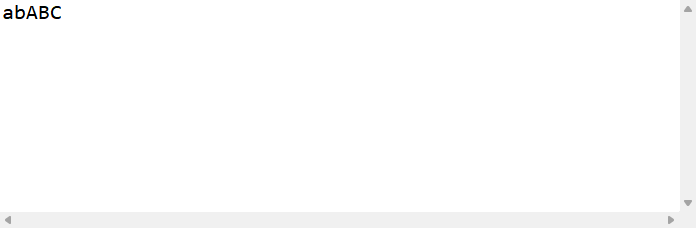

## StringBuilder类

StringBuilder 类和StringBuffer 类的构造器和方法一样；

==区别是StringBuilder 类是线程不安全的，但是速度快；==

==所以在不考虑多线程的环境下，用StringBuilder 类，因为快，在考虑多线程的情况下使用 StringBuffer 类，因为安全；==

# 32.基本数据类型的包装类

## 定义和介绍

基本数据类型自身没有方法，这样就限制了我们的使用，将基本数据类型封装成对象的好处在于可以在对象中定义更多的功能和方法来操作该数据；

**对应关系表：**

在 JDK 1.5 之前没有基本数据类型，都需要包装类；

区别是基本数据类型后跟变量，变量是没有任何构造器和方法的，而包装类可以用到该类的方法，即能够手动人为操纵它们；

| 基本数据类型 | 引用数据类型（包装类） |
| :----------: | :--------------------: |
|     byte     |          Byte          |
|    short     |         Short          |
|     int      |        Integer         |
|     long     |          Long          |
|    float     |         Float          |
|    double    |         Double         |
|     char     |       Character        |
|   boolean    |        Boolean         |

就是如下（记住==万事万物皆对象==）：

```java
package top.sharehome.Bag;

public class Demo {
	public static void main(String[] args) {
		//万事万物皆对象
		
		byte b1 = 10;
		Byte b2 = new Byte((byte)10);
		System.out.println(b1);
		System.out.println(b2);
		
		short s1 = 10;
		Short s2 = new Short((short)10);
		System.out.println(s1);
		System.out.println(s2);
		
		int i1 = 10;
		Integer i2 = new Integer(10);
		System.out.println(i1);
		System.out.println(i2);
		
		long l1 = 10;
		Long l2 = new Long(10);
		System.out.println(l1);
		System.out.println(l2);
		
		float f1 = 10.0f;
		Float f2 = new Float(10.0f);
		System.out.println(f1);
		System.out.println(f2);
		
		double d1 = 10.0;
		Double d2 = new Double(10.0);
		System.out.println(d1);
		System.out.println(d2);
		
		char c1 = '1';
		Character c2 = new Character('1');
		System.out.println(c1);
		System.out.println(c2);
		
		boolean bl1 = false;
		Boolean bl2 = new Boolean(false);
		System.out.println(bl1);
		System.out.println(bl2);
	}
}
```

打印效果如下：


## 包装类中常用的方法

**`Integer parseInt(String str)`  将一个字符串形式的整数转换成 int ；**

```java
package top.sharehome.Bag;

public class Demo {
	public static void main(String[] args) {
		String str = "1234";
		int parseInt = Integer.parseInt(str);
		System.out.println(parseInt);
	}
}
```

打印效果如下：


**`Integer parseDouble(String str)`  将一个字符串形式的整数转换成 double ；**

```java
package top.sharehome.Bag;

public class Demo {
	public static void main(String[] args) {
		String str = "1234.1";
		double parseDouble = Double.parseDouble(str);
		System.out.println(parseDouble);
	}
}
```

打印效果如下：


**`Integer parseLong(String str)`  将一个字符串形式的整数转换成 long ；**

```java
package top.sharehome.Bag;

public class Demo {
	public static void main(String[] args) {
		String str = "1234";
		long parseLong = Long.parseLong(str);
		System.out.println(parseLong);
	}
}
```

打印效果如下：


**`Integer parseBoolean(String str)`  将一个字符串形式的整数转换成 boolean ；**

```java
package top.sharehome.Bag;

public class Demo {
	public static void main(String[] args) {
		String str = "false";
		boolean parseBoolean = Boolean.parseBoolean(str);
		System.out.println(parseBoolean);
	}
}
```

打印效果如下：


## 拆箱和装箱

拆箱：`int a = 10;`

装箱：`Integer a = new Integer(10);`

# 33.Math类

**定义：**

Math 类包含用于执行基本数学运算的方法，例如初等指数，对数，平方根和三角函数等；

**用法：**

```
Math.方法名(参数);
```

## Math常用方法

**`abs(int a)`  返回一个数的绝对值；**

```java
package top.sharehome.Bag;

public class Demo {
	public static void main(String[] args) {
		int i = -10;
		int abs = Math.abs(i);
		System.out.println(abs);
	}
}
```

打印效果如下：


**`ceil(double a)`  向上取整；**

```java
package top.sharehome.Bag;

public class Demo {
	public static void main(String[] args) {
		double i = 10.23;
		double ceil = Math.ceil(i);
		System.out.println(ceil);
	}
}
```

打印效果如下：


**`floor(double a)`  向下取整；**

```java
package top.sharehome.Bag;

public class Demo {
	public static void main(String[] args) {
		double i = 10.23;
		double floor = Math.floor(i);
		System.out.println(floor);
	}
}
```

打印效果如下：


**`max(int a，int b)`  求最大值（多态）；**

```java
package top.sharehome.Bag;

public class Demo {
	public static void main(String[] args) {
		int a = 10;
		float b = 10.2f;
		float max = Math.max(a, b);
		System.out.println(max);
	}
}
```

打印效果如下：


**`pow(double a,double b)`  求某个数的几次幂（a^b^）；**

```java
package top.sharehome.Bag;

public class Demo {
	public static void main(String[] args) {
		double a = 10;
		double b = 2;
		double pow1 = Math.pow(a, b);
		double pow2 = Math.pow(b, a);
		System.out.println(pow1+" "+pow2);
	}
}
```

打印效果如下：


**`random()`  获取一个大于等于 0 且小于 1 的随机数；**==这里是伪随机数==

```java
package top.sharehome.Bag;

public class Demo {
	public static void main(String[] args) {
		double random = Math.random();
		System.out.println(random);
	}
}
```

打印效果如下：


**`round(float a)`  对小数四舍五入；**

```java
package top.sharehome.Bag;

public class Demo {
	public static void main(String[] args) {
		double a = 9.2;
		double b = 9.9;
		long round1 = Math.round(a);
		long round2 = Math.round(b);
		System.out.println(round1+" "+round2);
	}
}
```

打印效果如下：


**`sqrt(double a)`  计算平方根；**

```java
package top.sharehome.Bag;

public class Demo {
	public static void main(String[] args) {
		double a = 64;
		double sqrt = Math.sqrt(a);
		System.out.println(sqrt);
	}
}
```

打印效果如下：


# 34.Random类

此类的实例用于生成==伪随机数流==，此类使用 48 位的种子形成随机数，即该类有机会生成 2^48^ 个结果；

所以世界上没有真正的随机数，因为在程序里的所有随机数都是由计算机通过算法而得到的；

## Random构造器

| **构造方法摘要**                                             |
| ------------------------------------------------------------ |
| `Random()`        创建一个新的随机数生成器。                 |
| `Random(long seed)`        使用单个 `long` 种子创建一个新的随机数生成器，==该种子就是伪随机的证明==。 |

## Random方法

| 返回类型         | 方法解释                                                     |
| ---------------- | ------------------------------------------------------------ |
| `protected  int` | `next(int bits)`        生成下一个伪随机数，==看到protected方法先不要用，因为需要继承==。 |
| ` boolean`       | `nextBoolean()`        返回下一个伪随机数，它是取自此随机数生成器序列的均匀分布的 `boolean` 值。 |
| ` void`          | `nextBytes(byte[] bytes)`        生成随机字节并将其置于用户提供的 byte 数组中。 |
| ` double`        | `nextDouble()`        返回下一个伪随机数，它是取自此随机数生成器序列的、在 `0.0` 和 `1.0`  之间均匀分布的 `double` 值。 |
| ` float`         | `nextFloat()`        返回下一个伪随机数，它是取自此随机数生成器序列的、在 `0.0` 和 `1.0`  之间均匀分布的 `float` 值。 |
| ` double`        | `nextGaussian()`        返回下一个伪随机数，它是取自此随机数生成器序列的、呈高斯（“正态”）分布的 `double` 值，其平均值是  `0.0`，标准差是 `1.0`。 |
| ` int`           | `nextInt()`        返回下一个伪随机数，它是此随机数生成器的序列中均匀分布的 `int` 值。 |
| ` int`           | `nextInt(int n)`        返回一个伪随机数，它是取自此随机数生成器序列的、在 0（包括）和指定值（不包括）之间均匀分布的 `int`  值。 |
| ` long`          | `nextLong()`        返回下一个伪随机数，它是取自此随机数生成器序列的均匀分布的 `long` 值。 |
| ` void`          | `setSeed(long seed)`        使用单个 `long` 种子设置此随机数生成器的种子。 |

### 常用方法

**`nextBoolean()`   随机生成一个布尔值；**

```java
package top.sharehome.Bag;

import java.util.Random;

public class Method {
	public static void main(String[] args) {
		Random r = new Random();
		boolean nextBoolean = r.nextBoolean();
		System.out.println(nextBoolean);
	}
}
```

打印效果如下：


**`nextBytes(byte[] bytes)`   随机生成一个字节数组，并覆盖已有数组；**

```java
package top.sharehome.Bag;

import java.util.Arrays;
import java.util.Random;

public class Demo {
	public static void main(String[] args) {
		byte[] b = {0,0,0,0,0,0,0,0};
		Random r = new Random();
		r.nextBytes(b);
		System.out.println(Arrays.toString(b));
	}
}
```

打印效果如下：


**`nextDouble()`  随机生成一个 0.0-1.0 的 double；**

```java
package top.sharehome.Bag;

import java.util.*;

public class Demo {
	public static void main(String[] args) {
		Random r = new Random();
		double nextDouble = r.nextDouble();
		System.out.println(nextDouble);
	}
}
```

打印效果如下：


**`nextFloat()`  随机生成一个 0.0-1.0 的 float；**

```java
package top.sharehome.Bag;

import java.util.*;

public class Demo {
	public static void main(String[] args) {
		Random r = new Random();
		float nextFloat = r.nextFloat();
		System.out.println(nextFloat);
	}
}
```

打印效果如下：


**`nextGaussian()`  随机生成一个 0.0-1.0(不包括) 的数，该数出现几率按高斯分布；**

```java
package top.sharehome.Bag;

import java.util.*;

public class Demo {
	public static void main(String[] args) {
		int count1 = 0;
		int count2 = 0;
		int count3 = 0;
		Random r = new Random();
		for (int j = 0; j < 5; j++) {
			for (int i = 0; i < 1000000; i++) {
				double nextGaussian = r.nextGaussian();
				if (nextGaussian <= 0.33) {
					count1++;
				} else if (nextGaussian > 0.33 && nextGaussian < 0.66) {
					count2++;
				} else {
					count3++;
				}
			}
			System.out.println(count1 + " " + count2 + " " + count3);
			count1 = 0;
			count2 = 0;
			count3 = 0;
		}
	}
}
```

打印效果如下：


**`nextInt()`  随机生成一个整数；**

```java
package top.sharehome.Bag;

import java.util.*;

public class Demo {
	public static void main(String[] args) {
		Random r = new Random();
		int nextInt = r.nextInt();
		System.out.println(nextInt);
	}
}
```

打印效果如下：


**`nextInt(int n)`  随机生成一个 0-n 的整数；**

```java
package top.sharehome.Bag;

import java.util.*;

public class Demo {
	public static void main(String[] args) {
		Random r = new Random();
		for (int i = 0; i < 11; i++) {
			int nextInt = r.nextInt(10);
			System.out.print(nextInt + " ");
		}
	}
}
```

打印效果如下：


**`nextLong()`  随机生成一个 long；**

```java
package top.sharehome.Bag;

import java.util.*;

public class Demo {
	public static void main(String[] args) {
		Random r = new Random();
		long nextLong = r.nextLong();
		System.out.println(nextLong);
	}
}
```

打印效果如下：


# 35.System类

在 `System`  类提供的设施中，有标准输入、标准输出和错误输出流；对外部定义的属性和环境变量的访问；加载文件和库的方法；还有快速复制数组的一部分的实用方法；

## System方法

| 返回类型                    | 方法解释                                                     |
| --------------------------- | ------------------------------------------------------------ |
| `static void`               | `arraycopy(Object src,  int srcPos, Object dest, int destPos,  int length)`        从指定源数组中复制一个数组，复制从指定的位置开始，到目标数组的指定位置结束。 |
| `static String`             | `clearProperty(String key)`        移除指定键指示的系统属性。 |
| `static Console`            | `console()`        返回与当前 Java 虚拟机关联的唯一 `Console`对象（如果有）。 |
| `static long`               | `currentTimeMillis()`        返回以毫秒为单位的当前时间。    |
| `static void`               | `exit(int status)`        终止当前正在运行的 Java 虚拟机。   |
| `static void`               | `gc()`        运行垃圾回收器。                               |
| `static Map<String,String>` | `getenv()`        返回一个不能修改的当前系统环境的字符串映射视图。 |
| `static String`             | `getenv(String name)`        获取指定的环境变量值。          |
| `static Properties`         | `getProperties()`        确定当前的系统属性。                |
| `static String`             | `getProperty(String key)`        获取指定键指示的系统属性。  |
| `static String`             | `getProperty(String key, String def)`        获取用指定键描述的系统属性。 |
| `static SecurityManager`    | `getSecurityManager()`        获取系统安全接口。             |
| `static int`                | `identityHashCode(Object x)`        返回给定对象的哈希码，该代码与默认的方法 hashCode() 返回的代码一样，无论给定对象的类是否重写  hashCode()。 |
| `static Channel`            | `inheritedChannel()`        返回从创建此 Java 虚拟机的实体中继承的信道。 |
| `static void`               | `load(String filename)`        从作为动态库的本地文件系统中以指定的文件名加载代码文件。 |
| `static void`               | `loadLibrary(String libname)`       加载由  `libname` 参数指定的系统库。 |
| `static String`             | `mapLibraryName(String libname)`        将一个库名称映射到特定于平台的、表示本机库的字符串中。 |
| `static long`               | `nanoTime()`        返回最准确的可用系统计时器的当前值，以毫微秒为单位。 |
| `static void`               | `runFinalization()`        运行处于挂起终止状态的所有对象的终止方法。 |
| `static void`               | `runFinalizersOnExit(boolean value)`        **已过时。** *该方法具有固有的不安全性。它可能对正在使用的对象调用终结方法，而其他线程同时正在操作这些对象，从而导致不正确的行为或死锁。* |
| `static void`               | `setErr(PrintStream err)`        重新分配“标准”错误输出流。  |
| `static void`               | `setIn(InputStream in)`        重新分配“标准”输入流。        |
| `static void`               | `setOut(PrintStream out)`        重新分配“标准”输出流。      |
| `static void`               | `setProperties(Properties props)`        将系统属性设置为 `Properties` 参数。 |
| `static String`             | `setProperty(String key, String value)`        设置指定键指示的系统属性。 |
| `static void`               | `setSecurityManager(SecurityManager s)`        设置系统安全性。 |

### 常用方法

**`arraycopy(Object src,  int srcPos, Object dest, int destPos,  int length)`  复制数组；**

```java
package top.sharehome.Bag;

import java.util.Arrays;

public class Demo {
	public static void main(String[] args) {
		int arr1[] = {1,2,3,4,5,6,7,8,9};
		int arr2[] = {11,22,33,44,55,66,77,88,99};
		System.arraycopy(arr1, 0, arr2, 0, 3);
		System.out.println(Arrays.toString(arr1));
		System.out.println(Arrays.toString(arr2));
	}
}
```

打印效果如下：


**`exit(int status)`  虚拟机终止并且退出；**

```java
package top.sharehome.Bag;

public class Demo {
	public static void main(String[] args) {
		for (int i = 0; i < 1000000; i++) {
			if (i == 10) {
				System.exit(0);
			}
			System.out.println(i);
		}
	}
}
```

打印效果如下：

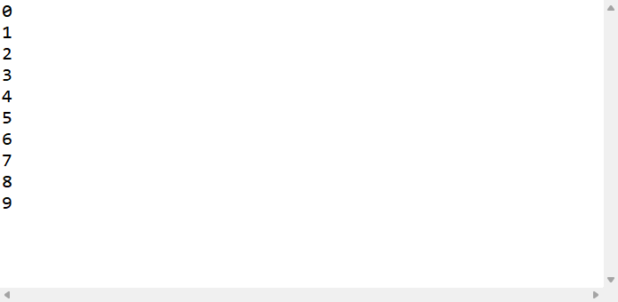

**`currentTimeMillis()`  返回当前时间毫秒值；**

```java
package top.sharehome.Bag;

public class Demo {
	public static void main(String[] args) {
		System.out.println(System.currentTimeMillis());
	}
}
```

打印效果如下：

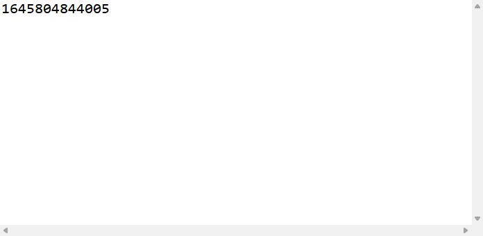

**`gc()`  运行垃圾回收器；**

垃圾回收器：Java 的一个特点就是有一条垃圾线程，负责去回收垃圾，之前的 c 语言是没有这个功能的，需要人为负责垃圾回收，但是很容易造成垃圾的遗漏，于是导致内存的溢出，但是这既是 Java 的优点，也是 Java 的缺点，因为无法人为控制垃圾的回收，而 `gc()` 仅仅是努力让垃圾回收更加彻底；

称为垃圾的条件：该对象没有被任何地引用时；

垃圾回收时最后调用的方法就是 Object 类中的 `finalize()` ；

```java
package top.sharehome.Bag;

public class Demo {
	public static void main(String[] args) {
		/*
		 * String str = new String("ABC"); 
		 * str = null; 
		 * 一开始str指向"ABC"
		 * 但是后面str又成为了空值，所以"ABC"就成了垃圾
		 */
		for (int i = 0; i < 100000; i++) {
			A a = new A();
			a = null;
			System.gc();//强制启动垃圾回收器
		}
	}
}

class A{
    //下面是 Object 里面的一个用于垃圾回收的方法--finalize(),当垃圾回收时会被调用一遍
	//finalize()是当前对象在被垃圾回收器回收之前调用的方法，也就是说可以让当前对象继续被引用，以保证垃圾回收器不会回收当前对象
	//当主函数循环次数少于100000次时，java自动的垃圾程序并不会启用
	@Override
	protected void finalize() throws Throwable {
		System.out.println("被调用");
	}
}
```

打印效果如下：


# 36.Date类

**定义：**

Date 类表示特定的瞬间，精确到毫秒；

时间是一个有距离的长度，长度的起始是 1970 年 1 月 1 日 8 点 0 分 0 秒，这个时间是 C 语言的生日， Java 是 C 语言写的，因此 java 中的时间就是从这个时间开始计算的；

## Date构造器

| **构造方法摘要**                                             |
| ------------------------------------------------------------ |
| `Date()`        分配 `Date` 对象并初始化此对象，以表示分配它的时间（精确到毫秒）。 |
| `Date(int year,  int month, int date)`       **已过时。** *从 JDK 1.1 开始，由  `Calendar.set(year + 1900, month, date)` 或  `GregorianCalendar(year + 1900, month, date)` 取代。* |
| `Date(int year,  int month, int date, int hrs, int min)`       **已过时。** *从 JDK  1.1 开始，由 `Calendar.set(year + 1900, month, date, hrs, min)` 或  `GregorianCalendar(year + 1900, month, date, hrs, min)`  取代。* |
| `Date(int year,  int month, int date, int hrs, int min, int sec)`        **已过时。** *从 JDK 1.1 开始，由 `Calendar.set(year + 1900,  month, date, hrs, min, sec)` 或 `GregorianCalendar(year + 1900, month,  date, hrs, min, sec)` 取代。* |
| `Date(long date)`        分配 `Date` 对象并初始化此对象，以表示自从标准基准时间（称为“历元（epoch）”，即 1970 年  1 月 1 日 00:00:00 GMT）以来的指定毫秒数。 |
| `Date(String s)`        **已过时。** *从 JDK 1.1 开始，由 `DateFormat.parse(String  s)` 取代。* |

## Date方法

| 返回类型      | 方法解释                                                     |
| ------------- | ------------------------------------------------------------ |
| ` boolean`    | `after(Date when)`        测试此日期是否在指定日期之后。     |
| ` boolean`    | `before(Date when)`        测试此日期是否在指定日期之前。    |
| ` Object`     | `clone()`        返回此对象的副本。                          |
| ` int`        | `compareTo(Date anotherDate)`        比较两个日期的顺序。    |
| ` boolean`    | `equals(Object obj)`        比较两个日期的相等性。           |
| ` int`        | `getDate()`        **已过时。** *从 JDK 1.1 开始，由  `Calendar.get(Calendar.DAY_OF_MONTH)` 取代。* |
| ` int`        | `getDay()`        **已过时。** *从 JDK 1.1 开始，由  `Calendar.get(Calendar.DAY_OF_WEEK)` 取代。* |
| ` int`        | `getHours()`        **已过时。** *从 JDK 1.1 开始，由  `Calendar.get(Calendar.HOUR_OF_DAY)` 取代。* |
| ` int`        | `getMinutes()`        **已过时。** *从 JDK 1.1 开始，由  `Calendar.get(Calendar.MINUTE)` 取代。* |
| ` int`        | `getMonth()`        **已过时。** *从 JDK 1.1 开始，由  `Calendar.get(Calendar.MONTH)` 取代。* |
| ` int`        | `getSeconds()`        **已过时。** *从 JDK 1.1 开始，由  `Calendar.get(Calendar.SECOND)` 取代。* |
| ` long`       | `getTime()`        返回自 1970 年 1 月 1 日 00:00:00 GMT 以来此 `Date`  对象表示的毫秒数。 |
| ` int`        | `getTimezoneOffset()`        **已过时。** *从 JDK 1.1 开始，由  `-(Calendar.get(Calendar.ZONE_OFFSET) + Calendar.get(Calendar.DST_OFFSET))  / (60 \* 1000)` 取代。* |
| ` int`        | `getYear()`        **已过时。** *从 JDK 1.1 开始，由 `Calendar.get(Calendar.YEAR) -  1900` 取代。* |
| ` int`        | `hashCode()`        返回此对象的哈希码值。                   |
| `static long` | `parse(String s)`        **已过时。** *从 JDK 1.1 开始，由 `DateFormat.parse(String  s)` 取代。* |
| ` void`       | `setDate(int date)`        **已过时。** *从 JDK 1.1 开始，由  `Calendar.set(Calendar.DAY_OF_MONTH, int date)` 取代。* |
| ` void`       | `setHours(int hours)`        **已过时。** *从 JDK 1.1 开始，由  `Calendar.set(Calendar.HOUR_OF_DAY, int hours)` 取代。* |
| ` void`       | `setMinutes(int minutes)`        **已过时。** *从 JDK 1.1 开始，由 `Calendar.set(Calendar.MINUTE,  int minutes)` 取代。* |
| ` void`       | `setMonth(int month)`        **已过时。** *从 JDK 1.1 开始，由 `Calendar.set(Calendar.MONTH,  int month)` 取代。* |
| ` void`       | `setSeconds(int seconds)`        **已过时。** *从 JDK 1.1 开始，由 `Calendar.set(Calendar.SECOND,  int seconds)` 取代。* |
| ` void`       | `setTime(long time)`        设置此 `Date` 对象，以表示 1970 年 1 月 1 日 00:00:00 GMT 以后  `time` 毫秒的时间点。 |
| ` void`       | `setYear(int year)`        **已过时。** *从 JDK 1.1 开始，由 `Calendar.set(Calendar.YEAR,  year + 1900)` 取代。* |
| ` String`     | `toGMTString()`        **已过时。** *从 JDK 1.1 开始，由 `DateFormat.format(Date  date)` 取代，使用 GMT `TimeZone`。* |
| ` String`     | `toLocaleString()`        **已过时。** *从 JDK 1.1 开始，由 `DateFormat.format(Date  date)` 取代。* |
| ` String`     | `toString()`        把此 `Date` 对象转换为以下形式的 `String`： dow mon dd  hh:mm:ss zzz yyyy 其中： `dow` 是一周中的某一天 (`Sun, Mon, Tue, Wed, Thu, Fri,  Sat`)。 |
| `static long` | `UTC(int year,  int month, int date, int hrs, int min, int sec)`        **已过时。** *从 JDK 1.1 开始，由 `Calendar.set(year + 1900,  month, date, hrs, min, sec)` 或 `GregorianCalendar(year + 1900, month,  date, hrs, min, sec)` 取代，使用 UTC `TimeZone`，后跟  `Calendar.getTime().getTime()`。* |

### Date常用方法

**`after(Date when)/before(Date when)`        测试此日期是否在指定日期之前/后：**

```java
package top.sharehome.Bag;

import java.util.*;

public class Demo {
	public static void main(String[] args) {
		Date d1 = new Date(0);
		Date d2 = new Date(1);
		boolean after = d1.after(d2);
		System.out.println(after);
	}
}
```

打印效果如下：


**`getTime()`        返回自 1970 年 1 月 1 日 00:00:00 GMT 以来此 `Date`  对象表示的毫秒数：**

```java
package top.sharehome.Bag;

import java.util.*;

public class Demo {
	public static void main(String[] args) {
		Date d = new Date();
		long time = d.getTime();
		System.out.println(time);
	}
}
```

打印效果如下：


## SimpleDateFormat类

**定义：**

`SimpleDateFormat` 是一个以与语言环境有关的方式来格式化和解析日期的具体类。它允许进行格式化（日期 ==>  文本）、解析（文本 ==> 日期）和规范化。 

**格式化标准表格：**

> | 字母 | 日期或时间元素           | 表示                                 | 示例                                        |
> | ---- | ------------------------ | ------------------------------------ | ------------------------------------------- |
> | `G`  | Era 标志符               | [Text](#text)                        | `AD`                                        |
> | `y`  | 年                       | [Year](#year)                        | `1996`; `96`                                |
> | `M`  | 年中的月份               | [Month](#month)                      | `July`; `Jul`; `07`                         |
> | `w`  | 年中的周数               | [Number](#number)                    | `27`                                        |
> | `W`  | 月份中的周数             | [Number](#number)                    | `2`                                         |
> | `D`  | 年中的天数               | [Number](#number)                    | `189`                                       |
> | `d`  | 月份中的天数             | [Number](#number)                    | `10`                                        |
> | `F`  | 月份中的星期             | [Number](#number)                    | `2`                                         |
> | `E`  | 星期中的天数             | [Text](#text)                        | `Tuesday`; `Tue`                            |
> | `a`  | Am/pm 标记               | [Text](#text)                        | `PM`                                        |
> | `H`  | 一天中的小时数（0-23）   | [Number](#number)                    | `0`                                         |
> | `k`  | 一天中的小时数（1-24）   | [Number](#number)                    | `24`                                        |
> | `K`  | am/pm 中的小时数（0-11） | [Number](#number)                    | `0`                                         |
> | `h`  | am/pm 中的小时数（1-12） | [Number](#number)                    | `12`                                        |
> | `m`  | 小时中的分钟数           | [Number](#number)                    | `30`                                        |
> | `s`  | 分钟中的秒数             | [Number](#number)                    | `55`                                        |
> | `S`  | 毫秒数                   | [Number](#number)                    | `978`                                       |
> | `z`  | 时区                     | [General time zone](#timezone)       | `Pacific Standard Time`; `PST`; `GMT-08:00` |
> | `Z`  | 时区                     | [RFC 822 time zone](#rfc822timezone) | `-0800`                                     |

**格式化示例表格：**

> | 日期和时间模式                   | 结果                                   |
> | -------------------------------- | -------------------------------------- |
> | `"yyyy.MM.dd G 'at' HH:mm:ss z"` | `2001.07.04 AD at 12:08:56 PDT`        |
> | `"EEE, MMM d, ''yy"`             | `Wed, Jul 4, '01`                      |
> | `"h:mm a"`                       | `12:08 PM`                             |
> | `"hh 'o''clock' a, zzzz"`        | `12 o'clock PM, Pacific Daylight Time` |
> | `"K:mm a, z"`                    | `0:08 PM, PDT`                         |
> | `"yyyyy.MMMMM.dd GGG hh:mm aaa"` | `02001.July.04 AD 12:08 PM`            |
> | `"EEE, d MMM yyyy HH:mm:ss Z"`   | `Wed, 4 Jul 2001 12:08:56 -0700`       |
> | `"yyMMddHHmmssZ"`                | `010704120856-0700`                    |
> | `"yyyy-MM-dd'T'HH:mm:ss.SSSZ"`   | `2001-07-04T12:08:56.235-0700`         |

**==格式化==示例如下：** ==SimpleDateFormat.format() 方法==

将当前时刻的 long 型转换成 String 型，以便大家能看懂；

```java
package top.sharehome.Bag;

import java.text.SimpleDateFormat;
import java.util.*;

public class Demo {
	public static void main(String[] args) {
		Date d = new Date();
		System.out.println(d);
		//创建了一个带指定模式的 SimpleDateFormat 对象
		SimpleDateFormat sdf = new SimpleDateFormat("yyyy年MM月dd日HH:mm:ss");
		//使用对象格式化时间
		String format = sdf.format(d);
		System.out.println(format);
	}
}
```

打印效果如下：


**==解析==示例如下：**

从键盘输入一个日期，解析成 Date 对象；

```java
package top.sharehome.Bag;

import java.text.ParseException;
import java.text.SimpleDateFormat;
import java.util.*;

public class Demo {
	public static void main(String[] args) throws ParseException { //抛出异常后面会有
		Scanner sc = new Scanner(System.in);
		System.out.println("请输入xxxx年xx月xx日xx:xx:xx这样格式的时间：");
		String str = sc.next();
		SimpleDateFormat sdf = new SimpleDateFormat("yyyy年MM月dd日HH:mm:ss");
		Date d0 = new Date(0);
		Date d = new Date();
		d = sdf.parse(str);
		System.out.println(d);
		System.out.println(d.getTime());
		System.out.println("1970年1月1日08:00:00的时间是：");
		System.out.println(d0);
		System.out.println(d0.getTime());
	}
}
```

打印效果如下：


### 常用构造器

| 常用构造方法摘要                                             |
| ------------------------------------------------------------ |
| `SimpleDateFormat(String pattern)`        用给定的模式和默认语言环境的日期格式符号构造 `SimpleDateFormat`。 |

### 常用方法

**`format(Date date, StringBuffer toAppendTo, FieldPosition pos)`        将给定的 `Date` 格式化为日期/时间字符串，并将结果添加到给定的  `StringBuffer`；**

```java
package top.sharehome.Bag;

import java.text.SimpleDateFormat;
import java.util.Date;

public class Demo {
	public static void main(String[] args) {
		SimpleDateFormat sdf = new SimpleDateFormat("yyyy.MM.dd  HH:mm:ss");
		Date d = new Date(0);
		String format = sdf.format(d);
		System.out.println(format);
	}
}
```

打印效果如下：

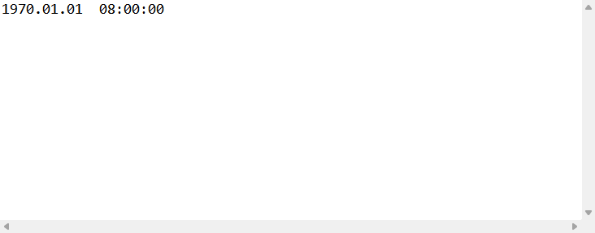

**`parse(String text, ParsePosition pos)`        解析字符串的文本，生成 `Date`；**

```java
package top.sharehome.Bag;

import java.text.ParseException;
import java.text.SimpleDateFormat;
import java.util.Date;

public class Demo {
	public static void main(String[] args) throws ParseException {
		SimpleDateFormat sdf = new SimpleDateFormat("yyyy.MM.dd  HH:mm:ss");
		String str = "1970.01.01  08:00:00";
		Date parse = sdf.parse(str);
		System.out.println(parse);
	}
}
```

打印效果如下：


## Calendar类

**定义：**

`Calendar` 类是一个抽象类，它为特定瞬间与一组诸如  `YEAR`、`MONTH`、`DAY_OF_MONTH`、`HOUR`  等 `日历字段`之间的转换提供了一些方法，并为操作日历字段（例如获得下星期的日期）提供了一些方法。瞬间可用毫秒值来表示，它是距*历元*（即格林威治标准时间 1970 年 1 月 1 日的 00:00:00.000，格里高利历）的偏移量。 

**如何获得一个 Calendar 对象：**

因为 Calendar 对象受保护，可以通过继承来获得一个 Calendar 对象：

```java
package top.sharehome.Bag;

import java.util.Calendar;
import java.util.Date;

public class Demo {
	public static void main(String[] args) {
		Calendar c = new A();
	}
}
class A extends Calendar{

	@Override
	protected void computeTime() {
		// TODO Auto-generated method stub
		
	}

	@Override
	protected void computeFields() {
		// TODO Auto-generated method stub
		
	}

	@Override
	public void add(int field, int amount) {
		// TODO Auto-generated method stub
		
	}

	@Override
	public void roll(int field, boolean up) {
		// TODO Auto-generated method stub
		
	}

	@Override
	public int getMinimum(int field) {
		// TODO Auto-generated method stub
		return 0;
	}

	@Override
	public int getMaximum(int field) {
		// TODO Auto-generated method stub
		return 0;
	}

	@Override
	public int getGreatestMinimum(int field) {
		// TODO Auto-generated method stub
		return 0;
	}

	@Override
	public int getLeastMaximum(int field) {
		// TODO Auto-generated method stub
		return 0;
	}
}
```

显然，这并不是一个好的方法；

查文档发现 Calendar 类中含有一些静态的方法，例如 Calendar.getInstance() ，即可以直接通过调用该方法获取一个 Calendar 对象：

```java
package top.sharehome.Bag;

import java.util.Calendar;

public class Demo {
	public static void main(String[] args) {
		Calendar c = Calendar.getInstance();
	}
}
```

查文档又发现 Calendar 对象中包含着一个可以被操作的 Date 对象，可以通过 getTime() 来获取该 Date 对象：

```java
package top.sharehome.Bag;

import java.util.Calendar;
import java.util.Date;

public class Demo {
	public static void main(String[] args) {
		Calendar c = Calendar.getInstance();
		Date time = c.getTime();
	}
}
```

### Calendar字段

| **字段摘要**           |                                                              |
| ---------------------- | ------------------------------------------------------------ |
| `static int`           | `ALL_STYLES`        指示所有风格名称的 `getDisplayNames` 的风格说明符，比如 "January" 和 "Jan"。 |
| `static int`           | `AM`        指示从午夜到中午之前这段时间的 `AM_PM` 字段值。  |
| `static int`           | `AM_PM`        `get` 和 `set` 的字段数字，指示 `HOUR`  是在中午之前还是在中午之后。 |
| `static int`           | `APRIL`        指示在格里高利历和罗马儒略历中一年中第四个月的 `MONTH` 字段值。 |
| `protected  boolean`   | `areFieldsSet`        如果 `fields[]` 与当前的设置时间同步，则返回 true。 |
| `static int`           | `AUGUST`        指示在格里高利历和罗马儒略历中一年中第八个月的 `MONTH` 字段值。 |
| `static int`           | `DATE`        `get` 和 `set` 的字段数字，指示一个月中的某天。 |
| `static int`           | `DAY_OF_MONTH`        `get` 和 `set` 的字段数字，指示一个月中的某天。 |
| `static int`           | `DAY_OF_WEEK`        `get` 和 `set` 的字段数字，指示一个星期中的某天。 |
| `static int`           | `DAY_OF_WEEK_IN_MONTH`        `get` 和 `set` 的字段数字，指示当前月中的第几个星期。 |
| `static int`           | `DAY_OF_YEAR`        `get` 和 `set` 的字段数字，指示当前年中的天数。 |
| `static int`           | `DECEMBER`        指示在格里高利历和罗马儒略历中一年中第十二个月的 `MONTH` 字段值。 |
| `static int`           | `DST_OFFSET`        `get` 和 `set`  的字段数字，以毫秒为单位指示夏令时的偏移量。 |
| `static int`           | `ERA`        指示年代的 `get` 和 `set` 的字段数字，比如罗马儒略历中的 AD 或  BC。 |
| `static int`           | `FEBRUARY`        指示在格里高利历和罗马儒略历中一年中第二个月的 `MONTH` 字段值。 |
| `static int`           | `FIELD_COUNT`        `get` 和 `set` 可识别的不同字段的数量。 |
| `protected  int[]`     | `fields`        此日历当前设置时间的日历字段值。             |
| `static int`           | `FRIDAY`        指示 Friday 的 `DAY_OF_WEEK`  字段值。       |
| `static int`           | `HOUR`        `get` 和 `set` 的字段数字，指示上午或下午的小时。 |
| `static int`           | `HOUR_OF_DAY`        `get` 和 `set` 的字段数字，指示一天中的小时。 |
| `protected  boolean[]` | `isSet`        通知是否设置了该日历某一指定日历字段的标志。  |
| `protected  boolean`   | `isTimeSet`        如果 `time` 值是一个有效值，则返回 true。 |
| `static int`           | `JANUARY`        指示在格里高利历和罗马儒略历中一年中第一个月的 `MONTH` 字段值。 |
| `static int`           | `JULY`        指示在格里高利历和罗马儒略历中一年中第七个月的 `MONTH` 字段值。 |
| `static int`           | `JUNE`        指示在格里高利历和罗马儒略历中一年中第六个月的 `MONTH` 字段值。 |
| `static int`           | `LONG`        指示长名称的 `getDisplayName`  和 `getDisplayNames`  的风格说明符，比如 "January"。 |
| `static int`           | `MARCH`        指示在格里高利历和罗马儒略历中一年中第三个月的 `MONTH` 字段值。 |
| `static int`           | `MAY`        指示在格里高利历和罗马儒略历中一年中第五个月的 `MONTH` 字段值。 |
| `static int`           | `MILLISECOND`        `get` 和 `set` 的字段数字，指示一秒中的毫秒。 |
| `static int`           | `MINUTE`        `get` 和 `set` 的字段数字，指示一小时中的分钟。 |
| `static int`           | `MONDAY`        指示 Monday 的 `DAY_OF_WEEK`  字段值。       |
| `static int`           | `MONTH`        指示月份的 `get` 和 `set` 的字段数字。        |
| `static int`           | `NOVEMBER`        指示在格里高利历和罗马儒略历中一年中第十一个月的 `MONTH` 字段值。 |
| `static int`           | `OCTOBER`        指示在格里高利历和罗马儒略历中一年中第十个月的 `MONTH` 字段值。 |
| `static int`           | `PM`        指示从中午到午夜之前这段时间的 `AM_PM`字段值。   |
| `static int`           | `SATURDAY`        指示 Saturday 的 `DAY_OF_WEEK`  字段值。   |
| `static int`           | `SECOND`        `get` 和 `set` 的字段数字，指示一分钟中的秒。 |
| `static int`           | `SEPTEMBER`        指示在格里高利历和罗马儒略历中一年中第九个月的 `MONTH` 字段值。 |
| `static int`           | `SHORT`        指示短名称的 `getDisplayName`  和 `getDisplayNames`  的风格说明符，比如 "Jan"。 |
| `static int`           | `SUNDAY`        指示 Sunday 的 `DAY_OF_WEEK`  字段值。       |
| `static int`           | `THURSDAY`        指示 Thursday 的 `DAY_OF_WEEK`  字段值。   |
| `protected  long`      | `time`        日历的当前设置时间，以毫秒为单位，表示自格林威治标准时间 1970 年 1月 1 日 0:00:00  后经过的时间。 |
| `static int`           | `TUESDAY`        指示 Tuesday 的 `DAY_OF_WEEK`  字段值。     |
| `static int`           | `UNDECIMBER`        指示一年中第十三个月的 `MONTH` 字段值。  |
| `static int`           | `WEDNESDAY`        指示 Wednesday 的 `DAY_OF_WEEK`  字段值。 |
| `static int`           | `WEEK_OF_MONTH`        `get` 和 `set` 的字段数字，指示当前月中的星期数。 |
| `static int`           | `WEEK_OF_YEAR`        `get` 和 `set` 的字段数字，指示当前年中的星期数。 |
| `static int`           | `YEAR`        指示年的 `get` 和 `set` 的字段数字。           |
| `static int`           | `ZONE_OFFSET]`        `get` 和 `set` 的字段数字，以毫秒为单位指示距 GMT 的大致偏移量。 |

### 常用方法

**`add(int field,  int amount)`       根据日历的规则，为给定的日历字段添加或减去指定的时间量；**

```java
package top.sharehome.Bag;

import java.util.Calendar;
import java.util.Date;

public class Demo {
	public static void main(String[] args) {
		Date d = new Date();
		System.out.println("现在时间是"+d);
		Calendar c = Calendar.getInstance();
		c.add(Calendar.DAY_OF_MONTH, -10);
		c.add(Calendar.MONTH, 2);
		System.out.println("我在今天的基础上减了十天后再往后推了2个月！");
		Date time = c.getTime();
		System.out.println(time);
	}
}
```

打印效果如下：

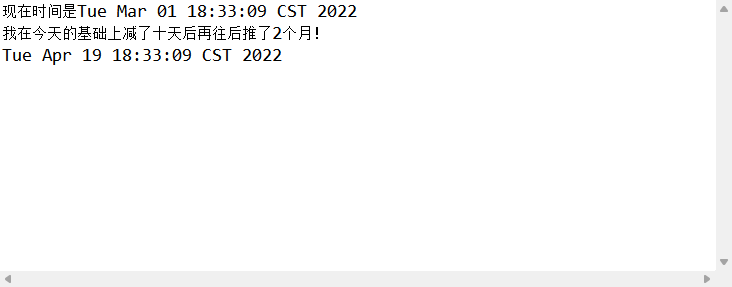

**`set()`  给日历设定数值；**

|         | 方法的重载                                                   |
| ------- | ------------------------------------------------------------ |
| ` void` | `set(int field,  int value)`       将给定的日历字段设置为给定值。 |
| ` void` | `set(int year,  int month, int date)`       设置日历字段  `YEAR`、`MONTH` 和 `DAY_OF_MONTH` 的值。 |
| ` void` | `set(int year,  int month, int date, int hourOfDay, int minute)`       设置日历字段  `YEAR`、`MONTH`、`DAY_OF_MONTH`、`HOUR_OF_DAY`  和 `MINUTE` 的值。 |
| ` void` | `set(int year,  int month, int date, int hourOfDay, int minute, int second)`        设置字段  `YEAR`、`MONTH`、`DAY_OF_MONTH`、`HOUR`、`MINUTE`  和 `SECOND` 的值。 |

```java
//不只是上面这样的代入方式，还可以是单个指明参数
package top.sharehome.Bag;

import java.util.Calendar;
import java.util.Date;

public class Demo {
	public static void main(String[] args) {
		Calendar c = Calendar.getInstance();
		c.set(Calendar.YEAR,2012);
		c.set(Calendar.MONTH, 0);
		c.set(Calendar.DATE, 1);
		c.set(Calendar.HOUR_OF_DAY, 8);
		c.set(Calendar.MINUTE, 23);
		c.set(Calendar.SECOND, 12);
		Date time = c.getTime();
		System.out.println(time);
	}
}
```

==MOUTH的值是从 0 算起的，即 0 ~ 11 代表着十二个月==

打印效果如下：


**示例如下：**

我们想要获得一个 2018 年 7 月 7 日的 Date 数据；

方法一：解析；

```java
package top.sharehome.Bag;

import java.text.ParseException;
import java.text.SimpleDateFormat;
import java.util.Date;

public class Demo {
	public static void main(String[] args) throws ParseException {
		String str = "2018年7月7日";
		SimpleDateFormat sdf = new SimpleDateFormat("yyyy年MM月dd日");
		Date parse = sdf.parse(str);
		System.out.println(parse);
	}
}
```

打印效果如下：


方法二：Calendar 类；

```java
package top.sharehome.Bag;

import java.text.SimpleDateFormat;
import java.util.Calendar;
import java.util.Date;

public class Demo {
	public static void main(String[] args) {
		Calendar c = Calendar.getInstance();
		c.set(2018,6,7,0,0,0);
		Date time = c.getTime();
		System.out.println(time);	
	}
}
```

打印效果如下：


## LocalDate本地日期

- 获取该类的对象,静态方法
  - static LocalDate now() 获取LocalDate的对象,跟随操作系统
  - static LocalDate of() 获取LocalDate的对象,自己设置日期
    - of方法中传递年月日 of(int year,int month,int day)

```java
/**
* LocalDate的静态方法获取对象
*/
public static void getInstance(){
    //静态方法now()
    LocalDate localDate = LocalDate.now();
    System.out.println("localDate = " + localDate);

    //静态方法of()设置日期
    LocalDate of =  LocalDate.of(2022,5,10);
    System.out.println("of = " + of);
}
```

- 获取日期字段的方法 : 名字是get开头
  - int getYear() 获取年份
  - int getDayOfMonth()返回月中的天数
  - int getMonthValue() 返回月份

```java
/**
* LocalDate类的方法 getXXX()获取日期字段
*/
public static void get(){
    LocalDate localDate = LocalDate.now();
    //获取年份
    int year = localDate.getYear();
    //获取月份
    int monthValue = localDate.getMonthValue();
    //获取天数
    int dayOfMonth = localDate.getDayOfMonth();
    System.out.println("year = " + year);
    System.out.println("monthValue = " + monthValue);
    System.out.println("dayOfMonth = " + dayOfMonth);
}
```

- 设置日期字段的方法 : 名字是with开头

  - LocalDate withYear(int year)设置年份

  - LocalDate withMonth(int month)设置月份

  - LocalDate withDayOfMonth(int day)设置月中的天数

  - > LocalDate对象是不可比对象,设置方法with开头,返回新的LocalDate对象

```java
/**
     * LocalDate类的方法 withXXX()设置日期字段
     */
public static void with(){
    LocalDate localDate = LocalDate.now();
    System.out.println("localDate = " + localDate);
    //设置年,月,日
    //方法调用链
    LocalDate newLocal = localDate.withYear(2025).withMonth(10).withDayOfMonth(25);
    System.out.println("newLocal = " + newLocal);
}
```

- 设置日期字段的偏移量, 方法名plus开头,向后偏移
- 设置日期字段的偏移量, 方法名minus开头,向前偏移

```java
 /**
     * LocalDate类的方法 minusXXX()设置日期字段的偏移量,向前
     */
    public static void minus() {
        LocalDate localDate = LocalDate.now();
        //月份偏移10个月
        LocalDate minusMonths = localDate.minusMonths(10);
        System.out.println("minusMonths = " + minusMonths);
    }
    /**
     * LocalDate类的方法 plusXXX()设置日期字段的偏移量,向后
     */
    public static void plus(){
        LocalDate localDate = LocalDate.now();
        //月份偏移10个月
        LocalDate plusMonths = localDate.plusMonths(10);
        System.out.println("plusMonths = " + plusMonths);
    }
```

### Period和Duration类

#### Period计算日期之间的偏差

- static Period between(LocalDate d1,LocalDate d2)计算两个日期之间的差值.
  - 计算出两个日期相差的天数,月数,年数

```java
public static void between(){
    //获取2个对象,LocalDate
    LocalDate d1 = LocalDate.now(); // 2021-4-13
    LocalDate d2 = LocalDate.of(2022,4,13); // 2022-6-15
    //Period静态方法计算
    Period period = Period.between(d1, d2);
    //period非静态方法,获取计算的结果
    int years = period.getYears();
    System.out.println("相差的年:"+years);
    int months = period.getMonths();
    System.out.println("相差的月:"+months);
    int days = period.getDays();
    System.out.println("相差的天:"+days);
}
```

#### Duration计算时间之间的偏差

- static Period between(Temporal d1,Temporal d2)计算两个日期之间的差值.


```java
 public static void between(){
        LocalDateTime d1 = LocalDateTime.now();
        LocalDateTime d2 = LocalDateTime.of(2021,5,13,15,32,20);
       // Duration静态方法进行计算对比
        Duration duration = Duration.between(d1, d2);
        // Duration类的对象,获取计算的结果
        long minutes = duration.toMinutes();
        System.out.println("相差分钟:" + minutes);

        long days = duration.toDays();
        System.out.println("相差天数:"+days);

        long millis = duration.toMillis();
        System.out.println("相差秒:" + millis);

        long hours = duration.toHours();
        System.out.println("相差小时:"+hours);
    }
```

#### DateTimeFormatter

  JDK8中的日期格式化对象 : java.time.format包

- static DateTimeFormatter ofPattern(String str)自定义的格式
- String format(TemporalAccessor t)日期或者时间的格式化
- TemporalAccessor  parse(String s)字符串解析为日期对象

```java
/**
* 方法parse,字符串转日期
*/
public static void parse(){
    //静态方法,传递日期格式,返回本类的对象
    DateTimeFormatter dateTimeFormatter =
    DateTimeFormatter.ofPattern("yyyy-MM-dd HH:mm:ss");
    String str = "2021-04-13 15:55:55";
    //dateTimeFormatter调用方法parse转换
    //返回接口类型,接口是LocalDate,LocalDateTime 都实现了该接口
    TemporalAccessor temporalAccessor = dateTimeFormatter.parse(str);
    //System.out.println(temporalAccessor);
    LocalDateTime localDateTime = LocalDateTime.from(temporalAccessor);
    System.out.println(localDateTime);
}

/**
* 方法format格式化
*
*/
public static void format(){
    //静态方法,传递日期格式,返回本类的对象
    DateTimeFormatter dateTimeFormatter =
    DateTimeFormatter.ofPattern("yyyy-MM-dd HH:mm:ss");
    //dateTimeFormatter对象调用方法format
    String format = dateTimeFormatter.format(LocalDateTime.now());
    System.out.println(format);
}
```

# 37.正则表达式

**定义：**

正则表达式(regular expression)描述了一种字符串匹配的模式（pattern），可以用来检查一个串是否含有某种子串、将匹配的子串替换或者从某个串中取出符合某个条件的子串等。

**作用：**

正则表达式能够快速匹配字符串，得到一个结果，例如手机号码格式正确与否，身份证号格式正确与否，邮箱格式正确与否等；

**完事万物皆对象：**

所以正则表达式也是一个对象—— ==Pattern==；

## Pattern类

正则表达式的编译表示形式。 

指定为字符串的正则表达式必须首先被编译为此类的实例。然后，可将得到的模式用于创建 `Matcher`  对象，依照正则表达式，该对象可以与任意`字符序列`匹配。执行匹配所涉及的所有状态都驻留在匹配器中，所以多个匹配器可以共享同一模式。 

**示例如下：**

匹配十一位手机号码：

```java
package top.sharehome.Bag;

import java.util.regex.Matcher;
import java.util.regex.Pattern;

public class Demo {
	public static void main(String[] args) {
		Pattern p = Pattern.compile("\\d{11}");//书写规则
		
		String desString = "17388888888";
		
		Matcher matcher = p.matcher(desString);//返回一个匹配器
		boolean matches = matcher.matches();//返回匹配结果
		System.out.println(matches);
	}
}
```

打印效果如下：


### Pattern字段

| **字段摘要** |                                                       |
| ------------ | ----------------------------------------------------- |
| `static int` | `CANON_EQ`        启用规范等价。                      |
| `static int` | `CASE_INSENSITIVE`        启用不区分大小写的匹配。    |
| `static int` | `COMMENTS`        模式中允许空白和注释。              |
| `static int` | `DOTALL`        启用 dotall 模式。                    |
| `static int` | `LITERAL`        启用模式的字面值解析。               |
| `static int` | `MULTILINE`        启用多行模式。                     |
| `static int` | `UNICODE_CASE`        启用 Unicode 感知的大小写折叠。 |
| `static int` | `UNIX_LINES`        启用 Unix 行模式。                |

### Pattern方法

| 返回类型         | 方法解释                                                     |
| ---------------- | ------------------------------------------------------------ |
| `static Pattern` | `compile(String regex)`        将给定的正则表达式编译到模式中。 |
| `static Pattern` | `compile(String regex,  int flags)`       将给定的正则表达式编译到具有给定标志的模式中。 |
| ` int`           | `flags()`        返回此模式的匹配标志。                      |
| ` Matcher`       | `matcher(CharSequence input)`        创建匹配给定输入与此模式的匹配器。 |
| `static boolean` | `matches(String regex, CharSequence input)`        编译给定正则表达式并尝试将给定输入与其匹配。 |
| ` String`        | `pattern()`        返回在其中编译过此模式的正则表达式。      |
| `static String`  | `quote(String s)`        返回指定 `String` 的字面值模式 `String`。 |
| ` String[]`      | `split(CharSequence input)`        围绕此模式的匹配拆分给定输入序列。 |
| ` String[]`      | `split(CharSequence input,  int limit)`       围绕此模式的匹配拆分给定输入序列。 |
| ` String`        | `toString()`        返回此模式的字符串表示形式。             |

## 正则表达式匹配套路

**套路一：**

1. 获得一个装着指定正则表达式的 Pattern 对象；
2. 将待匹配字符串装入 pattern 对象的 matcher 方法中，获得一个匹配器；
3. 执行匹配器的 matches() 方法，获得匹配结果；

示例如下：

```java
package top.sharehome.Bag;

import java.util.regex.Matcher;
import java.util.regex.Pattern;

public class Demo {
	public static void main(String[] args) {
		Pattern p = Pattern.compile("abc");
		Matcher matcher = p.matcher("abc");
		boolean matches = matcher.matches();
		System.out.println(matches);
	}
}
```

打印效果如下：


**套路二：**

通过 Pattern 的静态方法 matches 方法直接匹配正则表达式和目标字符串，并获得结果；

示例如下：

```java
package top.sharehome.Bag;

import java.util.regex.Pattern;

public class Demo {
	public static void main(String[] args) {
		boolean matches = Pattern.matches( "abc" , "abc");
		System.out.println(matches);
	}
}
```

打印效果如下：


**套路三：**

通过字符串自带的 matches() 方法直接匹配正则表达式和目标字符串，并获得结果；

```java
package top.sharehome.Bag;

import java.util.regex.Pattern;

public class Demo {
	public static void main(String[] args) {
		boolean matches = "abc".matches("abc");
		System.out.println(matches);
	}
}
```

打印效果如下：


## 正则表达式的书写

### 字符内容

- **`"."` 表示一个任意字符，如字符串长度为 n，则表达为 `".{n}"` ；**

  示例如下：

  ```java
  package top.sharehome.Bag;
  
  public class Demo {
  	public static void main(String[] args) {
  		boolean matches = "aaa123...".matches(".{9}");
  		System.out.println(matches);
  	}
  }
  ```

  打印效果如下：

  

- **`"\\d"` 表示一个数字字符，如字符串长度为 n ，则表达为 `"\\d{n}"` ；**

  **`"\\D"` 表示一个非数字字符，如字符串长度为 n ，则表达为 `"\\D{n}"` ；**

  示例如下：

  ```java
  package top.sharehome.Bag;
  
  public class Demo {
  	public static void main(String[] args) {
  		boolean matches1 = "123456789".matches("\\d{9}");
          boolean matches2 = "abcdefghi".matches("\\D{9}");
  		System.out.println(matches1);
          System.out.println(matches2);
  	}
  }
  ```

  打印效果如下：

  

- **`"\\s"` 表示一个空白字符，如字符串长度为 n ，则表达为 `"\\s{n}"` ；**

  **`"\\S"` 表示一个非空白字符，如字符串长度为 n ，则表达为 `"\\S{n}"` ；**

  示例如下“

  ```java
  package top.sharehome.Bag;
  
  public class Demo {
  	public static void main(String[] args) {
  		boolean matches1 = "         ".matches("\\s{9}");
          boolean matches2 = "abcdefghi".matches("\\S{9}");
  		System.out.println(matches1);
          System.out.println(matches2);
  	}
  }
  ```

  打印效果如下：

  

- **`"\\w"` 表示一个单词字符，如字符串长度为 n ，则表达为 `"\\w{n}"` ；**

  **`"\\W"` 表示一个非单词字符，如字符串长度为 n ，则表达为 `"\\W{n}"` ；**

  ==单词字符范围==： `a~z` , `A~Z` , `_` , `0~9`；

  示例如下：

  ```java
  package top.sharehome.Bag;
  
  public class Demo {
  	public static void main(String[] args) {
  		boolean matches1 = "abcdefghi".matches("\\w{9}");
          boolean matches2 = "+++===---".matches("\\W{9}");
  		System.out.println(matches1);
          System.out.println(matches2);
  	}
  }
  ```

  打印效果如下：

  

- **`a` （以a为例）表示字符 a 本身，`abc` （以abc为例）表示字符串 abc 本身；**

  示例如下：

  ```java
  package top.sharehome.Bag;
  
  public class Demo {
  	public static void main(String[] args) {
  		boolean matches1 = "abcdefghi".matches("abcdefghi");
          boolean matches2 = "123456789".matches("123456789");
  		System.out.println(matches1);
          System.out.println(matches2);
  	}
  }
  ```

  打印效果如下：

  

### 字符类

**`"[abc]"` （以 abc 为例）表示 abc 之中的某一个；**

**`"[^abc]"` （以 abc 为例）表示非 abc 之中的某一个；**

**`"[a-zA-Z]"`  表示`a` 到 `z` 或 `A` 到  `Z` 中的某一个，两头的字母包括在内（范围）** 

**`"[a-d[m-p]]"` 表示`a` 到 `d` 或 `m` 到  `p` 中的某一个，也可写作 `[a-dm-p]`（并集）** 

**`"[a-z&&[def]]"`  表示 `d`、`e` 或 `f` 中的某一个（交集）** 

**`"[a-z&&[^bc]]"`   表示 `a` 到 `z`，除了 `b` 和  `c` 中的某一个：`[ad-z]`（减去）** 

**`"[a-z&&[^m-p]]"`  表示 `a` 到 `z`，而非 `m` 到  `p` 中的某一个：`[a-lq-z]`（减去）**

示例如下：

```java
package top.sharehome.Bag;

public class Demo {
	public static void main(String[] args) {
		boolean matches1 = "a".matches("[abc]");
		boolean matches2 = "d".matches("[^abc]");
		boolean matches3 = "y".matches("[a-zA-Z]");
		boolean matches4 = "n".matches("[a-d[m-p]]");
		boolean matches5 = "e".matches("[a-z&&[def]]");
		boolean matches6 = "d".matches("[a-z&&[^bc]]");
		boolean matches7 = "l".matches("[a-z&&[^m-p]]");
		System.out.println(matches1);
		System.out.println(matches2);
		System.out.println(matches3);
		System.out.println(matches4);
		System.out.println(matches5);
		System.out.println(matches6);
		System.out.println(matches7);
	}
}
```

打印效果如下：


### 字符数量

**`"内容{3}"` 表示内容正好出现 3 次；**

**`"内容{3,5}"` 表示内容出现 3 到 5 次；**

**`"内容{3,}"` 表示内容至少出现 3 次；**

**`"内容1{3}内容2{4}内容3{5}"` 表示内容 1 出现 3 次且内容 2 出现 4 次且内容3 出现 5 次；**

**`"内容?"` 表示内容出现零次或一次；**

**"内容*" 表示内容出现零次或多次；**

**"内容+" 表示内容出现一次或多次；**

示例如下：

```java
package top.sharehome.Bag;

public class Demo {
	public static void main(String[] args) {
		boolean matches1 = "aaa".matches("a{3}");
		boolean matches2 = "aaaa".matches("a{3,5}");
		boolean matches3 = "aaaaaa".matches("a{3,}");
		boolean matches4 = "aaabbbbccccc".matches("a{3}b{4}c{5}");
		boolean matches5 = "".matches("a?");
		boolean matches6 = "aaaa".matches("a*");
		boolean matches7 = "a".matches("a+");
		System.out.println(matches1);
		System.out.println(matches2);
		System.out.println(matches3);
		System.out.println(matches4);
		System.out.println(matches5);
		System.out.println(matches6);
		System.out.println(matches7);
	}
}
```

打印效果如下：


### 边界匹配器

**`^首字符`  匹配行的开头位置，所以得写在第一位；**

**`尾字符$`  匹配行的结尾位置，所以得写在最后一位；**

**`\\b`  匹配单词位置；**

**`\\B`  匹配非单词边界位置；** 

**`\\A`  匹配输入的开头位置；**

**`\\G`  匹配上一个匹配的结尾位置；** 

**`\\Z`  匹配输入的结尾位置，仅用于最后的结束符（如果有的话）；** 

**`\\z`  匹配输入的结尾位置；**

示例如下：

我们来匹配 "I Love You"；

```java
package top.sharehome.Bag;

public class Demo {
	public static void main(String[] args) {
		String str = "I Love You";
		boolean matches = str.matches("^I\\b\\s\\b\\w{4}\\b\\s\\b\\w{2}u$");
        //^I表示该行以I开头，\\b表示I右边界，\\s表示I和L之间的空格，\\b表示Love左边界，\\w{4}表示Love四个单词，\\b表示Love右边界，\\s表示空格，\\b表示You左边界，\\w{2}表示Yo两个单词，\\u$表示该行以u结尾；
		System.out.println(matches);
	}
}
```

打印效果如下：


## 练习

**练习一：**

验证输入的电话号码；

```java
package top.sharehome.Bag;

import java.util.Scanner;

public class Demo {
	public static void main(String[] args) {
		Scanner sc = new Scanner(System.in);
		String reg = "^1[3456789]\\d{9}";
		System.out.println("请输入你的电话号码：");
		String des = sc.next();
		if(des.matches(reg)) {
			System.out.println("输入成功！");
		}else {
			System.out.println("输入失败！");
		}
		sc.close();
	}
}
```

打印效果如下：


**练习二：**

验证输入的电子邮箱；

邮箱由大写字母开头，后跟10位字符 (数字和字母) ，最后加上 @1900SH.com；

```java
package top.sharehome.Bag;

import java.util.Scanner;

public class Demo {
	public static void main(String[] args) {
		Scanner sc = new Scanner(System.in);
		String reg = "^[A-Z][a-zA-z0-9]{10}@1900SH.com$";
		System.out.println("请输入你的电子邮箱：");
		String des = sc.next();
		if(des.matches(reg)) {
			System.out.println("输入成功！");
		}else {
			System.out.println("输入失败！");
		}
		sc.close();
	}
}
```

打印效果如下：


**练习三：**

练习使用 String 类中的 replaceAll(String regex,String replacement) 方法和 split(String regex) 方法；

```java
package top.sharehome.Bag;

import java.util.Arrays;

public class Demo {
	public static void main(String[] args) {
		String str = "abcdefg123456789asdhfgjkl0987654321";
		//把 str 的数字替换成 -
		String replaceAll = str.replaceAll("\\d", "-");
		System.out.println(replaceAll);
		//把 str 按照数字进行切割成多个子字符串
		String[] split = str.split("\\d");
		System.out.println(Arrays.toString(split));
	}
}
```

打印效果如下：


# 38.阶段性练习

**练习一：**

编写一个程序，用于接收用户输入的五个数，并计算这五个数的平均数，最后将计算结果返回；

```java
import java.util.Scanner;

public class Demo {
	public static void main(String[] args) {
		double[] arr = new double[5];
		double pjs = method(arr);
		System.out.println("你输入的五个数的平均数是："+pjs);
	}
	public static double method(double[] arr) {
		Scanner sc = new Scanner(System.in);
		double sum = 0;
		System.out.println("请输入五个数，用空格分开：");
		for (int i = 0; i < arr.length; i++) {
			arr[i] = sc.nextDouble();
			sum += arr[i];
		}
		sc.close();
		return sum/5;
	}
}
```

打印效果如下：


**练习二：**

编写一个函数，用于接收三角形的底和高，并计算该三角形的面积，将面积返回；

```java
import java.util.Scanner;

public class Demo {
	public static void main(String[] args) {
		Scanner sc = new Scanner(System.in);
		System.out.println("请输入你的三角形的底和高（用空格隔开）：");
		double floor = sc.nextDouble();
		double high = sc.nextDouble();
		sc.close();
		double area = method(floor,high);
		System.out.println("你的三角形面积是："+area);
	}
	public static double method(double floor,double high) {
		return (floor*high)/2;
	}
}
```

打印效果如下：


**练习三：**

编写一个函数，用于接收 3 到 10 之间的一个数，然后输出由星号组成的长方形；

例如：用户输入 4 ，输出结果如下：

*\*\*\*
\*    *
\*    *
*\*\*\*

```java
import java.util.Scanner;

public class Demo {
	public static void main(String[] args) {
		Scanner sc = new Scanner(System.in);
		System.out.println("请输入你的图像行数：");
		int num = sc.nextInt();
		sc.close();
		method(num);
	}
	public static void method(int n) {
		for (int i = 0; i < n; i++) {
			if (i == 0 || i == n-1) {
				for (int j = 0; j < n; j++) {
					System.out.print("*");
				}
			}else {
				for (int j = 0; j < n; j++) {
					if(j == 0||j==n-1) {
						System.out.print("*");
					}else {
						System.out.print(" ");
					}
				}
			}
			System.out.println();
		}
	}
}
```

打印效果如下：


**练习四：**

写一个方法 boolean checkIsOddNumber(int num) 判断输入是否为奇数；

```java
import java.util.Scanner;

public class Demo {
	public static void main(String[] args) {
		Scanner sc = new Scanner(System.in);
		System.out.println("请输入一个需要判断的数：");
		int num = sc.nextInt();
		boolean checkIsOddNumber = checkIsOddNumber(num);
		System.out.println(checkIsOddNumber);
	}

	public static boolean checkIsOddNumber(int num) {
		if (num % 2 == 0) {
			return false;
		} else {
			return true;
		}
	}
}
```

打印效果如下：


**练习五：**

写一个方法 boolean checkIsPrimeNumber(int num) 判断输入是否为素数；

方法一：

```java
import java.util.Scanner;

public class Demo {
	public static void main(String[] args) {
		Scanner sc = new Scanner(System.in);
		System.out.println("请输入一个需要判断的数：");
		int num = sc.nextInt();
		boolean checkIsPrimeNumber = checkIsPrimeNumber(num);
		System.out.println(checkIsPrimeNumber);
	}

	public static boolean checkIsPrimeNumber(int num) {
		if(num<=1) {
			return false;
		}else {
			int count = 0;
			for (int i = 2; i <= num; i++) {
				if(num%i != 0) {
					count++;
				}
			}
			if(count == num-2) {
				return true;
			}else {
				return false;
			}
		}
	}
}
```

方法二：

```java
import java.util.Scanner;

public class Demo {
	public static void main(String[] args) {
		Scanner sc = new Scanner(System.in);
		System.out.println("请输入一个需要判断的数：");
		int num = sc.nextInt();
		boolean checkIsPrimeNumber = checkIsPrimeNumber(num);
		System.out.println(checkIsPrimeNumber);
	}

	public static boolean checkIsPrimeNumber(int num) {
		if (num <= 1) {
			return false;
		} else {
			for (int i = 2; i < num; i++) {
				if (num % i == 0) {
					return false;
				}
			}
		}
		return true;
	}
}
```

打印效果如下：


**练习六：**

打印一棵圣诞树；

```java
import java.util.Iterator;
import java.util.Scanner;

public class Demo {
	public static void main(String[] args) {
		method();
	}

	public static void method() {
		for (int i = 1; i <= 15; i++) {
			if (i <= 5) {
				for (int j = 0; j < 8 - i; j++) {
					System.out.print(" ");
				}
				for (int j = 0; j < 2 * i - 1; j++) {
					System.out.print("*");
				}
				System.out.println();
			} else if (i <= 11) {
				for (int j = 0; j < 11-i; j++) {
					System.out.print(" ");
				}
				for (int j = 0; j < 2*i-7; j++) {
					System.out.print("*");
				}
				System.out.println();
			} else {
				for (int j = 0; j < 6; j++) {
					System.out.print(" ");
				}
				for (int j = 0; j < 3; j++) {
					System.out.print("*");
				}
				System.out.println();
			}
		}
	}
}
```

打印效果如下：


**练习七：**

用 Java 代码将数组元素顺序颠倒；

```java
import java.util.Arrays;

public class Demo {
	public static void main(String[] args) {
		int arr[] = {2,3,4,5,6,7};
		int[] method = method(arr);
		System.out.println(Arrays.toString(method));
	}

	public static int[] method(int[] arr) {
		int n = arr.length;
		for (int i = 0; i < arr.length/2; i++) {
			int temp = arr[i];
			n=n-1;
			arr[i] = arr[n];
			arr[n] = temp;
		}
		return arr;
	}
}
```

打印效果如下：


**练习八：**

**写**一个名为 Account 的类模拟账户，该类的属性和方法如下图所示：

该类包括的属性：账号 id ，余额 balance ， 年利率 annualInterestRate；

包含的方法：访问器方法（getter() 和 setter())，取款方法 withdraw() ，存款方法 deposit() ；

注意取款方法应该判断用户余额是否满足取款条件；

**再写**一个 Customer 的类模拟客户，该类的属性和方法如下图所示：

该类包括的属性：姓 firstName ，名 lastName 和账号 account；

声明一个公有构造器，这个构造器带有两个代表姓名的参数；

声明两个公有存取器来访问该对象的属性；

**以上为基础**，写一个测试程序：

- 创建一个Customer，名字叫 Xiao Wu ，他有一个账号为 1900，余额为2000，年利率为 1.23% 的账户。

- 对 Xiao Wu操作：

  存入 100 元，再取出 960 元，再取出 2000 元，然后打印 Xiao Wu 的基本信息；

  信息：存入成功！100.0元；取出成功！960.0元；余额不足取款失败；Customer [Xiao,Wu] has a account: id is 1900,annualInterestRate is 1.23%,balance is 1140.0;

```java
package top.sharehome.Bag;

public class Demo {
	public static void main(String[] args) {
		Customer c = new Customer("Xiao", "Wu", new Account(1900, 2000, 1.23));
		Account a = c.getAccount();
		a.deposit(100);
		a.withdraw(960);
		a.withdraw(2000);
		System.out.println(a.getBalance());
		String string = c.toString(a.getAnnualInterestRate(), a.getBalance(), a.getId());
		System.out.println(string);
	}
}

class Account {
	private int id;
	private double balance;
	private double annualInterestRate;

	public Account() {
		super();
		// TODO Auto-generated constructor stub
	}

	public Account(int id, double balance, double annualInterestRate) {
		super();
		this.id = id;
		this.balance = balance;
		this.annualInterestRate = annualInterestRate;
	}

	public int getId() {
		return id;
	}

	public void setId(int id) {
		this.id = id;
	}

	public double getBalance() {
		return balance;
	}

	public void setBalance(double balance) {
		this.balance = balance;
	}

	public double getAnnualInterestRate() {
		return annualInterestRate;
	}

	public void setAnnualInterestRate(double annualInterestRate) {
		this.annualInterestRate = annualInterestRate;
	}

	public void withdraw(double amount) {
		if (amount > this.balance) {
			System.out.println("余额不足取款失败");
		} else {
			this.balance = this.balance - amount;
			System.out.println("取出成功！" + amount + "元");
		}
	}

	public void deposit(double amount) {
		this.balance += amount;
		System.out.println("存入成功！" + amount + "元");
	}
}

class Customer {
	private String firstName;
	private String lastName;
	private Account account;

	public Customer(String firstName, String lastName, Account account) {
		super();
		this.firstName = firstName;
		this.lastName = lastName;
		this.account = account;
	}

	public Customer() {
		super();
		// TODO Auto-generated constructor stub
	}

	public String getFirstName() {
		return firstName;
	}

	public void setFirstName(String firstName) {
		this.firstName = firstName;
	}

	public String getLastName() {
		return lastName;
	}

	public void setLastName(String lastName) {
		this.lastName = lastName;
	}

	public Account getAccount() {
		return account;
	}

	public void setAccount(Account account) {
		this.account = account;
	}

	public String toString(double annualInterestRate, double balance, double id) {
		return "Customer [" + firstName + ", " + lastName + "] has a account: id is " + account.getId()
				+ " , annualInterestRate is \n" + annualInterestRate + "% , balance is " + balance;
	}
}
```

打印效果如下：


**练习九：**

统计 “a12  12bsk1928bc” 中的数字字符的数量；

方法一：运用字符在底层是数字存储，进行判断识别；

```java
import java.util.Arrays;

public class Demo {
	public static void main(String[] args) {
		String str = "a12  12bsk1928bc";
		int number = isNumber(str);
		System.out.println(number);
	}

	public static int isNumber(String str) {
		char[] charArray = str.toCharArray();
		int count = 0;
		for (int i = 0; i < charArray.length; i++) {
			if (charArray[i]>='0'&&charArray[i]<='9') {
				count++;
			}
		}
		return count;
	}
}
```

打印效果如下：


方法二：运用 Character 中 toString 方法将 str 转换成的字符数组转成 String 类型，然后正则表达式；

```java
import java.util.Arrays;

public class Demo {
	public static void main(String[] args) {
		String str = "a12  12bsk1928bc";
		int number = isNumber(str);
		System.out.println(number);
	}

	public static int isNumber(String str) {
		char[] charArray = str.toCharArray();
		int count = 0;
		for (int i = 0; i < charArray.length; i++) {
			String string = Character.toString(charArray[i]);
			if (string.matches("\\d")) {
				count++;
			}
		}
		return count;
	}
}
```

打印效果如下：


# 39.异常

## 异常的概念

**定义：** Java 程序在运行过程中出现的特殊情况，当出现==特殊情况==时，就需要为不同的情况提供不同的解决方案，以保证程序能够正常运行，即预防异常的状况；

==特殊情况==指的是用户输入的问题，网络连接的问题，文件未找到的问题等；

==这种特殊情况可以在运行时报错时在 Console 控制台内看到；==

预防异常示例如下：

```java
package top.sharehome.Bag;

import java.util.InputMismatchException;
import java.util.Scanner;

public class Demo {
	public static void main(String[] args) {
		Scanner sc = new Scanner(System.in);
		System.out.println("请输入一个数字：");
		try {
			int num = sc.nextInt();
			int i = 10;
			int result = i/num;
			System.out.println(result);
		}catch (InputMismatchException e) {
			// TODO: handle exception
			System.out.println("输入的内容不相符");
		}catch (ArithmeticException e) {
			// TODO: handle exception
			System.out.println("不能是零！");
		}
		System.out.println("!!!!!!!");
	}
}
```

打印效果如下：


## 异常的分类

**广义分类：** ==父类：Throwable==

- Error	错误，这是我们不需要解决的，因为没有办法解决；
- Exception    异常，这是我们应该（必须）解决的；

**异常分类：**

- 编译时异常：在编译时出现的异常，即编译无法通过，编译时必须处理异常才能开始运行，所以编译时异常能够绝对杜绝异常情况的出现；

- 运行时异常：编译可以通过，即在编译时可以不用处理，在运行时出现了异常，需要事后解决，所以运行时异常并不能够得到绝对的避免，所以我们需要掌握一些常用的运行时异常；

  ==运行时异常属于 RuntimeException 子类；除了运行时异常以外的所有异常都是编译时异常；==

### 常用的运行时异常

- **空指针异常（java.lang.NullPointerException）：**

  示例如下：

  ```java
  package top.sharehome.Bag;
  
  public class Demo {
  	public static void main(String[] args) {
  		String str = null;
  		char[] cs = str.toCharArray();
  	}
  }
  ```

  打印效果如下：

  

- **数组下标越界异常（java.lang.ArrayIndexOutOfBoundsException）：**

  示例如下：

  ```java
  package top.sharehome.Bag;
  
  public class Demo {
  	public static void main(String[] args) {
  		char[] c = new char[5];
  		System.out.println(c[5]);
  	}
  }
  ```

  打印效果如下：

  

- **输入不匹配异常（java.util.InputMismatchException）：**

  示例如下：

  ```java
  package top.sharehome.Bag;
  
  import java.util.Scanner;
  
  public class Demo {
  	public static void main(String[] args) {
  		Scanner sc = new Scanner(System.in);
  		System.out.println("我们应该输入一个数字，但我却要输入一个字母：");
  		int nextInt = sc.nextInt();
  	}
  }
  ```

  打印效果如下：

  

- **算数异常（java.lang.ArithmeticException）：**

  示例如下：

  ```java
  package top.sharehome.Bag;
  
  public class Demo {
  	public static void main(String[] args) {
  		int num = 1/0;
  	}
  }
  ```

  打印效果如下：

  

- **类型转换异常（java.lang.ClassCastException）：**

  示例如下：
  
  ```java
  package top.sharehome.Bag;
  
  public class Demo {
  	public static void main(String[] args) {
  		A a = new B();  //向上转型
  		C c = (C)a;		//向下转型的
  	}
  }
  
  class A{
  	
  }
  
  class B extends A{
  	
  }
  class C extends A{
  	
  }
  ```
  
  打印效果如下：
  
  

### 查询其他运行时异常的方法

1. 在 Eclipse 中使用 Ctrl+Shift+T 调出 Open Type 窗口；

   

2. 在搜索框中输入 Exception ，找到该类；

   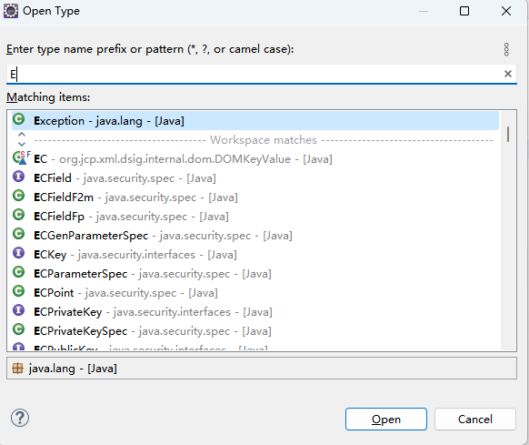

3. 进入类之后，然后使用 Ctrl+T，调出其子类；

   

4. 再在搜索框中搜索 RuntimeException 后进入，若要查询编译时异常，则查询除 RuntimeException 以外的异常即可；

   

5. 进入该子类之后，再次使用 Ctrl+T 即可看到该类中所包含的运行时异常；

   

## 异常生成机制

==抛抓模式==

当异常对象被创建并抛出时，程序就会遇到这个异常，遇到异常之后，如果没有任何的处理方法，那么 main 方法碰到异常程序终止，如果遇到异常后有处理方案（try-catch），那么就会去匹配 catch 分支，查看 catch 里的异常类型是否与抛出的异常类型相同，如果相同，就运行该 catch 分支中的语句，就表示该异常被处理，如果所有的 catch 分支都没有与该异常类型匹配，那么该异常还是会来到 main 方法中，然后程序终止；

当异常被处理时，catch 里的异常对象能够获取一些该异常的信息， catch 中的异常对象的常用方法：

- e.getMessage();
- e.printStackTrace();

## 异常的处理方案

示例如下：

以 io 流（后续学习）访问系统内存为例，D: 盘中没有 abc.java 这个文件，我们来访问它；

```java
package top.sharehome.Bag;

import java.io.FileInputStream;

public class Demo {
	public static void main(String[] args) {
		FileInputStream fis = new FileInputStream("d:/abc.java");
	}
}
```

报错效果如下：


这里给了我们两个选择，一种是将异常向上抛，一种是 try-catch-finally 处理方式

### 热处理异常

即使用 ==try-catch-finally== 结构；

- **try-catch-catch-…… 语法：**

  我们将可能出现异常的代码语句放入 try 语句中，如果没有出现异常，就按照原计划执行；

  若出现异常就会选择进入后续的 catch 语句，若出现相匹配的异常类型，则执行对应 catch 内容，同时舍弃该 catch 之后的 catch 代码；若没有出现相匹配的异常，该程序就会被系统自动处理，在控制台进行报错；

  **示例如下**：以输入不匹配异常为例；

  ```java
  package top.sharehome.Bag;
  
  import java.util.InputMismatchException;
  import java.util.Scanner;
  
  public class Demo {
  	public static void main(String[] args) {
  		Scanner sc = new Scanner(System.in);
  		System.out.println("输入数字正常执行，非数字异常执行：");
  		try {
  			int num = sc.nextInt();
  			System.out.printf("num = %d",num);
  		} catch (InputMismatchException e) {
              //这里已经找到所匹配的异常，即使下面的 Exception 也满足条件，也不会执行了
  			// TODO: handle exception
  			System.out.println("输入错误！！");
  		}catch (ArrayIndexOutOfBoundsException e) {
  			// TODO: handle exception
  			System.out.println("指针内存溢出！");
  		}catch (NullPointerException e) {
  			// TODO: handle exception
  			System.out.println("空指针异常!");
  		}catch (ArithmeticException e) {
  			// TODO: handle exception
  			System.out.println("计算异常！");
  		}catch (Exception e) {
  			// TODO: handle exception
  			System.out.println("出现异常！");
  		}
  	}
  }
  ```

  打印效果如下：

  

- **try-finally 语法：**

  finally 后的代码指的是无论出现异常，都必须要执行的代码，在该语法结构中，finally 的优先级甚至大于 return；

  一串正常代码中，一旦遇到 return ，就会终止程序，返回该返回的值，但是在该结构中即使返回了应该返回的值，依然还会执行 finally 中的代码；

  **示例如下：**

  ```
  package top.sharehome.Bag;
  
  public class Demo {
  	public static void main(String[] args) {
  		int num = method();
  		System.out.println("num+num=" + num);
  	}
  
  	public static int method() {
  		try {
  			int num = 10 / 5;
  			return num + num;
  		} finally {
  			// TODO: handle finally clause
  			System.out.println("我必须得执行！");
  		}
  	}
  }
  ```

  打印效果如下：

  

- **try-catch-catch-……-finally 语法：**

  该结构是以上两种情况的结合；

  **示例如下：**

  ```java
  package top.sharehome.Bag;
  
  import java.util.InputMismatchException;
  import java.util.Scanner;
  
  public class Demo {
  	public static void main(String[] args) {
  		Scanner sc = new Scanner(System.in);
  		System.out.println("输入数字正常执行，非数字异常执行：");
  		try {
  			int num = sc.nextInt();
  			System.out.printf("num = %d",num);
  		} catch (InputMismatchException e) {
              //这里已经找到所匹配的异常，即使下面的 Exception 也满足条件，也不会执行了
  			// TODO: handle exception
  			System.out.println("输入错误！！");
  		}catch (ArrayIndexOutOfBoundsException e) {
  			// TODO: handle exception
  			System.out.println("指针内存溢出！");
  		}catch (NullPointerException e) {
  			// TODO: handle exception
  			System.out.println("空指针异常!");
  		}catch (ArithmeticException e) {
  			// TODO: handle exception
  			System.out.println("计算异常！");
  		}catch (Exception e) {
  			// TODO: handle exception
  			System.out.println("出现异常！");
  		}finally {
  			System.out.println("运行时异常排除完毕！");
  		}
  	}
  }
  ```

  打印效果如下：

  

### 冷处理编译时异常

即==向上抛==

先用**未能找到文件异常**（编译时异常）来引出问题，以 io 流（后续学习）访问系统内存为例，D: 盘中没有 abc.java 这个文件，我们来访问它；

**示例如下：**

```java
package top.sharehome.Bag;

import java.io.FileInputStream;
import java.io.FileNotFoundException;

public class Demo {
	public static void main(String[] args) throws FileNotFoundException {
		m1();
	}
	static void m1() throws FileNotFoundException {
		m2();
	}
	static void m2() throws FileNotFoundException {
		m3();
	}
	static void m3() throws FileNotFoundException {
		m4();
	}
	static void m4() throws FileNotFoundException {
		FileInputStream fis = new FileInputStream("d:/abc.java");
	}
}
```

此时编译时异常就不会出现报错，运行程序若没有出现异常就不会报错，若出现异常就终止程序；

由于该异常申请是从各个方法抛出，直到抛给 main 方法才得以解决，所以称之为**向上抛**；

**我们也可以在中途使用热处理将其解决：**

```java
package top.sharehome.Bag;

import java.io.FileInputStream;
import java.io.FileNotFoundException;

public class Demo {
	public static void main(String[] args) {
		m1();
	}

	static void m1() {
		try {
			m2();
		} catch (FileNotFoundException e) {
			// TODO Auto-generated catch block
			e.printStackTrace();
		}
	}

	static void m2() throws FileNotFoundException {
		m3();
	}

	static void m3() throws FileNotFoundException {
		m4();
	}

	static void m4() throws FileNotFoundException {
		FileInputStream fis = new FileInputStream("d:/abc.java");
	}
}
```

此时就结束向上抛异常这样的操作；

## 自定义异常

**示例如下：**设计一个遇到负数就报错的异常；

NegativeNumberException 类：

```java
package top.sharehome.Bag;

public class NegativeNumberException extends Exception{
	//因为继承的是Exception，所以这里是一个编译时异常
	//如果继承RuntimeException，这里就是一个运行时异常
	//以下代码均是继承后的方法重写代码
	public NegativeNumberException() {
		super();
		// TODO Auto-generated constructor stub
	}

	public NegativeNumberException(String message, Throwable cause, boolean enableSuppression,
			boolean writableStackTrace) {
		super(message, cause, enableSuppression, writableStackTrace);
		// TODO Auto-generated constructor stub
	}

	public NegativeNumberException(String message, Throwable cause) {
		super(message, cause);
		// TODO Auto-generated constructor stub
	}

	public NegativeNumberException(String message) {
		super(message);
		// TODO Auto-generated constructor stub
	}

	public NegativeNumberException(Throwable cause) {
		super(cause);
		// TODO Auto-generated constructor stub
	}	
}
```

Demo 类：

```java
package top.sharehome.Bag;

import java.util.InputMismatchException;
import java.util.Scanner;

public class Demo {
	public static void main(String[] args) {
		Scanner sc = new Scanner(System.in);
		try {
			int num = sc.nextInt();
            //这里需要判断一下抛出自定义异常的条件和内容
			if (num < 0) {
				throw new NegativeNumberException("该数不能是负数！");
			}
		} catch (InputMismatchException e) {
			System.out.println("输入不匹配；");
		} catch (NegativeNumberException e) {
            // 以下是自定义异常的效果；
			// TODO: handle exception
			String message = e.getMessage();
			System.out.println(message);
		}
	}
}
```

打印效果如下：


# 40.集合

## 概念

### 特点

**数组**是一个容器，可以存放很多个相同数据类型的元素，但是数组有局限性：

1. 长度不可变；
2. 数据类型不可变；

**集合**也是一个容器，可以存放很多种元素，没有数组的局限性；

==集合大都存放引用数据类型，不用来存放基本数据类型；**所以数据多了存数组，对象多了存集合；**==

### 定义

==集合是一个不固定长度，可以存放任何数据类型的容器；==

**示例如下：**

```java
package top.sharehome.Bag;

import java.util.ArrayList;

public class Demo {
	//集合初体验
	public static void main(String[] args) {
		//创建集合
		ArrayList list = new ArrayList();
		list.add("abc");
		list.add(123);
		list.add(12.3f);
		list.add(1.23);
		list.add('a');
		list.add(true);
		System.out.println(list);
	}
}
```

打印效果如下：


## 集合类体系

$$
\begin{cases} Collection\ 集合\ 接口\begin{cases} List \ 列表\ 接口 \begin{cases} ArrayList\ 数组列表\\LinkedList\ 链表 \end{cases} \\ Set\ 集 \ 接口\begin{cases}HashSet\ 哈希表 --LinkedHashSet\ 链表哈希表\\TreeSet\ 红黑树 \end{cases} \end{cases} \\ Map\ 映射键值对\ 接口\begin{cases} HashMap\ 哈希表--LinkedHashMap \ 链表哈希表\\TreeMap\ 红黑树\\HashTable\ 哈希表，已经过时--Properties \ 哈希表\\ConCurrentHashMap\ 哈希表\ 线程相关 \end{cases}\\Iterator \ 迭代器接口\\泛型\ Generic\begin{cases}写作\\泛型类，泛型方法，泛型接口，泛型限定，泛型通配符 \end{cases}\\超级for循环 \end{cases}
$$

**线性表和链表特性总结：**

- 数组：
  - 有索引，数组中元素的地址是连续的，查询速度快；
  - 数组的长度为固定的，新数组创建，数组元素的复制，增删的效率慢；
- 链表：
  - 链表没有索引，采用对象之间内存地址记录的方式存储；
  - 查询元素，必须通过第一个节点依次查询，查询性能慢；
  - 增啥元素，不会改变原有链表的结构，速度比较快；

### Collection

**Collection** 是所有单列集合的顶级接口，**List** 和 **Set** 都是 **Collection** 的子接口；

**Collection接口是==元素集合==的一个基本接口，实现了对数据的==增删查（无改）==，常用方法如下：**

由于接口中的方法需要在实现类中使用，所以我们就以 ArrayList 类中对其进行示范；

- ==集合的长度是 **size()**、字符串的长度是 **length()**、数组的长度是 **length**；==

- **`System.out.println();`  查询元素；**

  ```java
  Collection col = new ArrayList();
  // 查 -- 直接打印出来
  System.out.println("col = " + col);
  ```

  打印效果如下：

  

- **`add(Object O) 和 addAll(Collection col)`  增加元素；**

  ```java
  Collection col = new ArrayList();
  col.add("abc");
  System.out.println("col = " + col);
  // 增 -- addAll();
  Collection colTest = new ArrayList();
  colTest.addAll(col);
  System.out.println("colTest = " + colTest);
  ```

  打印效果如下：

  

- **`remove(Object O) 和 removeAll(Collection col)`  删除元素；**

  ```java
  package top.sharehome.Bag;
  
  import java.util.ArrayList;
  import java.util.Collection;
  
  public class Demo {
  	public static void main(String[] args) {
  		Collection col = new ArrayList();
  		col.add(123);
  		col.add("name");
  		col.add('a');
  		System.out.println("删除前" + col);
  		col.remove("name");
  		System.out.println("删除name后" + col);
  		col.removeAll(col);
  		System.out.println("删除所有后" + col);
  	}
  }
  ```

  打印效果如下：

  

  ==注意：remove() 和 removeAll() 方法使用后会产生一个 boolean 返回值，该返回值分别表示能否删除成功（成功 true ；失败 false）和判断该集合是否为空（空 false；非空 true）；==

  清空的函数不止有 `removeAll()` ，还有 `clear()` ；

- `size()`  返回集合的元素个数；

  ```java
  package top.sharehome.Bag;
  
  import java.util.ArrayList;
  import java.util.Collection;
  
  public class Demo {
  	public static void main(String[] args) {
  		Collection col = new ArrayList();
  		col.add(123);
  		col.add("name");
  		col.add('a');
  		System.out.println(col.size());
  	}
  }
  ```

  打印效果如下：

  

- `contains(Object) 和 containsAll(Collection)`  判断是否存在

  ```java
  package top.sharehome.Bag;
  
  import java.util.ArrayList;
  import java.util.Collection;
  
  public class Demo {
  	public static void main(String[] args) {
  		Collection col = new ArrayList();
  		Collection colTest = new ArrayList();
  		col.add(123);
  		col.add("name");
  		col.add('a');
  		colTest.addAll(col);
  		boolean contains = colTest.contains("name");
  		boolean containsAll = colTest.containsAll(col);
  		System.out.println(contains);
  		System.out.println(containsAll);
  	}
  }
  ```
  
  打印效果如下：
  
  

- `equals()`  比较两个集合是否相同；

  ```java
  package top.sharehome.Bag;
  
  import java.util.ArrayList;
  import java.util.Collection;
  
  public class Demo {
  	public static void main(String[] args) {
  		Collection col = new ArrayList();
  		Collection colTest = new ArrayList();
  		col.add(123);
  		col.add("name");
  		col.add('a');
  		colTest.addAll(col);
  		boolean equals = col.equals(colTest);
  		System.out.println(equals);
  	}
  }
  ```

  打印效果如下：

  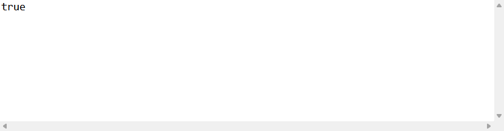

#### List接口

**==特点==**：

- List 在底层是一片连续的空间；
- 这个接口的集合都具有**索引**，接口中的元素允许**重复**；
  - 因为有索引，所以我们可以像遍历数组那样遍历集合，就不需要迭代器遍历（下一节有写到）
  - 链表本身没有索引，但是LinkedList内加入了一个计数器，该计数器充当了地址；
- 这个接口中的元素是**有序**的；
  - 元素不会排序，有序指的是元素存储和取出的顺序是一致的，即存3 4 5 6，取3 4 5 6

**主要实现类**：ArrayList 类等

**List接口常用方法：==增删查改==**

- **查询 List 中的元素依然是直接打印，或者使用 `get(int index)` ；**

  ```java
  package top.sharehome.Bag;
  
  import java.util.ArrayList;
  import java.util.List;
  
  public class Demo {
  	public static void main(String[] args) {
  		List list = new ArrayList();
  		list.add("a");
  		list.add("b");
  		list.add("c");
  		list.add("d");
  		System.out.println(list.get(0));
  	}
  }
  ```

  打印效果如下：

  

- **`add(Object O) 和 add(int index,Object O) 和 addAll(Object O) 和 addAll(int index,Object O)`  List 中的添加元素；**

  ```java
  package top.sharehome.Bag;
  
  import java.util.ArrayList;
  import java.util.List;
  
  public class Demo {
  	public static void main(String[] args) {
  		List list = new ArrayList();
  		List listTest = new ArrayList();
  		list.add("a");
  		list.add("b");
  		listTest.add("c");
  		listTest.add("d");
  		System.out.println("list = " + list);
  		list.add(2, "AB");
  		System.out.println("改变后list = " + list);
  		listTest.addAll(2, list);
  		System.out.println("listTest = " + listTest);
  	}
  }
  ```

  打印效果如下：

  

- **`remove(int index) 和 remove(Object O) 和 removeAll(Collection) 和 clear()`  删除 List 中的元素；**

  ```java
  package top.sharehome.Bag;
  
  import java.util.ArrayList;
  import java.util.List;
  
  public class Demo {
  	public static void main(String[] args) {
  		List list = new ArrayList();
  		list.add("a");
  		list.add("b");
  		list.add("c");
  		list.add("d");
  		System.out.println("list = " + list);
  		Object remove = list.remove(3);
  		System.out.println("删除后的元素" + remove);
  		System.out.println("list = " + list);
  	}
  }
  ```

  打印效果如下：

  

  ==注意：remove(int index) 会返回被删除的元素，而 remove() 和 removeAll() 分别是返回是否删除成功和判断集合是否为空；==

- **`set(int index,Object O)`  改变 List 中指定位置的元素，返回修改前的元素；**

  ```java
  package top.sharehome.Bag;
  
  import java.util.ArrayList;
  import java.util.List;
  
  public class Demo {
  	public static void main(String[] args) {
  		List list = new ArrayList();
  		list.add("a");
  		list.add("b");
  		list.add("c");
  		list.add("d");
  		list.set(0,"A");
  		System.out.println(list);
  	}
  }
  ```

  打印效果如下：

  

##### ArrayList(常用)

- ArrayList集合底层的实现原理是数组，大小可变；
- 查询速度快，增删慢；
- 数组的默认长度是10个，每次扩容是原来长度的1.5倍
- ArrayList是线程不安全的集合，运行速度快；

##### LinkedList

- LinkedList集合底层实现原理是链表，双向链表；
- 增删速度快，查询慢；
- LinkedList是线程不安全的集合，运行速度快；

#### Set接口

**==特点==**：

- Set 在底层类似于一片堆空间（存放无序且不可重复的元素）；
- 没有索引，不允许重复
- 有的有序（LinkedHashSet），有的无序

**主要实现类**：HashSet 类等

无序特点示例如下：

```java
package top.sharehome.Bag;

import java.util.HashSet;
import java.util.Set;

public class Demo {
	public static void main(String[] args) {
		Set s = new HashSet();
		s.add("A");
		s.add("2");
		s.add(1);
		s.add(2);
		System.out.println(s);
	}
}
```

打印效果如下：


不可重复性示例如下：

```java
package top.sharehome.Bag;

import java.util.HashSet;
import java.util.Set;

public class Demo {
	public static void main(String[] args) {
		Set s = new HashSet();
		s.add("A");
		s.add("2");
		s.add(1);
		s.add(2);
		s.add("A");  //重复一次
		System.out.println(s);
	}
}
```

打印效果如下：


**==我们可以借用该特点去删除一些重复的数据，当该数据是对象时，应该比较对象的内容而不是对象的地址，所以我们要重写 equals 和 hashcode；==**

示例如下：

Teacher 类：

```java
package top.sharehome.Bag;

import java.util.Objects;

public class Teacher {
	private String name;
	private int age;

	public String getName() {
		return name;
	}

	public void setName(String name) {
		this.name = name;
	}

	public int getAge() {
		return age;
	}

	public void setAge(int age) {
		this.age = age;
	}

	public Teacher(String name, int age) {
		super();
		this.name = name;
		this.age = age;
	}

	public Teacher() {
		super();
		// TODO Auto-generated constructor stub
	}

	@Override
	public String toString() {
		return "Teacher [name=" + name + ", age=" + age + "]";
	}
    
	//下面需要重写equals和hashcode，以便于比较内容而不是地址
    
	@Override
	public int hashCode() {
		return Objects.hash(age, name);
	}

	@Override
	public boolean equals(Object obj) {
		if (this == obj)
			return true;
		if (obj == null)
			return false;
		if (getClass() != obj.getClass())
			return false;
		Teacher other = (Teacher) obj;
		return age == other.age && Objects.equals(name, other.name);
	}
}
```

Demo 类：

```java
package top.sharehome.Bag;

import java.util.HashSet;
import java.util.Set;

public class Demo {
	public static void main(String[] args) {
		Teacher t1 = new Teacher("xiaochen", 20);
		Teacher t2 = new Teacher("xiaochen", 20);
		Set s = new HashSet();
		s.add(t1);
		s.add(t2);
		System.out.println(s);
	}
}
```

打印效果如下：


**主要实现类**：HashSet 类

**Set 接口常用方法和 Collection 接口方法，由于无序，所以不能进行索引，所以和 List 接口有区别；**

##### HashSet（HashMap）

- 实现Set接口，底层调用的是HashMap集合；

- HashSet的底层实现原理是哈希表；

- HashSet不保证迭代顺序，元素存储和取出的顺序不一定；

- 对象的哈希值：

  - 对象.HasCode() 的返回值就是哈希值，同时 对象.toString() 的返回值在对象后会 @哈希值；
  - String类会重写HashCode方法，并且自定义哈希值，哈希值的计算方法是：
    h = 31 * 上一次的计算结果 + 字符数组中元素的ASCII；
  - ==两个对象的哈希值相同，但不要求equals一定返回true;
    如果两个对象的equals返回true，那么两个对象的哈希值必须一致；
    由于哈希值和地址无直接联系，equals方法比较的是内容， == 比较的是地址值，则集合判断两个对象是否相同的条件就是内容与哈希值相同，即equals返回true，hashCode相等；==

- 哈希表的数据结构：

  数组+链表（单向链）的组合体；

  

  哈希表的底层数组长度默认是16个，扩容为原来长度的2倍；

  加载因子默认是0.75f，即数据长度达到数组默认长度的75%时扩容；

- 哈希表的面试问题：

  JDK7版本和JDK8版本的哈希表的区别：

  - **JDK7没有转红黑树；**

  - **JDK8转成红黑树；**

    转成树的两个条件：

    - 当一个数组中存储的链表长度>=8
    - 数组的整体长度超过64

    数组转回链表：

    - 链表长度<=6

  - **JDK7元素采用头插法；**

  - **JDK8元素采用尾插法；**

    - 这里的头插和尾插指的是插入哈希表中链表的方式

##### TreeSet（TreeMap）

- 底层是红黑树（Red-Black Tree）结构；

- 二叉树（已过时），本质就是链表；

  - 查询速度快；
  - 每一个节点，只有两个子节点（left 和 right，left存小值，right存大值）；
  - 被淘汰的原因：树容易长偏，即根节点可能是一个很大（或者很小）的值，那么就会出现左偏（或者右偏），即左边（右边）数据量巨大；

- 自然平衡二叉树；

  - 在二叉树的基础上，保证树是平衡的；

- 最后就是红黑树；

  - 每个节点有颜色，要么红，要么黑；

  - 根节点必须是黑色；

  - 叶子节点必须是黑色；

  - 颜色用变量表示，true表示黑色，false表示红色；

  - 红黑树可以对存储到红黑树的元素进行排序；

  - ==当红黑树存储对象时需要对象类实现 Comparable ，并且重写该接口中的compareTo方法；==

    示例如下：

    ```java
    package top.sharehome.BigJava;
    
    import java.util.TreeSet;
    
    public class Demo {
        public static void main(String[] args) {
            TreeSet<Student> ts = new TreeSet<>();
            ts.add(new Student("A",10));
            ts.add(new Student("B",11));
            ts.add(new Student("C",12));
            ts.add(new Student("D",13));
            ts.add(new Student("E",14));
            System.out.println("TS = "+ts);
        }
    }
    
    class Student implements Comparable<Student>{
    
        @Override
        public boolean equals(Object o) {
            if (this == o) return true;
            if (!(o instanceof Student)) return false;
    
            Student student = (Student) o;
    
            if (getAge() != student.getAge()) return false;
            return getName() != null ? getName().equals(student.getName()) : student.getName() == null;
        }
    
        @Override
        public int hashCode() {
            int result = getName() != null ? getName().hashCode() : 0;
            result = 31 * result + getAge();
            return result;
        }
    
        String name;
        int age;
    
        @Override
        public String toString() {
            return "Student{" +
                    "name='" + name + '\'' +
                    ", age=" + age +
                    '}';
        }
    
        public String getName() {
            return name;
        }
    
        public void setName(String name) {
            this.name = name;
        }
    
        public int getAge() {
            return age;
        }
    
        public void setAge(int age) {
            this.age = age;
        }
    
        public Student(String name, int age) {
            this.name = name;
            this.age = age;
        }
    
        public Student() {
        }
    
        @Override
        public int compareTo(Student o) {
            return  this.age-o.age;
        }
    }
    ```

    打印效果如下：

    

  - ==也可以自定义一个比较器，然后带入红黑树对象，自定义比较器类应该实现 Comparator 接口，并且重写接口中的 compare 方法；==

    示例如下：

    ```java
    package top.sharehome.BigJava;
    
    import java.util.Comparator;
    import java.util.TreeSet;
    
    public class Demo {
        public static void main(String[] args) {
            /*
            将比较器引入新的红黑树对象中
             */
            TreeSet<Student> ts = new TreeSet<>(new MyCom());
            ts.add(new Student("A",10));
            ts.add(new Student("B",11));
            ts.add(new Student("C",12));
            ts.add(new Student("D",13));
            ts.add(new Student("E",14));
            System.out.println("TS = "+ts);
        }
    }
    
    /**
     * 自定义一个比较器
     */
    class MyCom implements Comparator<Student>{
        @Override
        public int compare(Student o1, Student o2) {
            return  o1.age-o2.age;
        }
    }
    
    class Student{
        String name;
        int age;
    
        public Student() {
        }
    
        public Student(String name, int age) {
            this.name = name;
            this.age = age;
        }
    
        @Override
        public String toString() {
            return "Student{" +
                    "name='" + name + '\'' +
                    ", age=" + age +
                    '}';
        }
    }
    ```

    打印效果如下：

    

##### LinkedHashSet

- 底层的数据结构是哈希表，继承 HashSet；

- LinkedHasSet数据是双向链表，有序的集合，存储和取出的顺序一样；

  示例如下：

  ```java
  package top.sharehome.BigJava;
  
  import java.util.*;
  
  public class Demo {
      public static void main(String[] args) {
          Set<Student> l = new LinkedHashSet<>();
          l.add(new Student("A",10));
          l.add(new Student("B",19));
          l.add(new Student("C",13));
          l.add(new Student("D",17));
          l.add(new Student("E",15));
          Iterator<Student> it = l.iterator();
          while (it.hasNext()){
              System.out.println(it.next());
          }
      }
  }
  
  class Student{
      String name;
      int age;
  
      public Student() {
      }
  
      public Student(String name, int age) {
          this.name = name;
          this.age = age;
      }
  
      @Override
      public String toString() {
          return "Student{" +
                  "name='" + name + '\'' +
                  ", age=" + age +
                  '}';
      }
  }
  ```

  打印效果如下：

  

#### Collections工具类

该工具类中的方法全部是静态方法，直接用类名调用，主要是操作Collection系列的单列集合，少部分功能可以操作双列Map集合；

**集合的二分查找：** `int Collections.binarySearch(List,key) `

此方法返回 key 值的索引，若 key 不存在，则排序插入，返回 `-比它小的index-1` 

```java
package top.sharehome.BigJava;

import java.util.ArrayList;
import java.util.Collections;
import java.util.List;

public class Demo {
    public static void main(String[] args) {
        List<Integer> l = new ArrayList<>();
        for (int i = 0; i < 20; i++) {
            if ((i+1) % 2 == 0) {
                l.add(i + 1);
            }
        }
        int index1 = Collections.binarySearch(l, 1);
        int index2 = Collections.binarySearch(l,8);
        System.out.println("index1 = "+index1);
        System.out.println("index2 = "+index2);
    }
}
```

打印效果如下：

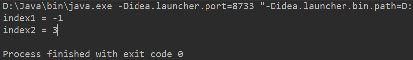

**集合元素位置随机交换：** `Collections.shuffle()` 该方法要求集合具有自然顺序，即集合的数据类型需要继承 Comparable 接口，或者有自定义的比较器；

示例如下：打印1-20不重复随机排序；

```java
package top.sharehome.BigJava;

import java.util.ArrayList;
import java.util.Collections;
import java.util.List;

public class Demo {
    public static void main(String[] args) {
        List<Integer> l = new ArrayList<>();
        for (int i = 0; i < 20; i++) {
            l.add(i+1);
        }
        Collections.shuffle(l);
        System.out.println(l.toString());
    }
}
```

打印效果如下：


#### 单列集合转数组

示例如下：

```java
package top.sharehome.BigJava;

import java.util.*;

public class Demo {
    public static void main(String[] args) {
        List<Integer> l = new ArrayList<>();
        for (int i = 0; i < 9; i++) {
            l.add(i+1);
        }
        Collections.shuffle(l);
        Integer[] arr = l.toArray(new Integer[9]);
        System.out.println(Arrays.toString(arr));
    }
}
```

打印效果如下：


#### 遍历Collection（迭代器）

英文名为 `Iterator` ，==是遍历 Collection 集合的工具==；

每一个 Collection 集合都会拥有一个自己的迭代器；

#### 获得迭代器

**`Iterato iterator = list.iterator();` 代码示例；**

```java
List list = new List();
Iterato iterator = list.iterator();
```

**示例如下：**

```java
package top.sharehome.Bag;

import java.util.ArrayList;
import java.util.Iterator;
import java.util.List;

public class Demo {
	public static void main(String[] args) {
		List list = new ArrayList();
		list.add("A");
		list.add("B");
		list.add(1);
		list.add(2);
		System.out.println(list);
		Iterator iterator = list.iterator();
	}
}
```

#### 操作迭代器

#### 常用方法

- **`hasNext()` 判断是否还能迭代，返回布尔值；**
- **`next()` 返回迭代的下一个元素；**
- **`remove()` 从迭代器所指向的 Collection 中移除迭代器返回的最后一个元素；** 

#### 方法的搭配

由常用方法可得知以下结构：

- 先由 `hasNext()` 方法去判断，判断为真，则返回 `true` ，否则返回 `false` ；
- 再由 `next()` 方法去接收 `hasNext()` 方法返回的结果，读取下一位或者停止读取；

集合遍历示例如下：

```java
package top.sharehome.Bag;

import java.util.ArrayList;
import java.util.Iterator;
import java.util.List;

public class Demo {
	public static void main(String[] args) {
		List list = new ArrayList();
		list.add("A");
		list.add("B");
		list.add(1);
		list.add(2);
		Iterator iterator = list.iterator();
		while(iterator.hasNext()) {
			System.out.print(iterator.next()+" ");
		}
	}
}
```

打印效果如下：


#### 注意事项

- `next()` 方法不能脱离于 `hasNext()` 方法来使用，比如不能单独以 `next()!=null;` 来作为是否输出的判断依据，不仅会导致无法遍历首元素，而且会引发一个 `NoSuchElementException` 异常，该异常是因为在末尾处无法找到最后一个元素（查找指针会溢出）；

- 普通的 for 循环也能遍历集合，但是不建议使用，因为遍历过程中，动态修改集合时会得到一个错误的结果；

  示例如下：

  ```java
  package top.sharehome.Bag;
  
  import java.util.ArrayList;
  import java.util.Iterator;
  import java.util.List;
  
  public class Demo {
  	public static void main(String[] args) {
  		List list = new ArrayList();
  		list.add("A");
  		list.add("B");
  		list.add("B");
  		list.add("C");
  		list.add("D");
  		list.add("E");
  		list.add("F");
  		for (int i = 0; i < list.size(); i++) {
  			Object object = list.get(i);
  			String str = (String) object;
  			if(str.equals("B")) {
  				list.remove(i);
  			}
  		}
  		System.out.println(list);
  	}
  }
  ```

  打印效果如下：

  

  显然，有一个 "B" 没有被删掉，所以错误输出；

- 如何解决如何在集合遍历过程中删除元素的问题呢？在迭代器中搭配 `remove()` 方法，将上述示例代码运行一次即可；

  ```java
  package top.sharehome.Bag;
  
  import java.util.ArrayList;
  import java.util.Iterator;
  import java.util.List;
  
  public class Demo {
  	public static void main(String[] args) {
  		List list = new ArrayList();
  		list.add("A");
  		list.add("B");
  		list.add("B");
  		list.add("C");
  		list.add("D");
  		list.add("E");
  		list.add("F");
  		Iterator iterator = list.iterator();
  		while (iterator.hasNext()) {
  			Object next = iterator.next();
  			String str = (String) next;
  			if (str.equals("B")) {
  				iterator.remove();
  			}
  		}
  		System.out.println(list);
  	}
  }
  ```

  打印效果如下：

  

- ==总之！！！在 Collection 集合遍历中一定要使用迭代器！且迭代器只能使用一次！！！==

### Map

**Map接口是==键值对集合==的一个基本接口，是双列集合的顶级接口，没有父接口；**

**键值对解释**：就是由键和值组成的一对关系，键就是 Key，值就是 Value，==通过键就能找到值==；

==键不可以重复，但是值可以重复；==

**主要实现类**：HashMap 类 ==增删查改==；

- **`get(Key k)`  查询单个值，返回的就是 Key 对应的 Value，`System.out.println` 查询整个 Map；**

- **`put(Key k,Value v)`  增加 Map 中的键值对；==该方法一般返回 value 的数据类型，返回内容为 null，但是当 put 进重复的 key 时，会覆盖原有键所对应的 value 值；==**

  Student 类：

  ```java
  package top.sharehome.Bag;
  
  public class Student {
  	private String name;
  	private int age;
  	public Student() {
  		super();
  		// TODO Auto-generated constructor stub
  	}
  	public Student(String name, int age) {
  		super();
  		this.name = name;
  		this.age = age;
  	}
  	public String getName() {
  		return name;
  	}
  	public void setName(String name) {
  		this.name = name;
  	}
  	public int getAge() {
  		return age;
  	}
  	public void setAge(int age) {
  		this.age = age;
  	}
  	@Override
  	public String toString() {
  		return "Student [name=" + name + ", age=" + age + "]";
  	}	
  }
  ```

  Demo 类：

  ```java
  package top.sharehome.Bag;
  
  import java.util.HashMap;
  import java.util.Map;
  
  public class Demo {
  	public static void main(String[] args) {
  		Map map = new HashMap();
  		Student stu1 = new Student("xiaoming", 20);
  		Student stu2 = new Student("xiaozhang", 21);
  		Student stu3 = new Student("xiaochen", 22);
  		map.put(001, stu1);
  		map.put(002, stu2);
  		map.put(003, stu3);
  		Object object = map.get(001);
  		System.out.println(object);
  	}
  }
  ```

  打印效果如下：

  

- **`remove(Key k)`  删除该 Key 所对应的键值对，并且返回该键值对，当然 `clear()` 能够实现删除整个Map；**

  Student 类：

  ```java
  package top.sharehome.Bag;
  
  public class Student {
  	private String name;
  	private int age;
  	public Student() {
  		super();
  		// TODO Auto-generated constructor stub
  	}
  	public Student(String name, int age) {
  		super();
  		this.name = name;
  		this.age = age;
  	}
  	public String getName() {
  		return name;
  	}
  	public void setName(String name) {
  		this.name = name;
  	}
  	public int getAge() {
  		return age;
  	}
  	public void setAge(int age) {
  		this.age = age;
  	}
  	@Override
  	public String toString() {
  		return "Student [name=" + name + ", age=" + age + "]";
  	}	
  }
  ```

  Demo 类：

  ```java
  package top.sharehome.Bag;
  
  import java.util.HashMap;
  import java.util.Map;
  
  public class Demo {
  	public static void main(String[] args) {
  		Map map = new HashMap();
  		Student stu1 = new Student("xiaoming", 20);
  		Student stu2 = new Student("xiaozhang", 21);
  		Student stu3 = new Student("xiaochen", 22);
  		map.put(001, stu1);
  		map.put(002, stu2);
  		map.put(003, stu3);
  		Object remove = map.remove(001);
  		System.out.println(remove);
  		System.out.println(map);
  	}
  }
  ```

  打印效果如下：

  

- **`put(Key k,Value v)`  不仅可以增加内容，还可以通过输入要改的键来修改值；** 

  Student 类：

  ```java
  package top.sharehome.Bag;
  
  public class Student {
  	private String name;
  	private int age;
  	public Student() {
  		super();
  		// TODO Auto-generated constructor stub
  	}
  	public Student(String name, int age) {
  		super();
  		this.name = name;
  		this.age = age;
  	}
  	public String getName() {
  		return name;
  	}
  	public void setName(String name) {
  		this.name = name;
  	}
  	public int getAge() {
  		return age;
  	}
  	public void setAge(int age) {
  		this.age = age;
  	}
  	@Override
  	public String toString() {
  		return "Student [name=" + name + ", age=" + age + "]";
  	}	
  }
  ```

  Demo 类：

  ```
  package top.sharehome.Bag;
  
  import java.util.HashMap;
  import java.util.Map;
  
  public class Demo {
  	public static void main(String[] args) {
  		Map map = new HashMap();
  		Student stu1 = new Student("xiaoming", 20);
  		Student stu2 = new Student("xiaozhang", 21);
  		map.put(001, stu1);
  		map.put(002, stu2);
  		System.out.println("map = " + map);
  		map.put(001, stu2);
  		System.out.println("修改后map = " + map);
  	}
  }
  ```

  打印效果如下：

  

- **`keySet()`  将 Map 中所有的键保存在一个数组里面，整体返回出来；**

  Student 类：

  ```java
  package top.sharehome.Bag;
  
  public class Student {
  	private String name;
  	private int age;
  	public Student() {
  		super();
  		// TODO Auto-generated constructor stub
  	}
  	public Student(String name, int age) {
  		super();
  		this.name = name;
  		this.age = age;
  	}
  	public String getName() {
  		return name;
  	}
  	public void setName(String name) {
  		this.name = name;
  	}
  	public int getAge() {
  		return age;
  	}
  	public void setAge(int age) {
  		this.age = age;
  	}
  	@Override
  	public String toString() {
  		return "Student [name=" + name + ", age=" + age + "]";
  	}	
  }
  ```

  Demo 类：

  ```java
  package top.sharehome.Bag;
  
  import java.util.HashMap;
  import java.util.Map;
  import java.util.Set;
  
  public class Demo {
  	public static void main(String[] args) {
  		Map map = new HashMap();
  		Student stu1 = new Student("xiaoming", 20);
  		Student stu2 = new Student("xiaozhang", 21);
  		Student stu3 = new Student("xiaochen", 22);
  		map.put(001, stu1);
  		map.put(002, stu2);
  		map.put(003, stu3);
  		Set keySet = map.keySet();
  		System.out.println(keySet);
  	}
  }
  ```

  打印效果如下：

  

- **`containKey(K)` 判断集合是否包含这个键，包含返回 true；**

  示例如下：

  ```java
  package top.sharehome.BigJava;
  
  import java.util.HashMap;
  import java.util.Map;
  
  public class Demo {
      public static void main(String[] args) {
          Map<Integer,String> m = new HashMap<>();
          m.put(1,"xiaohong");
          m.put(2,"xiaoming");
          m.put(3,"xiaochen");
          m.put(4,"xiaofang");
          m.put(5,"xiaoying");
          boolean b1 = m.containsKey(3);
          boolean b2 = m.containsKey(6);
          System.out.println(b1);
          System.out.println(b2);
      }
  }
  ```

  打印效果如下：

  

- **`containValue(V)` 判断集合是否包含这个值，包含返回 true；**

  示例如下：

  ```java
  package top.sharehome.BigJava;
  
  import java.util.HashMap;
  import java.util.Map;
  
  public class Demo {
      public static void main(String[] args) {
          Map<Integer,String> m = new HashMap<>();
          m.put(1,"xiaohong");
          m.put(2,"xiaoming");
          m.put(3,"xiaochen");
          m.put(4,"xiaofang");
          m.put(5,"xiaoying");
          boolean b1 = m.containsValue("xiaohong");
          boolean b2 = m.containsValue("xiaoli");
          System.out.println(b1);
          System.out.println(b2);
      }
  }
  ```

  打印效果如下：

  

- **`size()` 返回集合长度，Map集合中键值对的个数；**

  ==主要是用来判断该Map是否为空；==

  示例如下：

  ```java
  package top.sharehome.BigJava;
  
  import java.util.HashMap;
  import java.util.Map;
  
  public class Demo {
      public static void main(String[] args) {
          Map<Integer,String> m = new HashMap<>();
          m.put(1,"xiaohong");
          m.put(2,"xiaoming");
          m.put(3,"xiaochen");
          m.put(4,"xiaofang");
          m.put(5,"xiaoying");
          int i = m.size();
          System.out.println(i);
      }
  }
  ```

  打印效果如下：

  

- **`value()` Map集合中的所有的值拿出存储到 Collection\<V> 集合中**

  ==该方法的返回值就是一个Collection，所以不能用它的实现类去接收，我们也不必考虑它的转换过程，但一定要跟上泛型；；==

  示例如下：

  ```java
  package top.sharehome.BigJava;
  
  import java.util.*;
  
  public class Demo {
      public static void main(String[] args) {
          Map<Integer,String> m = new HashMap<>();
          m.put(1,"xiaohong");
          m.put(2,"xiaoming");
          m.put(3,"xiaochen");
          m.put(4,"xiaofang");
          m.put(5,"xiaoying");
          Collection<String> coll = m.values();
          System.out.println(coll);
      }
  }
  ```

  打印效果如下：

  

#### 遍历Map

##### 方式一(常用)

**方法解释：**

- 首先要有一个 Map 集合，只要我们能够拿到所有的键，就可以让我们返回所有对应的值；
- 然后通过 map.ksySet() 方法获取所有的键，返回并包装成一个 Collection 接口下的 Set 子接口，此时我们就可以根据遍历 Collection 的迭代器方法来遍历该 Map；
- 然后获得一个迭代器，在循环语句中，将所有 key 赋值为每一次循环的 iterator.next()，再通过 Map.get(key) 方法获得所有 key 所对应的 value；
- 最后输出出来；

**示例如下：**

```java
package top.sharehome.Bag;

import java.util.HashMap;
import java.util.Iterator;
import java.util.Map;
import java.util.Set;

public class Demo {
	public static void main(String[] args) {
		Map map = new HashMap();
		map.put(1, "a");
		map.put(2, "b");
		map.put(3, "c");
		map.put(4, "d");
		map.put(5, "e");
		//map集合里放的是键值对，Key和Value的映射关系
		//获得Map中所有的键，就能够遍历出所有的值；  ==>  map中的 keySet() 方法
		Set keySet = map.keySet();
		//返回一个包含所有键的 Set ，即可获得该 Set 的迭代器
		Iterator iterator = keySet.iterator();
		//步骤和 Collection 迭代方式一样
		while(iterator.hasNext()) {
			Object key = iterator.next();
			//这里要通过 map 中的 get() 方法得到每一个键所对应的值
			Object value = map.get(key);
			System.out.println("Key = "+key+" ==> value = "+value);
		}
	}
}
```

打印效果如下：


##### 方式二

**方法解释：**

通过 Map 集合的 values() 方法获得集合中所有的值；

该方法将所有的值放入一个容器并返回一个 Collection 接口下的 List 子接口（因为 Map 集合中的值可以重复）

**示例如下：**

```java
package top.sharehome.Bag;

import java.util.Collection;
import java.util.HashMap;
import java.util.Map;
import java.util.Set;

public class Demo {
	public static void main(String[] args) {
		Map map = new HashMap();
		map.put(1, "a");
		map.put(2, "b");
		map.put(3, "c");
		map.put(4, "d");
		map.put(5, "e");
		map.put(6, "a");
		Set keys = map.keySet();
		Collection values = map.values();
		System.out.println(keys);
		System.out.println(values);
	}
}
```

打印效果如下：


##### 方式三(须知)

**方法解释：**

使用 Map 中的 entrySet() 内部类，能够直接获取 Map 中的所有==映射关系（Entry）==，并且返回一个 Set 接口，这个接口中存储的元素比较特殊，存储的是 Map 集合中键值对映射关系的对象，内部接口 Map.Entry<K,V> ；

然后又可以用 Set 接口中的迭代器方法做遍历，参见方式一；

**映射关系相关的接口 ==Map.Entry<K,V>==：**

- **接口常见方法：**

  `equals(Object O)`  比较指定对象与该映射项是否相等；

  `getKey()`   返回该映射项对应的键；

  `getValue()`  返回该映射项对应的值；

  `setValue(Value V)`  用指定的值替换该映射项的值；

- **方法示例：**

  ```java
  package top.sharehome.Bag;
  
  import java.util.Collection;
  import java.util.HashMap;
  import java.util.Iterator;
  import java.util.Map;
  import java.util.Map.Entry;
  import java.util.Set;
  
  public class Demo {
  	public static void main(String[] args) {
  		Map map = new HashMap();
  		Map mapTest = new HashMap();
  		map.put(1, "a");
  		map.put(2, "b");
  		map.put(3, "c");
  		map.put(4, "d");
  		map.put(5, "e");
  		map.put(6, "a");
  		mapTest.putAll(map);
  		Set entrySet1 = map.entrySet();
  		Set entrySet2 = mapTest.entrySet();
  		Iterator iterator1 = entrySet1.iterator();
  		Iterator iterator2 = entrySet2.iterator();
  		Object next1 = iterator1.next();
  		Object next2 = iterator2.next();
  		//以下判断是向下转型
  		if(next1 instanceof Map.Entry) {
  			if(next2 instanceof Map.Entry) {
  				//以下两条是强转，因为 Object 中没有 entry 里的方法
  				Entry entry1 = (Entry) next1;
  				Entry entry2 = (Entry) next2;
  				boolean equals = entry1.equals(entry2);
  				Object key1 = entry1.getKey();
  				Object key2 = entry2.getKey();
  				Object value1 = entry1.getValue();
  				Object value2 = entry2.getValue();
  				System.out.println("equals = " + equals);
  				System.out.println("key1 = " + key1);
  				System.out.println("key2 = " + key2);
  				System.out.println("value1 = " + value1);
  				System.out.println("value2 = " + value2);
  				Object setValue1 = entry1.setValue("A");
  				Object setValue2 = entry2.setValue("B");
  				System.out.println("setValue1 = " + setValue1);
  				System.out.println("wetValue2 = " + setValue2);
  			}
  		}
  	}
  }
  ```

  打印效果如下：

  

**方式三示例如下：**

```java
package top.sharehome.BigJava;

import java.util.*;

public class Demo {
    public static void main(String[] args) {
        Map<Integer,String> m = new HashMap<>();
        m.put(1,"xiaohong");
        m.put(2,"xiaoming");
        m.put(3,"xiaochen");
        m.put(4,"xiaofang");
        m.put(5,"xiaoying");
        Set<Map.Entry<Integer,String>> s = m.entrySet();
        Iterator<Map.Entry<Integer,String>> it = s.iterator();
        while (it.hasNext()){
            Map.Entry<Integer,String> e = it.next();
            Integer key = e.getKey();
            String value = e.getValue();
            System.out.println("key = "+key+" ==> value = "+value);
        }
    }
}
```

打印效果如下：


#### HashMap(常用)

- HashMap集合特点
  - 是哈希表结构
  - 为了保证唯一性，用于键的对象，必须重写 hashCode 和 equals 方法，不然会出现该对象作为键时，插入内容相同的对象而会被判定成两个不一样的对象；
  - 线程不安全集合，运行速度快
  - 集合允许使用 null 作为键或者值

#### LinkedHashMap

继承于 HashMap ，实现 Map 接口，LinkedHashMap底层实现原理是哈希表，双向连，存取有序，其他的特性和它的父类 HashMap 一样；

**示例如下：**

我们从键盘获取，来存储 3 个学生对象；

```java
package top.sharehome.BigJava;

import java.util.*;

public class Demo {
    public static void main(String[] args) {
        Scanner sc = new Scanner(System.in);
        System.out.println("请输入学生个数：");
        int stuNum = sc.nextInt();
        Map<Integer, String> m = MyScan(stuNum);
        System.out.println("下面是第一种遍历方式：");
        Set<Integer> set1 = m.keySet();
        Iterator<Integer> it1 = set1.iterator();
        while (it1.hasNext()) {
            int key = it1.next();
            String value = m.get(key);
            System.out.println("key = " + key + " ==> value =" + value);
        }
        System.out.println("下面是第二种遍历方式：");
        Set<Map.Entry<Integer, String>> set2 = m.entrySet();
        Iterator<Map.Entry<Integer, String>> it2 = set2.iterator();
        while (it2.hasNext()) {
            Map.Entry<Integer, String> e = it2.next();
            int key = e.getKey();
            String value = e.getValue();
            System.out.println("key = " + key + " ==> value =" + value);
        }
    }

    public static LinkedHashMap<Integer, String> MyScan(int num) {
        Scanner sc = new Scanner(System.in);
        LinkedHashMap<Integer, String> m = new LinkedHashMap<>();
        for (int i = 0; i < num; i++) {
            System.out.println("请输入第" + (i + 1) + "个学生的序号和名字：");
            int stuNum = sc.nextInt();
            String name = sc.next();
            m.put(stuNum, name);
        }
        sc.close();
        return m;
    }
}
```

打印效果如下：


#### Hashtable

这是 Map 接口的实现类，这个类诞生于 JDK1.0 版本，而 Map 接口诞生于 JDK1.2 版本，所以 Hashtable 类从 JDK1.2 开始，改进为实现 Map 接口；

- Hashtable 类的特点
  - 底层数据结构是哈希表
  - 线程安全的，运行速度慢，被更加先进的 HashMap 取代
  - 不允许 null 值和 null 键

#### Vector

List 接口的实现 Vector，命运和 Hashtable 一样；

- Vector 类的特点
  - 底层实现结构式数组
  - 数组的默认容量是 10，每次扩容是原来的两倍
  - 线程安全，运行速度，被 ArrayList 取代

#### TreeMap

- TreeMap 特点

  - 底层实现是红黑树结构（添加查询速度都是比较快的）
  - 存储到 TreeMap 中的元素会对键进行排序，排序的依据：
    - 对象的自然顺序，作为键的对象，实现了接口 Comparable
    - 自己提供比较器，实现接口 Comparator ==（优先级高）==
  - 线程不安全，运行速度快

- 示例如下：

  ```java
  package top.sharehome.BigJava;
  
  import java.util.*;
  
  public class Demo {
      public static void main(String[] args) {
          Map<Student, Integer> m = new TreeMap<>(new MyCom());
          m.put(new Student("xiaochen", 21), 1);
          m.put(new Student("xiaoyang", 22), 1);
          m.put(new Student("xiaohong", 19), 1);
          Set<Student> set = m.keySet();
          Iterator<Student> it = set.iterator();
          while (it.hasNext()) {
              Student key = it.next();
              int value = m.get(key);
              System.out.println("key = " + key + " ==> value = " + value);
          }
      }
  }
  
  class MyCom implements Comparator<Student> {
      public int compare(Student o1, Student o2) {
          return o1.getAge()-o2.getAge();
      }
  }
  
  class Student {
      private String name;
      private int age;
  
      public Student(String name, int age) {
          this.name = name;
          this.age = age;
      }
  
      public String getName() {
          return name;
      }
  
      public int getAge() {
          return age;
      }
  
      @Override
      public String toString() {
          return "Student{" +
                  "name='" + name + '\'' +
                  ", age=" + age +
                  '}';
      }
  
      @Override
      public boolean equals(Object o) {
          if (this == o) return true;
          if (!(o instanceof Student)) return false;
  
          Student student = (Student) o;
  
          if (getAge() != student.getAge()) return false;
          return getName() != null ? getName().equals(student.getName()) : student.getName() == null;
      }
  
      @Override
      public int hashCode() {
          int result = getName() != null ? getName().hashCode() : 0;
          result = 31 * result + getAge();
          return result;
      }
  }
  ```

  打印效果如下：

  

#### Properties

- Properties 集合特点

  - 继承 Hashtable，实现 Map 接口

  - 底层是哈希表结构

  - 线程是安全的，运行速度慢

  - 这个集合没有泛型的写法，键和值的数据类型锁定为 String 类型

  - 这个集合有自己的特有方法

    - setProperties(String key,String value) 存放元素，不能用 put ，因为 put 的泛型被取消掉

      示例如下：

      ```java
      package top.sharehome.BigJava;
      
      import java.util.Properties;
      
      public class Demo {
          public static void main(String[] args) {
              Properties p = new Properties();
              p.setProperty("a", "1");
              p.setProperty("b", "1");
              p.setProperty("c", "1");
              System.out.println(p);
          }
      }
      ```

      打印效果如下：

      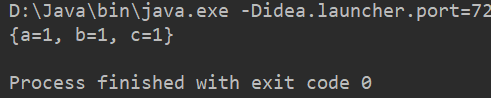

    - getProperties(String Key) 获取value

      示例如下：

      ```java
      package top.sharehome.BigJava;
      
      import java.util.Properties;
      
      public class Demo {
          public static void main(String[] args) {
              Properties p = new Properties();
              p.setProperty("a", "1");
              p.setProperty("b", "2");
              p.setProperty("c", "3");
              System.out.println(p.getProperty("a"));
              System.out.println(p.getProperty("b"));
              System.out.println(p.getProperty("c"));
          }
      }
      ```

      打印效果如下：

      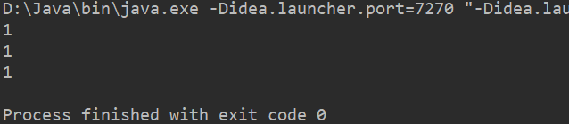

    - stringPropertyNames() 返回一个 Set 集合，等同于 Map 里的 keySet()

      示例如下：

      ```java
      package top.sharehome.BigJava;
      
      import java.util.Iterator;
      import java.util.Properties;
      import java.util.Set;
      
      public class Demo {
          public static void main(String[] args) {
              Properties p = new Properties();
              p.setProperty("a", "1");
              p.setProperty("b", "2");
              p.setProperty("c", "3");
              Set<String> s = p.stringPropertyNames();
              Iterator<String> it = s.iterator();
              while (it.hasNext()){
                  System.out.println(it.next());
              }
          }
      }
      ```

      打印效果如下：

      

  - 此集合可以和 IO 流对象结合使用，实现数据的持久存储

  - 和 IO 流相关的方法：`load()` 输入流；

- 遍历 Properties 集合

  示例如下：

  ```java
  package top.sharehome.BigJava;
  
  import java.util.Iterator;
  import java.util.Properties;
  import java.util.Set;
  
  public class Demo {
      public static void main(String[] args) {
          Properties p = new Properties();
          p.setProperty("a", "1");
          p.setProperty("b", "2");
          p.setProperty("c", "3");
          Set<String> s = p.stringPropertyNames();
          Iterator<String> it = s.iterator();
          while (it.hasNext()){
              String key =  it.next();
              String value = p.getProperty(key);
              System.out.println("key = "+key+" ==> value ="+value);
          }
      }
  }
  ```

  打印效果如下：

  

## 超级for循环

这是JDK1.5出现的特性：循环的特性；

Collection 是单列集合的顶级接口，但是到了 JDK1.5 版本之后，它成为了 Iterable 的子接口；

而只要实现 Iterable 接口，就可以成为超级 for 循环的目标；

所以 Collection List Set 以及数组都实现了这个接口，既能够超级 for 循环

**基本格式：**

```java
for(数据源中数据的数据类型 迭代变量 : 数据源){
	System.out.println(迭代变量);
}
```

**示例一：**

```jsva
package top.sharehome.Bag;

import java.util.ArrayList;
import java.util.List;

public class Demo {
	public static void main(String[] args) {
		List list = new ArrayList();
		list.add("A");
		list.add("B");
		list.add("B");
		list.add("C");
		list.add("D");
		list.add("E");
		list.add("F");
		for(Object obj:list) {
			System.out.println(obj);
		}
	}
}
```

打印效果如下：


**示例二：**

```java
package top.sharehome.Bag;

public class Demo {
	public static void main(String[] args) {
		int[] arr = {1,2,3,4,5,6};
		for(int a:arr) {
			System.out.println(a);
		}
	}
}
```

打印效果如下：


**示例三：**

```java
package top.sharehome.Bag;

public class Demo {
	public static void main(String[] args) {
		char[] ch = {'H','e','l','l','o',' ','W','o','r','l','d'};
		for(char c : ch) {
			System.out.print(c);
		}
	}
}
```

打印效果如下：


**示例四：**

```java
package top.sharehome.BigJava;

public class Demo {
    public static void main(String[] args) {
        int[] arr = new int[]{1, 2, 3, 4, 5, 6, 7, 8, 9};
        for (int i : arr) {
            for (int j : arr) {
                if (j > i) {
                    break;
                }
                System.out.print(j + "*" + i + "=" + i * j + "  ");
            }
            System.out.println();
        }
    }
}
```

打印效果如下：


### 优缺点

- 优点：能够让我们快速看到一个数据源中具体的元素；
- 缺点：无法对数据源中的数据进行操作；

## 泛型

### 出现之前

JDK1.4 之前没有泛型，当时的集合想装什么就可以装什么；

### 安全机制

软件升级：安全性提高，修复 bug 错误，改善用户体验，增加功能，提升性能；

而 JDK1.5 是Java中的里程碑版本，就是因为加入了泛型的安全机制；

**泛型的作用：**强制了集合存储固定的数据类型，安全性提高了，长远来看程序的代码量会减少，避免了类型的强制转换，程序的问题有运行时问题提前到编译时问题；

### 初识泛型

**集合的特点**之一：数据类型是任意的，这个特点既是优点，但也是缺点，因为在实际开发中我们是不会希望集合中的数据类型七七八八，所以我们可以**用泛型来约束集合中的数据类型**；

在创建集合时指明集合中存放的数据类型，用 `<>` 包裹起来，此时在集合中，我们就只能引用我们所规定的数据类型，而不能存放其他的数据类型：

```java
package top.sharehome.Bag;

import java.util.ArrayList;
import java.util.Collection;

public class Demo {
	public static void main(String[] args) {
		Collection<String> c = new ArrayList<String>();
		c.add("a");
		c.add("B");
		c.add("c");
		c.add(92);
	}
}
```

报错如下：


### 使用须知

泛型需要在指明有泛型的类当中使用，例如 Collection 中：


这个 **`<E>`** 可以理解成一个**数据类型（可以是基本数据类型，可以是一个对象）**的占位符，当我们改变这个 **E** 时，该类的方法提示中的数据类型也会跟着改变，但是一定要注意设置数据类型时，**基本数据类型必须用包装类**，如果我们不设置这个占位符，即删除掉 **`<E>`** ，该类会默认填入的数据类型为 Object；

未设置的情况示例：


设置后的情况示例：


### 注意事项

- 在 Java 1.7 之后可以省略创建对象时声明部分的泛型书写，但要保留创建部分的泛型书写；

  但是这里最好是写上！

  ```java
  Collection<Integer> c = new ArrayList<>();
  ```

- 一个类中可以创建多个泛型，在使用时也要一并使用，也就是说要么都不指明泛型类型，要么都必须全部指明泛型类型，如果有==一些不明确（表示至少有一种明确的类型）==的类型，可以使用 `<已知的一种类型 , Object>` 来指明；

  Student 类：

  ```java
  package top.sharehome.Bag;
  //假设A，B两种类不明确
  public class Student<A, B> {
  	private String name;
  	private int age;
  	private A a;
  	private B b;
  
  	public A getA() {
  		return a;
  	}
  
  	public void setA(A a) {
  		this.a = a;
  	}
  
  	public B getB() {
  		return b;
  	}
  
  	public void setB(B b) {
  		this.b = b;
  	}
  
  	public String getName() {
  		return name;
  	}
  
  	public void setName(String name) {
  		this.name = name;
  	}
  
  	public int getAge() {
  		return age;
  	}
  
  	public void setAge(int age) {
  		this.age = age;
  	}
  }
  ```

  Teacher 类：

  ```java
  package top.sharehome.Bag;
  
  public class Teacher<String, Integer, Character> {
  	private String name;
  	private int age;
  	private char sex;
  
  	public String getName() {
  		return name;
  	}
  
  	public void setName(String name) {
  		this.name = name;
  	}
  
  	public int getAge() {
  		return age;
  	}
  
  	public void setAge(int age) {
  		this.age = age;
  	}
  
  	public char getSex() {
  		return sex;
  	}
  
  	public void setSex(char sex) {
  		this.sex = sex;
  	}
  }
  ```

  Demo 类：

  ```java
  package top.sharehome.Bag;
  
  public class Demo {
  	public static void main(String[] args) {
  		Student stu1 = new Student();
  		Student<String, Object> stu2 = new Student<String, Object>();
  		Teacher T1 = new Teacher();
  		Teacher<String, Integer, Character> T2 = new Teacher<String, Integer, Character>
  	}
  }
  ```

- 继承或实现有泛型类型的抽象类或接口；

  情况一：在设计子类或者实现类时，直接指明父类的泛型，那么此时父类的泛型就被明确；

  Father 类：

  ```
  package top.sharehome.Bag;
  
  public class Father<String> {
  	
  }
  ```

  Son 类：

  ```java
  package top.sharehome.Bag;
  
  public class Son extends Father<String>{
  
  }
  ```

  情况二：在设计子类或实现类时，可以为子类设计一个泛型，用于指明父类的泛型；

  son 类：

  ```java
  package top.sharehome.Bag;
  
  public class Son<T> extends Father<T>{
  	//此时这个T表示的是一个占位符
  }
  ```

  Demo 类：

  ```java
  package top.sharehome.Bag;
  
  public class Demo {
  	public static void main(String[] args) {
  		Son<Boolean> s = new Son<Boolean>();
          //此时父类Father中的T就是Boolean
  	}
  }
  ```

  ==注意：此时子类中的 T 既指明了父类的泛型，也可以在子类中使用这个 T ；==

- 在 Map 集合中使用泛型；

  现在就可以很轻松地（不用向下转型）遍历 Map 集合；

  示例如下：

  ```java
  package top.sharehome.Bag;
  
  import java.util.HashMap;
  import java.util.Iterator;
  import java.util.Map;
  import java.util.Map.Entry;
  import java.util.Set;
  
  public class Demo {
  	public static void main(String[] args) {
  		Map<Integer,String> map = new HashMap<>();
  		map.put(1, "A");
  		map.put(2, "B");
  		map.put(3, "C");
  		Set<Entry<Integer,String>> entrySet = map.entrySet();
          //使用泛型后，Set集合中存放的元素数据类型就是 Entry 类型
  		System.out.println(entrySet);
  		Iterator<Entry<Integer, String>> iterator = entrySet.iterator();
  		while(iterator.hasNext()) {
              //这里也可以直接得到Entry，不用向下转型，可以直接输出
  			Entry<Integer,String> next = iterator.next();
  			Integer key = entry.getKey();
  			String value = entry.getValue();
  			System.out.println("entry = " + "\"" + entry + "\"" + " key = " + key + " value = " + value);
  		}
  	}
  }
  ```

  打印效果如下：

  

- 自定义泛型类，提高类的可变性；

  ```java
  package top.sharehome.BigJava;
  
  public class Demo {
      public static void main(String[] args) {
          Student<String> stu = new Student<>();
          stu.setQ("1911261716");
          Student<Integer> stu1 = new Student<>();
          stu1.setQ(1911261716);
          System.out.println(stu.getQ());
          System.out.println(stu1.getQ());
      }
  }
  
  class Student<QQ>{
      private QQ q;
      public void setQ(QQ q){
          this.q = q;
      }
      public QQ getQ(){
          return q;
      }
  }
  ```

  打印效果如下：

  

- 通配符 ？的用法：

  ```java
  package top.sharehome.BigJava;
  
  import java.util.ArrayList;
  import java.util.Iterator;
  import java.util.List;
  
  public class Demo {
      public static void main(String[] args) {
          List<String> l = new ArrayList<>();
          List<Integer> i = new ArrayList<>();
          l.add("haha");
          l.add("xixi");
          l.add("lala");
          i.add(1);
          i.add(2);
          i.add(3);
          each(l);
          each(i);
      }
      public static void each(List<?> t){
          Iterator it = t.iterator();
          while (it.hasNext()){
              System.out.println(it.next());
          }
      }
  }
  ```

  打印效果如下：

  

- 泛型的限定：

  <? extends Company> 传递类型可以是Company 或者是他的子类；

  泛型限定限定的是数据类型；

  ```java
  package top.sharehome.BigJava;
  
  import java.util.ArrayList;
  import java.util.Iterator;
  import java.util.List;
  
  public class Demo {
      public static void main(String[] args) {
          List<Student> studentList = new ArrayList<Student>();
          Student stu1 = new Student();
          stu1.setName("张三");
          stu1.setAge(21);
          Student stu2 = new Student();
          stu2.setName("李四");
          stu2.setTeamNum(3);
          studentList.add(stu1);
          studentList.add(stu2);
          List<Teacher> teacherList = new ArrayList<Teacher>();
          Teacher t1 = new Teacher();
          t1.setName("王五");
          t1.setAge(39);
          Teacher t2 = new Teacher();
          t2.setName("王六");
          t2.setWorkNum(98);
          teacherList.add(t1);
          teacherList.add(t2);
          work(teacherList);
          work(studentList);
      }
  
      /**
       * 此时就明确了该方法参数对象，不会有其他的数据类型或者结构能够传入该方法
       * @param l
       */
      public static void work(List<? extends Class> l){
          //这里就是泛型的限定
          Iterator<? extends Class> it = l.iterator();
          while (it.hasNext()){
              Class obj = it.next();
              System.out.println(obj);
          }
      }
  }
  
  class Class {
      private String name;
      private int age;
  
      public Class(String name, int age) {
          this.name = name;
          this.age = age;
      }
  
      public Class() {
      }
  
      public String getName() {
          return name;
      }
  
      public void setName(String name) {
          this.name = name;
      }
  
      public int getAge() {
          return age;
      }
  
      public void setAge(int age) {
          this.age = age;
      }
  
      @Override
      public String toString() {
          return "Class{" +
                  "name='" + name + '\'' +
                  ", age=" + age +
                  '}';
      }
  }
  
  class Student extends Class {
      public Student() {
      }
  
      private int teamNum;
  
      public Student(String name, int age, int teamNum) {
          super(name, age);
          this.teamNum = teamNum;
      }
  
      public Student(int teamNum) {
          this.teamNum = teamNum;
      }
  
      public int getTeamNum() {
          return teamNum;
      }
  
      public void setTeamNum(int teamNum) {
          this.teamNum = teamNum;
      }
  
      @Override
      public String toString() {
          return "Student{" +
                  "teamNum=" + teamNum +
                  "} " + super.toString();
      }
  }
  
  class Teacher extends Class {
      public Teacher() {
      }
  
      private int workNum;
  
      public Teacher(String name, int age, int workNum) {
          super(name, age);
          this.workNum = workNum;
      }
  
      public Teacher(int workNum) {
          this.workNum = workNum;
      }
  
      public int getWorkNum() {
          return workNum;
      }
  
      public void setWorkNum(int workNum) {
          this.workNum = workNum;
      }
  
      @Override
      public String toString() {
          return "Teacher{" +
                  "workNum=" + workNum +
                  "} " + super.toString();
      }
  }
  ```

  打印效果如下：

  

  注意：泛型上下限的限定；

  - <? extends E> 传递 E 类型或者是 E 的子类，这是泛型的上限限定；
  - <? super E> 传递 E 类型或者是 E 的父类，这是泛型的下限限定；

# 41.阶段性练习

**练习一：**

- 创建一个动物类，定义种类，性别和属性；
- 从键盘录入数据，通过构造方法存入对象中，并调用对象的方法打印；

```java
import java.util.Scanner;

public class Demo {
	public static void main(String[] args) {
		Scanner sc =  new Scanner(System.in);
		System.out.println("请输入物种名字：");
		String species = sc.next();
		System.out.println("请输入物种性别：");
		char sex = sc.next().charAt(0);
		Animal a = new Animal(species, sex);
		a.printObject();
	}
}

class Animal{
	String species;
	char sex;
	public Animal(String species,char sex) {
		this.species = species;
		this.sex = sex;
	}
	public void printObject() {
		System.out.println("物种："+species+" 性别："+sex);
	}
}
```

打印效果如下：


**练习二：**

- 描述猫类，有属性 name、color、sex，通过构造方法给猫的属性赋值（一个是波斯猫，一个是土猫，其他属性自定）；
- 为猫类添加吃饭，抓老鼠方法，创建两只猫的对象；
- 分别调用猫的吃饭，抓老鼠方法；

```java
public class Demo {
	public static void main(String[] args) {
		Cat bosi = new Cat("波斯猫", "红色", '雄');
		Cat tumao = new Cat("土猫", "绿色", '雌');
		bosi.eat(bosi.name);
		tumao.catchMouse(tumao.name);
	}
}

class Cat {
	String name;
	String color;
	char sex;

	public Cat() {
		super();
		// TODO Auto-generated constructor stub
	}

	public Cat(String name, String color, char sex) {
		super();
		this.name = name;
		this.color = color;
		this.sex = sex;
	}

	public void eat(String name) {
		System.out.println(name+"吃饭！");
	}

	public void catchMouse(String name) {
		System.out.println(name+"抓老鼠！");
	}
}
```

打印效果如下：


**练习三：**

- 创建一个工具类，定义方法用来将基本数据类型转换成字符串；

```java
public class Demo {
	public static void main(String[] args) {
		Tools t = new Tools();
		byte b = 123;
		String s1 = t.getStringFromByte(b);
		short s = 1234;
		String s2 = t.getStringFromShort(s);
		char c = '1';
		String s3 = t.getStringFromBChar(c);
		int i = 12345;
		String s4 = t.getStringFromInt(i);
		float f = 12345.6f;
		String s5 = t.getStringFromFloat(f);
		double d = 1234567.8;
		String s6 = t.getStringFromDouble(d);
		long l = 12345678;
		String s7 = t.getStringFromLong(l);
		boolean bool = false;
		String s8 = t.getStringFromBoolean(bool);
		System.out.printf("%s %s %s %s %s %s %s %s",s1,s2,s3,s4,s5,s6,s7,s8);
	}
}

class Tools {
	public String getStringFromByte(byte num) {
		return num+"";
	}
	public String getStringFromShort(short num) {
		return num+"";
	}
	public String getStringFromBChar(char num) {
		return num+"";
	}
	public String getStringFromInt(int num) {
		return num+"";
	}
	public String getStringFromFloat(float num) {
		return num+"";
	}
	public String getStringFromDouble(double num) {
		return num+"";
	}
	public String getStringFromLong(long num) {
		return num+"";
	}
	public String getStringFromBoolean(boolean num) {
		return num+"";
	}
}
```

打印效果如下：


**练习四：**

- 一档选秀节目，设计了一个平台共参与者展示才艺，不同的参与者有不同的才艺，使用多态编程模拟；

```java
public class Demo {
	public static void main(String[] args) {
		People coder = new Coder("程序员",21);
		People singer = new Singer("歌手",22);
		People dancer = new Dancer("舞者",21);
		System.out.println("请各位选手自我介绍一下：");
		System.out.println("我叫"+coder.name+",今年"+coder.age+"岁;");
		coder.haveRest();
		Coder c = (Coder)coder;
		c.playComputer();
		System.out.println("我叫"+singer.name+",今年"+singer.age+"岁;");
		singer.haveRest();
		Singer s = (Singer)singer;
		s.sing();
		System.out.println("我叫"+dancer.name+",今年"+dancer.age+"岁;");
		dancer.haveRest();
		Dancer d = (Dancer)dancer;
		d.dance();
	}
}

class People{
	String name;
	int age;
	
	public People(String name, int age) {
		super();
		this.name = name;
		this.age = age;
	}

	public People() {
		super();
		// TODO Auto-generated constructor stub
	}

	public void haveRest() {
		System.out.println("我会休息！");
	}
}

class Coder extends People{
	public Coder(String name, int age) {
		super(name, age);
		// TODO Auto-generated constructor stub
	}

	public void playComputer() {
		System.out.println("我会玩电脑！");
	}
}

class Singer extends People{
	public Singer(String name, int age) {
		super(name, age);
		// TODO Auto-generated constructor stub
	}

	public void sing() {
		System.out.println("我会唱歌！");
	}
}

class Dancer extends People {
	public Dancer(String name, int age) {
		super(name, age);
		// TODO Auto-generated constructor stub
	}

	public void dance() {
		System.out.println("我会跳舞！");
	}
}
```

打印效果如下：


**练习五：**

- 学生都有学习和做作业的能力，但是学习的方式不同，使用抽象类的方法模拟编程；

```java
public class Demo {
	public static void main(String[] args) {
		Student good = new Good();
		Student poor = new Poor();
		good.name = "xiaochen";
		good.age = 20;
		System.out.println("我是"+good.name+" 年龄"+good.age);
		good.studyMethod();
		poor.name = "xiaowu";
		poor.age = 20;
		System.out.println("我是"+poor.name+" 年龄"+poor.age);
		poor.studyMethod();
	}
}

abstract class Student{
	String name;
	int age;
	abstract void studyMethod();
}

class Good extends Student{

	@Override
	void studyMethod() {
		// TODO Auto-generated method stub
		System.out.println("卷！");
	}
	
}

class Poor extends Student{

	@Override
	void studyMethod() {
		// TODO Auto-generated method stub
		System.out.println("摆！");
	}
	
}
```

打印效果如下：


**练习六：**

- 创建一个乐器接口，定义演奏方法 play ，定义两个实现类（钢琴 Piano，小提琴 Violin），分别实现乐器接口并做出不同的演奏；

```java
public class Demo {
	public static void main(String[] args) {
		Tools piano = new Piano();
		Tools violin = new Violin();
		piano.play();
		violin.play();
	}
}

interface Tools {
	void play();
}

class Piano implements Tools {
	@Override
	public void play() {
		// TODO Auto-generated method stub
		System.out.println("演奏钢琴曲！");
	}
}

class Violin implements Tools{
	@Override
	public void play() {
		// TODO Auto-generated method stub
		System.out.println("演奏小提琴曲！");
	}
}
```

打印效果如下：


**练习七：**

- 国家规定，汽车必须能点火，能开动，国家将文件发送到汽车厂商的手里，厂商生产的汽车必须符合要求，可以有特性功能，编程模拟；

```java
public class Demo {
	public static void main(String[] args) {
		CarShop1 c1 = new CarShop1(1,0);
		CarShop2 c2 = new CarShop2(1,1);
		c1.getLisence(c1.getName());
		c2.getLisence(c2.getName());
	}
}

class CarShop {
	int canLaunch;
	int canMove;

	public CarShop() {
		super();
		// TODO Auto-generated constructor stub
	}

	public CarShop(int canLaunch, int canMove) {
		super();
		this.canLaunch = canLaunch;
		this.canMove = canMove;
	}

	public void getLisence(String name) {
		if (this.canLaunch != 0 && this.canMove != 0) {
			System.out.println(name+"能够得到国家许可");
		} else {
			System.out.println(name+"不能得到国家许可");
		}
	}
}

class CarShop1 extends CarShop {
	private String name = "CarShop1";
	public String getName() {
		return this.name;
	}
	public void Character() {
		System.out.println("时速300km/h");
	}

	public CarShop1() {
		super();
		// TODO Auto-generated constructor stub
	}

	public CarShop1(int canLaunch, int canMove) {
		super(canLaunch, canMove);
		// TODO Auto-generated constructor stub
	}

}

class CarShop2 extends CarShop {
	private String name = "CarShop2";
	public String getName() {
		return this.name;
	}
	public void Character() {
		System.out.println("时速320km/h");
	}

	public CarShop2() {
		super();
		// TODO Auto-generated constructor stub
	}

	public CarShop2(int canLaunch, int canMove) {
		super(canLaunch, canMove);
		// TODO Auto-generated constructor stub
	}
}
```

打印效果如下：


**练习八：**

- 定义一个动物类，自定义属性；
- 定义吃饭和睡觉两个方法；
- 创建两个对象（小猫和小狗），分别调用吃饭和睡觉方法；
- 打印结果是：小猫吃小鱼干，甜甜地睡着了，小狗吃骨头，憨憨地睡着了；

```java
class Demo {
	public static void main(String[] args) {
		Animal Cat = new Animal("小猫",2);
		Animal Dog = new Animal("小狗",1);
		System.out.println(Cat.name+Cat.eat("小鱼干")+","+Cat.sleep("甜甜")
		+","+Dog.name+Dog.eat("骨头")+","+Dog.sleep("憨憨"));
	}
}

class Animal {
	String name;
	int age;

	public Animal() {
		super();
		// TODO Auto-generated constructor stub
	}

	public Animal(String name, int age) {
		super();
		this.name = name;
		this.age = age;
	}

	public String sleep(String description) {
		return description + "地睡着了";
	}

	public String eat(String thing) {
		return "吃" + thing;
	}
}
```

打印效果如下：


**练习九：**

- 统计一个字符串中大写字母字符，小写字母字符，数字字符出现的次数，其他字符出现的次数；
- ABCDEabcd123456!@#\$\%\^

方法一：

```java
import java.util.Scanner;

class Demo {
	public static void main(String[] args) {
		Scanner sc = new Scanner(System.in);
		System.out.println("请输入要计数的字符串：");
		String str = sc.next();
		sc.close();
		char ch[] = str.toCharArray();
		int matchNum = 0;
		int matchBig = 0;
		int matchSmall = 0;
		int matchOther = 0;
		for (int i = 0;i<ch.length;i++) {
			if(ch[i]>='a'&&ch[i]<='z') {
				matchSmall++;
			}
			else if(ch[i]>='A'&&ch[i]<='Z') {
				matchBig++;
			}
			else if(ch[i]>='1'&&ch[i]<='9') {
				matchNum++;
			}
			else {
				matchOther++;
			}
		}
		System.out.println("数字："+matchNum);
		System.out.println("大写字母："+matchBig);
		System.out.println("小写字母："+matchSmall);
		System.out.println("其他字符："+matchOther);
	}
}
```

方法二：

```java
import java.util.Scanner;

class Demo {
	public static void main(String[] args) {
		Scanner sc = new Scanner(System.in);
		System.out.println("请输入需要计数的字符串：");
		String str = sc.next();
		sc.close();
		char ch[] = str.toCharArray();
		int matchNum = 0;
		int matchBig = 0;
		int matchSmall = 0;
		int matchOther = 0;
		for (int i = 0;i<ch.length;i++) {
			String s = Character.toString(ch[i]);
			if(s.matches("[1-9]")) {
				matchNum++;
			}else if(s.matches("[a-z]")) {
				matchSmall++;
			}else if(s.matches("[A-Z]")) {
				matchBig++;
			}else {
				matchOther++;
			}
		}
		System.out.println("数字："+matchNum);
		System.out.println("大写字母："+matchBig);
		System.out.println("小写字母："+matchSmall);
		System.out.println("其他字符："+matchOther);
	}
}
```

打印效果如下：


**练习十：**

- 把数组中的数据按照指定格式拼接成一个字符串

  - 举例

    int[] arr = {1,2,3};

  - 输出结果 “[1,2,3]”

```java
import java.util.Scanner;

class Demo {
	public static void main(String[] args) {
		Scanner sc= new Scanner(System.in);
		System.out.println("你要输入的数据长度：");
		int n = sc.nextInt();
		int[] arr = new int[n];
		System.out.println("请输入你要格式化的数字：");
		for (int i = 0; i < arr.length; i++) {
			arr[i] = sc.nextInt();
		}
		sc.close();
		System.out.println("格式化后输出为：");
		System.out.print("[");
		for (int i = 0; i < arr.length-1; i++) {
			System.out.print(arr[i]+",");
		}
		System.out.print(arr[n-1]+"]");
	}
}
```

打印效果如下：


**练习十一：**

- 把字符串反转
  - "abc" ==> "cba"

```java
import java.util.Scanner;

class Demo {
	public static void main(String[] args) {
		Scanner sc = new Scanner(System.in);
		System.out.println("请输入要反转的字符串：");
		String str = sc.next();
		sc.close();
		char[] ch = str.toCharArray();
		int n = ch.length / 2;
		for (int i = 0; i < ch.length; i++) {
			if(i>=n) {
				break;
			}
			char temp = ch[i];
			ch[i] = ch[ch.length-1-i];
			ch[ch.length-1-i] = temp;
		}
		System.out.println("反转后得：");
		System.out.println(ch);
	}
}
```

打印效果如下：


**练习十二：**

- 统计大串中小串出现的次数
  - 大串：Adcddkiqooqkdddleef
  - 小串：dd
  
  方法一：

```java
class Demo {
	public static void main(String[] args) {
		String str = "Adcddkiqooqkdddleef";
		String mstr = "dd";
		char[] cs = str.toCharArray();
		char[] mcs = mstr.toCharArray();
		int count = 0;
		int b1 = 0;
		
		int condition = mcs.length;
		int b2 = 0;
		for (int i = 0; i < cs.length; i++) {
			if (i + mcs.length > cs.length - 1) {
				break;
			}
			b1 = 0;
			for (int j = 0; j < mcs.length; j++) {
				if (cs[i + j] == mcs[j]) {
					b1++;
				}
			}
			if (b1 == mcs.length) {
				count++;
			}
		}
		while(condition>0) {
			if(cs[cs.length-1]==mcs[condition-1]) {
				b2++;
			}
			if(b2==mcs.length) {
				count++;
			}
			condition--;
		}
		System.out.println("检测重复到" + count + "次");
	}
}
```

打印效果如下：


​		方法二：

```java
package top.sharehome.BigJava;

import java.util.Scanner;

public class Demo {
    public static void main(String[] args) {
        Scanner sc = new Scanner(System.in);
        String str = sc.next();
        String str0 = sc.next();
        int count = 0;
        int index = 0;
        while ((index = str.indexOf(str0)) != -1) {
            count++;
            str = str.substring(index+1,str.length());
        }
        System.out.println(count);
    }
}
```

打印效果如下：


**练习十三：**

- 除去一个字符串中相邻重复的字符
  - abbddAffeeEddcccwceaa ==> abdAfeEdcwcea

```java
import java.util.Scanner;

class Demo {
	public static void main(String[] args) {
		Scanner sc = new Scanner(System.in);
		System.out.println("请输入需要去重的字符串：");
		String str = sc.next();
		sc.close();
		StringBuffer sb = new StringBuffer();
		char[] charArray = str.toCharArray();
		for (int i = 0; i < charArray.length; i++) {
			if (i + 1 != charArray.length) {
				if (charArray[i] != charArray[i + 1]) {
					sb.append(charArray[i]);
				}
			}else {
				sb.append(charArray[i]);
			}
		}
		System.out.println("去除重复后：");
		System.out.println(sb);
	}
}
```

打印效果如下：


# 42.多线程

## 进程

任何的软件都会存储在磁盘当中，运行软件的时候，操作系统使用 IO 技术将磁盘中的软件的文件加载到内存中，此时该软件才能运行；

**进程概念：**

应用程序运行的时候进入内存，程序在内存中占用内存的空间就叫做进程；


## 线程（Thread）

### 相关概念

**线程概念：**在内存和CPU之间建立一条连接的通路，通过这条通路，CPU可以在内存中取出数据进行计算，这个连接的通路就是线程，一个独立的进程当中可以开启多个线程，因此CPU实际运行的并不是进程，而是线程；


**并发概念：**同一个时刻多个线程同时操作了同一个数据；

**并行概念（了解）：**同一个时刻多个线程同时执行不同的程序；

## Java实现线程程序

在这之前的所有程序都有一个共性：main启动之后，一条线走到了底，这个被称为单线程；

==下面的 Runnable 类相比于 Thread 接口来说更加常用，只不过在学习前期需要了解 Java 中线程类的实现，循序渐进；==

### Thread类

一切都是对象，那么线程也是对象，Thread类是线程对象的描述类；

实现线程程序的步骤：

- 定义类继承 Thread 
- 子类重写 `run()` 方法
- 创建子类对象，该对象就是线程对象
- 调用线程对象的方法 `start()` 启动线程：`start()` 执行本地方法，本地方法和操作系统交互，`start()` 会申请一块新的方法栈空间，此时重写后的 `run()` 方法会被转入该栈空间，该空间和 `main()` 方法所在空间互不打扰，进而实现同时运行的效果；

```java
package top.sharehome.Test;

public class Demo {
    public static void main(String[] args) {
        Person p = new Person();
        p.start();
        for (int i = 0; i < 3; i++) {
            System.out.println("main"+(i+1));
        }
    }
}

class Person extends Thread{

    @Override
    public void run() {
        for (int i = 0; i < 3; i++) {
            System.out.println("run"+(i+1));
        }
    }
}
```

打印效果如下：


==由上方示例可以看出，程序运行，就能触发 main 函数和 Person 类中的 run() 方法同时跑起来；==

线程的内存图


### Thread类方法

- Thread类的方法 getName() 返回线程的名字，返回值是 String；

  自然该类中也会有 setName() 方法，即修改线程的名字，但是不常用，没必要改名字；

  示例如下：

  ```java
  package top.sharehome.Test;
  
  public class Demo {
      public static void main(String[] args) {
          ThreadName tn1 = new ThreadName();
          ThreadName tn2 = new ThreadName();
          tn2.setName("xiaochen");
          tn1.start();
          tn2.start();
      }
  }
  
  class ThreadName extends Thread{
      @Override
      public void run() {
          System.out.println("该线程名字:"+super.getName());
      }
  }
  ```

  打印效果如下：

  

  ==若有 n 个新建线程，那么新建线程名默认是从 Thread-0 开始到 Thread-n；==

  **==注意：main 方法也会进栈，所以 main 也是一条线程，他的名字就叫 main 线程，以前运行的程序或者代码都是在 main 线程上面运行的；==**

- Thread 类的静态方法：`currentThread()` 返回一个当前程序运行所在的 Thread 对象；

  ==这是一个获取线程名字的通用方法；==

  示例如下：我们可以由此得知 main 线程的名字；

  ```java
  package top.sharehome.Test;
  
  public class Demo {
      public static void main(String[] args) {
          Thread t = Thread.currentThread();
          System.out.println(t.getName());
      }
  }
  ```

  打印效果如下：

  

- Thread 类的方法 `join()`  等待该线程终止；

  解释：执行 join() 方法的线程，该线程不结束，其他的线程无法运行；

  示例如下：

  ```java
  package top.sharehome.Test;
  
  public class Demo {
      public static void main(String[] args) throws InterruptedException {
          JOIN t0 = new JOIN();
          JOIN t1 = new JOIN();
          t0.start();
          t0.join();
          t1.start();
      }
  }
  
  class JOIN extends Thread{
      @Override
      public void run() {
          for (int i = 0; i < 5; i++) {
              System.out.println(Thread.currentThread().getName()+"i."+i);
          }
      }
  }
  ```

  打印效果如下：

  

- Thread 类的方法 static yield() 暂停当前线程，但是该方法也是一个理论方法，实际情况还是得看CPU自我的选择；

- Thread 类的方法 static sleep(long millis) 暂停该线程 millis 毫秒；

### 线程优先级(了解)

线程优先级只是一个理论说法，实际运行情况还是需要看CPU自我的选择情况；

默认的线程优先级是 5 ，我们可以通过 `线程对象.getPriority()` 方法去获得，也可以通过 `线程对象.setPriority()` 方法去修改，修改值尽量不要自定义数字，需要使用 Thread 类中的静态常量：`MIN_PRIORITY`、`MAX_PRIORITY`、`NORM_PRIORITY` 去修改，它们分别代表 1、10、5；

示例如下：

```java
package top.sharehome.Test;

public class Demo {
    public static void main(String[] args) {
        ThreadName t0 = new ThreadName();
        ThreadName t1 = new ThreadName();
        t0.setPriority(Thread.MAX_PRIORITY);
        t1.setPriority(Thread.MIN_PRIORITY);
        System.out.println("t0.getPriority() = " + t0.getPriority());
        System.out.println("t0.getPriority() = " + t1.getPriority());
        t0.start();
        t1.start();
    }
}

class ThreadName extends Thread{
    @Override
    public void run() {
        for (int i = 0; i < 50; i++) {
            System.out.println(Thread.currentThread().getName()+"i."+i);
        }
    }
}
```

打印效果如下：


### Runnable接口

**实现线程程序的步骤：**

- 定义类实现这个接口
- 重写接口的抽象方法 `run()` 
- 创建 Thread 类对象
  - Thread 类构造方法中需要传递 Runnable 接口的实现类对象
- 调用 Thread 对象方法 `start()` 启动线程；

示例如下：

```java
package top.sharehome.Test;

public class Demo {
    public static void main(String[] args) throws InterruptedException {
        Runnable r = new RunnableC();
        Thread t = new Thread(r);
        t.start();
        for (int i = 0; i < 5; i++) {
            System.out.println(Thread.currentThread().getName()+"i."+i);
        }
    }
}

class RunnableC implements Runnable{
    @Override
    public void run() {
        for (int i = 0; i < 5; i++) {
            System.out.println(Thread.currentThread().getName()+"i."+i);
        }
    }
}
```

打印效果如下：


**实现接口的好处：**

接口实现的好处是设计上的分离效果：线程要执行的任务和线程对象本身是分离的；

继承 Thread 类：需要重写 run() 方法，但是 Thread 是线程对象，run() 是线程要执行的任务，这样的话会增强程序的耦合性，而我们需要做到的是高内聚低耦合；

实现 Runnable 接口：方法 run() 在实现类中，和线程无关，创建 Thread 类传递接口的实现类对象，线程的任务和 Thread 没有联系，做到了低耦合；

## 线程安全问题

出现线程安全的问题需要有一个前提：线程执行只负责调用方法 run() ，多个线程同时操作同一个资源堆内存，比如一个程序中的全局变量，它是一个安全隐患性的问题，就像我们的运行时异常一样，可能会出错，也可能不会；

### 典例：售票问题

火车票的票源是固定的，但是购买渠道非常多，比如在火车站买，火车站有多个窗口，而多个窗口都在卖同一个固定源的票；

```java
package top.sharehome.Test;

public class Demo {
    public static void main(String[] args) {
        Runnable r = new Ticket();
        Thread t0 = new Thread(r);
        Thread t1 = new Thread(r);
        Thread t2 = new Thread(r);
        t0.start();
        t1.start();
        t2.start();
    }
}


class Ticket implements Runnable {
    //定义票源
    private int num = 10;

    @Override
    public void run() {
        while (true) {
            if (num > 0) {
                System.out.println("出售第" + num + "张");
                num--;
            } else {
                break;
            }
        }
    }
}
```

打印效果如下：


==可以看出第十张票一共卖了三次，不符合实际情况，为什么会买三次呢？问题在于 num-- 这一代码，三个线程同时进行，也许会出现第一个线程读取值了，还没来得及自减，就又被另一个线程读取，所以值没变；==

### 方案：同步代码块(synchronized)

当一个线程没有完成全部操作的时候，其他线程不能操作，我们就需要用同步代码块来实现：

格式---- **`synchronized`** 关键字

```java
synchronized(任意对象){  //任意对象应该是同一个事先都定义好的对象，不能是不同的对象
	//这里写线程操作的共享资源，这样可以保证线程安全问题
	//线程操作的共享资源需要在 run() 方法里面去找
}
```

**任意对象：**在同步中，这个对象称为对象锁，简称“锁”，但是官方的文档里，它被称作对象监视器；

**示例如下：**

```java
package top.sharehome.Test;

public class Demo {
    public static void main(String[] args) throws InterruptedException {
        Runnable r = new Ticket();
        Thread t0 = new Thread(r);
        Thread t1 = new Thread(r);
        Thread t2 = new Thread(r);
        t0.start();
        t1.start();
        t2.start();
    }
}


class Ticket implements Runnable {
    //定义票源
    private int num = 10;
    Object obj = new Object();  //定义好一个任意对象，即锁；
    @Override
    public void run() {
        while (true) {
            synchronized (obj) {
                try {
                    Thread.sleep(1);
                } catch (InterruptedException e) {
                    e.printStackTrace();
                }
                if (num > 0) {
                    System.out.println(Thread.currentThread().getName() + "出售第" + num + "张");
                    num--;
                }
            }
        }
    }
}
```

打印效果如下：


==由上图效果能看出已经解决了售票重复，数据错误等问题，但是也显然会发现是全都是 0 线程在工作，这里并不是出现了 bug ，是因为运行次数不够多，而且在运行时能明显感觉运行速度变慢，这是为了确保线程安全所做的必要措施；==

==显然这并不能使用 join 方法强制一条线程运行完毕，再调用其他线程，如果使用 join 那么原理和买票排队只排一条长队，只不过这个长队整体在选择窗口，况且这里使用了死循环，所得到的结果和单线程是一模一样的；==

#### 同步代码块保证线程安全的原理

关键点就是对象锁的拿取和放回！==以下只是一个简单描述，实际情况下的进程会更加复杂；==

- 进程开始前，同步代码块处是 `synchronized(obj){}` ，`obj` 对象锁存在于此；

- 进程执行到同步代码块时，所有线程也来到同步代码块处，进程判断锁是否存在，如果**锁存在**，CPU 就会随机选择线程进入到同步代码块中：

  - 同时线程就带着锁进入同步代码块中，此时同步代码块处是 `synchronized(){}` ，因为 `obj` 对象锁被线程带着一起进了同步代码块；
  - 执行完毕时，线程出去就会把锁给归还，此时同步代码块处是 `synchronized(obj){}` ;
  - 执行完后的线程和其他线程一样，再次来到同步代码块处，等待着 CPU 的随机选择；

- 进程执行到同步代码块时，所有线程也来到同步代码块处，进程判断所是否存在，如果**锁不存在**，那么 CPU 就不会选择任何一条线程进入到同步代码块中：

  - 那么线程只能在同步代码块处等待上一个线程结束，将锁归还；

- **注意：**CPU在选择时，较大概率会再次选择到归还锁的线程，但是也有概率选择到其他线程，但是依然是随机选择；

  

==保证线程安全的大方向就是保证数据安全而牺牲性能追求！！！==

### 同步方法：常见的一种表示方法

当一个方法当中，所有代码都是线程操作的共享内容，可以在方法的定义上添加同步的关键字 synchronized ，这被称作同步的方法，或者称为同步的函数；

- 同步方法当中有对象锁，该锁就是 this 对象；
- ==静态同步方法中也有锁对象，由于静态方法中没有 this 或者 super 的对象，锁对象就是**本类.class属性**，这个属性表示这个类的 class 文件的对象；==

非静态同步方法示例如下：

```java
package top.sharehome.Test;

public class Demo {
    public static void main(String[] args) throws InterruptedException {
        Runnable r = new Ticket();
        Thread t0 = new Thread(r);
        Thread t1 = new Thread(r);
        Thread t2 = new Thread(r);
        t0.start();
        t1.start();
        t2.start();
    }
}


class Ticket implements Runnable {
    //定义票源
    private int num = 100;

    @Override
    public void run() {
        while (true) {
            sale();
        }
    }

    private synchronized void sale() {
        if (num > 0) {
            try {
                Thread.sleep(1);
            } catch (InterruptedException e) {
                e.printStackTrace();
            }
            System.out.println(Thread.currentThread().getName() + "出售第" + num + "张");
            num--;
        }
    }
}
```

静态同步方法示例如下：

```java
package top.sharehome.Test;

public class Demo {
    public static void main(String[] args) throws InterruptedException {
        Runnable r = new Ticket();
        Thread t0 = new Thread(r);
        Thread t1 = new Thread(r);
        Thread t2 = new Thread(r);
        t0.start();
        t1.start();
        t2.start();
    }
}


class Ticket implements Runnable {
    //定义票源
    private static int num = 10;  //这里需要静态，以配合下面的静态方法

    @Override
    public void run() {
        while (true) {
            sale();
        }
    }

    private static synchronized void sale() {
        if (num > 0) {
            try {
                Thread.sleep(1);
            } catch (InterruptedException e) {
                e.printStackTrace();
            }
            System.out.println(Thread.currentThread().getName() + "出售第" + num + "张");
            num--;
        }
    }
}
```

打印效果如下：


## 死锁问题

**死锁程序：**多个线程同时争夺同一个锁资源，出现程序的假死现象；

==工作中不会让程序员制作一个死锁程序，所以一般死锁程序的学习用于应对面试；==

**面试点：**考察开发人员是否充分理解同步代码的执行原理——线程判断锁，获取锁，释放锁，如果不出代码块，锁不会被释放；

**完成死锁的案例：同步代码块的嵌套；**

```java
package top.sharehome.Test;

public class Demo {
    public static void main(String[] args) throws InterruptedException {
        Runnable lock = new Lock();
        new Thread(lock).start();
        new Thread(lock).start();
    }
}


class Lock implements Runnable {
    Object A = new Object();
    Object B = new Object();
    private boolean flag = true;

    @Override
    public void run() {
        while (true) {
            if (flag) {
                synchronized (A) {
                    System.out.println(Thread.currentThread().getName()+"线程获取A锁");
                    synchronized (B) {
                        System.out.println(Thread.currentThread().getName()+"线程获取B锁");
                    }
                }
                flag = false;
            }else{
                synchronized (B){
                    System.out.println(Thread.currentThread().getName()+"线程获取B锁");
                    synchronized (A){
                        System.out.println(Thread.currentThread().getName()+"线程获取A锁");
                    }
                }
                flag = true;
            }
        }
    }
}
```

打印效果如下：


## Lock 接口(锁接口)

这是一个 JDK1.5 的新特性，用于替代 `synchronized` ，可以更加灵活，但是至于性能， JDK1.6 之后对 `synchronized` 进行了优化，性能俩者相差无几；

- Lock接口的方法

  - void lock() 获取锁；

  - void unlock() 释放锁；

- Lock接口的实现类
  - ReentrantLock

**示例如下：**

```java
package top.sharehome.Test;

import java.util.concurrent.locks.Lock;
import java.util.concurrent.locks.ReentrantLock;

public class Demo {
    public static void main(String[] args) throws InterruptedException {
        Runnable r = new Ticket();
        Thread t0 = new Thread(r);
        Thread t1 = new Thread(r);
        Thread t2 = new Thread(r);
        t0.start();
        t1.start();
        t2.start();
    }
}


class Ticket implements Runnable {
    //定义票源
    private int num = 100;
    //获取Lock接口的实现类对象
    private Lock lock = new ReentrantLock();

    @Override
    public void run() {
        while (true) {
            sale();
        }
    }

    private void sale() {
        lock.lock();
        if (num > 0) {
            try {
                Thread.sleep(1);
            } catch (InterruptedException e) {
                e.printStackTrace();
            }
            System.out.println(Thread.currentThread().getName() + "出售第" + num + "张");
            num--;
        }
        lock.unlock();
    }
}
```

打印效果如下：


## 线程通信的方法

- wait() 方法（进程等待）和 notify() 方法（进程唤醒）
  - 方法的调用一定是在同步代码块中；
  - 调用者必须是锁的对象名，即 `锁.wait()` 或者 `锁.notify()` ；
  - wait() 和 notify() 定义在 Object 类中；
    - 原因：因为同步中的锁是任意对象，而任何类都继承 Object类；
- wait() 之后需要被唤醒或者设置好自动唤醒的时间；

## 生产者与消费者案例

生产者和消费者一边生产一边消费，即两条不同的线程共同操作同一个资源，该问题会面临线程安全问题，示例如下：

```java
package top.sharehome.Test;

public class Demo {
    public static void main(String[] args) {
        Resourse r = new Resourse();
        Produce produce = new Produce(r);
        Customer customer = new Customer(r);
        Thread t0 = new Thread(produce);
        Thread t1 = new Thread(customer);
        t0.start();
        t1.start();
    }
}

/**
 * 定义资源对象
 */
class Resourse {
    //该计数器用来记录生产的个数
    int count;
    //该标记用来提示生产者或者消费者工作
    //true：生产好了，等待消费
    //false：消费好了，等待生产
    boolean flag;
}

/**
 * 生产者线程
 */
class Produce implements Runnable {
    private Resourse r;

    public Produce(Resourse r) {
        this.r = r;
    }

    @Override
    public void run() {
        while (true) {
            try {
                Thread.sleep(1000);
            } catch (InterruptedException e) {
                e.printStackTrace();
            }
            synchronized (r) {
                if (r.flag == true) {
                    try {
                        r.wait();
                    } catch (InterruptedException e) {
                        e.printStackTrace();
                    }
                }
                r.count++;
                System.out.println("生成第" + r.count + "个");
                r.flag = true;
                r.notify();
            }
        }
    }
}

/**
 * 消费者线程
 */
class Customer implements Runnable {
    private Resourse r;

    public Customer(Resourse r) {
        this.r = r;
    }

    @Override
    public void run() {
        while (true) {
            try {
                Thread.sleep(1000);
            } catch (InterruptedException e) {
                e.printStackTrace();
            }
            synchronized (r) {
                if (r.flag == false) {
                    try {
                        r.wait();
                    } catch (InterruptedException e) {
                        e.printStackTrace();
                    }
                }
                System.out.println("消费第" + r.count + "个");
                r.flag =false;
                r.notify();
            }
        }
    }
}
```

打印效果如下：


### 多生产和多消费

示例代码如下：

```java
package top.sharehome.Test;

public class Demo {
    public static void main(String[] args) {
        Resourse r = new Resourse();
        Produce produce = new Produce(r);
        Customer customer = new Customer(r);
        new Thread(produce).start();
        new Thread(produce).start();
        new Thread(produce).start();
        new Thread(customer).start();
        new Thread(customer).start();
        new Thread(customer).start();
    }
}

/**
 * 定义资源对象
 */
class Resourse {
    //该计数器用来记录生产的个数
    int count;
    //该标记用来提示生产者或者消费者工作
    //true：生产好了，等待消费
    //false：消费好了，等待生产
    boolean flag;
}

/**
 * 生产者线程
 */
class Produce implements Runnable {
    private Resourse r;

    public Produce(Resourse r) {
        this.r = r;
    }

    @Override
    public void run() {
        while (true) {
            try {
                Thread.sleep(1000);
            } catch (InterruptedException e) {
                e.printStackTrace();
            }
            synchronized (r) {
                if (r.flag == true) {
                    try {
                        r.wait();
                    } catch (InterruptedException e) {
                        e.printStackTrace();
                    }
                }
                r.count++;
                System.out.println(Thread.currentThread().getName()+"生成第" + r.count + "个");
                r.flag = true;
                r.notify();
            }
        }
    }
}

/**
 * 消费者线程
 */
class Customer implements Runnable {
    private Resourse r;

    public Customer(Resourse r) {
        this.r = r;
    }

    @Override
    public void run() {
        while (true) {
            try {
                Thread.sleep(1000);
            } catch (InterruptedException e) {
                e.printStackTrace();
            }
            synchronized (r) {
                if (r.flag == false) {
                    try {
                        r.wait();
                    } catch (InterruptedException e) {
                        e.printStackTrace();
                    }
                }
                System.out.println(Thread.currentThread().getName()+"消费第" + r.count + "个");
                r.flag =false;
                r.notify();
            }
        }
    }
}
```

打印效果如下：


**安全问题产生的原因：**

1. 线程本身就是一个新创建的方法栈内存，并不代表具体的功能，所以在线程唤醒时，CPU并不会分类选择，而是随机选择，即正常顺序应该是生产者生产后消费者消费，但是CPU不认识谁是生产者，谁是消费者，所以会随机选择；
2. 线程的唤醒 notify() 并不能指定唤醒谁，但是会优先唤醒第一个等待的线程；
3. 被唤醒的线程，已经进行过 if 判断，一旦醒来就会继续执行，不会理会我们所设置的标志 flag；

**解决办法：**

由于Java并不能控制 CPU等硬件，所以第一条原因我们没有办法进行优化；

所以我们能做的就是改进唤醒机制，为了避免一个线程唤醒后同类型线程再被唤醒不判别就开始运行，我们可以统一重置一下运行顺序，即在同一时间唤醒全部线程，给予所有线程等可能性的被选概率，然后将 if 判断改为 while 循环判断，防止不满足标识符要求就开始运行；

全部重新唤醒的方法是 `对象.notifyAll()` ;

示例如下：

```java
package top.sharehome.Test;

public class Demo {
    public static void main(String[] args) {
        Resourse r = new Resourse();
        Produce produce = new Produce(r);
        Customer customer = new Customer(r);
        new Thread(produce).start();
        new Thread(produce).start();
        new Thread(produce).start();
        new Thread(customer).start();
        new Thread(customer).start();
        new Thread(customer).start();
    }
}

/**
 * 定义资源对象
 */
class Resourse {
    //该计数器用来记录生产的个数
    int count;
    //该标记用来提示生产者或者消费者工作
    //true：生产好了，等待消费
    //false：消费好了，等待生产
    boolean flag;
}

/**
 * 生产者线程
 */
class Produce implements Runnable {
    private Resourse r;

    public Produce(Resourse r) {
        this.r = r;
    }

    @Override
    public void run() {
        while (true) {
            try {
                Thread.sleep(1000);
            } catch (InterruptedException e) {
                e.printStackTrace();
            }
            synchronized (r) {
                while (r.flag == true) {
                    try {
                        r.wait();
                    } catch (InterruptedException e) {
                        e.printStackTrace();
                    }
                }
                r.count++;
                System.out.println(Thread.currentThread().getName()+"生成第" + r.count + "个");
                r.flag = true;
                r.notifyAll();
            }
        }
    }
}

/**
 * 消费者线程
 */
class Customer implements Runnable {
    private Resourse r;

    public Customer(Resourse r) {
        this.r = r;
    }

    @Override
    public void run() {
        while (true) {
            try {
                Thread.sleep(1000);
            } catch (InterruptedException e) {
                e.printStackTrace();
            }
            synchronized (r) {
                while (r.flag == false) {
                    try {
                        r.wait();
                    } catch (InterruptedException e) {
                        e.printStackTrace();
                    }
                }
                System.out.println(Thread.currentThread().getName()+"消费第" + r.count + "个");
                r.flag =false;
                r.notifyAll();
            }
        }
    }
}
```

打印效果如下：


### sleep()和wait()的区别

- sleep() 在休眠的过程中，同步锁不会丢失，不会释放；
- wait() 在等待时会释放同步锁，被唤醒之后需要重新获得同步锁才能开始执行；

### 生产者和消费者案例性能问题

- wait() 方法和 notify() 方法，本地方法调用 OS 的功能，和操作系统交互，JVM 找到 OS，把线程停止，频繁等待与唤醒，导致 JVM 和 OS 交互的次数过多；
- notifyAll() 方法唤醒全部的线程，会造成巨大的线程资源浪费，为了一个线程不得已唤醒了全部的线程；

#### 阻塞队列方案(两大接口优化)

用 Lock 接口替换了同步锁 synchronized，提供了更加灵活，性能更好的锁定操作；

用 Condition 集合接口中 await() 方法替换掉需要设置在 synchronized 中的 wait() 方法；

用 Condition 集合接口中 signal() 方法替换掉需要设置在 synchronized 中的 notify() 方法；

**问题分析如下：**

由于类似于生产者和消费者的案例具有极其严重的性能问题，而该性能问题主要是由于 wait() 方法和 notify() 或者 notifyAll() 方法的自身缺陷所造成的，其次就是 CPU 并不能分辨出哪一条进程是生产者，哪一条进程是消费者而导致的资源争夺问题，阻塞队列就是来解决这两种问题的；

**优化需求：**

- 减少或者阻断程序通过本地方法和 OS 的交互，减少操作系统的运行压力；
- 将每一类进程做好分类，用容器装起来，避免资源的相互争夺；

**优化思路：**

- 我们可以用使用 ==**Lock** 接口==中的 lock() 方法和 unlock() 方法，来替换掉同步代码块，以便能够更加灵活地上锁和解锁；
- 我们可以用 ==**Condition** 接口==作为容器，分别容纳两类线程；==该接口也成为线程的阻塞队列；==
  - Condition 容器是一个==队列集合（先进先出）接口==，专门用来装线程对象，通过 Lock 接口中的 newCondition() 方法返回一个 Condition 对象而产生，==即获得该队列的前提是先有锁，一把锁让两个或多个队列分别轮流使用==；
- 再调用 Condition 对象下特有的 await() 方法和 signal() 方法来分别替换 wait() 和 notify() ；
  - await() 让线程释放锁，同时进入队列；
  - signal() 让线程再次获得锁，同时退出队列

**示例如下：**

```java
package top.sharehome.Test;

import java.util.concurrent.locks.Condition;
import java.util.concurrent.locks.Lock;
import java.util.concurrent.locks.ReentrantLock;

public class Demo {
    public static void main(String[] args) {
        Resourse r = new Resourse();
        Produce pro = new Produce(r);
        Customer cus = new Customer(r);
        new Thread(pro).start();
        new Thread(pro).start();
        new Thread(pro).start();
        new Thread(cus).start();
        new Thread(cus).start();
        new Thread(cus).start();
    }
}

/**
 * 定义资源对象
 */
class Resourse {
    //该计数器用来记录生产的个数
    private int count;
    //该标记用来提示生产者或者消费者工作
    //true：生产好了，等待消费
    //false：消费好了，等待生产
    private boolean flag;
    private Lock lock = new ReentrantLock();
    //生产者线程的阻塞队列
    private Condition pro = lock.newCondition();
    //消费者线程的阻塞队列
    private Condition cus = lock.newCondition();

    /**
     * 生产者线程
     */
    public void getCount() {
        try {
            Thread.sleep(1000);
        } catch (InterruptedException e) {
            e.printStackTrace();
        }
        //获取锁
        lock.lock();
        //无限等待，直至标识符改变
        while (flag) {
            try {
                pro.await();
                //使用Condition集合中特有的等待方法，随即释放锁
                //同时将生产者线程放入了Condition集合之中
            } catch (InterruptedException e) {
                e.printStackTrace();
            }
        }
        this.count++;
        System.out.println(Thread.currentThread().getName() + "生成第" + this.count + "个");
        //修改标签，完成生产
        this.flag = true;
        //唤醒消费线程队列的一个
        cus.signal();
        //释放锁
        lock.unlock();
    }


    /**
     * 消费者线程
     */
    public void setCount() {
        try {
            Thread.sleep(1000);
        } catch (InterruptedException e) {
            e.printStackTrace();
        }
        //获取锁
        lock.lock();
        //无限等待，直至标识符改变
        while (!this.flag) {
            try {
                cus.await();
                //使用Condition中特有的等待方法，释放锁
                //同时将消费者线程放入了Condition集合之中
            } catch (InterruptedException e) {
                e.printStackTrace();
            }
        }
        System.out.println(Thread.currentThread().getName() + "消费第" + this.count + "个");
        //修改标签，完成消费
        this.flag = false;
        //唤醒生产线程队列的一个
        pro.signal();
        //释放锁
        lock.unlock();
    }
}

/**
 * 生产者类
 */
class Produce implements Runnable {
    private Resourse r;

    public Produce(Resourse r) {
        this.r = r;
    }

    @Override
    public void run() {
        while (true) {
            r.getCount();
        }
    }
}

/**
 * 消费者类
 */
class Customer implements Runnable {
    private Resourse r;

    public Customer(Resourse r) {
        this.r = r;
    }

    @Override
    public void run() {
        while (true) {
            r.setCount();
        }
    }
}
```

打印效果如下：


### Lock锁的实现原理

这个技术不开源，技术的名称叫做轻量级锁；

这种锁效率较高，因为使用的是 CAS 锁技术（Compare And Swap），也称为自旋锁；

**图示如下：**


若此时多出一个自减的 ThreadC，那么会出现一个更严重的问题，即 ABA 问题，也就是说在线程 A 自旋的过程中，线程 B 和线程 C 又自增又自减，线程 A 判断时会认为该值没有被改变，从而停止自旋，进行赋值，这是错误的；

**若想解决 ABA 问题，我们需要加入一个只增不减的 version 值，即”版本号“，依此判断该变量是否被修改过；**

==CAS 锁的存在意义在于提高性能，但是不排除一些特殊的情况，例如该线程因为不明原因运行较其他线程慢，那么 CAS 就失去了存在意义，反而会拖慢进程，所以 JDK 对于此类问题做出了限制，当竞争的线程大于等于 10 ，或者单个线程自旋超过 10 次的时候，JDK 会强制取消 CAS 锁，升级其为重量级锁，即让 OS 锁定 CPU 和内存的总线，synchronized 同步锁就是一种重量级锁，所以它的一些方法能够直接和 OS 交互，效率较低；==

## 单例设计模式

### 定义

==设计模式不是技术，是以前的开发人员为了解决某些问题实现的写代码的经验，所有的设计模式的核心技术就是面向对象；==

**设计模式定义**：共有 23 种设计模式，人们经过反复的推敲，得到一些代码和思路，解决问题的方式上的一些有经验的，科学的，高效的代码组织方式，单例模式是其中的一种；

**单例模式定义：**

单例模式，是一种常用的软件设计模式，在它的核心结构中只包含一个被称为单例的特殊类，通过单例模式可以保证系统中应用该模式的类只有一个实例，即一个类只有一个对象实例；

### 创建方法

- 私有修饰构造方法；

- 自己创建自己；

  - **单例中创建自己的成员变量，不 new 对象（懒汉式）**

  - **单例中创建自己的 new 对象（饿汉式）**

- 方法静态 get() ，返回本类的方法；
  - **get() 方法中判断是否为空，为空则 new 一个对象，不为空则返回成员变量名（懒汉式）**
  - **直接返回成员变量名（饿汉式）**

#### 懒汉式单例模式

这里需要判断该实例变量是否有值，有的话就返回原本有的那个值，这样就不会被重新创建；

Method 类：

```java
package top.sharehome.Bag;

public class Method {
    //构造器私有化
	private Method() {
		
	}
    //静态实例变量
	private static Method a;
    //公共的静态的方法去获得一个本就存在于实例中的静态实例变量
	public static Method getInstance() {
        //判断该实例变量是否有值
		if(a==null) {
			a = new Method();
		}
		return a;
	}
    //测试单例模式是否成功的方法
	public static void testMethod() {
		System.out.println("ok");
	}
}
```

Demo 类：

```java
package top.sharehome.Bag;

public class Demo {
	public static void main(String[] args) {
		Method a = Method.getInstance();
		a.testMethod();
	}
}
```

打印效果如下：


懒汉式单例模式缺点：若该程序有多条线程，判断时若出现多个用户同时运行程序就有可能会起冲突，造成线程不安全；

##### 懒汉式的安全问题

一个线程判断变量 s=null ，还没有执行 new 对象语句，就被另一个线程抢到 CPU 资源，同时有 2 个线程都进行判断变量，对象被多次创建；

**解决方案**

创建单例时使用同步代码块对多线程进行限制：

```java
public class Single {
    private Single() {

    }

    private static Single single;

    public static Single getSingle() {
        synchronized (Single.class) {
            if (single == null) {
                single = new Single();
            }
            System.out.println(Math.random());
            return single;
        }
    }
}
```

但是添加同步会产生性能问题：第一个线程获取锁，创建对象，返回对象；第二个线程调用方法的时候，对象已经有值了，根本就不需要再一次进入同步代码块，可以直接 return ；

所以可以使用**双重判断(DCL)**来提高程序的效率，示例如下：

```Java
public class Single {
    private Single() {

    }

    private static volatile Single single; //volatile关键字下节介绍

    public static Single getSingle() {
        if (single == null) {  //判空是为了让滴一个之后的线程没办法进入同步代码块
            synchronized (Single.class) {
                if (single == null) {
                    single = new Single();
                }
                System.out.println(Math.random());
                return single;
            }
        }
    }
}
```

#### 饿汉式单例模式

直接强制初始化内部的实例中的实例变量，每个用户得到的都只能是初始化的实例结果；

Method 类：

```java
package top.sharehome.Bag;

public class Method {
    //构造器私有化
	private Method() {
		
	}
    //强制初始化实例变量
	private static Method a = new Method();
    //公共的静态的方法去获得一个本就存在于实例中的静态实例变量
	public static Method getInstance() {
		return a;
	}
    //测试单例模式是否成功的方法
	public static void testMethod() {
		System.out.println("ok");
	}
}
```

Demo 类：

```java
package top.sharehome.Bag;

public class Demo {
	public static void main(String[] args) {
		Method a = Method.getInstance();
		a.testMethod();
	}
}
```

打印效果如下：


饿汉式单例模式缺点：更容易浪费空间；

饿汉式单例模式优点：保证了线程的安全；

## 关键字volatile

成员变量修饰符，不能修饰其他内容；

- 关键字作用：
  - 保证被修饰的变量在线程中的可见性；
  - 防止指令重排序；
    - 单例模式中，使用了该关键字，不使用关键字可能就会让线程拿到一个尚未初始化完成的对象（半初始化问题）；

**可见性示例：**

```Java
package top.sharehome.Demo;

public class Demo {
    public static void main(String[] args) throws InterruptedException {
        MyRunnable myRunnable = new MyRunnable();

        new Thread(myRunnable).start();

        Thread.sleep(2000);

        //main线程修改变量
        myRunnable.setFlag(false);
    }
}

class MyRunnable implements Runnable {
    private volatile boolean flag = true;  //关键字在这里

    @Override
    public void run() {
        m();
    }

    private void m() {
        System.out.println("开始执行");
        while (flag) {

        }
        System.out.println("结束执行");
    }


    public void setFlag(boolean flag) {
        this.flag = flag;
    }
}
```

==理论上，如果不加 volatile 关键字，这个程序应该打印 “开始程序” 后两秒再打印 “结束程序”，事实上并不会停止，这是因为计算机内存数据和 CPU 缓存数据的差异造成的，flag 变量创建后被放入了内存当中，但是运行程序是在 CPU 三级缓存上跑，而 flag 只会被引入缓存一次，所以造成了 flag 值在内存和缓存中不一致的问题，即不可见问题，**如果加上 volatile 关键字，就能够时刻同步内存与缓存中的变量数据；**==

**指令重排序示例：**

```java
package top.sharehome.Demo;

import java.util.HashSet;
import java.util.Scanner;
import java.util.Set;

public class Demo {
    static int a, b, x, y;

    public static void main(String[] args) throws InterruptedException {
        Set<String> stringSet = new HashSet<>();
        while (true) {
            a = 0;
            b = 0;
            x = 0;
            y = 0;
            Thread t1 = new Thread() {
                @Override
                public void run() {
                    x = 1;  //x=1
                    a = y;  //a=0  or  b=1
                }
            };
            Thread t2 = new Thread() {
                @Override
                public void run() {
                    y = 1;  //y=1
                    b = x;  //b=1  or  b=0
                }
            };
            t1.start();
            t2.start();
            t1.join();
            t2.join();
            stringSet.add("a:" + a + ",b=" + b);
            System.out.println(stringSet);
            if (a == 0 && b == 0) {
                break;
            }
        }
    }
}
```

==读程序可知，a 和 b 不可能同时等于零，也就是说这个程序将会是一个死循环，但事实上这个程序非常有可能执行 break，这是因为 CPU 对指令的重排序问题，理论上 CPU 会对一个程序逐行执行，但是那是只有一个线程的情况下，但是一旦出现多个线程，CPU 就会对指令进行重排序，这种排序是一种未知可能，举例来说，该程序两个线程内部类其中一个将代码的执行顺序调换，就会极大可能造成 a 和 b 同时为零的情况；==

打印效果如下：


## 线程池ThreadPool

这是线程的缓冲池，目的就是提高效率，线程是内存中的一个独立的方法栈区，但 JVM 没有能力开辟内存，而 start() 方法是一个本地，回合 OS 交互，所以会限制其提高效率的效果；JDK 1.5 开始内置了线程池；

### Executors类

- Executors的静态方法    newFixedThreadPool(int 线程的个数)；
  - 方法的返回值 ExecutorService 接口的实现类，该类负责管理线程池中的线程；
- ExecutorService 接口的方法：
  - submit(Runnable r) 提交线程执行的任务；
  - shutdown() 销毁线程池，慎用！

### 线程池的使用

**示例如下：**

```java
package top.sharehome.Demo;

import java.util.concurrent.ExecutorService;
import java.util.concurrent.Executors;

public class Demo {
    public static void main(String[] args) throws InterruptedException {
        //创建线程池，线程的个数是两个
        ExecutorService es = Executors.newFixedThreadPool(2);
        //调用方法开启线程池里的线程
        es.submit(new MyRunnable());
        es.submit(new MyRunnable());
    }
}

class MyRunnable implements Runnable {

    @Override
    public void run() {
        System.out.println(Thread.currentThread().getName());
    }
}
```

打印效果如下：


==可以看出该程序不会停止，是因为线程池一直存在，没有被销毁；==

### Callable接口

作用类似于 Runnable 接口，但是有区别，因为 Callable 接口有返回值，还可以抛出异常，但是 Runnable 接口没有，Callable 接口的抽象方法只有一个 call()；

启动线程方式：

1. 让线程调用重写方法 call()；
2. 利用线程池中的 submit(Callable\<T> c) 方法进行获取返回值 Future 对象；
3. 使用 Future 对象中的 get() 方法获得最后的结果；
4. 然后进行输出打印；

示例如下：

```java
package top.sharehome.Demo;

import java.util.concurrent.*;

public class Demo {
    public static void main(String[] args) throws InterruptedException, ExecutionException {
        ExecutorService es = Executors.newFixedThreadPool(2);
        Future<String> submit = es.submit(new MyCallable());
        String s = submit.get();
        System.out.println("s = " + s);
    }
}

class MyCallable implements Callable<String> {

    @Override
    public String call() throws Exception {
        return "启动成功！";
    }
}
```

打印效果如下：

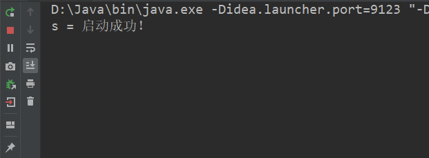

### ConcurrentHashMap

ConcurrentHashMap 类本质上是 Map 集合，即键值对的集合，使用方式和 HashMap 没有区别，但凡对此 Map 集合的操作，不去修改集合内部元素，就不会被加锁（synchronized）；

### 线程的状态图-生命周期

线程的生命周期只有 6 种：


在某一时刻，线程只能处于其中的一种状态，这种线程的状态反映的是 JVM 中的线程状态和 OS 无关；

- NEW 状态——新建线程状态——new Thread()；
- RUNNABLE 状态——正在运行状态——start()；
- BLOCKED 状态——受阻塞状态——synchronized(){}，即无锁受阻或者运行时的 wait() 状态释放锁；
- TERMINTED 状态——结束线程状态——run() 方法结束；
- WAITING 状态——无线等待状态——wait()；
- TIMED_WAITING 状态——时间等待状态——sleep()，join()，wait(miles）；

图示如下：


# 43.File类(操作文件夹，文件和路径)

- 文件夹 Directory：存储文件的容器，防止文件重名而设置，可以对文件归类，但是文件夹本身不存储任何数据，计算机专业术语中被称为目录；
- 文件 File：存储数据的容器，同一个目录中的文件名不能相同；
- 路径 Path：一个目录或者文件在磁盘中的位置；
  - c:\jdk8\jar 是目录的路径，是一个文件夹的路径；
  - c:\jdk8\bin\javac.exe 是一个文件的路径；
  - Windows 系统不区分目录和文件大小写，但是 Linux 系统要区分目录和文件大小写；
- File 类：是为了描述目录和文件的路径的对象，但是不能修改文件中的数据；
- 具有平台无关性，即跨平台性；

## File类的构造方法

- File(String pathname) 传递字符串的路径名；
- File(String parent,String child) 床底字符串的父路径，字符串的子路径；
- File(File parent,String child) 传递 File 类的父路径，字符串的子路径；

示例如下：

```java
package top.sharehome.Demo;

import java.io.File;
import java.util.concurrent.*;

public class Demo {
    public static void main(String[] args) throws InterruptedException, ExecutionException {
        File file = new File("C:\\Program Files\\Common Files\\Oracle\\Java");
        System.out.println("file = " + file);
        File file1 = new File("C:\\Program Files\\Common Files\\Oracle","Java");
        System.out.println("file1 = " + file1);
        File file2 = new File(file,"javapath");
        System.out.println("file2 = " + file2);
    }
}
```

打印效果如下：


==注意：File 类的构造器可以直接被打印，但是并不会判断系统中是否存在此目录或者文件，需要调用类下的 exists() 方法来判断；==

## File类的判断方法

- boolean exists() 判断构造方法中的路径是否存在；
- boolean isDirectory() 判断构造方法中的路径是不是文件夹；
- boolean isFile() 判断构造方法中的路径是不是文件；
- boolean isAbsolute() 判断构造方法中的是不是绝对路径；

示例如下：

```java
package top.sharehome.Demo;

import java.io.File;
import java.io.IOException;
import java.util.concurrent.*;

public class Demo {
    public static void main(String[] args) throws InterruptedException, ExecutionException, IOException {
        File file = new File("d:\\大学课程学习文档\\java\\Practice\\IO");
        System.out.println("file.exists() = " + file.exists());
        System.out.println("file.isDirectory() = " + file.isDirectory());
        System.out.println("file.isFile() = " + file.isFile());
        System.out.println("file.isAbsolute() = " + file.isAbsolute());
    }
}
```

打印效果如下：


### 绝对/相对路径

- 绝对路径
  - 在磁盘中的路径具有唯一性；
  - Windows 系统中，以盘符开头：`C:/java/jar`
  - Linux 或者 Unix 系统中，以 `/` 开头：`/user/local`
  - 互联网路径：`https://www.baidu.com`
- 相对路径
  - 必须有参照物，假如是 `bin`
  - 参照物的父类就是 `../` ；

## File类的创建方法

==File 类的创建方法禁止创建重名元素，这个重名可以是**文件和文件之间的重名**，可以是**文件夹和文件夹之间的重名**，甚至是**文件和文件夹的重名**；==

- file.createNewFile() 方法，返回一个 boolean 判断**文件**是否创建成功，但是创建的**文件名**需要事先存在于 file 对象的构造器中，==这里需要区分 **文件** 和 **文件夹** 的区别，该方法创建的是文件，而不是文件夹，所以即使没有后缀名，它也可以创建无后缀名的文件；==

  **示例如下：**

  ```java
  package top.sharehome.Demo;
  
  import java.io.File;
  import java.io.IOException;
  import java.util.concurrent.*;
  
  public class Demo {
      public static void main(String[] args) throws InterruptedException, ExecutionException, IOException {
          File file = new File("d:\\大学课程学习文档\\java\\Practice\\IO\\FileTest.txt");
          System.out.println("file.exists() = " + file.exists());
          boolean newFile = file.createNewFile();
          if (newFile){
              System.out.println("创建成功！");
          }else {
              System.out.println("创建失败！");
          }
      }
  }
  ```

  打印效果如下：

  

  

- file.mkdirs() 方法，返回一个 boolean 判断**文件夹**是否创建成功，但是创建的**文件夹名**需要事先存在于 file 对象的构造器中，文件夹名也可以带后缀名，只不过建出来的依旧是一个文件夹，==由于 Windows 系统识别目录名字符长度不得超过 255 ，如果创建文件夹层数过多或者名字过长，Windows 会不识别，那么创建后的文件夹可能永远也删不掉了==；

  **示例如下：**

  ```java
  package top.sharehome.Demo;
  
  import java.io.File;
  import java.io.IOException;
  import java.util.concurrent.*;
  
  public class Demo {
      public static void main(String[] args) throws InterruptedException, ExecutionException, IOException {
          File file = new File("d:\\大学课程学习文档\\java\\Practice\\IO\\FileTest");
          System.out.println("file.exists() = " + file.exists());
          boolean newFile = file.mkdirs();
          if (newFile){
              System.out.println("创建成功！");
          }else {
              System.out.println("创建失败！");
          }
      }
  }
  ```

  打印效果如下：

  

  

  ==还有一个方法叫做 file.mkdir() 该方法只能建立一层文件夹，所以处于被 file.mkdirs() 方法取代的状态；==

## File类的删除方法

file.delete() 方法删除指定的目录或者文件，返回一个 boolean 判断是否删除成功，该路径要事先写在 file 对象中；

**示例如下：**

```java
package top.sharehome.Demo;

import java.io.File;
import java.io.IOException;
import java.util.concurrent.*;

public class Demo {
    public static void main(String[] args) throws InterruptedException, ExecutionException, IOException {
        File file = new File("d:\\大学课程学习文档\\java\\Practice\\IO\\FileTest");
        if (file.exists()) {
            System.out.println("存在该文件或者目录！");
            if (file.delete()) {
                System.out.println("删除成功！");
            }else {
                System.out.println("删除失败！");
            }
        }else {
            System.out.println("没有该文件或者目录");
        }
    }
}
```

打印效果如下：


==若要删除文件夹，必须保证该文件夹为空，不然删除就会失败！==

## File类的获取方法

File getAbsoluteFile() 获取绝对路径，返回值是一个 File 类型；

==Java 默认的相对路径参考点是本项目所在路径，即下例中，我们在项目中建立一个 IO 文件夹，然后传入 IO：==

```java
package top.sharehome.Demo;

import java.io.File;
import java.io.IOException;

public class Demo {
    public static void main(String[] args) throws IOException {
        File f = new File("IO");
        System.out.println("f.getAbsoluteFile() = " + f.getAbsoluteFile());
    }
}
```

打印效果如下：


File getParentFile() 获取父路径，返回值式 File 类型；

==因为返回的是 File 对象，所以我们可以多次使用 File 的方法：==

```java
package top.sharehome.Demo;

import java.io.File;
import java.io.IOException;

public class Demo {
    public static void main(String[] args) throws IOException {
        File f = new File("d:\\大学课程学习文档\\java\\Practice\\IO");
        System.out.println("f.getParentFile().getParentFile().getParentFile().getParentFile() = " + f.getParentFile().getParentFile().getParentFile().getParentFile());
        System.out.println("f.getParentFile().getParentFile().getParentFile() = " + f.getParentFile().getParentFile().getParentFile());
        System.out.println("f.getParentFile().getParentFile() = " + f.getParentFile().getParentFile());
        System.out.println("f.getParentFile() = " + f.getParentFile());
    }
}
```

打印效果如下：


String getName() 获取名字，File 构造方法中的路径名字；

```java
package top.sharehome.Demo;

import java.io.File;
import java.io.IOException;

public class Demo {
    public static void main(String[] args) throws IOException {
        File f = new File("d:\\大学课程学习文档\\java\\Practice\\IO");
        System.out.println("f.getName() = " + f.getName());
    }
}
```

打印效果如下：


String getPath() 获取 File 构造方法中的路径，完整的路径转成 String 返回；

```java
package top.sharehome.Demo;

import java.io.File;
import java.io.IOException;

public class Demo {
    public static void main(String[] args) throws IOException {
        File f = new File("d:\\大学课程学习文档\\java\\Practice\\IO");
        System.out.println("f.getPath() = " + f.getPath());
    }
}
```

打印效果如下：


long length() 获取文件的字节数；

```java
package top.sharehome.Demo;

import java.io.File;
import java.io.IOException;

public class Demo {
    public static void main(String[] args) throws IOException {
        File f = new File("d:\\大学课程学习文档\\java\\Practice\\IO");
        System.out.println("f.length() = " + f.length());
        System.out.println("f.getParentFile().length() = " + f.getParentFile().length());
    }
}
```

打印效果如下：


## File类的遍历方法

- **listFile() 方法**  返回值是 File[] 数组，存储了多个 File 对象，方法的作用是遍历当前的文件夹；

  ```java
  package top.sharehome.Demo;
  
  import java.io.File;
  import java.io.IOException;
  
  public class Demo {
      public static void main(String[] args) throws IOException {
          File f = new File("d:\\大学课程学习文档\\java\\Practice\\IO");
          File[] files = f.listFiles();
          for (int i = 0; i < files.length; i++) {
              System.out.println(files[i]);
          }
      }
  }
  ```

  打印效果如下：

  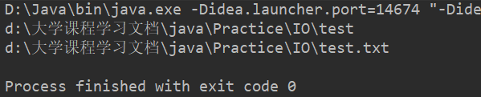

- 递归遍历一个文件夹中所有的元素：

  思路：遇到文件夹先输出再进入递归方法，遇到文件就直接输出；

  ```java
  package top.sharehome.Demo;
  
  import java.io.File;
  import java.io.IOException;
  
  public class Demo {
      public static void main(String[] args) throws IOException {
          File f = new File("d:\\大学课程学习文档\\java\\Practice");
          method(f);
      }
  
      public static void method(File dir) {
          File[] files = dir.listFiles();
          for (int i = 0; i < files.length; i++) {
              if (files[i].isDirectory()) {
                  System.out.println(files[i]);
                  method(files[i]);
              } else {
                  System.out.println(files[i]);
              }
          }
      }
  }
  ```

  打印效果如下：

  

  **==既然可以遍历一个文件夹中所有的元素，那么我们可以用这个特性来设计一些实用的程序，比如删除一个文件夹内所有空文件夹；==**

  **思路：**先遍历到最底层的文件夹，再判断这个文件夹的长度，若为零则删除；

  **IO文件夹如下**：

  

  ```java
  package top.sharehome.Demo;
  
  import java.io.File;
  import java.io.IOException;
  
  public class Demo {
      static long count;
      public static void main(String[] args) throws IOException {
          File f = new File("d:\\大学课程学习文档\\java\\Practice\\IO");
          method(f);
          System.out.println("一共删减了"+count+"个空文件夹！");
      }
  
      public static void method(File dir) {
          File[] files = dir.listFiles();
          for (int i = 0; i < files.length; i++) {
              if (files[i].isDirectory()) {
                  method(files[i]);
                  if (files[i].length() == 0) {
                      files[i].delete();
                      count++;
                  }
              }
          }
      }
  }
  ```

  打印效果如下：

  

# 44.I/O流(操作文件中的数据)

## 相关概念

I/O流：Input/Output；

I/O作用是将数据从一个设备中流入另一个设备中，比如从磁盘流向内存，从磁盘流向移动存储设备，从一台计算机流向另一台计算机；

I/O流中的数据都是字节，任何数据文件都由字节组成，字节是计算机中最小的存储单元；


## I/O流对象的分类

### 按照操作的文件类型分类

- 文件类型文件 -- 选择流对象字符流
  - 什么是文本文件：使用文本工具（记事本，notepad++，editplus等）打开这个文件能够直接“阅读”的文件；
- 非文件类型文件 -- 选择流对象字节流

### 按照数据流向分类

- 输入流：Java 程序从其他地方读取数据；
- 输出流：Java 程序中的数据写入到其他地方；

### I/O流对象的分类归纳

- 字节输出流：OutputStream 抽象超类
- 字节输入流：InputStream 抽象超类
- 字符输出流：Writer 抽象超类
- 字符输出流：Reader 抽象超类

## 字节流

### 字节输出流

OutputStream 是所有字节输出流的超类，是一种全能的输出流，可以写入任何类型的文件；

写入字节的方法 `write()` 

- void write(int b) 写入单个字节，参数给到的是 int ，但是会被转型为 byte ，所以数据范围应该在 -128~127；
- void write(byte[] b) 写入字节数组；
- void write(byte[] b,int startIndex,int len) 写入数组的一部分，开始索引，写入的个数；==常常用于文件的复制操作；==

#### FileOutputStream 实现类

**构造方法：**

- FileOutputStream(File file)
- FileOutputStream(String file)
  - 创建字节输出流对象，绑定参数就是要写入的数据目的地；
  - ==如果数据目的地不存在，那么就会创建这样一个数据目的地并且写入数据，如果数据目的地存在，那么就会覆盖原有的数据目的地中的数据；==

==JVM 很聪明，任何一个操作系统都具有 IO 设备，但是 JVM 没有，因为它是依靠操作系统来实现 IO 功能的，所以当 IO 对象使用完毕后要记得释放资源（对象名.close()）；==

**字节输出流写入文件的步骤：**

- 创建字节输出流对象，构造方法中需要绑定文件的路径；

- 调用流对象的方法 write() 写入数据；

- 释放资源；

  示例如下：

  ```java
  package top.sharehome.Demo;
  
  import java.io.File;
  import java.io.FileOutputStream;
  import java.io.IOException;
  
  public class Demo {
      public static void main(String[] args) throws IOException {
          File f = new File("d:\\大学课程学习文档\\java\\Practice\\IO\\test.txt");
          FileOutputStream fos = new FileOutputStream(f);
          byte[] arr = new byte[]{97,98,99,100,101,102};
          boolean exists = f.exists();
          if (exists){
              fos.write(49);
              fos.write(50);
              fos.write(51);
              fos.write(arr);
              fos.write(arr,0,3);
          }
          fos.close();
      }
  }
  ```

  打印效果如下：

  

  **还可以利用字符串中的 getBytes() 方法将字符串转换成 byte[]；**

  ```java
  package top.sharehome.Demo;
  
  import java.io.File;
  import java.io.FileOutputStream;
  import java.io.IOException;
  
  public class Demo {
      public static void main(String[] args) throws IOException {
          File f = new File("d:\\大学课程学习文档\\java\\Practice\\IO\\test.txt");
          FileOutputStream fos = new FileOutputStream(f);
          boolean exists = f.exists();
          if (exists){
              fos.write("你好 Java".getBytes());
          }
          fos.close();
      }
  }
  ```

  打印效果如下：

  

**追加写入和换行：**

- 追加写入，即 FileOutputStream 构造方法的第二个参数写 true；

  ```java
  package top.sharehome.Demo;
  
  import java.io.FileOutputStream;
  import java.io.IOException;
  
  public class Demo {
      public static void main(String[] args) throws IOException {
          FileOutputStream fosWrite = new FileOutputStream("d:\\大学课程学习文档\\java\\Practice\\IO\\test.txt");
          FileOutputStream fosCover = new FileOutputStream("d:\\大学课程学习文档\\java\\Practice\\IO\\test.txt",true);
          fosWrite.write(97);
          fosWrite.write(98);
          fosWrite.write(99);
          fosCover.write(100);
          fosCover.write(101);
          fosCover.write(102);
          fosCover.close();
          fosWrite.close();
      }
  }
  ```

  打印效果如下：

  

- 换行写入，使用 Windows 系统的换行符号 **`\r(换行符)    \n(回车符)`**

  示例如下：

  ```java
  package top.sharehome.Demo;
  
  import java.io.FileOutputStream;
  import java.io.IOException;
  
  public class Demo {
      public static void main(String[] args) throws IOException {
          FileOutputStream fos = new FileOutputStream("d:\\大学课程学习文档\\java\\Practice\\IO\\test.txt");
          byte[] bytes = new byte[]{97,98,99,'\n','\r',100,101,102};
          fos.write(bytes);
          fos.close();
      }
  }
  ```

  打印效果如下：

  


#### 字节输出流异常处理

==其实以上的示例都存在不恰当异常处理的情况，由于 JVM 借用了 OS 的 IO 功能，所以 JVM 向上抛的异常处理方式并不是一个明智的选择，所以应该选择 **try……catch……finally……** 的异常处理方式将其就地处理掉；==

异常主要有两个：

1. **FileOutputStream** 对象创建失败后的空指针异常；
1. 以及 **FileOutputStream** 创建时的 IO 流异常；

示例如下：

```java
package top.sharehome.Demo;

import java.io.FileOutputStream;
import java.io.IOException;

public class Demo {
    public static void main(String[] args) {
        FileOutputStream fos = null;
        //这个 try 是为了处理IO流异常
        try {
            fos = new FileOutputStream("d:\\大学课程学习文档\\java\\Practice\\IO\\test.txt");
            fos.write("字节输出流异常处理".getBytes());
            fos.close();
        } catch (IOException e) {
            e.printStackTrace();
        } finally {
            //这个 try 也是为了处理IO流异常
            try {
                //这个 if 是为了防止空指针异常输出
                if (fos != null) {
                    fos.close();
                }
            } catch (IOException e) {
                e.printStackTrace();
            }
        }
    }
}
```

打印效果如下：


### 字节输入流

InputStream 是所有字节输入流的超类，是一种全能的输入流，可以读取任何类型的文件；

读取字节的方法 **`read()`** 

- **int read()** 读取单个字节，同一个对象的连续 read() 方法会接连读取内容，每次读取返回一个 int 类型值，如果读取到流的末尾就返回 -1，==该方法不能正常读取中文，因为一个中文字符所占大小不止一个字节==；
- **int read(byte[] b)** 读取字节数组，同一个对象的连续 read(byte[] b) 方法会接连读取内容并返回读取到的字节个数，同时 byte[] 数组中的会被新读取到的内容所覆盖，如果读取到流的末尾就返回 -1，==通常我们要将 byte[] 数组设置成 1024 的整数倍==；

#### FileInputStream 实现类

**构造方法：**

- FileInputStream(File file)
- FileInputStream(String file)
  - 创建字节输入流对象，绑定参数就是要读取的数据源文件；
  - 字节流输入流和输出流的方法使用几乎一样；

**方法示例如下：**

- **int read() 读取单个字节，返回一个 int 类型值；**

  （文件中内容是 abc）

  ```java
  package top.sharehome.Demo;
  
  import java.io.FileInputStream;
  import java.io.IOException;
  
  public class Demo {
      public static void main(String[] args) {
          FileInputStream fis = null;
          try {
              fis = new FileInputStream("d:\\大学课程学习文档\\java\\Practice\\IO\\test.txt");
              int r = 0;
              while ((r = fis.read()) != -1) {
                  System.out.println("r= "+r);
              }
          } catch (IOException e) {
              e.printStackTrace();
          } finally {
              try {
                  if (fis != null) {
                      fis.close();
                  }
              } catch (IOException e) {
                  e.printStackTrace();
              }
          }
      }
  }
  ```

  打印效果如下：

  

- **int read(byte[] b) 读取字节数组；**

  （文件中内容是 abcdefghi）

  ```java
  package top.sharehome.Demo;
  
  import java.io.FileInputStream;
  import java.io.IOException;
  
  public class Demo {
      public static void main(String[] args) {
          FileInputStream fis = null;
          byte[] arr = new byte[1024];
          try {
              fis = new FileInputStream("d:\\大学课程学习文档\\java\\Practice\\IO\\test.txt");
              int i;
              while ((i = fis.read(arr)) != -1) {
                  System.out.println("i = " + i);
                  System.out.println("new String(arr) = " + new String(arr));
              }
          } catch (IOException e) {
              e.printStackTrace();
          } finally {
              try {
                  if (fis != null) {
                      fis.close();
                  }
              } catch (IOException e) {
                  e.printStackTrace();
              }
          }
      }
  }
  ```

  打印效果如下：

  

  ==由于原理是 byte[] 数组覆盖后输出，最后一次只读取到了一个 i 字母，所以仅仅只覆盖上一次所读取到的 g 的位置，而 h 的位置保持不变；==

  为了不出现以上的情况，我们又要运用 String 类当中的重载方法 **String(转换的数组,开始索引,转换的个数)**：

  ```java
  package top.sharehome.Demo;
  
  import java.io.FileInputStream;
  import java.io.IOException;
  
  public class Demo {
      public static void main(String[] args) {
          FileInputStream fis = null;
          byte[] arr = new byte[1024];
          try {
              fis = new FileInputStream("d:\\大学课程学习文档\\java\\Practice\\IO\\test.txt");
              int i;
              while ((i = fis.read(arr)) != -1) {
                  System.out.println("i = " + i);
                  System.out.println("new String(arr) = " + new String(arr, 0, i));
              }
          } catch (IOException e) {
              e.printStackTrace();
          } finally {
              try {
                  if (fis != null) {
                      fis.close();
                  }
              } catch (IOException e) {
                  e.printStackTrace();
              }
          }
      }
  }
  ```

  打印效果如下：

  

### 文件复制

实现文件的复制功能，和操作系统中的 Ctrl+c，Ctrl+v 一样，原理上就是字节的流动；

我们可以用单个字节输入输出流完成它，假设从 **test1.txt** 提取内容 **123** 到 **test2.txt** 中：

```java
package top.sharehome.Demo;

import java.io.FileInputStream;
import java.io.FileOutputStream;
import java.io.IOException;

public class Demo {
    public static void main(String[] args) {
        FileInputStream fis = null;
        FileOutputStream fos = null;
        try {
            fis = new FileInputStream("d:\\大学课程学习文档\\java\\Practice\\IO\\test1.txt");
            fos = new FileOutputStream("d:\\大学课程学习文档\\java\\Practice\\IO\\test2.txt");
            int flag = 0;
            while ((flag = fis.read()) != -1) {
                fos.write(flag);
            }
        } catch (IOException e) {
            e.printStackTrace();
        } finally {
            try {
                if (fis != null) {
                    fis.close();
                }
            } catch (IOException e) {
                e.printStackTrace();
            }
            try {
                if (fos != null) {
                    fos.close();
                }
            } catch (IOException e) {
                e.printStackTrace();
            }
        }
    }
}
```

打印效果如下：


==但是这种单个字节复制文件方法是不明智的，较小的文件可以这样，但是一旦文件内存较大，该方法的效率就显得极其低下；==

**举例如下：**

以下是 test3.txt 文件内容，有20000+行内容，我们写程序来验证一下所花费时间；

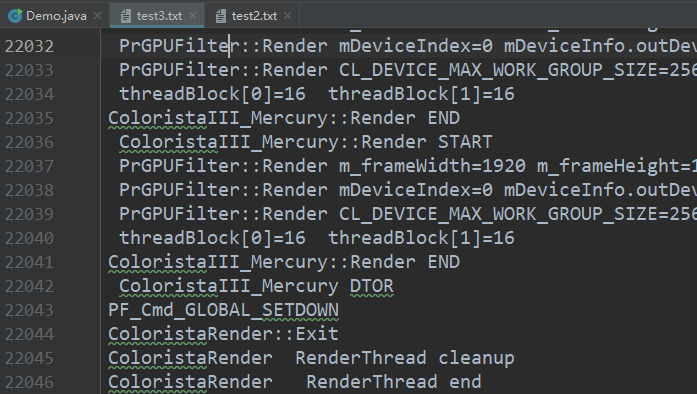

```java
package top.sharehome.Demo;

import java.io.FileInputStream;
import java.io.FileOutputStream;
import java.io.IOException;

public class Demo {
    public static void main(String[] args) {
        long start = System.currentTimeMillis();
        FileInputStream fis = null;
        FileOutputStream fos = null;
        try {
            fis = new FileInputStream("d:\\大学课程学习文档\\java\\Practice\\IO\\test3.txt");
            fos = new FileOutputStream("d:\\大学课程学习文档\\java\\Practice\\IO\\test2.txt");
            int flag = 0;
            while ((flag = fis.read()) != -1) {
                fos.write(flag);
            }
        } catch (IOException e) {
            e.printStackTrace();
        } finally {
            try {
                if (fis != null) {
                    fis.close();
                }
            } catch (IOException e) {
                e.printStackTrace();
            }
            try {
                if (fos != null) {
                    fos.close();
                }
            } catch (IOException e) {
                e.printStackTrace();
            }
        }
        long end = System.currentTimeMillis();
        System.out.println("end-start = " + (end - start));
    }
}
```

打印效果如下：


==足足用了 13 秒，效率极低！所以我们要考虑运用到字节数组去完成这一复制动作！==

```java
package top.sharehome.Demo;

import java.io.FileInputStream;
import java.io.FileOutputStream;
import java.io.IOException;

public class Demo {
    public static void main(String[] args) {
        long start = System.currentTimeMillis();
        byte[] arr = new byte[1024];
        FileInputStream fis = null;
        FileOutputStream fos = null;
        try {
            fis = new FileInputStream("d:\\大学课程学习文档\\java\\Practice\\IO\\test3.txt");
            fos = new FileOutputStream("d:\\大学课程学习文档\\java\\Practice\\IO\\test2.txt");
            int flag = 0;
            while ((flag = fis.read(arr)) != -1) {
                fos.write(arr,0,flag);
            }
        } catch (IOException e) {
            e.printStackTrace();
        } finally {
            try {
                if (fis != null) {
                    fis.close();
                }
            } catch (IOException e) {
                e.printStackTrace();
            }
            try {
                if (fos != null) {
                    fos.close();
                }
            } catch (IOException e) {
                e.printStackTrace();
            }
        }
        long end = System.currentTimeMillis();
        System.out.println("end-start = " + (end - start));
    }
}
```

打印效果如下：


==显然，速度要快很多，这样的数组也就是字节流缓冲流的原理；==

### 字节流的缓冲流

使用字节流的缓冲流，提高原有流对象的读写性能；

字节流缓冲区流，流的本质上也是字节流；

- BufferedOutputStream 继承自 OutputStream；
  - 方法 write() 写入单个的字节，或者是字节数组；
- BufferedInputStream 继承自 InputStream；
  - 方法 read() 读取单个的字节，或者是字节数组；

==Buffered 开头的流被称为缓冲流，FileOutputStream 基础流；这些**类的构造器需要传入基础流**，传入什么基础流，那就对什么基础流进行高效处理，如果没有基础流，那么这个类就无意义，这样的类设计也有一个特殊的设计模式名称——**装饰者**，关闭流时仅关闭装饰者即可；==

#### BufferedOutputStream 构造方法

**`new BufferedOutputStream(OutputStream out)`** 传递字节输出流；

#### BufferedInputStream 构造方法

**`new BufferedInputStream(InputStream in)`** 传递字节输入流；

#### 字节缓冲流实现文件复制

```java
package top.sharehome.Demo;

import java.io.*;

public class Demo {
    public static void main(String[] args) {
        long start = System.currentTimeMillis();
        FileInputStream fis = null;
        FileOutputStream fos = null;
        BufferedInputStream bis = null;
        BufferedOutputStream bos = null;
        try {
            fis = new FileInputStream("d:\\大学课程学习文档\\java\\Practice\\IO\\test3.txt");
            fos = new FileOutputStream("d:\\大学课程学习文档\\java\\Practice\\IO\\test2.txt");
            bis = new BufferedInputStream(fis);
            bos = new BufferedOutputStream(fos);
            byte[] arr = new byte[1024];
            int flag = 0;
            while ((flag = bis.read(arr)) != -1) {
                bos.write(arr, 0, flag);
            }
        } catch (IOException e) {
            e.printStackTrace();
        } finally {
            try {
                if (bis != null) {
                    bis.close();
                }
            } catch (IOException e) {
                e.printStackTrace();
            }
            try {
                if (bos != null) {
                    bos.close();
                }
            } catch (IOException e) {
                e.printStackTrace();
            }
        }
        long end = System.currentTimeMillis();
        System.out.println("(end-start) = " + (end - start));
    }
}
```

打印效果如下：


==再次相比普通数组的文件复制，这又是一次巨大的优化；==

## 字符流

**==只能操作文本文件；==**

**==字符流 = 字节流 + 编码表==**

### Writer类

是所有字符输出流的超类（写入文本文件）；

- write(int c) 写入单个字符；
- write(char[] ch) 写入字符数组；
- write(char[] ch,int off,int len) 写入字符数组一部分，开始索引以及写入的个数；
- **write(String str)** 写入字符串；
- flush() 刷新该流的缓冲（该类写入数据时先写入内存，只能刷新了数据才会抵达目的路径），而在 close() 方法完成后也会自动调用一次 flush() 方法，但是建议手动刷新，防止内存积压过多；

#### OutputStreamWriter 实现类

OutputStreamWriter 实现类继承 Writer 类，是字符的输出流，同时也被称作转换流，==**这个类也是“装饰者”**==，装饰输出流（OutputStream）；

**转换流**：把字符流转换成字节流；

**构造方法：**

- OutputStreamWriter(OutputStream out) 传递任意字节输出流；
- OutputStreamWriter(OutputStream out,String 编码表名) 传递任意字节输出流，编码表名，不同的 IDE 有不同的默认编码表，IDEA 是 UTF-8 ，eclipse 是 GBK；

**使用类示例如下：**

```java
package top.sharehome.Demo;

import java.io.FileOutputStream;
import java.io.IOException;
import java.io.OutputStreamWriter;

public class Demo {
    public static void main(String[] args) {
        FileOutputStream fos = null;
        OutputStreamWriter osw = null;
        try {
            fos = new FileOutputStream("d:\\大学课程学习文档\\java\\Practice\\IO\\test1.txt");
            osw = new OutputStreamWriter(fos, "utf8");
            osw.write("啦啦啦啦啦啦");
            osw.flush();
        } catch (IOException e) {
            e.printStackTrace();
        } finally {
            try {
                if (osw != null) {
                    osw.close();
                }
            } catch (IOException e) {
                e.printStackTrace();
            }
        }
    }
}
```

打印效果如下：


### Reader类

是所有字符输入流的超类（读取文本文件）；

- int read() 读取单个字符；
- int read(char[] ch) 读取字符数组；

#### InputStreamReader 实现类

InputStreamWriter 实现类继承 Reader 类，是字符的输入流，同时也被称作转换流，==**这个类也是“装饰者”**==，装饰输入流（InputStream）；

**转换流**：字节流转成字符流；

**构造方法：**

- InputStreamReader(InputStream in) 传递任意字节输入流；
- InputStreamReader(InputStream in,String 编码表名) 传递任意字节输入流，编码表名，不同的 IDE 有不同的默认编码表，IDEA 是 UTF-8 ，eclipse 是 GBK；

**使用类示例如下：**（test2.txt 文件如下）


```java
package top.sharehome.Demo;

import java.io.FileInputStream;
import java.io.IOException;
import java.io.InputStreamReader;

public class Demo {
    public static void main(String[] args) {
        FileInputStream fis = null;
        InputStreamReader isr = null;
        try {
            fis = new FileInputStream("d:\\大学课程学习文档\\java\\Practice\\IO\\test2.txt");
            isr = new InputStreamReader(fis);
            char[] ch = new char[1024];
            int flag = 0;
            while ((flag=isr.read(ch)) != -1) {
                System.out.println(new String(ch, 0, flag));
            }
        } catch (IOException e) {
            e.printStackTrace();
        } finally {
            try {
                if (isr != null) {
                    isr.close();
                }
            } catch (IOException e) {
                e.printStackTrace();
            }
        }
    }
}
```

打印效果如下：


### 便捷类

- FileWriter 继承自 OutputStreamWriter；

  - 字符的输出流，写入文本文件；
  - 直接采用默认的编码表（utf-8）；
  - FileWriter 构造方法直接传递字符串的文件名即可，该文件若在项目根路径不存在，则在根路径创建后再写入；

  示例如下：

  ```java
  package top.sharehome.Demo;
  
  import java.io.FileWriter;
  import java.io.IOException;
  
  public class Demo {
      public static void main(String[] args) {
          FileWriter fw = null;
          try {
              fw = new FileWriter("d:\\大学课程学习文档\\java\\Practice\\IO\\test2.txt");
              fw.write("你好 IO流");
              fw.flush();
          } catch (IOException e) {
              e.printStackTrace();
          } finally {
              try {
                  if (fw != null) {
                      fw.close();
                  }
              } catch (IOException e) {
                  e.printStackTrace();
              }
          }
      }
  }
  ```

  打印效果如下：

  

- FileReader 继承自 InputStreamReader；

  - 字符的输入流，读取文本文件；
  - 直接采用默认的编码表；
  - FileReader 构造方法直接传递字符串的文件名即可，必须要有数据源文件；

  示例如下：

  ```java
  package top.sharehome.Demo;
  
  import java.io.FileReader;
  import java.io.IOException;
  
  public class Demo {
      public static void main(String[] args) {
          FileReader fr = null;
          try {
              fr = new FileReader("d:\\大学课程学习文档\\java\\Practice\\IO\\test2.txt");
              char[] ch = new char[1024];
              int flag = 0;
              while ((flag = fr.read(ch)) != -1) {
                  System.out.print(new String(ch,0,flag));
              }
          } catch (IOException e) {
              e.printStackTrace();
          } finally {
              try {
                  if (fr != null) {
                      fr.close();
                  }
              } catch (IOException e) {
                  e.printStackTrace();
              }
          }
      }
  }
  ```

  打印效果如下：

  

### 字符流的缓冲流

使用字符流的缓冲流，提高原有流对象的读写性能；

==字符流的缓冲流是字符流中便捷类的**“装饰者”**；==

- BufferedWriter 继承自 Writer；

  - 字符输出流的缓冲流，写入文本文件；

  - 特殊方法：newLine() 写入文本换行符，由于每个操作系统的换行符不一样，这个方法就实现了代码的跨平台性；

    示例如下：

    ```java
    package top.sharehome.Demo;
    
    import java.io.BufferedWriter;
    import java.io.FileWriter;
    import java.io.IOException;
    
    public class Demo {
        public static void main(String[] args) {
            FileWriter fr = null;
            BufferedWriter bf = null;
            try {
                fr = new FileWriter("d:\\大学课程学习文档\\java\\Practice\\IO\\test1.txt");
                bf = new BufferedWriter(fr);
                bf.write(97);
                bf.newLine();
                bf.write(98);
                bf.flush();
            }catch (IOException e){
                e.printStackTrace();
            }finally {
                try {
                 if (fr!=null){
                     fr.close();
                 }
                }catch (IOException e){
                    e.printStackTrace();
                }
            }
        }
    }
    ```

    打印效果如下：

    

- BufferedReader 继承自 Reader；

  - 字符输入流的缓冲流，读取文本文件；
  - 特殊方法：readLine() 读取文本一行，由于每个操作系统的换行符不一样，这个方法就实现了代码的跨平台性，返回 String ，当读取完文件后反 null；

  示例如下：

  ```java
  package top.sharehome.Demo;
  
  import java.io.BufferedReader;
  import java.io.FileReader;
  import java.io.IOException;
  
  public class Demo {
      public static void main(String[] args) {
          FileReader fr = null;
          BufferedReader br = null;
          try {
              fr = new FileReader("d:\\大学课程学习文档\\java\\Practice\\IO\\test1.txt");
              br = new BufferedReader(fr);
              String flag = null;
              while ((flag = br.readLine()) != null) {
                  System.out.println("flag = " + flag);
              }
          } catch (IOException e) {
              e.printStackTrace();
          } finally {
              try {
                  if (br != null) {
                      br.close();
                  }
              } catch (IOException e) {
                  e.printStackTrace();
              }
          }
      }
  }
  ```

  打印效果如下：

  

==字符流的缓冲流和字节流的缓冲流使用方法大致相同；==

在 Java11 之后可以使用一种更简单的方法来读取一个文件（类似于迭代器的遍历方式），此时要用Scanner类来获取一个文件：

```java
import java.io.IOException;
import java.nio.charset.StandardCharsets;
import java.nio.file.Path;
import java.util.Scanner;

/**
 * @author AntonyCheng
 * @date 2022/8/28 17:32
 */

public class Demo {
    public static void main(String[] args) {
        Scanner in = null;
        try {
            //Scanner(Path source, Charset charset)构造器需要Java10
            //Path接口中Path of(String first, String... more)需要Java11
            in = new Scanner(Path.of("d:\\desktop\\txt.png"), StandardCharsets.UTF_8);
            while (in.hasNextLine()) {
                System.out.println(in.nextLine());
            }
        } catch (IOException e) {
            e.printStackTrace();
            throw new RuntimeException(e.getMessage());
        } finally {
            if (in != null) {
                in.close();
            }
        }
    }
}

```

#### BufferedWriter 构造方法

**`new BufferedWriter(Writer w)`** 传递字符输出流；

#### BufferedReader 构造方法

**`new BufferedReader(Reader r)`** 传递字符输入流；

### 禁止使用字符流复制文本文件

这是一个错误的应用，不能保证复制后和源文件是一致的；

## 打印流

- PrintStream：字节输出流；

- PrintWriter：字符输出流；

- 打印流特性：

  - 打印流负责输出打印，不关心数据源；

  - 方便地打印各种形式数据；

  - **打印流永远不会抛出 IO 异常**；

  - 具有自动刷新的功能；

    

    即添加参数 true ，但是要注意自动刷新必须需要 println 或者 printf 或者 format 进行打印

  - 这些依然是**“装饰者”**，需要再构造方法中引入字节流或者字符流；

**打印流示例如下：**

- **PrintStream 示例：**

  ```java
  package top.sharehome.Demo;
  
  import java.io.FileOutputStream;
  import java.io.IOException;
  import java.io.PrintStream;
  
  public class Demo {
      public static void main(String[] args) {
          FileOutputStream fos = null;
          PrintStream ps = null;
          try {
              fos = new FileOutputStream("d:\\大学课程学习文档\\java\\Practice\\IO\\test1.txt");
              ps = new PrintStream(fos);
              ps.print("这里写什么就会在文件里写什么！");
          } catch (IOException e) {
              e.printStackTrace();
          } finally {
              if (ps != null) {
                  ps.close();
              }
          }
      }
  }
  ```

  打印效果如下：

  

- **PrintWriter 示例：**

  ```java
  package top.sharehome.Demo;
  
  import java.io.*;
  
  public class Demo {
      public static void main(String[] args) {
          FileWriter fw = null;
          PrintWriter pw = null;
          try {
              fw = new FileWriter("d:\\大学课程学习文档\\java\\Practice\\IO\\test1.txt");
              pw = new PrintWriter(fw);
              pw.println("这里写什么就会在文件里写什么!");
  
          } catch (IOException e) {
              e.printStackTrace();
          } finally {
              if (pw != null) {
                  pw.close();
              }
          }
      }
  }
  ```

  打印效果如下：

  

## 基本数据流

- DataInputStream
  - 基本数据类型读取流；
  - 构造方法传递一个字节输入流；

- DataOutputStream
  - 基本数据类型写入流；
  - 构造方法传递一个字节输出流；
- 基本数据流依然是一个**“装饰者”**；

**基本数据流示例如下：**

```java
package top.sharehome.Demo;

import java.io.*;

public class Demo {
    public static void main(String[] args) {
        FileOutputStream fos = null;
        DataOutputStream dos = null;
        FileInputStream fis = null;
        DataInputStream dis = null;
        try {
            fos = new FileOutputStream("d:\\大学课程学习文档\\java\\Practice\\IO\\test1.txt");
            dos = new DataOutputStream(fos);
            fis = new FileInputStream("d:\\大学课程学习文档\\java\\Practice\\IO\\test1.txt");
            dis = new DataInputStream(fis);
            dos.writeInt(6);
            int i = dis.readInt(); //这里不能使用普通的 read() 方法，需要和写入格式相统一
            System.out.println("i = " + i);
        } catch (IOException e) {
            e.printStackTrace();
        } finally {
            try {
                if (dos != null) {
                    dos.close();
                }
            } catch (IOException e) {
                e.printStackTrace();
            }
            try {
                if (dis != null) {
                    dis.close();
                }
            } catch (IOException e) {
                e.printStackTrace();
            }
        }
    }
}
```

打印效果如下：


==如果我们要连续写入读取多个值呢？首先想到的是循环，但是循环条件成了一个问题，因为这里传输的是基本数据类型，返回 -1 是有可能的，所以这里只能通过抓取异常来来确定循环结束点；==

**示例如下：**

```java
package top.sharehome.Demo;

import java.io.*;

public class Demo {
    public static void main(String[] args) {
        FileInputStream fis = null;
        DataInputStream dis = null;
        try {
            fis = new FileInputStream("d:\\大学课程学习文档\\java\\Practice\\IO\\test1.txt");
            dis = new DataInputStream(fis);
            while (true){
                try {
                    int readInt = dis.readInt();
                    System.out.println("readInt = " + readInt);
                }catch (IOException e){
                    break;
                }
            }
        } catch (IOException e) {
            e.printStackTrace();
        } finally {
            try {
                if (dis != null) {
                    dis.close();
                }
            } catch (IOException e) {
                e.printStackTrace();
            }
        }
    }
}
```

打印效果如下：


## 对象的序列化

**对象序列化：**简单来说就是用 IO 流技术把对象写入（ObjectOutputStream 类）文件，反之，从文件中读取（ObjectInputStream 类）一个对象就是对象的反序列化，==所以先要做序列化，才能做反序列化，这两个类依然是**"装饰者"**；==

**开启对象序列化：**每一个普通类是没有序列化权限的，必须要实现 **Serializable** 接口以启用序列化；

**对象的序列化意义：**把对象变成一个文件，允许这个对象文件在网络上传输，可以让任何人使用；

### JavaBeans

#### 概念

**JavaBeans**是 Java 中一种特殊的类，可以将多个对象封装到一个对象（bean）中。特点是可序列化，提供无参构造器，提供 getter 方法和 setter 方法访问对象的属性。名称中的“Bean”是用于Java的可重用软件组件的惯用叫法。

#### 优点

- Bean可以控制它的属性、事件和方法是否暴露给其他程序。
- Bean可以接收来自其他对象的事件，也可以产生事件给其他对象。
- 有软件可用来配置Bean。
- Bean的属性可以被序列化，以供日后重用。

#### 规范

要成为 JavaBean 类别，则必需遵循关于命名、构造器、方法的特定规范。有了这些规范，才能有可以使用、复用、替代和连接 JavaBeans 的工具。

规范如下：

- 变量私有化。
- 有一个public的无参数构造函数。
- 属性可以透过*get*、*set*、*is*（可替代get，用在布尔型属性上）方法或遵循特定命名规则的其他方法访问。
- ==可序列化。==

```java
package player;

public class PersonBean implements java.io.Serializable {

    /**
     * name 属性(注意大小写)
     */
    private String name = null;

    private boolean deceased = false;

    /** 无参构造器 */
    public PersonBean() {
    }

    /**
     * name 属性的 Getter方法
     */
    public String getName() {
        return name;
    }

    /**
     * name 属性的Setter方法
     * @param value
     */
    public void setName(final String value) {
        name = value;
    }

    /**
     * deceased 属性的Getter方法
     * 布林值属性Getter方法的不同形式(这里使用了is而非get)
     */
    public boolean isDeceased() {
        return deceased;
    }

    /**
     * deceased 属性的Setter方法
     * @param value
     */
    public void setDeceased(final boolean value) {
        deceased = value;
    }
}
```

 

### ObjectOutputStream 对象的序列化

- 构造方法 ObjectOutputStream(OutputStream out) 传递字节输出流；
- 方法 void writeObject(Object o) 写入对象；

**示例如下：**

```java
package top.sharehome.Demo;

import java.io.FileOutputStream;
import java.io.IOException;
import java.io.ObjectOutputStream;
import java.io.Serializable;

public class Demo {

    public static void main(String[] args) {
        Person p = new Person("张三",21);
        FileOutputStream fos = null;
        ObjectOutputStream oos = null;
        try {
            fos = new FileOutputStream("d:\\大学课程学习文档\\java\\Practice\\IO\\test.txt");
            oos = new ObjectOutputStream(fos);
            oos.writeObject(p);
        } catch (IOException e) {
            e.printStackTrace();
        } finally {
            try {
                if (oos != null) {
                    oos.close();
                }
            } catch (IOException e) {
                e.printStackTrace();
            }
        }
    }
}

class Person implements Serializable {
    //这里需要加一串序列号，其作用后面内容有介绍；
    static final long serialVersionUID = 42L;
    private String name;
    private int age;

    public Person() {
    }

    public Person(String name, int age) {
        this.name = name;
        this.age = age;
    }

    public String getName() {
        return name;
    }

    public void setName(String name) {
        this.name = name;
    }

    public int getAge() {
        return age;
    }

    public void setAge(int age) {
        this.age = age;
    }

    @Override
    public String toString() {
        return "Person{" +
                "name='" + name + '\'' +
                ", age=" + age +
                '}';
    }
}
```

打印效果如下：


### ObjectInputStream 对象的反序列化

- 构造方法 ObjectInputStream(InputStream in) 传递字节输入流；
- 方法 Object readObject() 读取对象，由于得到的是 Object 对象，所以读取到对象后还需要进行对象的强制转换；

**示例如下：**

```java
package top.sharehome.Demo;

import java.io.FileInputStream;
import java.io.IOException;
import java.io.ObjectInputStream;
import java.io.Serializable;

public class Demo {
    public static void main(String[] args) {
        FileInputStream fis = null;
        ObjectInputStream ois = null;
        try {
            fis = new FileInputStream("d:\\大学课程学习文档\\java\\Practice\\IO\\test.txt");
            ois = new ObjectInputStream(fis);
            Object obj = ois.readObject();
            System.out.println(obj.toString());
        } catch (IOException e) {
            e.printStackTrace();
        } catch (ClassNotFoundException e) {
            e.printStackTrace();
        } finally {
            try {
                if (ois != null) {
                    ois.close();
                }
            } catch (IOException e) {
                e.printStackTrace();
            }
        }
    }
}

class Person implements Serializable {
    //这里需要加一串序列号，其作用后面内容有介绍；
    static final long serialVersionUID = 42L;
    private String name;
    private int age;

    public Person() {
    }

    public Person(String name, int age) {
        this.name = name;
        this.age = age;
    }

    public String getName() {
        return name;
    }

    public void setName(String name) {
        this.name = name;
    }

    public int getAge() {
        return age;
    }

    public void setAge(int age) {
        this.age = age;
    }

    @Override
    public String toString() {
        return "Person{" +
                "name='" + name + '\'' +
                ", age=" + age +
                '}';
    }
}
```

打印效果如下：


### 不能序列化的情况

**静态属性：**

==类中的静态成员也成为实例实例，实例成员是属于类本身的，随着类的加载而加载，而我们创建的是对象，做的是对象的序列化，而实例成员并不属于我们所创建的对象，所以静态属性不会被序列化，写入文件的结果是数据类型的默认值；==

**transient 关键字修饰：**

transient 关键字只有一个作用，那就是阻止变量的值被序列化写入文件中；

示例如下：

```java
package top.sharehome.Demo;

import java.io.*;

public class Demo {
    public static void main(String[] args) {
        FileOutputStream fos = null;
        ObjectOutputStream oos = null;
        FileInputStream fis = null;
        ObjectInputStream ois = null;
        Person p = new Person("李四",20);
        try {
            fos = new FileOutputStream("d:\\大学课程学习文档\\java\\Practice\\IO\\test.txt");
            fis = new FileInputStream("d:\\大学课程学习文档\\java\\Practice\\IO\\test.txt");
            oos = new ObjectOutputStream(fos);
            ois = new ObjectInputStream(fis);
            oos.writeObject(p);
            Object obj = ois.readObject();
            System.out.println(obj.toString());
        } catch (IOException e) {
            e.printStackTrace();
        } catch (ClassNotFoundException e) {
            e.printStackTrace();
        } finally {
            try {
                if (ois != null) {
                    ois.close();
                }
            } catch (IOException e) {
                e.printStackTrace();
            }
            try {
                if (oos!=null){
                    oos.close();
                }
            } catch (IOException e) {
                e.printStackTrace();
            }
        }
    }
}

class Person implements Serializable {
    //这里需要加一串序列号，其作用后面内容有介绍；
    static final long serialVersionUID = 42L;
    private String name;
    private transient int age; //将年龄防序列化

    public Person() {
    }

    public Person(String name, int age) {
        this.name = name;
        this.age = age;
    }

    public String getName() {
        return name;
    }

    public void setName(String name) {
        this.name = name;
    }

    public int getAge() {
        return age;
    }

    public void setAge(int age) {
        this.age = age;
    }

    @Override
    public String toString() {
        return "Person{" +
                "name='" + name + '\'' +
                ", age=" + age +
                '}';
    }
}
```

打印效果如下：


==静态变量和此种情况的打印效果一模一样；==

### 序列号

**固定格式：**

```java
static final long serialVersionUID = 42L; //赋值部分可自行修改，即42L可修改；
```

==当我们需要把一个类序列化时，不仅需要让这个类实现  Serializable 接口，还需要在类的成员变量中加入上述格式的序列号；==

**序列号目的：**防止写入的文件被篡改，此时序列号就成了这个类的唯一标识；

# 45.网络编程

## 软件结构

**C/S结构：**全称为 Client/Server 结构，是指客户端和服务器结构，重点在于客户端开发，常见的程序有QQ，迅雷，百度网盘等软件，但是客户端开发并不适合于 Java ，而适合于 C/C++ ；

**B/S结构：**全称为 Browser/Server 结构，是指浏览器和服务器结构，重点在于服务器端开发，常见浏览器有 IE ，谷歌，火狐等，服务端开发才是适合用 Java 实现的；

两种架构各有优势，但是无论是哪种架构，都离不开网络的支持；

**网络编程：**就是在一定的协议下，实现两台计算机的通信的程序；

## 网络通信协议

### TCP/IP协议参考模型

- **网络通信协议：**通过计算机网络可以使多台计算机实现连接，位于同一个网络中的计算机在进行连接和通信时需要遵守一定的规则，这就好比在道路中行驶的汽车一定要遵守交通规则一样。在计算机网络中，这些连接和通信的规则被称为网络通信协议，它对数据的传输格式、传输速率、传输步骤等做了统一规定，通信双方必须同时遵守才能完成数据交换。

- **TCP/IP协议：** 传输控制协议/因特网互联协议( Transmission Control Protocol/Internet Protocol)，是Internet最基本、最广泛的协议。它定义了计算机如何连入因特网，以及数据如何在它们之间传输的标准。它的内部包含一系列的用于处理数据通信的协议，并采用了4层的分层模型，每一层都呼叫它的下一层所提供的协议来完成自己的需求。


上图中，OSI参考模型：模型过于理想化，未能在因特网上进行广泛推广。

TCP/IP参考模型(或TCP/IP协议)：事实上的国际标准。

**TCP/IP协议**中的四层分别是**应用层、传输层、网络层和链路层**，每层分别负责不同的通信功能。

* **链路层**：链路层是用于**定义物理传输通道**，通常是对某些网络连接设备的驱动协议，例如针对光纤、网线提供的驱动。
* **网络层**：网络层是整个**TCP/IP协议的核心**，它主要用于**将传输的数据进行分组，将分组数据发送到目标计算机或者网络**。而IP协议是一种非常重要的协议。IP（internet protocal）又称为互联网协议。**IP的责任就是把数据从源传送到目的地**。它在源地址和目的地址之间**传送**一种称之为**数据包**的东西，它还提供**对数据大小的重新组装**功能，以适应不同网络对包大小的要求。
* 传输层：主要使网络程序进行通信，在进行网络通信时，可以采用==TCP协议==，也可以采用==UDP协议==。**TCP（Transmission Control Protocol）协议，即传输控制协议，是一种面向连接的、可靠的、基于字节流的传输层通信协议**。UDP(User Datagram Protocol，用户数据报协议)：是一个无连接的传输层协议、提供面向事务的简单不可靠的信息传送服务。
* 应用层：**主要负责应用程序的协议**，例如HTTP协议、FTP协议等。

而通常我们说的TCP/IP协议，其实是指TCP/IP协议族，因为该协议家族的两个最核心协议：TCP（传输控制协议）和IP（网际协议），为该家族中最早通过的标准，所以简称为TCP/IP协议。

### TCP与UDP协议

==我们所接触较多的是 TCP 协议，而 UDP 协议了解即可；==

java.net 包中提供了两种常见的网络协议的支持：

- **UDP：用户数据报协议（User Datagram Protocol）；**

  - **面向无连接的，不可靠的且不安全的协议：**UDP 是无连接通信协议，即在传输数据时，数据的发送端和接收端不建立逻辑链接，就是一台计算机向另一台计算机发送数据时不会确认接收端是否存在就会发出信息，同样接收端在收到数据时也不会向发送端反馈是否收到数据，==所以容易产生**丢包**（数据包丢失）的现象==；
  - **消耗资源小，通信效率高：**所以常用于音频，视频和普通数据（QQ，微信消息）的传输，即使丢失一两个数据包也不会对接收结果产生太大影响，但是==Java 并不擅长这样的协议==；
  - **有大小限制：**UDP 协议会把数据限制在 64KB 之内，超出这个范围就不能发送了；
  - **数据报（Datagram）：**网络传输的基本单位；

- **TCP：传输控制协议（Transmission Control Protocol）；**

  - **面向连接的，可靠协议：**通信双方必须建立逻辑链接才能传输数据，理论上此种数据传输是可靠无差错的，往往现实不然，它是基于字节流的传输层通信协议，可以连续传输大量的数据，类似于打电话或者是百度云盘的下载；
  - **握手和挥手：**当一台计算机与另一台计算机建立连接时，TCP 协议会采用“三次握手”方式让它们建立一个连接——用于发送和接收数据虚拟链路，当数据传输完毕后 TCP 协议会采用“四次挥手”的方式断开连接；

    - **三次握手：**TCP协议中，在发送数据的准备阶段，客户端与服务器之间的三次交互，以保证连接的可靠，但是会浪费网络资源，速度慢；

      - 第一次握手：客户端向服务器端发出连接请求，等待服务器确认；

        ==注意：服务器端永远不会向客户端主动发起连接请求；==
      
      - 第二次握手：服务器端向客户端送回一个响应，通知客户端收到了连接请求；
      
      - 第三次握手：客户端再次向服务器端发出确认信息，确认连接；
    
    - **四次挥手：**TCP协议中，在发送数据结束后，释放连接时需要经过四次挥手；

      - 第一次挥手：客户端向服务器端提出结束连接，让服务器端做最后的准备工作，此时客户端处于半关闭状态，即不再向服务器端发送数据，但是可以接收数据；
  
      - 第二次挥手：服务器端收到释放连接的请求后，会将最后的数据发给客户端，并且告知上层应用进程不再接收数据；
  
      - 第三次挥手：服务器端发送完数据后，会给客户端发送一个释放连接的报文，那么客户端接收后就知道可以正式释放连接了；
  
      - 第四次挥手：客户端接收到服务器端最后的释放连接报文后，要回复一个彻底断开的报文，这样服务器端收到之后才会彻底释放连接；
  

## 网络编程三要素

### 协议

**协议：**计算机网络通信必须遵守的规则，详情请看上节介绍；

### IP地址

**IP地址：指互联网协议地址（Internet Protocol Address）**，俗称IP。IP地址用来给一个网络中的计算机设备做唯一的编号。假如我们把“个人电脑”比作“一台电话”的话，那么“IP地址”就相当于“电话号码”；

**IP地址分类方式一：**

- IPv4：是一个32位的二进制数，通常被分为4个字节，表示成`a.b.c.d` 的形式，例如`192.168.65.100` 。其中a、b、c、d都是0~255之间的十进制整数，那么最多可以表示42亿个；

- IPv6：由于互联网的蓬勃发展，IP地址的需求量愈来愈大，但是网络地址资源有限，使得IP的分配越发紧张；

  为了扩大地址空间，拟通过IPv6重新定义地址空间，采用128位地址长度，每16个字节一组，分成8组十六进制数，表示成`ABCD:EF01:2345:6789:ABCD:EF01:2345:6789`，号称可以为全世界的每一粒沙子编上一个网址，这样就解决了网络地址资源数量不够的问题；

**IP地址分类方式二：**

公网地址(万维网使用)和 私有地址(局域网使用)。192.168.开头的就是私有址址，范围即为192.168.0.0--192.168.255.255，专门为组织机构内部使用；

**常用命令：**

- 查看本机IP地址，在控制台输入：

```java
ipconfig
```


- 检查网络是否连通，在控制台输入：

```java
ping 空格 IP地址
ping 192.168.80.1
```


**特殊的IP地址：**

- 本地回环地址(hostAddress)：`127.0.0.1`  
- 主机名(hostName)：`localhost`

**域名：**

因为IP地址数字不便于记忆，因此出现了域名，域名容易记忆，当在连接网络时输入一个主机的域名后，域名服务器(DNS)负责将域名转化成IP地址，这样才能和主机建立连接。 ------- 域名解析；

### 端口号

网络的通信，本质上是两个进程（应用程序）的通信。每台计算机都有很多的进程，那么在网络通信时，如何区分这些进程呢？

如果说**IP地址**可以唯一标识网络中的设备，那么**端口号**就可以唯一标识设备中的进程（应用程序）了；

- **端口号：用两个字节表示的整数，它的取值范围是0~65535**。
  - 公认端口：0~1023。被预先定义的服务通信占用，如：HTTP（80），FTP（21），Telnet（23）；
  - 注册端口：1024~49151。分配给用户进程或应用程序。如：Tomcat（8080），MySQL（3306），Oracle（1521）；
  - 动态/ 私有端口：49152~65535；

如果端口号被另外一个服务或应用所占用，会导致当前程序启动失败；

利用 `协议`+`IP地址`+`端口号` 三元组合，就可以标识网络中的进程： `IP 192.168.1.100:8080` ，那么进程间的通信就可以利用这个标识与其它进程进行交互；

## InetAddress类

InetAddress 类获取本机 IP 地址对象；

```java
package top.sharehome.Demo;

import java.net.InetAddress;

public class Demo {
    public static void main(String[] args) throws Exception {
        /**
         * 以下是该类获取自己计算机的ip地址和主机名
         */
        InetAddress inetAddress = InetAddress.getLocalHost();
        String ip = inetAddress.getHostAddress();
        String hostName = inetAddress.getHostName();
        System.out.println("inetAddress = " + inetAddress);
        System.out.println("ip = " + ip);
        System.out.println("hostName = " + hostName);
        System.out.println("===================================");
        /**
         * 以下是该类获取远程计算机的ip地址和主机名
         */
        InetAddress inetAddress1 = InetAddress.getByName("byName");
        String ip1 = inetAddress1.getHostAddress();
        String hostName1 = inetAddress1.getHostName();
        System.out.println("inetAddress1 = " + inetAddress1);
        System.out.println("ip1 = " + ip1);
        System.out.println("hostName1 = " + hostName1);
    }
}
```

打印效果如下：


==报错是因为这个远程计算机的主机名是不存在的！==

## TCP:Socket和ServerSocket

通信的两端都要有Socket（也可以叫“套接字”），是两台机器间通信的端点。网络通信其实就是Socket间的通信。Socket可以分为：

* 流套接字（stream socket）：使用TCP提供可依赖的字节流服务
  * ServerSocket：此类实现TCP服务器套接字。服务器套接字等待请求通过网络传入。
  * Socket：此类实现客户端套接字（也可以就叫“套接字”）。套接字是两台机器间通信的端点。
* 数据报套接字（datagram socket）：使用UDP提供“尽力而为”的数据报服务
  * DatagramSocket：此类表示用来发送和接收UDP数据报包的套接字。

图示如下：


**图示示例如下：**

服务器端：

```java
package top.sharehome.Demo;

import java.io.IOException;
import java.io.InputStream;
import java.io.OutputStream;
import java.net.ServerSocket;
import java.net.Socket;

/**
 * 下面实现了一个服务器端
 */
public class ICPServer {
    public static void main(String[] args) {
        ServerSocket serverSocket = null;
        InputStream inputStream = null;
        OutputStream outputStream = null;
        try {
            //使用serverSocket建立服务器端，并设置端口
            serverSocket = new ServerSocket(8888);

            //使用serverSocket类中的accept()方法获取接收端，即客户端的对象
            Socket accept = serverSocket.accept();

            //使用accept.getInputStream()方法创建输入流并从客户端获取内容
            inputStream = accept.getInputStream();
            byte[] arr = new byte[1024];
            int flag = inputStream.read(arr);
            System.out.println(new String(arr, 0, flag));
            System.out.println("accept = " + accept);

            //accept.getOutputStream()方法撞见一个输出流并向客户端输出内容
            outputStream = accept.getOutputStream();
            outputStream.write("thank".getBytes());
        } catch (IOException e) {
            e.printStackTrace();
        } finally {
            try {
                if (serverSocket != null) {
                    serverSocket.close();
                }
            } catch (IOException e) {
                e.printStackTrace();
            }
            try {
                if (inputStream != null) {
                    inputStream.close();
                }
            } catch (IOException e) {
                e.printStackTrace();
            }
            try {
                if (outputStream != null) {
                    outputStream.close();
                }
            } catch (IOException e) {
                e.printStackTrace();
            }
        }
    }
}
```

客户端：

```java
package top.sharehome.Demo;

import java.io.IOException;
import java.io.InputStream;
import java.io.OutputStream;
import java.net.Socket;

/**
 * 下面实现了一个客户端
 */
public class ICPclient {
    public static void main(String[] args) {
        Socket socket = null;
        OutputStream outputStream = null;
        InputStream inputStream = null;
        try {
            //使用Socket建立客户端，并指定ip地址和端口
            socket = new Socket("127.0.0.1", 8888);

            //调用socket.getOutputStream()方法获取输出流并向服务器端输出内容
            outputStream = socket.getOutputStream();
            outputStream.write("Hello".getBytes());

            //调用socket.getInputStream()方法获取输入流并从服务器端输入内容
            inputStream = socket.getInputStream();
            byte[] arr = new byte[1024];
            int flag = inputStream.read(arr);
            System.out.println(new String(arr, 0, flag));
            System.out.println("socket = " + socket);

        } catch (IOException e) {
            e.printStackTrace();
        } finally {
            try {
                if (socket != null) {
                    socket.close();
                }
            } catch (IOException e) {
                e.printStackTrace();
            }
            try {
                if (outputStream != null) {
                    outputStream.close();
                }
            } catch (IOException e) {
                e.printStackTrace();
            }
            try {
                if (inputStream != null) {
                    inputStream.close();
                }
            } catch (IOException e) {
                e.printStackTrace();
            }
        }
    }
}
```

打印效果如下：


### 上传服务器死循环问题

在 I/O 流的学习中，我们结识到了通过循环来快速写入和读取的方法，但是这个循环放在客户端和服务器端之间就会出现很严重的问题，以 **客户端通过基础流读取客户端文件数据然后向服务器写入数据，服务器端读取客户端数据后再通过基础流向服务器端文件里** 为例：

```java
//客户端相关操作代码：
byte[] bytes = new byte[1024];
int flag = 0;
while ((flag = fileInputStream.read(bytes)) != -1) {
    outputStream.write(bytes, 0, flag);
}
inputStream = socket.getInputStream();
flag = inputStream.read(bytes);
//服务器端相关操作代码：
byte[] bytes = new byte[1024];
int flag = 0;
while ((flag = inputStream.read(bytes)) != -1) {
    fileOutputStream.write(bytes, 0, flag);
}
```

==当客户端读取数据到客户端文件末尾处时会返回 -1，然后结束掉客户端的循环，但是由于 read() 方法的阻塞性，服务器端中的 read() 方法会一直等待着客户端继续写入数据，但是此时的客户端并不会再向服务器端传输数据，所以导致了服务器没办法完成该次相应，从而使客户端中的 read() 也进入了阻塞状态，进而进入一种双终端之间的死循环；==

**解决办法：**

再写入完毕之后使用 Socket 类中的 shutdownOutput() 方法手动关闭写入通道，并且告诉对方自己已经写入完毕；

```java
//客户端相关操作代码：
byte[] bytes = new byte[1024];
int flag = 0;
while ((flag = fileInputStream.read(bytes)) != -1) {
    outputStream.write(bytes, 0, flag);
}
socket.shutdownOutput();  //手动关闭写入通道
inputStream = socket.getInputStream();
flag = inputStream.read(bytes);
//服务器端相关操作代码：
byte[] bytes = new byte[1024];
int flag = 0;
while ((flag = inputStream.read(bytes)) != -1) {
    fileOutputStream.write(bytes, 0, flag);
}
```

### 文件名重复问题

向服务器上传内容就类似于复制粘贴，如果粘贴时的文件名和粘贴路径中的文件有所重复，那么原来的文件就会被覆盖掉，这样的话向服务器上传文件始终只能是一个文件，所以我们要自定义一些文件名，最常见的就是 **System.currentTimeMillis()** 获取得到毫秒值再加上是 **new Random().nextInt()** 随机数；

示例如下：

```Java
//客户端相关代码：
fileInputStream = new FileInputStream("d:\\大学课程学习文档\\java\\Practice\\ImgClient\\1.jpg");  //由客户端读取客户端文件；
//服务器端相关代码：
fileOutputStream = new FileOutputStream("d:\\大学课程学习文档\\java\\Practice\\ImgServer\\" + System.currentTimeMillis() + new Random().nextInt(999999999) +".jpg");  //由服务器端接收客户端的数据并且将数据打包重命名为System.currentTimeMillis() + new Random().nextInt(999999999).jpg
```

### 图片上传案例

示例图片如下：


**客户端代码：**

```java
package top.sharehome.Demo;

import java.io.*;
import java.net.Socket;

public class ICPclient {
    public static void main(String[] args) {
        /**
         * 我们需要创建四个流
         * 1.连接服务器
         * 2.字节流将图片引入
         * 3.链接对象的字节输出流，将图片写入服务器
         * 4.读取服务器返回的上传成功的消息
         */
        FileInputStream fileInputStream = null;
        OutputStream outputStream = null;
        Socket socket = null;
        InputStream inputStream = null;
        try {
            socket = new Socket("127.0.0.1", 8888);
            fileInputStream = new FileInputStream("d:\\大学课程学习文档\\java\\Practice\\ImgClient\\1.jpg");
            outputStream = socket.getOutputStream();
            byte[] bytes = new byte[1024];
            int flag = 0;
            while ((flag = fileInputStream.read(bytes)) != -1) {
                outputStream.write(bytes, 0, flag);
            }
            socket.shutdownOutput();
            inputStream = socket.getInputStream();
            flag = inputStream.read(bytes);
            System.out.println("socket = " + socket);
            System.out.println(new String(bytes, 0, flag));
        } catch (IOException e) {
            e.printStackTrace();
        } finally {
            try {
                if (fileInputStream != null) {
                    fileInputStream.close();
                }
            } catch (IOException e) {
                e.printStackTrace();
            }
            try {
                if (socket != null) {
                    socket.close();
                }
            } catch (IOException e) {
                e.printStackTrace();
            }
        }
    }
}
```

**服务器端代码：**

```java
package top.sharehome.Demo;

import java.io.FileOutputStream;
import java.io.IOException;
import java.io.InputStream;
import java.io.OutputStream;
import java.net.ServerSocket;
import java.net.Socket;
import java.util.Random;

public class ICPServer {
    public static void main(String[] args) {
        /**
         * 我们需要建立三个流
         * 1.和客户端建立连接
         * 2.接收客户端传来的数据
         * 3.返回上传成功的信息
         */
        ServerSocket serverSocket = null;
        FileOutputStream fileOutputStream = null;
        InputStream inputStream = null;
        OutputStream outputStream = null;
        Socket client = null;
        try {
            serverSocket = new ServerSocket(8888);
            client = serverSocket.accept();
            fileOutputStream = new FileOutputStream("d:\\大学课程学习文档\\java\\Practice\\ImgServer\\" + System.currentTimeMillis() + new Random().nextInt(999999999) +".jpg");
            inputStream = client.getInputStream();
            byte[] bytes = new byte[1024];
            int flag = 0;
            while ((flag = inputStream.read(bytes)) != -1) {
                fileOutputStream.write(bytes, 0, flag);
            }
            System.out.println("client = " + client);

            outputStream = client.getOutputStream();
            outputStream.write("上传图片成功！".getBytes());
        } catch (IOException e) {
            e.printStackTrace();
        } finally {
            try {
                if (serverSocket != null) {
                    serverSocket.close();
                }
            } catch (IOException e) {
                e.printStackTrace();
            }
            try {
                if (fileOutputStream != null) {
                    fileOutputStream.close();
                }
            } catch (IOException e) {
                e.printStackTrace();
            }
            try {
                if (client != null) {
                    client.close();
                }
            } catch (IOException e) {
                e.printStackTrace();
            }
        }
    }
}
```

打印效果如下：


## UDP:DatagramSocket

基于UDP协议的网络编程仍然需要在通信实例的两端各建立一个Socket，但这两个Socket之间并没有虚拟链路，这两个Socket只是发送、接收数据报的对象，Java提供了DatagramSocket对象作为基于UDP协议的Socket，使用DatagramPacket代表DatagramSocket发送、接收的数据报；

**DatagramSocket 类的常用方法：**

* public DatagramSocket(int port)创建数据报套接字并将其绑定到本地主机上的指定端口。套接字将被绑定到通配符地址，IP 地址由内核来选择；
* public DatagramSocket(int port,InetAddress laddr)创建数据报套接字，将其绑定到指定的本地地址。本地端口必须在 0 到 65535 之间（包括两者）。如果 IP 地址为 0.0.0.0，套接字将被绑定到通配符地址，IP 地址由内核选择；
* public void close()关闭此数据报套接字；
* public void send(DatagramPacket p)从此套接字发送数据报包。DatagramPacket 包含的信息指示：将要发送的数据、其长度、远程主机的 IP 地址和远程主机的端口号；
* public void receive(DatagramPacket p)从此套接字接收数据报包。当此方法返回时，DatagramPacket 的缓冲区填充了接收的数据。数据报包也包含发送方的 IP 地址和发送方机器上的端口号。 此方法在接收到数据报前一直阻塞。数据报包对象的 length 字段包含所接收信息的长度。如果信息比包的长度长，该信息将被截短；

**DatagramPacket类的常用方法：**

* public DatagramPacket(byte[] buf,int length) 构造 DatagramPacket，用来接收长度为 length 的数据包。 length 参数必须小于等于 buf.length；
* public DatagramPacket(byte[] buf,int length,InetAddress address,int port)构造数据报包，用来将长度为 length 的包发送到指定主机上的指定端口号。length 参数必须小于等于 buf.length；
* public int getLength()返回将要发送或接收到的数据的长度；

### 示例代码

**发送端：**

```java
package top.sharehome.Demo;

import java.net.DatagramPacket;
import java.net.DatagramSocket;
import java.net.InetAddress;
import java.util.ArrayList;

public class Send {

    public static void main(String[] args)throws Exception {
//		1、建立发送端的DatagramSocket
        DatagramSocket ds = new DatagramSocket();

        //要发送的数据
        ArrayList<String> all = new ArrayList<String>();
        all.add("hello java");
        all.add("hello C");
        all.add("hello php");
        all.add("hello python");

        //接收方的IP地址
        InetAddress ip = InetAddress.getByName("127.0.0.1");
        //接收方的监听端口号
        int port = 9999;
        //发送多个数据报
        for (int i = 0; i < all.size(); i++) {
//			2、建立数据包DatagramPacket
            byte[] data = all.get(i).getBytes();
            DatagramPacket dp = new DatagramPacket(data, data.length, ip, port);
//			3、调用Socket的发送方法
            ds.send(dp);
        }

//		4、关闭Socket
        ds.close();
    }
}
```

**接收端：**

```java
package top.sharehome.Demo;

import java.net.DatagramPacket;
import java.net.DatagramSocket;

public class Receive {

    public static void main(String[] args) throws Exception {
//		1、建立接收端的DatagramSocket，需要指定本端的监听端口号
        DatagramSocket ds = new DatagramSocket(9999);

        //一直监听数据
        while(true){
            //		2、建立数据包DatagramPacket
            byte[] buffer = new byte[1024*64];
            DatagramPacket dp = new DatagramPacket(buffer , buffer.length);

            //		3、调用Socket的接收方法
            ds.receive(dp);

            //4、拆封数据
            String str = new String(buffer,0,dp.getLength());
            System.out.println(str);
        }
    }
}
```

# 46.枚举

## 枚举的概述

枚举是 Java 中一种特殊的类，它可以定义固定数量的枚举实例，例如: 性别、交通信号灯、季节等等；

## 为什么要使用枚举

假设我们要定义一个人类，人类中包含姓名和性别。通常会将性别定义成字符串类型，效果如下：

```java
public class Person {
    private String name;
    private String sex;

    public Person() {
    }

    public Person(String name, String sex) {
        this.name = name;
        this.sex = sex;
    }
	
    // 省略get/set/toString方法
}
```

```java
public class Demo01 {
    public static void main(String[] args) {
        Person p1 = new Person("张三", "男");
        Person p2 = new Person("张三", "abc"); // 因为性别是字符串,所以我们可以传入任意字符串
    }
}
```

不使用枚举存在的问题：可以给性别传入任意的字符串，导致性别是非法的数据，不安全；

==一个方法接收的参数是固定范围之内的时候，那么即可使用枚举类型；==

## 枚举格式

```java
enum 枚举名 {
    第一行都是罗列枚举实例,这些枚举实例直接写大写名字即可。
}
```

**示例如下：**

```java
package top.sharehome.Demo;

enum Gender {
    MALE, FEMALE
}

public class Demo {
    public static void main(String[] args) {
        Person xiaochen = new Person("xiaochen", Gender.FEMALE);
        System.out.println("xiaochen = " + xiaochen);
        Person xiaowu = new Person("xiaowu","男");
        System.out.println("xiaowu = " + xiaowu);
    }
}

class Person{
    private String name;
    private Gender gender;

    public Person() {
    }

    public Person(String name, Gender gender) {
        this.name = name;
        this.gender = gender;
    }

    public String getName() {
        return name;
    }

    public void setName(String name) {
        this.name = name;
    }

    public Gender getGender() {
        return gender;
    }

    public void setGender(Gender gender) {
        this.gender = gender;
    }

    @Override
    public String toString() {
        return "Person{" +
                "name='" + name + '\'' +
                ", gender=" + gender +
                '}';
    }
}
```

显示效果如下：


==即：性别这个人物属性被限制在了 MALE 和 FEMALE 之间；==

### 成员变量和成员方法

枚举的本质是一个类，所以枚举中还可以有成员变量，成员方法，内部类等；

其实枚举中的每一个分类变量都可以看成一个”内部对象“，而在这”内部对象“中有一个很重要的对象构造参数—— **tag** ，它是每一个分类变量的唯一标识，演示示例如下：


这里报错是因为枚举中没有有参构造器，所以我们得加上：


在枚举中设置变量或者方法的主要目的是为了让其变得灵活，比如说我们想要在数据库中写入 ”男“ ，而不是 ”MALE“ 时就需要用这种方式去打破枚举对于变量的封锁，所以通常还会加上一个 getter() 方法去获取 ”内部对象构造参数“：

```java
enum Gender {
    MALE("男"), FEMALE("女");
    private String tag;

    Gender(String tag) {
        this.tag = tag;
    }

    public String getTag() {
        return tag;
    }
}
```

示例如下：

```java
package top.sharehome.Demo;

enum Gender {
    MALE("男"), FEMALE("女");
    private String tag;

    Gender(String tag) {
        this.tag = tag;
    }

    public String getTag() {
        return tag;
    }
}

public class Demo {
    public static void main(String[] args) {
        Person p = new Person("xiaochen",Gender.FEMALE);
        System.out.println("下面获取“女”到数据库中!");
        System.out.println("p.getGender().getTag() = " + p.getGender().getTag());
    }
}

class Person{
    private String name;
    private Gender gender;

    public Person() {
    }

    public Person(String name, Gender gender) {
        this.name = name;
        this.gender = gender;
    }

    public String getName() {
        return name;
    }

    public void setName(String name) {
        this.name = name;
    }

    public Gender getGender() {
        return gender;
    }

    public void setGender(Gender gender) {
        this.gender = gender;
    }

    @Override
    public String toString() {
        return "Person{" +
                "name='" + name + '\'' +
                ", gender=" + gender +
                '}';
    }
}
```

打印效果如下：


## 枚举示例：交通灯

```java
package top.sharehome.Demo;

enum Color {
    RED("红"), YELLOW("黄"), GREEN("绿");
    private String tag;

    Color(String tag) {
        this.tag = tag;
    }

    public String getTag() {
        return tag;
    }
}

public class Demo {
    public static void main(String[] args) {
        TrafficLight trafficLightR = new TrafficLight(Color.RED);
        TrafficLight trafficLightY = new TrafficLight(Color.YELLOW);
        TrafficLight trafficLightG = new TrafficLight(Color.GREEN);
        System.out.println("当交通灯变"+trafficLightR.getColor().getTag()+"时，需要停止脚步");
        System.out.println("当交通灯变"+trafficLightY.getColor().getTag()+"时，需要注意交通");
        System.out.println("当交通灯变"+trafficLightG.getColor().getTag()+"时，需要及时同行");
    }
}

class TrafficLight {
    private Color color;

    public TrafficLight() {
    }

    public TrafficLight(Color color) {
        this.color = color;
    }

    public Color getColor() {
        return color;
    }

    public void setColor(Color color) {
        this.color = color;
    }
}
```

打印效果如下：


# 47.反射

## 类加载（了解）

**类在内存的声明周期：**加载-->使用-->卸载；

### 类的加载过程

当程序主动使用某个类时，如果该类还未被加载到内存中，系统会通过**加载、连接、初始化**三个步骤来对该类进行初始化，如果没有意外，JVM将会连续完成这三个步骤，所以有时也把这三个步骤统称为类加载；

类的加载又分为三个阶段：

（1）加载：**load**

就是指将类型的class字节码数据读入内存 

（2）连接：**link**

- 验证：校验合法性等 

- 准备：准备对应的内存（方法区），创建Class对象，为类变量赋默认值，为静态常量赋初始值。

- 解析：把字节码中的符号引用替换为对应的直接地址引用

（3）初始化：**initialize**（类初始化）即执行\<clinit>类初始化方法，会给类的静态变量赋初始值


### 类加载的情况

- 运行主方法所在的类，要先完成类初始化，再执行main方法；

- 第一次使用某个类型就是在new它的对象，此时这个类没有初始化的话，先完成类初始化再做实例初始化；
- 调用某个类的静态成员（类变量和类方法），此时这个类没有初始化的话，先完成类初始化；
- 子类初始化时，发现它的父类还没有初始化的话，那么先初始化父类；

- 通过反射操作某个类时，如果这个类没有初始化，也会导致该类先初始化；

**面试题如下：**

试问以下哪个类会被加载；

```java
package top.sharehome.Demo;

class Father{
    static{
        System.out.println("main方法所在的类的父类(1)");//初始化子类时，会初始化父类
    }
}

public class Demo extends Father{
    static{
        System.out.println("main方法所在的类(2)");//主方法所在的类会初始化
    }

    public static void main(String[] args) throws ClassNotFoundException {
        new A();//第一次使用A就是创建它的对象，会初始化A类

        B.test();//直接使用B类的静态成员会初始化B类

        Class clazz = Class.forName("top.sharehome.Demo.C");//通过反射操作C类，会初始化C类
    }
}
class A{
    static{
        System.out.println("A类初始化");
    }
}
class B{
    static{
        System.out.println("B类初始化");
    }
    public static void test(){
        System.out.println("B类的静态方法");
    }
}
class C{
    static{
        System.out.println("C类初始化");
    }
}
```

打印效果如下：

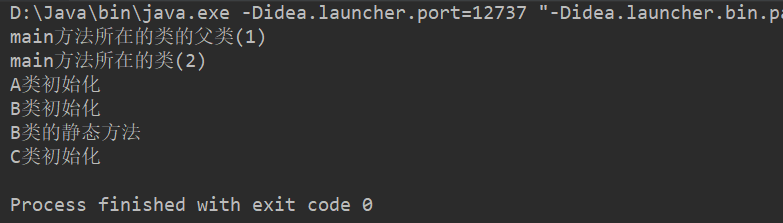

### 类不加载的情况

- 使用某个类的静态的常量（static  final）

- 通过子类调用父类的静态变量，静态方法，只会导致父类初始化，不会导致子类初始化，即只有声明静态成员的类才会初始化

- 用某个类型声明数组并创建数组对象时，不会导致这个类初始化

**面试题如下：**

试问以下哪个类会被加载；

```java
package top.sharehome.Demo;

public class Demo {
    public static void main(String[] args) {
        System.out.println(D.NUM);

        System.out.println(F.num);
        F.test();

        G[] arr = new G[5];
    }
}
class D{
    public static final int NUM = 10;
    static{
        System.out.println("D类的初始化");
    }
}
class E{
    static int num = 10;
    static{
        System.out.println("E父类的初始化");
    }
    public static void test(){
        System.out.println("父类的静态方法");
    }
}
class F extends E{
    static{
        System.out.println("F子类的初始化");
    }
}

class G{
    static{
        System.out.println("G类的初始化");
    }
}
```

打印效果如下：


### 类加载器

很多开发人员都遇到过java.lang.ClassNotFoundException或java.lang.NoClassDefError，想要更好的解决这类问题，或者在一些特殊的应用场景，比如需要支持类的动态加载或需要对编译后的字节码文件进行加密解密操作，那么需要你自定义类加载器，因此了解类加载器及其类加载机制也就成了每一个Java开发人员的必备技能之一。

**类加载器分为:** 

（1）引导类加载器（Bootstrap Classloader）又称为根类加载器

	它负责加载jre/lib中的核心库
	它本身不是Java代码实现的，也不是ClassLoader的子类，获取它的对象时往往返回null

（2）扩展类加载器（Extension ClassLoader）

	它负责加载jre/lib/ext扩展库
	它是ClassLoader的子类

（3）应用程序类加载器（Application Classloader）

	它负责加载项目的classpath路径下的类
	
	它是ClassLoader的子类

（4）自定义类加载器

	当你的程序需要加载“特定”目录下的类，可以自定义类加载器；
	当你的程序的字节码文件需要加密时，那么往往会提供一个自定义类加载器对其进行解码
	后面会见到的自定义类加载器：tomcat中

**Java系统类加载器的双亲委托模式**

==主要是保证了一个类只加载一次；==

**简单描述：**

	下一级的类加载器，如果接到任务时，会先搜索是否加载过，如果没有，会先把任务往上传，如果都没有加载过，一直到根加载器，如果根加载器在它负责的路径下没有找到，会往回传，如果一路回传到最后一级都没有找到，那么会报ClassNotFoundException或NoClassDefError，如果在某一级找到了，就直接返回Class对象。

应用程序类加载器 把扩展类加载器视为父加载器，扩展类加载器把引导类加载器视为父加载器；

但是三者之间并不是继承关系，是组合的方式实现的；

**图示如下：**


## java文件转换为Class对象的过程

**过程如下：**

- `.Java` 文件首先通过编译转换成 `.class` 文件，`.class` 我们是无法看懂的，所以暂时不深究；
- 然后 `.class` 通过类加载器再转变为 Class 对象；

**注意事项：**

该过程结束后，`.java` 文件中的普通变量，构造方法以及普通方法分别转变为了 Class 对象中的 Filed，Constructor 以及 Method，我们平时创建对象，使用对象的成员变量等一系列操作都会转变为去操作 Class 对象中这三者；

## 什么是反射

反射是一种机制/功能，利用该机制/功能可以在**程序运行**过程中对类进行解剖并操作类中的构造方法，成员方法，成员属性；

**反射的应用场景**

各种框架的设计(主要场景)；

各大框架的内部实现也大量使用到了反射机制，所以要想学好这些框架，则必须要求了解反射机制；

## 为什么要用反射

在日常的代码编写中，会接触反射的概率近乎为零，但是反射常常用于框架的编写，框架就是一个半成品，不能完成我们想要的任务，但是拥有绝大多数基本的功能；

由于框架的普适性，编写框架时并不能得知具体的类情况，即不能对一个具体的对象进行 **new ClassName()** ，所以我们只能通过反射来得到我们想要的类，通俗一点就是我们设计一个可以引入对象的对象，类似于这一方法的思想就是反射；

==反射主要功能就是操作 Class 对象；==

## 获取Class对象的方式

- **类型名.class** ：要求编译期间已知类型，所以这种方式并不适用于框架设计；
- **对象.getClass** ：获取对象的运行时类型，也是已知类型，也不适用于框架设计；
- **Class.forName(类型全名称)** ：通常需要和配置文件配合使用，可以获取编译期间未知的类型，这也是框架设计中最常见的一种方式；
- **ClassLoader的类加载器对象.loadClass(类型全称名)** ：可以用系统类加载器对象或自定义加载器对象加载指定路径下的类型，不常用的一种方法；

**获取类型示例如下（前三种）：**

```java
package top.sharehome.Test;

public class Demo {
    public static void main(String[] args) throws Exception {
        //第一种方式
        Class<Test> clazz1 = Test.class;
        System.out.println("clazz1 = " + clazz1);
        //第二种方式
        Test test = new Test();
        Class clazz2 = test.getClass();
        System.out.println("clazz2 = " + clazz2);
        //第三种方式
        Class clazz3 = Class.forName("top.sharehome.Test.Test");
        System.out.println("clazz3 = " + clazz3);
    }
}

class Test {
    private String name = "xiaochen";

    public Test() {
    }

    public Test(String name) {
        this.name = name;
    }

    public String getName() {
        return name;
    }

    public void setName(String name) {
        this.name = name;
    }

}
```

打印效果如下：


## 反射的应用

### 获取类型的详细信息（了解）

可以获取：包、修饰符、类型名、父类（包括泛型父类）、父接口（包括泛型父接口）、成员（属性、构造器、方法）、注解（类上的、方法上的、属性上的）；

- **获取包信息：**

  ```java
  Package pkg = clazz.getPackage();
  ```

- **获取修饰符：**

  ```java
  int mod = clazz.getModifiers();
  ```

  修饰符定义在Modifier类中，该类里面有很多常量值，每一个常量对应一种修饰符；

- **获取类名：**

  ```java
  String name = clazz.getName();
  ```

- **获取父类的字节码对象：**

  ```java
  Class superclass = clazz.getSuperclass();
  ```

- **获取该类实现的所有接口：**

  ```java
  Class[] interfaces = clazz.getInterfaces();
  ```

- **获取该类的所有属性：**

  ```
  Field[] declaredFields = clazz.getDeclaredFields();
  ```

- **获取该类的所有构造函数：**

  ```java
  Method[] declaredMethods = clazz.getDeclaredMethods();
  ```

- **获取该类的所有方法：**

  ```java
  Method[] declaredMethods = clazz.getDeclaredMethods();
  ```

- **获取该类的所有构造方法：**

  ```java
  Constructor[] constructors = clazz.getConstructors();
  ```

**示例如下：**

```java
package top.sharehome.Test;

import java.lang.reflect.Constructor;

public class Demo {
    public static void main(String[] args) throws Exception {
        Class clazz = Class.forName("top.sharehome.Test.Test");
        System.out.println("clazz3 = " + clazz);
        System.out.println("clazz.getPackage() = " + clazz.getPackage());
        System.out.println("clazz.getModifiers() = " + clazz.getModifiers());
        System.out.println("clazz.getName() = " + clazz.getName());
        System.out.println("clazz.getSuperclass() = " + clazz.getSuperclass());
        System.out.println("clazz.getInterfaces() = " + clazz.getInterfaces());
        System.out.println("clazz.getDeclaredField() = " + clazz.getDeclaredFields());
        System.out.println("clazz.getDeclaredMethods() = " + clazz.getDeclaredMethods());
        System.out.println("clazz.getConstructors() = " + clazz.getConstructors());
    }
}

interface Father{
    void Hello();
}

class Test implements Father{
    private String name = "xiaochen";

    public Test() {
    }

    public Test(String name) {
        this.name = name;
    }

    public String getName() {
        return name;
    }

    public void setName(String name) {
        this.name = name;
    }

    @Override
    public void Hello() {
        System.out.println("hello");
    }
}
```

打印效果如下：

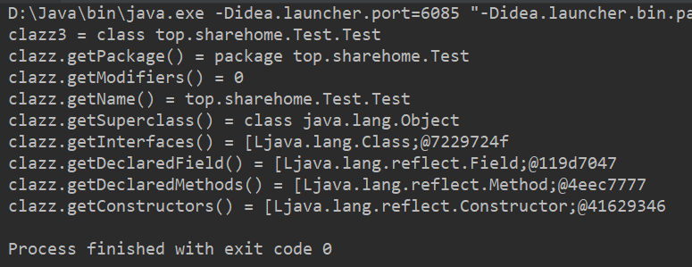

### 创建任意引用类型的对象（重点）

#### 相关方法

`Class类型对象.newInstance()` ；（JDK 9 后被弃用）

`Class类型对象.getDeclaredConstructor().newInstance()`；（newInstance() 替代品）

==这里主要学习第二个方法；==

**`Class类型对象.getDeclaredConstructor(parameterTypes···).newInstance(initargs···);`** 

- **getDeclaredConstructor(parameterTypes···)** 是获取一个 Class 类型自带的构造方法，参数就是类中构造方法参数.class；

  **示例如下：**

  ```java
  //构造方法如下
  public Test(String name, int age, char gender) {
  	this.name = name;
  	this.age = age;
  	this.gender = gender;
  }
  //获得类的构造方法如下
  Class clazz = Test.class;
  Constructor constructor = clazz.getDeclaredConstructor(String.class, int.class, char.class);
  ```

- **`newInstance(initargs···)`** 是在获得了构造器的基础上将 Class 类型对象转换为 Object 对象，==这里要注意该方法的参数需要和 claredConstructor(parameterTypes···) 里的参数相匹配；==

  **示例如下：**

  ```java
  //构造方法如下
  public Test(String name, int age, char gender) {
  	this.name = name;
  	this.age = age;
  	this.gender = gender;
  }
  //引入对象如下：
  Class clazz1 = Test.class;
  Object o1 = clazz1.getDeclaredConstructor(String.class,int.class,char.class).newInstance("xiaowu",21,'男');
  ```

**整体示例如下：**

```java
package top.sharehome.Test;

public class Demo {
    public static void main(String[] args) throws Exception {
        Class clazz1 = Test.class;
        Object o1 = clazz1.getDeclaredConstructor(String.class,int.class,char.class).newInstance("xiaowu",21,'男');
        Test t1 = (Test) o1;
        System.out.println("t1.getName() = " + t1.getName());
    }
}

class Test{
    private String name = "xiaochen";
    private int age = 21;
    private char gender = '女';

    public Test() {
    }

    public Test(String name, int age, char gender) {
        this.name = name;
        this.age = age;
        this.gender = gender;
    }

    public String getName() {
        return name;
    }

    public void setName(String name) {
        this.name = name;
    }

    public int getAge() {
        return age;
    }

    public void setAge(int age) {
        this.age = age;
    }

    public char getGender() {
        return gender;
    }

    public void setGender(char gender) {
        this.gender = gender;
    }
}
```

打印效果如下：


#### 任意类型框架设计

**框架类：**

```java
package top.sharehome.Test;

public class CreateBean {
    public static Object CreateBean(Class clazz) throws Exception {
        return clazz.getDeclaredConstructor().newInstance();
    }
}
```

**使用类：**

```java
package top.sharehome.Test;

public class Demo {
    public static void main(String[] args) throws Exception {
        Test t = (Test) CreateBean.CreateBean(Test.class);
        System.out.println(t);
    }
}

class Test{
    private String name = "xiaochen";
    private int age = 21;
    private char gender = '女';

    public Test() {
    }

    public Test(String name, int age, char gender) {
        this.name = name;
        this.age = age;
        this.gender = gender;
    }

    public String getName() {
        return name;
    }

    public void setName(String name) {
        this.name = name;
    }

    public int getAge() {
        return age;
    }

    public void setAge(int age) {
        this.age = age;
    }

    public char getGender() {
        return gender;
    }

    public void setGender(char gender) {
        this.gender = gender;
    }

    @Override
    public String toString() {
        return "Test{" +
                "name='" + name + '\'' +
                ", age=" + age +
                ", gender=" + gender +
                '}';
    }
}
```

打印效果如下：


### 操作任意类型的属性（重点）

- 获取该类型的Class对象

  ```java
  Class clazz = Class.forName(类型全名称);
  ```

- 获取属性对象

  ```java
  Field field = clazz.getDeclaredField(属性变量名);
  ```

- 设置属性可访问

  ```java
  field.setAccessible(true);
  ```

- 创建实例对象：如果操作的是非静态属性，需要创建实例对象

  ```java
  Object obj = clazz.getDeclaredConstructor().newInstance();
  ```

- 设置属性值

  ```java
  field.set(obj,"chai");
  ```

- 获取属性值

  ```java
  Object value = field.get(obj);
  ```

**操作如下：**

- **利用获取一个类中的所有的变量属性名和值；**

  ```java
  package top.sharehome.Test;
  
  import java.lang.reflect.Field;
  
  public class Demo {
      public static void main(String[] args) throws Exception {
          Class clazz = Test.class;
          Field[] declaredFields = clazz.getDeclaredFields();
          Test t = (Test) clazz.getDeclaredConstructor().newInstance();
          for (Field f : declaredFields) {
              //因为对象中有私有属性，所以要设置属性的可见性
              //这种设置可见性的做法也叫做暴力反射
              f.setAccessible(true);
              //获取属性名
              String name = f.getName();
              //获取属性值
              Object o = f.get(t);
              System.out.println("name:field = " + name + ":" + o);
          }
      }
  }
  
  class Test {
      private String name = "xiaochen";
      private int age = 21;
      private char gender = '女';
  
      public Test() {
      }
  
      public Test(String name, int age, char gender) {
          this.name = name;
          this.age = age;
          this.gender = gender;
      }
  
      public String getName() {
          return name;
      }
  
      public void setName(String name) {
          this.name = name;
      }
  
      public int getAge() {
          return age;
      }
  
      public void setAge(int age) {
          this.age = age;
      }
  
      public char getGender() {
          return gender;
      }
  
      public void setGender(char gender) {
          this.gender = gender;
      }
  
      @Override
      public String toString() {
          return "Test{" +
                  "name='" + name + '\'' +
                  ", age=" + age +
                  ", gender=" + gender +
                  '}';
      }
  }
  ```

  打印效果如下：

  

- **获取一个类中的某一个变量属性名和值；**

  ```java
  package top.sharehome.Test;
  
  import java.lang.reflect.Field;
  
  public class Demo {
      public static void main(String[] args) throws Exception {
          Class clazz = Test.class;
          Test t = (Test) clazz.getDeclaredConstructor().newInstance();
          Field FName = clazz.getDeclaredField("name");
          FName.setAccessible(true);
          String name = FName.getName();
          Object o = FName.get(t);
          System.out.println("name:field ="+name+":"+o);
      }
  }
  
  class Test {
      private String name = "xiaochen";
      private int age = 21;
      private char gender = '女';
  
      public Test() {
      }
  
      public Test(String name, int age, char gender) {
          this.name = name;
          this.age = age;
          this.gender = gender;
      }
  
      public String getName() {
          return name;
      }
  
      public void setName(String name) {
          this.name = name;
      }
  
      public int getAge() {
          return age;
      }
  
      public void setAge(int age) {
          this.age = age;
      }
  
      public char getGender() {
          return gender;
      }
  
      public void setGender(char gender) {
          this.gender = gender;
      }
  
      @Override
      public String toString() {
          return "Test{" +
                  "name='" + name + '\'' +
                  ", age=" + age +
                  ", gender=" + gender +
                  '}';
      }
  }
  ```

  打印效果如下：

  

- **修改一个类中的某一属性值；**

  ```java
  package top.sharehome.Test;
  
  import java.lang.reflect.Field;
  
  public class Demo {
      public static void main(String[] args) throws Exception {
          Class clazz = Test.class;
          Test t = (Test) clazz.getDeclaredConstructor().newInstance();
          Field FName = clazz.getDeclaredField("name");
          FName.setAccessible(true);
          String name = FName.getName();
          Object o = FName.get(t);
          System.out.println("name:field ="+name+":"+o);
          System.out.println("修改后:");
          FName.set(t,"xiaowu");
          Object o1 = FName.get(t);
          System.out.println("name:field ="+name+":"+o1);
      }
  }
  
  class Test {
      private String name = "xiaochen";
      private int age = 21;
      private char gender = '女';
  
      public Test() {
      }
  
      public Test(String name, int age, char gender) {
          this.name = name;
          this.age = age;
          this.gender = gender;
      }
  
      public String getName() {
          return name;
      }
  
      public void setName(String name) {
          this.name = name;
      }
  
      public int getAge() {
          return age;
      }
  
      public void setAge(int age) {
          this.age = age;
      }
  
      public char getGender() {
          return gender;
      }
  
      public void setGender(char gender) {
          this.gender = gender;
      }
  
      @Override
      public String toString() {
          return "Test{" +
                  "name='" + name + '\'' +
                  ", age=" + age +
                  ", gender=" + gender +
                  '}';
      }
  }
  ```

  打印效果如下：

  

### 操作任意类型的方法（重点）

（1）获取该类型的Class对象

```java
Class clazz = Class.forName(类型全名称);
```

（2）获取方法对象

```java
Method method = clazz.getDeclaredMethod("login",String.class,String.class);
```

（3）创建实例对象

```java
Object obj = clazz.getDeclaredConstructor().newInstance();
```

（4）调用方法

```java
Object result = method.invoke(obj,"chai","123");
```

如果方法的权限修饰符修饰的范围不可见，也可以调用setAccessible(true)；

如果方法是静态方法，实例对象也可以省略，用null代替；

如果方法是无参的，那么只需要在 clazz.getDeclaredMethod() 方法中只传入方法名，method.invoke() 方法中传入引入对象名即可；

**操作如下：**

调用方法示例；

```java
package top.sharehome.Test;

import java.lang.reflect.Method;

public class Demo {
    public static void main(String[] args) throws Exception {
        Class clazz = Test.class;
        Object o = clazz.getDeclaredConstructor().newInstance();
        Method method = clazz.getDeclaredMethod("Method", String.class, int.class, char.class);
        //因为方法是私有的
        method.setAccessible(true);
        Object invoke = method.invoke(o, "xiaowu", 21, '男');
        System.out.println("return = " + invoke);
    }
}

class Test {
    private String name = "xiaochen";
    private int age = 21;
    private char gender = '女';

    public Test() {
    }

    public Test(String name, int age, char gender) {
        this.name = name;
        this.age = age;
        this.gender = gender;
    }

    public String getName() {
        return name;
    }

    public void setName(String name) {
        this.name = name;
    }

    public int getAge() {
        return age;
    }

    public void setAge(int age) {
        this.age = age;
    }

    public char getGender() {
        return gender;
    }

    public void setGender(char gender) {
        this.gender = gender;
    }

    @Override
    public String toString() {
        return "Test{" +
                "name='" + name + '\'' +
                ", age=" + age +
                ", gender=" + gender +
                '}';
    }

    private String Method(String name, int age, char gender) {
        this.name = name;
        this.age = age;
        this.gender = gender;
        System.out.println("这是一个返回 Test 类中具体值的方法");
        return "" + this.name + " " + this.age + " " + this.gender;
    }
}
```

打印效果如下：


### Type接口的介绍和获取（了解）

`java.lang.reflect.Type` 接口及其相关接口用于描述 java 中用到的所有类型，是 Java 的反射中很重要的组成部分。Type 是 Java 编程语言中所有类型的公共高级接口。它们包括原始类型、参数化类型、数组类型、类型变量和基本类型，==站在反射的角度上看，Java  生态所有的类都由 Type 接口支撑；==

#### 使用反射获取Type

有很多场景下我们可以获得Type，比如：

- 当我们拿到一个Class，用 `Class.getGenericInterfaces()` 方法得到Type[]，也就是这个类实现接口的Type类型列表，由于 Class 类实现 Type 接口，是父子关系，所以该方法与 `clazz.getInterfaces()` 方法获得的内容一样；

  ```java
  package top.sharehome.Test;
  
  import java.lang.reflect.Type;
  
  public class Demo {
      public static void main(String[] args) {
          Class clazz = Test.class;
          Type[] genericInterfaces = clazz.getGenericInterfaces();
          Class[] interfaces = clazz.getInterfaces();
          System.out.println("Type[] 遍历如下：");
          for (Type t:genericInterfaces) {
              System.out.println(t);
          }
          System.out.println("Class[] 遍历如下：");
          for (Class c:interfaces) {
              System.out.println(c);
          }
      }
  }
  
  interface Father1{
  
  }
  
  interface Father2{
  
  }
  
  class Father3 {
  
  }
  
  class Test extends Father3 implements Father1,Father2 {
      private String name = "xiaochen";
      private int age = 21;
      private char gender = '女';
  
      public Test() {
      }
  
      public Test(String name, int age, char gender) {
          this.name = name;
          this.age = age;
          this.gender = gender;
      }
  
      public String getName() {
          return name;
      }
  
      public void setName(String name) {
          this.name = name;
      }
  
      public int getAge() {
          return age;
      }
  
      public void setAge(int age) {
          this.age = age;
      }
  
      public char getGender() {
          return gender;
      }
  
      public void setGender(char gender) {
          this.gender = gender;
      }
  
      @Override
      public String toString() {
          return "Test{" +
                  "name='" + name + '\'' +
                  ", age=" + age +
                  ", gender=" + gender +
                  '}';
      }
  
      private String Method(String name, int age, char gender) {
          this.name = name;
          this.age = age;
          this.gender = gender;
          System.out.println("这是一个返回 Test 类中具体值的方法");
          return "" + this.name + " " + this.age + " " + this.gender;
      }
  }
  ```

  打印效果如下：

  

- 当我们拿到一个 Class，用 `Class.getDeclaredFields() `方法得到 Field[]，也就是类的属性列表，然后用 `Field. getGenericType()` 方法得到这个属性的 Type 类型。

- 当我们拿到一个Method，用 `Method.getGenericParameterTypes()` 方法获得 Type[]，也就是方法的参数类型列表。

- 当我们拿到一个 Class，用 `Class.getGenericSuperclass()` 这样就可以获取父类的泛型实参列表，和 `Class.getGenericInterfaces()` 方法类似，这个获得的内容和 `class.getSuperclass()` 方法获得的内容一样；

#### Type的分类

Type接口包含了一个实现类 (Class) 和四个实现接口 (TypeVariable, ParameterizedType, GenericArrayType, WildcardType) ，这四个接口都有自己的实现类，但这些实现类开发都不能直接使用，只能用接口。

- Class:  当需要描述的类型是**普通 Java 类、数组、自定义类、 8种java基本类型**的时候， java会选择Class来作为这个Type的实现类，我们甚至可以直接把这个Type强行转换类型为Class。这些类基本都有一个特点：**基本和泛型无关**，其他4种Type的类型，基本都是泛型的各种形态。 
- ParameterizedType: 当需要描述的类是**泛型类**时，比如 List,Map 等，不论代码里写没写具体的泛型，java 会选择 ParameterizedType 接口做为Type的实现。ParameterizedType 接口有 getActualTypeArguments() 方法，用于得到泛型的 Type 类型数组。 
- GenericArrayType:  当需要描述的类型是**泛型类的数组**时，比如比如 List[] , Map[] , type 用GenericArrayType 接口作为 Type 的实现。GenericArrayType 接口有 getGenericComponentType() 方法，得到数组的组件类型的 Type 对象。 
- WildcardType: 当需要描述的类型是泛型类，而且泛型类中的泛型被定义为 (? extends xxx) 或者 (? super xxx) 这种类型，比如 List<? extends TestReflect>，这个类型首先将由ParameterizedType 实现，当调用 ParameterizedType 的 getActualTypeArguments() 方法后得到的 Type 就由 WildcardType 实现。

**示例表格如下：**

|      描述类型举例       | 所用到的 Type 类型 |
| :---------------------: | :----------------: |
|          Test           |       Class        |
|   ArrayList\<String>    | ParameterizedType  |
|     Test\<String>[]     |  GenericArrayType  |
| Test\<? extends Father> |    WildcardType    |

### 使用反射创建和操作任意类型数组

在java.lang.reflect包下还提供了一个Array类，Array对象可以代表所有的数组。程序可以通过使用Array类来动态的创建数组，操作数组元素等。

#### 相关方法

**public static Object newInstance(Class<?> componentType, int... dimensions)**：创建一个具有指定的组件类型和维度的新数组。

**public static void set==Xxx==(Object array,int index,==xxx== value)**：将array数组中[index]元素的值修改为value。此处的==Xxx==对应8种基本数据类型，如果该属性的类型是引用数据类型，则直接使用set(Object array,int index, Object value)方法。

**public static ==xxx== get==Xxx==(Object array,int index,==xxx== value)**：将array数组中[index]元素的值返回。此处的Xxx对应8种基本数据类型，如果该属性的类型是引用数据类型，则直接使用get(Object array,int index)方法。

**示例如下：**

```java
package top.sharehome.Test;

import java.lang.reflect.Array;

public class Demo {
    public static void main(String[] args) {
        Object object = Array.newInstance(int.class, 5);
        Array.setInt(object,0,0);
        Array.setInt(object,1,1);
        Array.setInt(object,2,2);
        for (int i = 0; i < 5; i++) {
            System.out.println("Array.getInt(object,i) = " + Array.getInt(object, i));
        }
    }
}
```

打印效果如下：


# 48.注解

## 什么是注解

注解英文是annotation,是一种代码级别的说明,和类 接口平级关系。相当于一种标记，在程序中加入注解就等于为程序打上某种标记，以后，javac编译器、开发工具和其他程序可以通过反射来了解你的类及各种元素上有无标记，看你的程序有什么标记，就去干相应的事，标记可以加在包、类、属性、方法、方法的参数以及局部变量上定义；

## 注解的作用

执行编译期的检查 例如:@Override；

分析代码(==主要用途：替代配置文件，存储一些配置信息==)，用在框架里面, 注解开发；

##  JDK提供的三个基本注解

- `@Override`:描述方法的重写；

- `@SuppressWarnings`:压制警告，强行消除一些编写警告，比如一些参数的初始化赋值；

- `@Deprecated`:标记过时，IDEA 中的过时是使用贯穿线的方式来表达的；

## 自定义注解（重点）

**格式如下：**

```java
@interface 注解名{
    属性类型 属性名();
    ······
}
```

**属性类型：**

- String 类型
- enum 类型
- 八种基本数据类型
- Class 类型
- 另一个注解类型
- 以及上述类型的数组类型

**示例如下：**

```java
package top.sharehome.Test;

@interface MyAnnotation {
    //String
    String str();

    //enum
    MyEnum me();

    //基本数据类型
    int i();

    double d();

    //Class 类型
    Class clazz();

    //注解类型
    temp t();

    //数组类型
    String[] strs();
}

public class Demo {

}

enum MyEnum {
    RED("红色");
    private String tag;

    MyEnum(String tag) {
        this.tag = tag;
    }

    public String getTag() {
        return tag;
    }
}

@interface temp {
}
```

### 注意点

1. 一旦注解带着属性，那么打上注解的时候就需要为这些属性赋值：

   ```java
   package top.sharehome.Test;
   
   @interface MyAnnotation{
       String str();
       int i();
       Class clazz();
   }
   
   class Test{
       @MyAnnotation(str = "hello java",i = 0,clazz = Test.class)
       public static void main(String[] args) {
           
       }
   }
   ```

2. 注解可以使用 default 关键字，将注解中的一些属性在注解中进行赋值，而赋值后的属性在打上注解时可以不再进行赋值，也可以赋值其他内容对原来的值进行覆盖；

   ```java
   package top.sharehome.Test;
   
   @interface MyAnnotation{
       String str() default "hello java";
       int i() default 0;
       Class clazz();
   }
   
   class Test{
       @MyAnnotation(str = "hihi",clazz = Test.class)
       public static void main(String[] args) {
   
       }
   }
   ```

3. 如果注解属性是数组类型，但是打上注解或者注解内部赋值的时候只有一个值，那么可以省略大括号；

   ```java
   package top.sharehome.Test;
   
   @interface MyAnnotation{
       char[] ch();
       double[] d();
       int[] arr() default 1;
       String[] str() default {"abc","bcd","cde"};
   }
   
   class Test{
       @MyAnnotation(ch = 1,d = {1,2,3},arr = {1,2},str = " ")
       public static void main(String[] args) {
   
       }
   }
   ```

4. 如果在打上注解时只有一个注解属性需要赋值，并且这个属性的属性名是 **value** ，那么可以省略改注解属性名 **value**；

   ```java
   package top.sharehome.Test;
   
   @interface MyAnnotation{
       char[] ch() default 'a';
       int value();
   }
   
   class Test{
       @MyAnnotation(3)
       public static void main(String[] args) {
   
       }
   }
   ```

## 元注解

**定义：**元注解是使用在自定义的注解上，为自定义的注解提供支持的注解；

### 常用元注解

- `@Target`:定义该注解作用在什么上面(位置)，默认注解可以在任何位置. 值为:`ElementType`的枚举值

  - `METHOD`：方法
  - `TYPE`：类或者接口
  - `FIELD`：字段
  - `CONSTRUCTOR`：构造方法声明

- `@Retention`:定义该注解保留到那个代码阶段，值为:`RetentionPolicy`类型，**默认只在源码阶段保留**

  - `SOURCE`：只在源码上保留(默认)
  - `CLASS`：在源码和字节码上保留
  - `RUNTIME`：在所有的阶段都保留 

  java (源码阶段) ----编译---> .class(字节码阶段) ----加载内存--> 运行(RUNTIME)；

## 注解解析

**解析的目的：**

- 获取类，成员变量，成员方法，方法属性，构造函数等上面的注解对象；
- 获取注解对象的属性；
- 判断某个类，成员变量，成员方法等上面是否有某一个注解；

### AnnotatedElement 接口

**相关方法：**

- **T getAnnotation(Class\<T> annotationType);  **获取指定类型的注解引用，没有则返回null。

- **boolean isAnnotationPresent(Class<?extends Annotation> annotationType);**  判断指定类型的注解是否存在；

- Annotation[] getAnnotations()：得到所有的注解，包含从父类继承下来的。==不常用==

- Annotation[] getDeclaredAnnotations()：得到自己身上的注解。==不常用==

==Class、Method、Field、Constructor 等已经实现了 AnnotatedElement 接口；==

**示例如下：**

```java
package top.sharehome.Test;

import java.lang.annotation.*;
import java.lang.reflect.Method;

class Test {
    public static void main(String[] args) throws Exception {
        System.out.println("===========================");
        //注解解析
        //1、判断UseAnnotation类的所有方法上，是否包含MyAnnotation2注解
        //1.1、获取该类的所有方法
        Class clazz = UseAnnotation.class;
        Method[] declaredMethods = clazz.getDeclaredMethods();
        //1.2、遍历出每一个方法，判断该方法是否包含MyAnnotation2注解
        for (int i = 0; i < declaredMethods.length; i++) {
            boolean flag = declaredMethods[i].isAnnotationPresent(MyAnnotation2.class);
            System.out.println("MyAnnotation2: "+declaredMethods[i].getName() + " " + flag);
        }
        System.out.println("===========================");
        //2.获取UseAnnotation类的setAge()方法上的MyAnnotation1注解，并且拿到该注解的所有属性
        //2.1、使用反射获取setAge()方法
        Method setAge = clazz.getDeclaredMethod("setAge", int.class);
        //2.2、获取到setAge()方法上的MyAnnotation1上的注解
        MyAnnotation1 declaredAnnotation = setAge.getDeclaredAnnotation(MyAnnotation1.class);
        //2.3、再获取到注解中的所有属性
        System.out.println("declaredAnnotation.value() = " + declaredAnnotation.value());
        System.out.println("declaredAnnotation.ch() = " + declaredAnnotation.ch());
    }
}

@Retention(RetentionPolicy.RUNTIME)
@interface MyAnnotation1 {
    char[] ch() default 'a';

    int value();
}

@Retention(RetentionPolicy.RUNTIME)
@interface MyAnnotation2 {

}


class UseAnnotation {
    private int age;

    @MyAnnotation1(0)
    @MyAnnotation2
    public void setAge(int age) {
        this.age = age;
    }

    public int getAge() {
        return age;
    }
}
```

打印效果如下：


# 49.Junit——单元测试

想要进行单元测试，需要引入两个外部 jar 包，第一个是 junit.jar ，第二个是 hamcrest-core.jar ，其中 hamcrest-core.jar 是 junit.jar 的依赖包 ，jar 包的下载地址可以使用以下网站：https://mvnrepository.com/；

下载完毕之后导入至项目 lib 文件夹下（若文件夹不存在，则需要自己搭建），然后右击 jar 包点击 **As a library……** 即可导入其中内容；

## Junit相关介绍

**Junit是什么：**

Junit是Java语言编写的第三方单元测试框架

**单元测试概念：**

* 单元：在Java中，一个类就是一个单元
* 单元测试：程序猿编写的一小段代码，用来对某个类中的某个方法进行功能测试或业务逻辑测试。

**Junit单元测试框架的作用：**

用来对类中的方法功能进行有目的的测试，以保证程序的正确性和稳定性，能够让方法独立运行起来。

## 单元测试

### 注意事项

- 被测试方法所存在的类权限修饰符必须是 public；
- 被测试方法权限修饰符必须是 publlic；
- 被测试方法不能包含返回值，即返回值类型为 void；
- 被测试方法不能含有参数；
- 被测试方法必须要打上 @Test 注解来修饰；

**示例如下：**

```java
package top.sharehome.Test;

public class Test {
    @org.junit.Test
    public void TestMethod() {
        System.out.println("hello java");
    }
}
```

打印效果如下：


### Junit常用注解(Junit-4.xxx版本)

* @Test：用来修饰要测试的方法；

* @Before：用来修饰方法，该方法会在每一个测试方法执行之前执行一次。

  这个修饰的方法中通常会做一些全局的初始化工作；

* @After：用来修饰方法，该方法会在每一个测试方法执行之后执行一次。

  这个修饰的方法中通常会做一些全局的销毁

* @BeforeClass：用来静态修饰方法，该方法会在所有测试方法之前执行一次，==不常用==；

* @AfterClass：用来静态修饰方法，该方法会在所有测试方法之后执行一次，==不常用==

**这个版本的 Junit 较为常用，所以只给出这个版本的的示例：**

```java
package top.sharehome.Test;

public class Test {
    @org.junit.Before
    public void Before() {
        System.out.println("这个是Before注解");
    }

    @org.junit.After
    public void After() {
        System.out.println("这个是After注解");
    }

    @org.junit.Test
    public void TestMethod() {
        System.out.println("hello java");
    }
}
```

打印效果如下：


### Junit常用注解(Junit-5.xxx版本)

-  @BeforeEach：用来修饰方法，该方法会在每一个测试方法执行之前执行一次。
-  @AfterEach：用来修饰方法，该方法会在每一个测试方法执行之后执行一次。
-  @BeforeAll：用来静态修饰方法，该方法会在所有测试方法之前执行一次。
-  @AfterAll：用来静态修饰方法，该方法会在所有测试方法之后执行一次。

### 断言

判断一个程序运行的结果是否满足我们的预期；

**相关方法：**

Assert 类中的 assert 系列方法：参数通常格式是**期望值**和**实际值**；


示例如下：

```java
package top.sharehome.Project;

import org.junit.Assert;
import org.junit.Test;

public class Junit {
    @Test
    public void checkMethod() {
        Cacluate cacluate = new Cacluate();
        int sum = cacluate.sum(1, 3);
        Assert.assertEquals(4, sum);
    }
}

class Cacluate {
    public int sum(int a, int b) {
        return a + b + 10;
    }
}
```

打印效果如下：


# 50.Lambda表达式

## 函数式编程思想

**引例如下：**

我们创建一个线程，来打印 hello lambda；

普通做法：

```java
package top.sharehome.Project;

import org.junit.Test;

public class Demo {
    @Test
    public void Test() {
        Runnable tt = new ThreadTest();
        Thread t = new Thread(tt);
        t.start();
    }
}

class ThreadTest implements Runnable {

    @Override
    public void run() {
        System.out.println("hello lambda");
    }
}
```

函数式编程做法：

```java
package top.sharehome.Project;

import org.junit.Test;

public class Demo {
    @Test
    public void testStart() {
        new Thread(() -> {
            System.out.println("hello lambda");
        }).start();
    }
}
```

打印效果如下：


==**即：我们只需要关注具体要做的事情，不用思考具体是由谁（哪个对象）来做，这样就能极大的简化我们的代码，但是这样做是由前提的，那就是保证一个接口中只有一个抽象方法即可，比如这里调用的 Thread() 对象所实现的 Runnable 接口就只有一个抽象方法 run()；**==

## 函数式接口及其分布

lambda表达式其实就是实现SAM接口的语法糖，所谓SAM接口就是Single Abstract Method，即该接口中只有一个抽象方法需要实现，当然该接口可以包含其他非抽象方法；

其实只要满足“SAM”特征的接口都可以称为函数式接口，都可以使用Lambda表达式，但是如果要更明确一点，最好在声明接口时，加上@FunctionalInterface。一旦使用该注解来定义接口，编译器将会强制检查该接口是否确实有且仅有一个抽象方法，否则将会报错；

之前学过的SAM接口中，标记了@FunctionalInterface的函数式接口的有：Runnable，Comparator，FileFilter；

Java8在java.util.function新增了很多函数式接口：主要分为四大类，消费型、供给型、判断型、功能型。基本可以满足我们的开发需求。当然你也可以定义自己的函数式接口；

### 自定义函数式接口

只要确保接口中有且仅有一个抽象方法即可：

```java
修饰符 interface 接口名称 {
    public abstract 返回值类型 方法名称(可选参数信息);
    // 其他非抽象方法内容
}
```

接口当中抽象方法的 public abstract 是可以省略的；

**示例如下：**

```java
package top.sharehome.Project;

public class Demo {
    public static void main(String[] args) {
        CalcTest(1,2,(int a,int b)->{
            return a+b;
        });
    }

    public static void CalcTest(int a,int b,Calc calc){
        System.out.println("计算结果为 "+calc.calc(a,b));
    }
}


//这就是自定义的一个函数接口
interface Calc {
    int calc(int a, int b);
}
```

打印效果如下：


### 消费型接口Consumer

消费型接口的抽象方法特点：有形参，但是返回值类型是void；

| 接口名               | 抽象方法                       | 描述                       |
| -------------------- | ------------------------------ | -------------------------- |
| Consumer<T>          | void accept(T t)               | 接收一个对象用于完成功能   |
| BiConsumer<T,U>      | void accept(T t, U u)          | 接收两个对象用于完成功能   |
| DoubleConsumer       | void accept(double value)      | 接收一个double值           |
| IntConsumer          | void accept(int value)         | 接收一个int值              |
| LongConsumer         | void accept(long value)        | 接收一个long值             |
| ObjDoubleConsumer<T> | void accept(T t, double value) | 接收一个对象和一个double值 |
| ObjIntConsumer<T>    | void accept(T t, int value)    | 接收一个对象和一个int值    |
| ObjLongConsumer<T>   | void accept(T t, long value)   | 接收一个对象和一个long值   |

### 供给型接口Supplier

这类接口的抽象方法特点：无参，但是有返回值；

| 接口名          | 抽象方法               | 描述              |
| --------------- | ---------------------- | ----------------- |
| Supplier<T>     | T get()                | 返回一个对象      |
| BooleanSupplier | boolean getAsBoolean() | 返回一个boolean值 |
| DoubleSupplier  | double getAsDouble()   | 返回一个double值  |
| IntSupplier     | int getAsInt()         | 返回一个int值     |
| LongSupplier    | long getAsLong()       | 返回一个long值    |

### 断言型接口Funtion

这里接口的抽象方法特点：有参，但是返回值类型是boolean结果；

| 接口名           | 抽象方法                   | 描述             |
| ---------------- | -------------------------- | ---------------- |
| Predicate<T>     | boolean test(T t)          | 接收一个对象     |
| BiPredicate<T,U> | boolean test(T t, U u)     | 接收两个对象     |
| DoublePredicate  | boolean test(double value) | 接收一个double值 |
| IntPredicate     | boolean test(int value)    | 接收一个int值    |
| LongPredicate    | boolean test(long value)   | 接收一个long值   |

### 功能型接口Predicate

这类接口的抽象方法特点：既有参数又有返回值；

| 接口名                  | 抽象方法                                        | 描述                                                |
| ----------------------- | ----------------------------------------------- | --------------------------------------------------- |
| Function<T,R>           | R apply(T t)                                    | 接收一个T类型对象，返回一个R类型对象结果            |
| UnaryOperator<T>        | T apply(T t)                                    | 接收一个T类型对象，返回一个T类型对象结果            |
| DoubleFunction<R>       | R apply(double value)                           | 接收一个double值，返回一个R类型对象                 |
| IntFunction<R>          | R apply(int value)                              | 接收一个int值，返回一个R类型对象                    |
| LongFunction<R>         | R apply(long value)                             | 接收一个long值，返回一个R类型对象                   |
| ToDoubleFunction<T>     | double applyAsDouble(T value)                   | 接收一个T类型对象，返回一个double                   |
| ToIntFunction<T>        | int applyAsInt(T value)                         | 接收一个T类型对象，返回一个int                      |
| ToLongFunction<T>       | long applyAsLong(T value)                       | 接收一个T类型对象，返回一个long                     |
| DoubleToIntFunction     | int applyAsInt(double value)                    | 接收一个double值，返回一个int结果                   |
| DoubleToLongFunction    | long applyAsLong(double value)                  | 接收一个double值，返回一个long结果                  |
| IntToDoubleFunction     | double applyAsDouble(int value)                 | 接收一个int值，返回一个double结果                   |
| IntToLongFunction       | long applyAsLong(int value)                     | 接收一个int值，返回一个long结果                     |
| LongToDoubleFunction    | double applyAsDouble(long value)                | 接收一个long值，返回一个double结果                  |
| LongToIntFunction       | int applyAsInt(long value)                      | 接收一个long值，返回一个int结果                     |
| DoubleUnaryOperator     | double applyAsDouble(double operand)            | 接收一个double值，返回一个double                    |
| IntUnaryOperator        | int applyAsInt(int operand)                     | 接收一个int值，返回一个int结果                      |
| LongUnaryOperator       | long applyAsLong(long operand)                  | 接收一个long值，返回一个long结果                    |
| BiFunction<T,U,R>       | R apply(T t, U u)                               | 接收一个T类型和一个U类型对象，返回一个R类型对象结果 |
| BinaryOperator<T>       | T apply(T t, T u)                               | 接收两个T类型对象，返回一个T类型对象结果            |
| ToDoubleBiFunction<T,U> | double applyAsDouble(T t, U u)                  | 接收一个T类型和一个U类型对象，返回一个double        |
| ToIntBiFunction<T,U>    | int applyAsInt(T t, U u)                        | 接收一个T类型和一个U类型对象，返回一个int           |
| ToLongBiFunction<T,U>   | long applyAsLong(T t, U u)                      | 接收一个T类型和一个U类型对象，返回一个long          |
| DoubleBinaryOperator    | double applyAsDouble(double left, double right) | 接收两个double值，返回一个double结果                |
| IntBinaryOperator       | int applyAsInt(int left, int right)             | 接收两个int值，返回一个int结果                      |
| LongBinaryOperator      | long applyAsLong(long left, long right)         | 接收两个long值，返回一个long结果                    |

## Lambda表达式语法

Lambda表达式是用来给【函数式接口】的变量或形参赋值用的。

其实本质上，Lambda表达式是用于实现【函数式接口】的“抽象方法”

Lambda表达式语法格式

```java
(形参列表) -> {Lambda体}
```

说明：

* (形参列表)它就是你要赋值的函数式接口的抽象方法的(形参列表)，照抄
* {Lambda体}就是实现这个抽象方法的方法体
* ->称为Lambda操作符（减号和大于号中间不能有空格，而且必须是英文状态下半角输入方式）

**优化：Lambda表达式可以精简**

* 当{Lambda体}中只有一句语句时，可以省略{}和{;}
* 当{Lambda体}中只有一句语句时，并且这个语句还是一个return语句，那么return也可以省略，但是如果{;}没有省略的话，return是不能省略的
* (形参列表)的类型可以省略
* 当(形参列表)的形参个数只有一个，那么可以把数据类型和()一起省略，但是形参名不能省略
* 当(形参列表)是空参时，()不能省略

示例代码：

```java
public class TestLambdaGrammer {
	@Test
	public void test1(){
		//用Lambda表达式给Runnable接口的形参或变量赋值
		/*
		 * 确定两件事，才能写好lambda表达式
		 * （1）这个接口的抽象方法是否需要传入参数
		 * 		public void run()
		 * （2）这个抽象方法的实现要干什么事
		 * 		例如：我要打印“hello lambda"
		 */
		Runnable r = () -> {System.out.println("hello lambda");};
	}
	
	@Test
	public void test2(){
		//lambda体省略了{;}
		Runnable r = () -> System.out.println("hello lambda");
	}
	
	@Test
	public void test3(){
		String[] arr = {"hello","Hello","java","chai"};
		
		//为arr数组排序，但是，想要不区分大小写
		/*
		 * public static <T> void sort(T[] a,Comparator<? super T> c)
		 * 这里要用Lambda表达式为Comparator类型的形参赋值
		 * 
		 * 两件事：
		 * （1）这个接口的抽象方法：  int compare(T o1, T o2)
		 * （2）这个抽象方法要做什么事？
		 * 		例如：这里要对String类型的元素，不区分大小写的比较大小
		 */
//		Arrays.sort(arr, (String o1, String o2) -> {return o1.compareToIgnoreCase(o2);});
		
		//省略了{return ;}
//		Arrays.sort(arr, (String o1, String o2) ->  o1.compareToIgnoreCase(o2));
		
		//省略了两个String
		Arrays.sort(arr, (o1, o2) ->  o1.compareToIgnoreCase(o2));
		
		for (String string : arr) {
			System.out.println(string);
		}
	}
	
	@Test
	public void test4(){
		ArrayList<String> list = new ArrayList<>();
		list.add("hello");
		list.add("java");
		list.add("world");
		
		/*
		 * JDK1.8给Collection系列的集合，准确的讲是在Iterable接口中，增加了一个默认方法
		 * 		default void forEach(Consumer<? super T> action) 
		 * 这个方法是用来遍历集合等的。代替原来的foreach循环的。
		 * 
		 * 这个方法的形参是Consumer接口类型，它是函数式接口中消费型接口的代表
		 * 我现在调用这个方法，想要用Lambda表达式为Consumer接口类型形参赋值
		 * 
		 * 两件事：
		 * （1）它的抽象方法：  void  accept(T t)
		 * （2）抽象方法的实现要完成的事是什么
		 * 		例如：这里要打印这个t
		 */
//		list.forEach((String t) -> {System.out.println(t);});
		
		//省略{;}
//		list.forEach((String t) -> System.out.println(t));
		
		//省略String
//		list.forEach((t) -> System.out.println(t));
		
		//可以省略形参()
		list.forEach(t -> System.out.println(t));
	}
}
```

## Lambda表达式练习

### 无参无返回值形式

假如有自定义函数式接口Call如下：

```java
public interface Call {
    void shout();
}
```

在测试类中声明一个如下方法：

```java
public static void callSomething(Call call){
    call.shout();
}
```

在测试类的main方法中调用callSomething方法，并用Lambda表达式为形参call赋值，可以喊出任意你想说的话。

```java
public class TestLambda {
	public static void main(String[] args) {
		callSomething(()->System.out.println("回家吃饭"));
		callSomething(()->System.out.println("我爱你"));
		callSomething(()->System.out.println("滚蛋"));
		callSomething(()->System.out.println("回来"));
	}
	public static void callSomething(Call call){
		call.shout();
	}
}
interface Call {
    void shout();
}
```

### 消费型接口

代码示例：Consumer<T>接口

在JDK1.8中Collection集合接口的父接口Iterable接口中增加了一个默认方法：

`public default void forEach(Consumer<? super T> action) `遍历Collection集合的每个元素，执行“xxx消费型”操作。

在JDK1.8中Map集合接口中增加了一个默认方法：

`public default void forEach(BiConsumer<? super K,? super V> action)`遍历Map集合的每对映射关系，执行“xxx消费型”操作。

案例：

（1）创建一个Collection系列的集合，添加你知道的编程语言，调用forEach方法遍历查看

（2）创建一个Map系列的集合，添加一些(key,value)键值对，例如，添加编程语言排名和语言名称，调用forEach方法遍历查看


示例代码：

```java
	@Test
	public void test1(){
		List<String> list = Arrays.asList("java","c","python","c++","VB","C#");
		list.forEach(s -> System.out.println(s));
    }
	@Test
	public void test2(){
		HashMap<Integer,String> map = new HashMap<>();
		map.put(1, "java");
		map.put(2, "c");
		map.put(3, "python");
		map.put(4, "c++");
        map.put(5, "VB");
        map.put(6, "C#");
		map.forEach((k,v) -> System.out.println(k+"->"+v));
	}
```

### 供给型接口

代码示例：Supplier<T>接口

在JDK1.8中增加了StreamAPI，java.util.stream.Stream<T>是一个数据流。这个类型有一个静态方法：

`public static <T> Stream<T> generate(Supplier<T> s)`可以创建Stream的对象，而这种流也被称为无限流。而又包含一个forEach方法可以遍历流中的元素：`public void forEach(Consumer<? super T> action)`。

案例：

现在请调用Stream的generate方法，来产生一个流对象，并调用Math.random()方法来产生数据，为Supplier函数式接口的形参赋值。最后调用forEach方法遍历流中的数据查看结果。

```java
@Test
public void test2(){
    Stream.generate(() -> Math.random()).forEach(num -> System.out.println(num));
}
```

### 功能型接口

代码示例：Funtion<T,R>接口

在JDK1.8时Map接口增加了很多方法，例如：

`public default void replaceAll(BiFunction<? super K,? super V,? extends V> function) `按照function指定的操作替换map中的value。

`public default void forEach(BiConsumer<? super K,? super V> action)`遍历Map集合的每对映射关系，执行“xxx消费型”操作。

案例：

（1）声明一个Employee员工类型，包含编号、姓名、薪资。

（2）添加n个员工对象到一个HashMap<Integer,Employee>集合中，其中员工编号为key，员工对象为value。

（3）调用Map的forEach遍历集合

（4）调用Map的replaceAll方法，将其中薪资低于10000元的，薪资设置为10000。

（5）再次调用Map的forEach遍历集合查看结果

Employee类：

```java
public class Employee{
	private int id;
	private String name;
	private double salary;
	public Employee(int id, String name, double salary) {
		super();
		this.id = id;
		this.name = name;
		this.salary = salary;
	}
	public Employee() {
		super();
	}
	public int getId() {
		return id;
	}
	public void setId(int id) {
		this.id = id;
	}
	public String getName() {
		return name;
	}
	public void setName(String name) {
		this.name = name;
	}
	public double getSalary() {
		return salary;
	}
	public void setSalary(double salary) {
		this.salary = salary;
	}
	@Override
	public String toString() {
		return "Employee [id=" + id + ", name=" + name + ", salary=" + salary + "]";
	}
	
}
```

测试类：

```java
import java.util.HashMap;

public class TestLambda {
	public static void main(String[] args) {
		HashMap<Integer,Employee> map = new HashMap<>();
		Employee e1 = new Employee(1, "张三", 8000);
		Employee e2 = new Employee(2, "李四", 9000);
		Employee e3 = new Employee(3, "王五", 10000);
		Employee e4 = new Employee(4, "赵六", 11000);
		Employee e5 = new Employee(5, "钱七", 12000);
		
		map.put(e1.getId(), e1);
		map.put(e2.getId(), e2);
		map.put(e3.getId(), e3);
		map.put(e4.getId(), e4);
		map.put(e5.getId(), e5);
		
		map.forEach((k,v) -> System.out.println(k+"="+v));
		System.out.println();
		
		map.replaceAll((k,v)->{
			if(v.getSalary()<10000){
				v.setSalary(10000);
			}
			return v;
		});
		map.forEach((k,v) -> System.out.println(k+"="+v));
	}
}
```

### 断言型接口

代码示例：Predicate<T>接口

JDK1.8时，Collecton<E>接口增加了一下方法，其中一个如下：

`public default boolean removeIf(Predicate<? super E> filter)` 用于删除集合中满足filter指定的条件判断的。

`public default void forEach(Consumer<? super T> action) `遍历Collection集合的每个元素，执行“xxx消费型”操作。

**案例一：**

（1）添加一些字符串到一个Collection集合中

（2）调用forEach遍历集合

（3）调用removeIf方法，删除其中字符串的长度<5的

（4）再次调用forEach遍历集合

```java
import java.util.ArrayList;

public class TestLambda {
	public static void main(String[] args) {
		ArrayList<String> list = new ArrayList<>();
		list.add("hello");
		list.add("java");
		list.add("C++");
		list.add("ok");
		list.add("yes");
		
		list.forEach(str->System.out.println(str));
		System.out.println();
		
		list.removeIf(str->str.length()<5);
		list.forEach(str->System.out.println(str));
	}
}
```

**案例二：**

（1）声明一个Employee员工类型，包含编号、姓名、性别，年龄，薪资。

（2）声明一个EmployeeSerice员工管理类，包含一个ArrayList\<Employee>集合的属性all，在EmployeeSerice的构造器中，创建一些员工对象，为all集合初始化。

（3）在EmployeeSerice员工管理类中，声明一个方法：ArrayList\<Employee> get(Predicate\<Employee> p)，即将满足p指定的条件的员工，添加到一个新的ArrayList\<Employee> 集合中返回。

（4）在测试类中创建EmployeeSerice员工管理类的对象，并调用get方法，分别获取：

* 所有员工对象
* 所有年龄超过35的员工
* 所有薪资高于15000的女员工
* 所有编号是偶数的员工
* 名字是“张三”的员工
* 年龄超过25，薪资低于10000的男员工

示例代码：

Employee类：

```java
package com.itheima.pojo;

public class Employee{
	private int id;
	private String name;
	private char gender;
	private int age;
	private double salary;

	public Employee(int id, String name, char gender, int age, double salary) {
		super();
		this.id = id;
		this.name = name;
		this.gender = gender;
		this.age = age;
		this.salary = salary;
	}

	public char getGender() {
		return gender;
	}

	public void setGender(char gender) {
		this.gender = gender;
	}

	public int getAge() {
		return age;
	}

	public void setAge(int age) {
		this.age = age;
	}

	public Employee() {
		super();
	}
	public int getId() {
		return id;
	}
	public void setId(int id) {
		this.id = id;
	}
	public String getName() {
		return name;
	}
	public void setName(String name) {
		this.name = name;
	}
	public double getSalary() {
		return salary;
	}
	public void setSalary(double salary) {
		this.salary = salary;
	}
	@Override
	public String toString() {
		return "Employee [id=" + id + ", name=" + name + ", gender=" + gender + ", age=" + age + ", salary=" + salary
				+ "]";
	}
}
```

员工管理类：

```java
class EmployeeService{
	private ArrayList<Employee> all;
	public EmployeeService(){
		all = new ArrayList<Employee>();
		all.add(new Employee(1, "张三", '男', 33, 8000));
		all.add(new Employee(2, "翠花", '女', 23, 18000));
		all.add(new Employee(3, "无能", '男', 46, 8000));
		all.add(new Employee(4, "李四", '女', 23, 9000));
		all.add(new Employee(5, "老王", '男', 23, 15000));
		all.add(new Employee(6, "大嘴", '男', 23, 11000));
	}
	public ArrayList<Employee> get(Predicate<Employee> p){
		ArrayList<Employee> result = new ArrayList<Employee>();
		for (Employee emp : all) {
			if(p.test(emp)){
				result.add(emp);
			}
		}
		return result;
	}
}
```

测试类：

```java
public class TestLambda {
	public static void main(String[] args) {
		EmployeeService es = new EmployeeService();
		
		es.get(e -> true).forEach(e->System.out.println(e));
		System.out.println();
		es.get(e -> e.getAge()>35).forEach(e->System.out.println(e));
		System.out.println();
		es.get(e -> e.getSalary()>15000 && e.getGender()=='女').forEach(e->System.out.println(e));
		System.out.println();
		es.get(e -> e.getId()%2==0).forEach(e->System.out.println(e));
		System.out.println();
		es.get(e -> "张三".equals(e.getName())).forEach(e->System.out.println(e));
		System.out.println();
		es.get(e -> e.getAge()>25 && e.getSalary()<10000 && e.getGender()=='男').forEach(e->System.out.println(e));
	}
}
```

## 方法引用与构造器引用

Lambda表达式是可以简化函数式接口的变量与形参赋值的语法。而方法引用和构造器引用是为了简化Lambda表达式的。当Lambda表达式满足一些特殊的情况时，还可以再简化：

（1）Lambda体只有一句语句，并且是通过调用一个对象的/类现有的方法来完成的

例如：System.out对象，调用println()方法来完成Lambda体

​          Math类，调用random()静态方法来完成Lambda体

（2）并且Lambda表达式的形参正好是给该方法的实参

例如：t->System.out.println(t)

​        () -> Math.random() 都是无参

### 方法引用

方法引用的语法格式：

（1）实例对象名::实例方法		

（2）类名::静态方法

（3）类名::实例方法

说明：

* :: 称为方法引用操作符（两个:中间不能有空格，而且必须英文状态下半角输入）
* Lambda表达式的形参列表，全部在Lambda体中使用上了，要么是作为调用方法的对象，要么是作为方法的实参。
* 在整个Lambda体中没有额外的数据。

```java
	@Test
	public void test4(){
//		Runnable r = () -> System.out.println("hello lambda");
		Runnable r = System.out::println;//打印空行
		
		//不能简化方法引用，因为"hello lambda"这个无法省略
	}
	
	@Test
	public void test3(){
		String[] arr = {"Hello","java","chai"};
//		Arrays.sort(arr, (s1,s2) -> s1.compareToIgnoreCase(s2));
		
		//用方法引用简化
		/*
		 * Lambda表达式的形参，第一个（例如：s1），正好是调用方法的对象，剩下的形参(例如:s2)正好是给这个方法的实参
		 */
		Arrays.sort(arr, String::compareToIgnoreCase);
	}
	
	@Test
	public void test2(){
//		Stream<Double> stream = Stream.generate(() -> Math.random());
		
		//用方法引用简化
		Stream<Double> stream = Stream.generate(Math::random);
	}
	
	@Test
	public void test1(){
		List<Integer> list = Arrays.asList(1,3,4,8,9);
		
		//list.forEach(t -> System.out.println(t));
		
		//用方法再简化
		list.forEach(System.out::println);
	}
```

### 构造器引用

（1）当Lambda表达式是创建一个对象，并且满足Lambda表达式形参，正好是给创建这个对象的构造器的实参列表。

（2）  当Lambda表达式是创建一个数组对象，并且满足Lambda表达式形参，正好是给创建这个数组对象的长度

构造器引用的语法格式：

* 类名::new
* 数组类型名::new

示例代码：

```java
public class TestMethodReference {
    @Test
	public void teset04() {
		Stream<Integer> stream = Stream.of(1,2,3);
		Stream<int[]> stream2 = stream.map(int[]::new);
	}    
    
    @Test
	public void teset02() {
		Stream<String> stream = Stream.of("1.0","2.3","4.4");
		
//		Stream<BigDecimal> stream2 = stream.map(num -> new BigDecimal(num));
		
		Stream<BigDecimal> stream2 = stream.map(BigDecimal::new);
	}
	
	@Test
	public void test1(){
//		Supplier<String> s = () -> new String();//通过供给型接口，提供一个空字符串对象
		
		//构造器引用
		Supplier<String> s = String::new;//通过供给型接口，提供一个空字符串对象
	}
}
```

# 51.Stream流

## Stream流的优势

Java8中有两大最为重要的改变。第一个是 Lambda 表达式；另外一个则是 Stream API。

Stream API ( java.util.stream) 把真正的函数式编程风格引入到Java中。这是目前为止对Java类库最好的补充，因为Stream API可以极大提高Java程序员的生产力，让程序员写出高效率、干净、简洁的代码。

Stream 是 Java8 中处理集合的关键抽象概念，它可以指定你希望对集合进行的操作，可以执行非常复杂的查找、过滤和映射数据等操作。 使用Stream API 对集合数据进行操作，就类似于使用 SQL 执行的数据库查询。也可以使用 Stream API 来并行执行操作。简言之，Stream API 提供了一种高效且易于使用的处理数据的方式。

Stream是数据渠道，用于操作数据源（集合、数组等）所生成的元素序列。“集合讲的是数据，负责存储数据，Stream流讲的是计算，负责处理数据！”

注意：

①Stream 自己不会存储元素。

②Stream 不会改变源对象。每次处理都会返回一个持有结果的新Stream。

③Stream 操作是延迟执行的。这意味着他们会等到需要结果的时候才执行。

## Stream流的使用步骤

Stream 的操作三个步骤：

- 创建 Stream：通过一个数据源（如：集合、数组），获取一个流
- 中间操作：中间操作是个操作链，对数据源的数据进行n次处理，但是在终结操作前，并不会真正执行。
- 终止操作：一旦执行终止操作，就执行中间操作链，最终产生结果并结束Stream。


### 创建Stream

#### 创建 Stream方式一：通过集合

Java8 中的 Collection 接口被扩展，提供了两个获取流的方法：

* public default Stream<E> stream() : 返回一个顺序流
* public default Stream<E> parallelStream() : 返回一个并行流

```java
@Test
public void test01(){
    List<Integer> list = Arrays.asList(1,2,3,4,5);

    //JDK1.8中，Collection系列集合增加了方法
    Stream<Integer> stream = list.stream();
}
```

#### 创建 Stream方式二：通过数组

Java8 中的 Arrays 的静态方法 stream() 可以获取数组流：

* public static <T> Stream<T> stream(T[] array): 返回一个流

```java
@Test
public void test03(){
    String[] arr = {"hello","world"};
    Stream<String> stream = Arrays.stream(arr);
}

@Test
public void test02(){
    int[] arr = {1,2,3,4,5};
    IntStream stream = Arrays.stream(arr);
}
```

重载形式，能够处理对应基本类型的数组：

* public static IntStream stream(int[] array)：返回一个整型数据流
* public static LongStream stream(long[] array)：返回一个长整型数据流
* public static DoubleStream stream(double[] array)：返回一个浮点型数据流

#### 创建 Stream方式三：通过Stream的of()

可以调用Stream类静态方法 of(), 通过显示值创建一个流。它可以接收任意数量的参数。

* public static<T> Stream<T> of(T... values) : 返回一个顺序流

```java
@Test
public void test04(){
    Stream<Integer> stream = Stream.of(1,2,3,4,5);
    stream.forEach(System.out::println);
}
```

#### 创建 Stream方式四：创建无限流

可以使用静态方法 Stream.iterate() 或者 Stream.generate(), 创建无限流。

* public static<T> Stream<T> iterate(final T seed, final UnaryOperator<T> f):返回一个无限流
* public static<T> Stream<T> generate(Supplier<T> s) ：返回一个无限流

```java
@Test
public void test06(){
    /*
		 * Stream<T> iterate(T seed, UnaryOperator<T> f)  
		 * UnaryOperator接口，SAM接口，抽象方法：
		 * 
		 * UnaryOperator<T> extends Function<T,T>
		 * 		T apply(T t)
		 */
    Stream<Integer> stream = Stream.iterate(1, num -> num+=2);
    //		stream = stream.limit(10);
    stream.forEach(System.out::println);
}

@Test
public void test05(){
    Stream<Double> stream = Stream.generate(Math::random);
    stream.forEach(System.out::println);
}
```

### 中间操作

多个中间操作可以连接起来形成一个流水线，除非流水线上触发终止操作，否则中间操作不会执行任何的处理！而在终止操作时一次性全部处理，称为“惰性求值”。

#### filer过滤

`filter(Predicate p)`可以接收 Lambda ， 从流中排除某些元素

```java
@Test
public void test01(){
    //1、创建Stream
    Stream<Integer> stream = Stream.of(1,2,3,4,5,6);

    //2、加工处理
    //过滤：filter(Predicate p)
    //把里面的偶数拿出来
    /*
		 * filter(Predicate p)
		 * Predicate是函数式接口，抽象方法：boolean test(T t)
		 */
    stream = stream.filter(t -> t%2==0);

    //3、终结操作：例如：遍历
    stream.forEach(System.out::println);
}
```

#### distinct去重

`distinct()`通过流所生成元素的equals() 去除重复元素

```java
@Test
public void test02(){
    Stream.of(1,2,3,4,5,6,2,2,3,3,4,4,5)
        .distinct()
        .forEach(System.out::println);
}
```

#### limit截断

`limit(long maxSize)`截断流，使其元素不超过给定数量，即只保留 Stream 前多少个元素；

```java
@Test
public void test03(){
    Stream.of(1,2,3,4,5,6,2,2,3,3,4,4,5)
        .limit(3)
        .forEach(System.out::println);
}

@Test
public void test04(){
    Stream.of(1,2,2,3,3,4,4,5,2,3,4,5,6,7)
        .distinct()  //(1,2,3,4,5,6,7)
        .filter(t -> t%2!=0) //(1,3,5,7)
        .limit(3)
        .forEach(System.out::println);
}
```

#### skip跳过

`skip(long n)`跳过元素，返回一个扔掉了前 n 个元素的流。若流中元素不足 n 个，则返回一个空流。与 limit(n) 互补

```java
@Test
	public void test05(){
		Stream.of(1,2,3,4,5,6,2,2,3,3,4,4,5)
			.skip(5)
			.forEach(System.out::println);
	}
```

#### peek对每个元素进行Lambda操作

```java
@Test
public void test06(){
    long count = Stream.of(1,2,3,4,5,6,2,2,3,3,4,4,5)
        .distinct()
        .peek(System.out::println)  //Consumer接口的抽象方法  void accept(T t)
        .count();
    System.out.println("count="+count);
}
```


#### sorted排序

`sorted()`产生一个新流，其中按自然顺序排序

```java
@Test
public void test07(){
        Stream.of(11,2,39,4,54,6,2,22,3,3,4,54,54)
                .distinct()
                .sorted()
                .limit(3)
                .forEach(System.out::println);
}
```

`sorted(Comparator com)`产生一个新流，其中按比较器顺序排序

```java
@Test
public void test08(){
    //希望能够找出前三个最大值，前三名最大的，不重复
    Stream.of(11,2,39,4,54,6,2,22,3,3,4,54,54)
        .distinct()
        .sorted((n1,n2) -> n2 - n1)
        .limit(3)
        .forEach(System.out::println);
}
```

#### map映射成新元素

`map(Function f)`接收一个函数作为参数，该函数会被应用到每个元素上，并将其映射成一个新的元素。

```java
@Test
public void test09(){
    Stream.of(1,2,3,4,5)
        .map(t -> t+=1)//Function<T,R>接口抽象方法 R apply(T t)
        .forEach(System.out::println);
}

@Test
public void test10(){
    String[] arr = {"hello","world","java"};

    Arrays.stream(arr)
        .map(t->t.toUpperCase())
        .forEach(System.out::println);
}
```

#### 所有中间操作方法列表

| **方  法**                          | **描  述**                                                   |
| ----------------------------------- | ------------------------------------------------------------ |
| **filter(Predicate p)**             | 接收 Lambda ， 从流中排除某些元素                            |
| **distinct()**                      | 筛选，通过流所生成元素的equals() 去除重复元素                |
| **limit(long maxSize)**             | 截断流，使其元素不超过给定数量                               |
| **skip(long n)**                    | 跳过元素，返回一个扔掉了前 n 个元素的流。若流中元素不足 n 个，则返回一个空流。与 limit(n) 互补 |
| **peek(Consumer** **action)**       | 接收Lambda，对流中的每个数据执行Lambda体操作                 |
| **sorted()**                        | 产生一个新流，其中按自然顺序排序                             |
| **sorted(Comparator com)**          | 产生一个新流，其中按比较器顺序排序                           |
| **map(Function f)**                 | 接收一个函数作为参数，该函数会被应用到每个元素上，并将其映射成一个新的元素。 |
| **mapToDouble(ToDoubleFunction f)** | 接收一个函数作为参数，该函数会被应用到每个元素上，产生一个新的 DoubleStream。 |
| **mapToInt(ToIntFunction f)**       | 接收一个函数作为参数，该函数会被应用到每个元素上，产生一个新的 IntStream。 |
| **mapToLong(ToLongFunction f)**     | 接收一个函数作为参数，该函数会被应用到每个元素上，产生一个新的 LongStream。 |
| **flatMap(Function f)**             | 接收一个函数作为参数，将流中的每个值都换成另一个流，然后把所有流连接成一个流 |

### 终结操作

终端操作会从流的流水线生成结果。其结果可以是任何不是流的值，例如：List、Integer，甚至是 void。流进行了终止操作后，不能再次使用。

#### forEach迭代

```java
@Test
public void test01(){
    Stream.of(1,2,3,4,5)
        .forEach(System.out::println);
}
```

#### count返回流中元素总数

```java
@Test
public void test02(){
    long count = Stream.of(1,2,3,4,5)
        .count();
    System.out.println("count = " + count);
}
```

#### allMatch检查是否匹配所有元素

```java
@Test
public void test03(){
    boolean result = Stream.of(1,3,5,7,9)
        .allMatch(t -> t%2!=0);
    System.out.println(result);
}
```

#### anyMatch检查是否至少匹配一个元素

```java
@Test
public void test04(){
    boolean result = Stream.of(1,3,5,7,9)
        .anyMatch(t -> t%2==0);
    System.out.println(result);
}
```

#### findFirst返回第一个元素

```java
@Test
public void test08(){
    Optional<Integer> opt = Stream.of(1,3,5,7,9).findFirst();
    System.out.println(opt.get());
}
```

#### max返回流中最大值

```java
@Test
public void test02(){
    Optional<Integer> max = Stream.of(1,2,4,5,7,8)
        .max(Integer::compareTo);
    System.out.println(max.get());
}
```

#### reduce可以将流中元素反复结合操作起来，得到一个值

`T reduce(T iden, BinaryOperator b)`可以将流中元素反复结合起来，得到一个值。返回 T

```java
@Test
public void test03(){
    Integer reduce = Stream.of(1,2,4,5,7,8)
        .reduce(0, (t1,t2) -> t1+t2);//BinaryOperator接口   T apply(T t1, T t2)
    System.out.println(reduce);
}
```

`U reduce(BinaryOperator b)`可以将流中元素反复结合起来，得到一个值。返回 Optional<T>

```java
@Test
public void test04(){
    Optional<Integer> max = Stream.of(1,2,4,5,7,8)
        .reduce((t1,t2) -> t1>t2?t1:t2);//BinaryOperator接口   T apply(T t1, T t2)
    System.out.println(max.get());
}
```

#### collect将流转换为其他形式(很重要)

`R collect(Collector c)`将流转换为其他形式。接收一个 Collector接口的实现，用于给Stream中元素做汇总的方法

```java
@Test
public void test14(){
    List<Integer> list = Stream.of(1,2,4,5,7,8)
        .filter(t -> t%2==0)
        .collect(Collectors.toList());

    System.out.println(list);
}
```

#### 所有总结操作的方法列表

| **方法**                                   | **描述**                                                     |
| ------------------------------------------ | ------------------------------------------------------------ |
| **boolean** **allMatch(Predicate p)**      | 检查是否匹配所有元素                                         |
| **boolean** **anyMatch**(**Predicate p**)  | 检查是否至少匹配一个元素                                     |
| **boolean** **noneMatch(Predicate  p)**    | 检查是否没有匹配所有元素                                     |
| **Optional<T>** **findFirst()**            | 返回第一个元素                                               |
| **Optional<T>** **findAny()**              | 返回当前流中的任意元素                                       |
| **long** **count()**                       | 返回流中元素总数                                             |
| **Optional<T>** **max(Comparator c)**      | 返回流中最大值                                               |
| **Optional<T>** **min(Comparator c)**      | 返回流中最小值                                               |
| **void** **forEach(Consumer c)**           | 迭代                                                         |
| **T** **reduce(T iden, BinaryOperator b)** | 可以将流中元素反复结合起来，得到一个值。返回 T               |
| **U** **reduce(BinaryOperator b)**         | 可以将流中元素反复结合起来，得到一个值。返回 Optional<T>     |
| **R** **collect(Collector c)**             | 将流转换为其他形式。接收一个 Collector接口的实现，用于给Stream中元素做汇总的方法 |

Collector 接口中方法的实现决定了如何对流执行收集的操作(如收集到 List、Set、Map)。另外， Collectors 实用类提供了很多静态方法，可以方便地创建常见收集器实例。

### 练习

案例：

现在有两个 ArrayList 集合存储队伍当中的多个成员姓名，要求使用传统的for循环（或增强for循环）依次进行以
下若干操作步骤：

1. 第一个队伍只要名字为3个字的成员姓名；存储到一个新集合中。
2. 第一个队伍筛选之后只要前3个人；存储到一个新集合中。
3. 第二个队伍只要姓张的成员姓名；存储到一个新集合中。
4. 第二个队伍筛选之后不要前2个人；存储到一个新集合中。
5. 将两个队伍合并为一个队伍；存储到一个新集合中。
6. 根据姓名创建 Person 对象；存储到一个新集合中。
7. 打印整个队伍的Person对象信息。

Person 类的代码为：

```java
package com.atguigu.stream;
public class Person {
    private String name;

    public Person() {
    }

    public Person(String name) {
        this.name = name;
    }

    public String getName() {
        return name;
    }

    public void setName(String name) {
        this.name = name;
    }

    @Override
    public String toString() {
        return "Person{" +
                "name='" + name + '\'' +
                '}';
    }
}
```

两个队伍（集合）的代码如下：

```java
public static void main(String[] args) {
       //第一支队伍
        List<String> one = new ArrayList<>();
        one.add("迪丽热巴");
        one.add("宋远桥");
        one.add("苏星河");
        one.add("石破天");
        one.add("石中玉");
        one.add("老子");
        one.add("庄子");
        one.add("洪七公");

        List<String> two = new ArrayList<>();
        two.add("古力娜扎");
        two.add("张无忌");
        two.add("赵丽颖");
        two.add("张三丰");
        two.add("尼古拉斯赵四");
        two.add("张天爱");
        two.add("张二狗");
    
		// ....编写代码完成题目要求 
    }
```

参考答案：

```java
package top.sharehome.homework;

import java.util.ArrayList;
import java.util.List;
import java.util.stream.Collectors;
import java.util.stream.Stream;

public class Demo {
    public static void main(String[] args) {
        //第一支队伍
        List<String> one = new ArrayList<>();
        one.add("迪丽热巴");
        one.add("宋远桥");
        one.add("苏星河");
        one.add("石破天");
        one.add("石中玉");
        one.add("老子");
        one.add("庄子");
        one.add("洪七公");

        List<String> two = new ArrayList<>();
        two.add("古力娜扎");
        two.add("张无忌");
        two.add("赵丽颖");
        two.add("张三丰");
        two.add("尼古拉斯赵四");
        two.add("张天爱");
        two.add("张二狗");

        System.out.println("第一个队伍只要名字为3个字的成员姓名；存储到一个新集合中:");
        one.stream().
                filter(s -> s.length() == 3).
                collect(Collectors.toList()).
                stream().
                forEach(System.out::println);
        System.out.println();
        System.out.println("第一个队伍筛选之后只要前3个人；存储到一个新集合中:");
        one.stream().
                filter(s -> s.length() == 3).
                collect(Collectors.toList()).
                stream().
                limit(3).
                forEach(System.out::println);
        System.out.println();
        System.out.println("第二个队伍只要姓张的成员姓名；存储到一个新集合中:");
        two.stream().
                filter(s -> s.startsWith("张")).
                collect(Collectors.toList()).
                stream().
                forEach(System.out::println);
        System.out.println();
        System.out.println("第二个队伍筛选之后不要前2个人；存储到一个新集合中:");
        two.stream().
                filter(s -> s.startsWith("张")).
                collect(Collectors.toList()).
                stream().
                skip(2).
                forEach(System.out::println);
        System.out.println();
        System.out.println("将刚才那两个处理后的队伍合并为一个队伍；存储到一个新集合中:");
        Stream<String> newOne = one.stream().filter(s -> s.length()==3).limit(3);
        Stream<String> newTwo = two.stream().filter(s -> s.startsWith("张")).skip(2);
        List<String> all = Stream.concat(newOne, newTwo).collect(Collectors.toList());
        all.forEach(System.out::println);
        System.out.println();
        System.out.println("根据姓名创建 Person 对象；存储到一个新集合中:");
        List<Person> newAll = all.stream().map(x -> new Person(x)).collect(Collectors.toList());
        System.out.println(newAll);
        System.out.println();
        System.out.println("打印整个队伍的Person对象信息:");
        newAll.stream().forEach(System.out::println);
    }
}

class Person {
    private String name;

    public Person() {
    }

    public Person(String name) {
        this.name = name;
    }

    public String getName() {
        return name;
    }

    public void setName(String name) {
        this.name = name;
    }

    @Override
    public String toString() {
        return "Person{" +
                "name='" + name + '\'' +
                '}';
    }
}
```

打印效果如下：


# 52.Optional类

到目前为止，臭名昭著的空指针异常是导致Java应用程序失败的最常见原因。以前，为了解决空指针异常，Google公司著名的Guava项目引入了Optional类，Guava通过使用检查空值的方式来防止代码污染，它鼓励程序员写更干净的代码。受到Google Guava的启发，Optional类已经成为Java 8类库的一部分；

Optional实际上是个容器：它可以保存类型T的值，或者仅仅保存null。Optional提供很多有用的方法，这样我们就不用显式进行空值检测；

## 创建Optional对象

（1）static <T> Optional<T> empty() ：用来创建一个空的Optional

```java
@Test
public void test01(){
    Optional<String> opt = Optional.empty();
    System.out.println(opt);
}
```

（2）static <T> Optional<T> of(T value) ：用来创建一个非空的Optional，且value不能为null；

```java
@Test
public void test02(){
    String str = "hello";
    Optional<String> opt = Optional.of(str);
    System.out.println(opt);
}
```

（3）static <T> Optional<T> ofNullable(T value) ：用来创建一个可能是空，也可能非空的Optional ==最常用==

```java
@Test
public void test03(){
    String str = null;
    Optional<String> opt = Optional.ofNullable(str);
    System.out.println(opt);
}
```

## 从Optional容器中取出所包装的对象

（1）T get()  ：要求Optional容器必须非空；

```java
@Test
public void test04(){
    String str = "hello";
    Optional<String> opt = Optional.of(str);
    System.out.println(opt.get());
}
```

（2）T orElse(T other)  ：

orElse(T other) 与ofNullable(T value)配合使用；

如果Optional容器中非空，就返回所包装值，如果为空，就用orElse(T other), other是指定的默认值（备胎）代替；

```java
@Test
public void test05(){
    String str = "hello";
    Optional<String> opt = Optional.ofNullable(str);
    String string = opt.orElse("atguigu");
    System.out.println(string);
}
```

（3）T orElseGet(Supplier<? extends T> other)  ：

如果Optional容器中非空，就返回所包装值，如果为空，就用Supplier接口的Lambda表达式提供的值代替；

```java
@Test
public void test06(){
    String str = null;
    Optional<String> opt = Optional.ofNullable(str);
    String string = opt.orElseGet(String::new);
    System.out.println(string);
}
```

（4）<X extends Throwable> T orElseThrow(Supplier<? extends X> exceptionSupplier) 

如果Optional容器中非空，就返回所包装值，如果为空，就抛出你指定的异常类型代替原来的NoSuchElementException；

```java
@Test
public void test07(){
    String str = null;
    Optional<String> opt = Optional.ofNullable(str);
    String string = opt.orElseThrow(()->new RuntimeException("值不存在"));
    System.out.println(string);
}
```

3、其他方法

（1）boolean isPresent()  ：判断Optional容器中是否有值；

```java
@Test
public void test08(){
    Optional<String> op = Optional.of("hello");
    boolean present = op.isPresent();
    System.out.println(present);
}
```

（2）void ifPresent(Consumer<? super T> consumer) ：

判断Optional容器中的值是否存在，如果存在，就对它进行Consumer指定的操作，如果不存在就不做；

```java
@Test
public void test09(){
    Optional<String> op = Optional.of("hello");
    op.ifPresent(s -> System.out.println("存在值"));
}
```

（3）<U> Optional<U> map(Function<? super T,? extends U> mapper)  

判断Optional容器中的值是否存在，如果存在，就对它进行Function接口指定的操作，如果不存在就不做；

```java
@Test
public void test10(){
    String str = "Hello";
    Optional<String> opt = Optional.ofNullable(str);
    //判断是否是纯字母单词，如果是，转为大写，否则保持不变
    String result = opt.filter(s->s.matches("[a-zA-Z]+")).
        map(s -> s.toLowerCase()).
        orElse(str);
    System.out.println(result);
}
```

## 练习

**案例一：**

（1）声明一个Girl类型，包含姓名（String）属性

（2）声明一个Boy类型，包含姓名（String），女朋友（Girl）属性

（3）在测试类中，创建一个Boy对象，并

如果他有女朋友，显示他女朋友名称；

如果他没有女朋友，他的女朋友默认为“嫦娥”，即只能欣赏“嫦娥”了

```java
class Girl{
	private String name;

	public Girl(String name) {
		super();
		this.name = name;
	}

	public String getName() {
		return name;
	}

	public void setName(String name) {
		this.name = name;
	}

	@Override
	public String toString() {
		return "Girl [name=" + name + "]";
	}
	
}
class Boy{
	private String name;
	private Girl girlFriend;
	public Boy(String name, Girl girlFriend) {
		super();
		this.name = name;
		this.girlFriend = girlFriend;
	}
	public String getName() {
		return name;
	}
	public void setName(String name) {
		this.name = name;
	}
	public Girl getGirlFriend() {
		return girlFriend;
	}
	public void setGirlFriend(Girl girlFriend) {
		this.girlFriend = girlFriend;
	}
	@Override
	public String toString() {
		return "Boy [name=" + name + ", girlFriend=" + girlFriend + "]";
	}
	
}
```

测试类

```java
	public static void main(String[] args) {
//		Boy boy = new Boy("张三",null);
		Boy boy = new Boy("张三",new Girl("翠翠"));
		Optional<Girl> grilFriend = Optional.ofNullable(boy.getGirlFriend());
		Optional.of(grilFriend.orElse(new Girl("嫦娥"))).ifPresent(g->System.out.println(g));
	}
```

**案例二：**

（1）声明学生类，包含姓名和年龄

（2）添加几个学生对象到一个ArrayList<Student>集合中

（3）对集合中的学生进行操作，找出年龄大于30岁的，并取出第一个学生，如果没有这样的学生，用无参构造new一个学生对象，打印学生信息

学生类示例代码：

```java
class Student{
	private String name;
	private int age;
	public Student(String name, int age) {
		super();
		this.name = name;
		this.age = age;
	}
	public Student() {
		super();
	}
	public String getName() {
		return name;
	}
	public void setName(String name) {
		this.name = name;
	}
	public int getAge() {
		return age;
	}
	public void setAge(int age) {
		this.age = age;
	}
	@Override
	public String toString() {
		return "Student [name=" + name + ", age=" + age + "]";
	}
}
```

测试类

```java
@Test
public void test1(){
    ArrayList<Student> list = new ArrayList<>();
    list.add(new Student("张三", 23));
    //...

    //取出流中第一个年龄大于30岁的学生的年龄，并打印它的年龄，如果没有，用无参构造创建一个学生对象
    Student stu = list.stream()
        .filter(s -> s.getAge()>30)
        .findFirst().orElse(new Student());
    System.out.println("学生的年龄：" + stu.getAge());
}
```

# 53.JDK8新特性

## 前言

到此为止，Java 的基础知识都已经全部展现出来了，但是随着 Java 的更新迭代，Java 不同版本之间会出现一些显著特性，之前有关 Java 基础知识的所有文章均是基于 JDK8 版本所描述的，此后的文章就会推出 JDK8 之后版本的特性介绍。

本章节是“JDK8新特性“，但有一些已经在以往的文章中做出过介绍，它们的文章索引如下：

- [50.Lambda表达式](#50lambda表达式)
- [51.Stream流](#51stream流)
- [52.Optional类](#52optional类)

## 收集器Collectors

 `java.util.stream.Collectors` 实现了 `java.util.stream.Collector` 接口，同时又提供了大量的方法对流 ( stream ) 的元素执行 Map And Reduce 操作，或者统计操作，**Collectors主要用于 `stream.collect()` 方法中。**

其实在以往的文章中用到过该工具类，例如：

```java
public static void main(String[] args) {
    List<Integer> collect = Stream.of(1, 2, 3, 4, 5)
            .collect(Collectors.toList());
    System.out.println(collect);
}
```

打印效果如下：

```
[1, 2, 3, 4, 5]
```

接下来认识一些更多的常见 API 。

### 求平均值averagingXXX

`avergingXXX()` 是一类方法，主要用于在流式计算中获取流中元素的平均值，接下来主要以 `averagingDouble()` 方法为例。

`averagingDouble()` 方法将流中的所有元素视为 Double 类型并计算他们的平均值，这些元素均为 Number 类型，计算后的平均值返回为 Double 类型。

```java
public static void main(String[] args) {
    Double collect = Stream.of(1f, 2f, 3f, 4f, 5f)
            .collect(Collectors.averagingDouble(d -> d));
    System.out.println(collect);
}
```

打印结果如下：

```
3.0
```

类似的还有 `averagingInt()` 、`averagingLong()` 两个方法，不同点是它们将流中的元素分别视为 Integer 类型和 Long 类型，以及类型之间不可转换的问题。

### 次序操作collectingAndThen

`Collectors.collectingAndThen()` 函数应该最像 Map And Reduce 过程，它可接受两个函数式参数，第一个参数用于 Reduce 操作，而第二参数用于 Map 操作，也就是说第二个参数处理完之后的流会传递给第一个参数进行处理，例如现在将一个流中的数字“+1”之后再求平均值：

```java
public static void main(String[] args) {
    Double collect = Stream.of(1f, 2f, 3f, 4f, 5f)
            .collect(Collectors.collectingAndThen(Collectors.averagingDouble(v -> v),
                    s -> s + 1));
    System.out.println(collect);
}
```

打印效果如下：

```
4.0
```

### 计数counting

`Collectors.counting()` 用于统计流中元素的个数，例如：

```java
public static void main(String[] args) {
    Long collect = Stream.of(1f, 2f, 3f, 4f, 5f)
            .collect(Collectors.counting());
    System.out.println(collect);
}
```

打印效果如下：

```
5
```

### 内容拼接joining

`Collectors.joining()` 方法用某个指定的拼接字符把所有的字符串流元素拼接成一个字符串，并添加可选的前缀和后缀，例如：

```java
public static void main(String[] args) {
    String collect = Stream.of(1, 2, 3, 4, 5)
            .map(Object::toString)
            .collect(Collectors.joining(",", "prefix", "suffix"));
    System.out.println(collect);
}
```

打印效果如下：

```
prefix1,2,3,4,5suffix
```

### 最值maxBy&minBy

`Collectors.maxBy()` 和 `Collectors.minBy()` 两个方法分别用于计算流中所有元素的最大值和最小值。两个方法都可以接受一个比较器作为参数，用于设计如何计算最大值或最小值，例如将字符串转换成字符，然后“+1”，同时转换成字符串，最后计算最大值：

```java
Optional<String> collect = Stream.of("A", "B", "D", "C")
        .map(data-> String.valueOf((char) (data.charAt(0) +1)))
        .collect(Collectors.maxBy((o1, o2) -> {
            return o1.charAt(0) - o2.charAt(0);
        }));
System.out.println(collect.get());
```

打印效果如下：

```
E
```

最小值使用方法相同，这里就不进行示例演示。

### 求累加和summingXXX

`summingXXX()` 是一类方法，主要用于在流式计算中获取流中元素的累加和，接下来主要以 `summingInt()` 方法为例。

`Collectors.summingInt()` 方法将流中的所有元素视为 Integer 类型，并计算所有元素的累加和，返回类型也是 Integer 类型：

```java
public static void main(String[] args) {
    Integer collect = Stream.of(1, 2, 3, 4, 5)
            .collect(Collectors.summingInt(data -> data));
    System.out.println(collect);
}
```

打印效果如下：

```
15
```

类似的还有 `summingDouble()` 、`summingLong()` 两个方法，不同点是它们将流中的元素分别视为 Double 类型和 Long 类型，返回值类型也一一对应，以及类型之间不可转换的问题。

### 转换mapping&flatMapping

`Collectors.mapping()` 和 `Collectors.flatMapping()` 可以看作是本质相同，但途径不同的 标准 Map And Reduce 过程。均有两个函数式参数，第一个参数是 Map 操作，第二个参数是 Reduce 操作，途经区别在于 `Collectors.mapping()` 方法对流中元素每次 Map 操作得到的是一个具体的值，而 `Collectors.flatMapping()` 方法对流中元素每次 Map 操作得到的是一个与元素相对应的数据流，说简单点即后者具有升维/降维的转换能力，示例如下：

```java
Stream<Integer> integerStream1 = Stream.of(1, 2, 3, 4, 5);
List<Integer> collect1 = integerStream1
        .collect(Collectors.flatMapping(data -> {
            return Stream.of(data + 1, data * 10);
        }, Collectors.toList()));
System.out.println(collect1);
Stream<Integer> integerStream2 = Stream.of(1, 2, 3, 4, 5);
List<Integer> collect2 = integerStream2
        .collect(Collectors.mapping(data -> {
            return data + 1;
        }, Collectors.toList()));
System.out.println(collect2);
```

打印效果如下：

```
[2, 10, 3, 20, 4, 30, 5, 40, 6, 50]
[2, 3, 4, 5, 6]
```

## 编解码器Base64

Base64 是一种常见的字符编码解码方式，一般用于将二进制数据编码为更具可读性的 Base64 进制格式。

Java 8 中的 `java.util.Base64` 类提供了三种类型的 Base64 编码解码格式：

**1、** **简单类型( simple )**：编码字符只包含 A-Za-z0-9+/ 等 64 个字符。且编码的时候不会包含任何换行符 ( \r 、 \n 、\r\n ）。解码的时候也只会解码 A-Za-z0-9+/ 内的字符，超出的则会被拒绝。

**2、** **URL**：编码字符只包含 A-Za-z0-9+_ 等 64 个字符。和 **简单类型** 相比，就是把 / 换成了 _ 。因为没有 / 字符，因此这种编码方式非常适合 URL 和文件名等。

**3、** **MIME**：编码会被映射为 MIME 友好格式：每一行输出不超过 76 个字符，而且每行以 \r\n 符结束。但末尾行并不会包含 \r\n。

### 内部类

`java.util.Base64` 还包含了两个内部静态类，分别实现了 RFC 4648 和 RFC 2045 中规范的 Base64 编码和解码方式。

| 内部类                      | 说明                                                         |
| :-------------------------- | :----------------------------------------------------------- |
| static class Base64.Decoder | 该类实现使用 RFC 4648 和 RFC 2045 中规定的 Base64 解码方案解码数据 |
| static class Base64.Encoder | 该类实现使用 RFC 4648 和 RFC 2045 中规定的 Base64 编码方案编码数据 |

### 静态方法

`java.util.Base64` 类提供的都是静态方法。下表列出了这些静态方法：

| 方法                                                         | 说明                                                         |
| :----------------------------------------------------------- | :----------------------------------------------------------- |
| Base64.Decoder getDecoder()                                  | 返回一个 `Base64.Decoder` 类型的 **简单** 解码器             |
| Base64.Encoder getEncoder()                                  | 返回一个 `Base64.Encoder` 类型的 **简单** 编码器             |
| Base64.Decoder getMimeDecoder()                              | 返回一个 `Base64.Decoder` 类型的 **MIME** 解码器             |
| Base64.Encoder getMimeEncoder()                              | 返回一个 `Base64.Encoder` 类型的 **MINE** 编码器             |
| Base64.Encoder getMimeEncoder( int lineLength, byte[] lineSeparator) | 返回一个 `Base64.Encoder` 类型的使用特定长度和行分隔符的 **MINE** 编码器 |
| Base64.Decoder getUrlDecoder()                               | 返回一个 `Base64.Decoder` 类型的 **URL 和文件名安全**的解码器 |
| Base64.Encoder getUrlEncoder()                               | 返回一个 `Base64.Encoder` 类型的 **URL 和文件名安全**的编码器 |

### 用法示例

这里以**简单**类型为例：

```java
public static void main(String[] args) {
    String str = "Java Notes Of AntonyCHeng";
    String encodeStr = Base64.getEncoder().encodeToString(str.getBytes(StandardCharsets.UTF_8));
    String decodeStr = new String(Base64.getDecoder().decode(encodeStr));
    System.out.println("str = " + str);
    System.out.println("encodeStr = " + encodeStr);
    System.out.println("decodeStr = " + decodeStr);
}
```

打印效果如下：

```
str = Java Notes Of AntonyCHeng
encodeStr = SmF2YSBOb3RlcyBPZiBBbnRvbnlDSGVuZw==
decodeStr = Java Notes Of AntonyCHeng
```

## 接口默认方法

### JDK8之前的接口

在 JDK8 之前，interface 之中可以定义变量和方法，变量必须是 public 、static 、final 的，方法必须是 public 、abstract 的。由于这些修饰符都是默认的以下写法等价：

```java
public interface JDK8BeforeInterface {  
    public static final int field1 = 0;  
  
    int field2 = 0;  
  
    public abstract void method1(int a) throws Exception;  
  
    void method2(int a) throws Exception;  
}
```

### JDK8之后的接口

JDK8及以后，允许我们在接口中定义static方法和default方法

- 接口中定义的静态static方法只能通过接口名直接调用，default的方法需要用接口的实现类的对象来调用
- 接口中的static和default方法可以有函数体，其实现类不必要重写
- 其他的非static和非default的都是抽象方法，没有函数体，其实现类必须重写所有的抽象方法
- 如果子类（或实现类）继承的父类和其实现的接口定义了同名同参的方法，并且接口中的方法为default方法（都有函数体），那么该子类的对象调用该方法时（在子类没有重写该方法的情况下），默认是父类的方法（类优先性）
- 如果类实现了多个接口，而且多个接口中定义了同名同参数的default方法（有函数体），在该类没有重写的情况下，就会报错（接口冲突）。如果想解决这个问题，就必须在该类中重写此方法。

```java
public interface JDK8Interface {  
  
    // static修饰符定义静态方法  
    static void staticMethod() {  
        System.out.println("接口中的静态方法");  
    }  
  
    // default修饰符定义默认方法  
    default void defaultMethod() {  
        System.out.println("接口中的默认方法");  
    }  
}  
 
public class JDK8InterfaceImpl implements JDK8Interface {  
    //实现接口后，因为默认方法不是抽象方法，所以可以不重写，但是如果开发需要，也可以重写  
}  
 
public class Main {  
    public static void main(String[] args) {  
        // static方法必须通过接口类调用  
        JDK8Interface.staticMethod();  
  
        //default方法必须通过实现类的对象调用  
        new JDK8InterfaceImpl().defaultMethod();  
    }  
}  
 
 
public class AnotherJDK8InterfaceImpl implements JDK8Interface {  
    // 当然如果接口中的默认方法不能满足某个实现类需要，那么实现类可以覆盖默认方法。  
    // 签名跟接口default方法一致,但是不能再加default修饰符  
    @Override  
    public void defaultMethod() {  
        System.out.println("接口实现类覆盖了接口中的default");  
    }  
}  
```

## Nashorn JavaScript

对于 Java 中的 JavaScript 引擎， Java 8 引入了 Nashorn 来代替原先的 Rhino。

Nashorn 使用 Java 7 中引入的调用动态特性，且直接编译内存中的代码并将字节码传递给 JVM。这两项改进，直接给 Nashorn 带了至少 2 到 10 倍的性能提升。

在 Nashorn JavaScript 引擎中。Java 8 引入了一个新的命令行工具 `jjs`，用于在控制台执行 JavaScript 代码。例如可以在当前目录下 ( 任意位置 ) 创建一个 JavaScript 文件 hello.js ，然后在命令行中使用如下命令就可以运行 hello.js 文件。

## 日期时间API

从 Java 5 开始，处理日期时间都由 `java.util.Date` 、`java.util.Calendar` 、`java.util.GregoiranCalendar` 和 `java.text.SimpleDateFormat` 四大类负责，分别用于处理日期、日历、日历表示、日期时间格式化。

但是这些类早在很久以前就有非常多设计不合理的地方，比如 `java.util.Date` 并非线程安全； `java.util.Date` 默认的时间年月日分别从 1900，1，0 开始的，非常反人类......于是乎在 Java 8 中重新设计了所有时间、日历和时区相关的API，并且统一规划在了 `java.time` 包及其子包下。

### 本地日期时间

Java 8 为处理本地的日期时间提供了三个类 `LocalDate` 、`LocalTime` 和 `LocalDateTime`。分别用于处理 **本地日期**、**本地时间** 和 **本地日期时间**。

当使用这三个类时，开发者并不需要关心时区是什么。因为它默认使用的是操作系统的时区。

比如，可以使用 `LocalDateTime.now()` 方法返回当前的日期时间。

**获取当前日期时间示例如下：**

```java
public static void main(String[] args) {
    System.out.println("LocalDate.now() = " + LocalDate.now());
    System.out.println("LocalTime.now() = " + LocalTime.now());
    System.out.println("LocalDateTime.now() = " + LocalDateTime.now());
}
```

打印效果如下：

```
LocalDate.now() = 2024-03-31
LocalTime.now() = 16:49:37.469327600
LocalDateTime.now() = 2024-03-31T16:49:37.469327600
```

**获取当前时间的年月日时分秒示例如下：**

```java
public static void main(String[] args) {
    LocalDateTime dateTime = LocalDateTime.now();
    System.out.println("dateTime = " + dateTime);
    System.out.println("dateTime.getYear() = " + dateTime.getYear());
    System.out.println("dateTime.getMonth() = " + dateTime.getMonth());
    System.out.println("dateTime.getDayOfMonth() = " + dateTime.getDayOfMonth());
    System.out.println("dateTime.getHour() = " + dateTime.getHour());
    System.out.println("dateTime.getMinute() = " + dateTime.getMinute());
    System.out.println("dateTime.getSecond() = " + dateTime.getSecond());
}
```

打印结果如下：

```
dateTime = 2024-03-31T16:54:24.719364900
dateTime.getYear() = 2024
dateTime.getMonth() = MARCH
dateTime.getDayOfMonth() = 31
dateTime.getHour() = 16
dateTime.getMinute() = 54
dateTime.getSecond() = 24
```

**创建日期时间示例如下：**

```java
public static void main(String[] args) {
    LocalDateTime customDateTime = LocalDateTime.of(2001, 11, 11, 12, 13, 14);
    System.out.println("customDateTime = " + customDateTime);
}
```

打印结果如下：

```
customDateTime = 2001-11-11T12:13:14
```

**修改日期时间示例如下：**

```java
public static void main(String[] args) {
    LocalDateTime oldDateTime = LocalDateTime.of(2001, 11, 11, 12, 13, 14);
    LocalDateTime newDateTime = oldDateTime
            .withYear(2020)
            .withMonth(1)
            .withDayOfMonth(1)
            .withMinute(0)
            .withSecond(0);
    System.out.println("oldDateTime = " + oldDateTime);
    System.out.println("newDateTime = " + newDateTime);
}
```

打印结果如下：

```
oldDateTime = 2001-11-11T12:13:14
newDateTime = 2020-01-01T12:00
```

**解析字符串示例如下：**

```java
public static void main(String[] args) {
    LocalDateTime parseDateTime = LocalDateTime.parse("2012-10-10T21:58:00");
    LocalDateTime parseFormatDateTime = LocalDateTime.parse("2020.01.01 12:13:14", DateTimeFormatter.ofPattern("yyyy.MM.dd HH:mm:ss"));
    System.out.println("parseDateTime = " + parseDateTime);
    System.out.println("parseFormatDateTime = " + parseFormatDateTime);
}
```

打印效果如下：

```
parseDateTime = 2012-10-10T21:58
parseFormatDateTime = 2020-01-01T12:13:14
```

### 时区日期时间

`LocalDateTime` 类中看似没有时区的相关信息，但是它们内部其实已经处理了时区，只是默认使用的是当前操作系统的时区。但是如果自己维护的服务器位于德国柏林，上面的 Java 程序为中国境内用户提供服务，此时就需要从代码层面约定时区，Java 8 中 `java.time.ZonedDateTime` 和 `java.time.ZoneId` 就起到了作用，前者用于处理需要时区的日期时间，后者用于处理时区。

`ZonedDateTime` 和 `LocalDateTime` 类似，几乎有着相同的 API。从某些方面说，`ZonedLocalTime` 如果不传递时区信息，那么它会默认使用操作系统的时区，这样，结果其实和 `LocalDateTime` 是类似的，而且在时区确定的情况下，这两个类是可以互相转换的，示例如下：

```java
public static void main(String[] args) {
    ZonedDateTime zonedDateTime = ZonedDateTime.now();
    LocalDateTime localDateTime = zonedDateTime.toLocalDateTime();
    System.out.println("zonedDateTime = " + zonedDateTime);
    System.out.println("localDateTime = " + localDateTime);
}
```

打印效果如下：

```
zonedDateTime = 2024-03-31T17:11:44.140144800+08:00[Asia/Shanghai]
localDateTime = 2024-03-31T17:11:44.140144800
```

其实如果查看源码，`now()` 方法底层调用的是 `now(Clock.systemDefaultZone())` ，而 `Clock.systemDefaultZone()` 方法返回的就是一个 `new SystemClock(ZoneId.systemDefault())` ，所以这里可以得出获取本地电脑时区的方法：

```java
public static void main(String[] args) {
    System.out.println("ZoneId.systemDefault() = " + ZoneId.systemDefault());
}
```

打印效果如下：

```
ZoneId.systemDefault() = Asia/Shanghai
```

其实也可以直接通过没有定义时区的 `ZonedDateTime` 对象获取本地电脑时区：

```java
public static void main(String[] args) {
    System.out.println("ZonedDateTime.now().getZone() = " + ZonedDateTime.now().getZone());
}
```

打印效果如下：

```
ZonedDateTime.now().getZone() = Asia/Shanghai
```

在定义时区之前需要知道有哪些时区可以被我们使用，使用 `ZoneId.getAvailableZoneIds()` 方法即可查看，这里我们定义一个时区为德国柏林的2001年11月11日12时13分14秒：

```java
public static void main(String[] args) {
    ZonedDateTime zonedDateTime = ZonedDateTime.of(2001, 11, 11, 12, 13, 14, 0, ZoneId.of("Europe/Berlin"));
    System.out.println("zonedDateTime = " + zonedDateTime);
}
```

打印效果如下：

```
zonedDateTime = 2001-11-11T12:13:14+01:00[Europe/Berlin]
```

### 格式化

Java 8 似乎对  `java.text.SimpleDateFormat` 也不太满意，重新创建了一个 `java.time.format` 包，该包下包含了格式化的类和枚举。

**java.time.format包**

`java.time.format` 包提供了以下几个类用于格式化日期时间：

| 类                       | 说明                                   |
| :----------------------- | :------------------------------------- |
| DateTimeFormatter        | 用于打印和解析日期时间对象的格式化程序 |
| DateTimeFormatterBuilder | 创建日期时间格式化样式的构建器         |
| DecimalStyle             | 日期和时间格式中使用的本地化十进制样式 |

`java.time.format` 包还提供了以下几个枚举，包含了常见的几种日期时间格式：

| 枚举          | 说明                                               |
| :------------ | :------------------------------------------------- |
| FormatStyle   | 包含了本地化日期，时间或日期时间格式器的样式的枚举 |
| ResolverStyle | 包含了解决日期和时间的不同方法的枚举               |
| SignStyle     | 包含了如何处理正/负号的方法的枚举                  |
| TextStyle     | 包含了文本格式和解析的样式的枚举                   |

**DateTimeFormatter类**

DateTimeFormatter 类格式化日期时间的最重要的类，用于**打印**和**解析**日期时间对象的格式化器，而且该类是一个最终类，只能实例化，不能被扩展和继承。

所有日期时间类都提供了两个重要的方法：

- 一个用于格式化 `format(DateTimeFormatterformatter)` ，将日期时间类转换成字符串；
- 另一个用于解析 `parse(CharSequencetext,DateTimeFormatterformatter)` ，将字符串转换为日期时间类。

DateTimeFormatter类自带有一些格式化格式，这些格式化格式在 ZonedDateTime 类使用时全部适配，而部分格式在 LocalDateTime 类下会不兼容，示例如下：

```java
public static void main(String[] args) {
    ZonedDateTime dateTime = ZonedDateTime.now();
    System.out.println("dateTime.format(DateTimeFormatter.BASIC_ISO_DATE) = " + dateTime.format(DateTimeFormatter.BASIC_ISO_DATE));
    System.out.println("dateTime.format(DateTimeFormatter.ISO_DATE) = " + dateTime.format(DateTimeFormatter.ISO_DATE));
    System.out.println("dateTime.format(DateTimeFormatter.ISO_DATE_TIME) = " + dateTime.format(DateTimeFormatter.ISO_DATE_TIME));
    System.out.println("dateTime.format(DateTimeFormatter.ISO_INSTANT) = " + dateTime.format(DateTimeFormatter.ISO_INSTANT));
    System.out.println("dateTime.format(DateTimeFormatter.ISO_LOCAL_DATE) = " + dateTime.format(DateTimeFormatter.ISO_LOCAL_DATE));
    System.out.println("dateTime.format(DateTimeFormatter.ISO_LOCAL_DATE_TIME) = " + dateTime.format(DateTimeFormatter.ISO_LOCAL_DATE_TIME));
    System.out.println("dateTime.format(DateTimeFormatter.ISO_LOCAL_TIME) = " + dateTime.format(DateTimeFormatter.ISO_LOCAL_TIME));
    System.out.println("dateTime.format(DateTimeFormatter.ISO_OFFSET_DATE) = " + dateTime.format(DateTimeFormatter.ISO_OFFSET_DATE));
    System.out.println("dateTime.format(DateTimeFormatter.ISO_OFFSET_DATE_TIME) = " + dateTime.format(DateTimeFormatter.ISO_OFFSET_DATE_TIME));
    System.out.println("dateTime.format(DateTimeFormatter.ISO_OFFSET_TIME) = " + dateTime.format(DateTimeFormatter.ISO_OFFSET_TIME));
    System.out.println("dateTime.format(DateTimeFormatter.ISO_ORDINAL_DATE) = " + dateTime.format(DateTimeFormatter.ISO_ORDINAL_DATE));
    System.out.println("dateTime.format(DateTimeFormatter.ISO_TIME) = " + dateTime.format(DateTimeFormatter.ISO_TIME));
    System.out.println("dateTime.format(DateTimeFormatter.ISO_WEEK_DATE) = " + dateTime.format(DateTimeFormatter.ISO_WEEK_DATE));
    System.out.println("dateTime.format(DateTimeFormatter.ISO_ZONED_DATE_TIME) = " + dateTime.format(DateTimeFormatter.ISO_ZONED_DATE_TIME));
    System.out.println("dateTime.format(DateTimeFormatter.RFC_1123_DATE_TIME) = " + dateTime.format(DateTimeFormatter.RFC_1123_DATE_TIME));
}
```

打印效果如下：

```
dateTime.format(DateTimeFormatter.BASIC_ISO_DATE) = 20240331+0800
dateTime.format(DateTimeFormatter.ISO_DATE) = 2024-03-31+08:00
dateTime.format(DateTimeFormatter.ISO_DATE_TIME) = 2024-03-31T17:50:14.8944319+08:00[Asia/Shanghai]
dateTime.format(DateTimeFormatter.ISO_INSTANT) = 2024-03-31T09:50:14.894431900Z
dateTime.format(DateTimeFormatter.ISO_LOCAL_DATE) = 2024-03-31
dateTime.format(DateTimeFormatter.ISO_LOCAL_DATE_TIME) = 2024-03-31T17:50:14.8944319
dateTime.format(DateTimeFormatter.ISO_LOCAL_TIME) = 17:50:14.8944319
dateTime.format(DateTimeFormatter.ISO_OFFSET_DATE) = 2024-03-31+08:00
dateTime.format(DateTimeFormatter.ISO_OFFSET_DATE_TIME) = 2024-03-31T17:50:14.8944319+08:00
dateTime.format(DateTimeFormatter.ISO_OFFSET_TIME) = 17:50:14.8944319+08:00
dateTime.format(DateTimeFormatter.ISO_ORDINAL_DATE) = 2024-091+08:00
dateTime.format(DateTimeFormatter.ISO_TIME) = 17:50:14.8944319+08:00
dateTime.format(DateTimeFormatter.ISO_WEEK_DATE) = 2024-W13-7+08:00
dateTime.format(DateTimeFormatter.ISO_ZONED_DATE_TIME) = 2024-03-31T17:50:14.8944319+08:00[Asia/Shanghai]
dateTime.format(DateTimeFormatter.RFC_1123_DATE_TIME) = Sun, 31 Mar 2024 17:50:14 +0800
```

除了上面自带的格式，还允许按照一定规则自定义格式，示例如下：

```java
public static void main(String[] args) {
    ZonedDateTime nowDateTime = ZonedDateTime.now();
    System.out.println("nowDateTime = " + nowDateTime);
    DateTimeFormatter formatter = DateTimeFormatter.ofPattern("yyyy/MM/dd HH:mm:ss");
    String formatterDateTime = nowDateTime.format(formatter);
    System.out.println("formatterDateTime = " + formatterDateTime);
}
```

打印效果如下：

```
nowDateTime = 2024-03-31T17:58:17.194510800+08:00[Asia/Shanghai]
formatterDateTime = 2024/03/31 17:58:17
```

当然这里可以使用刚刚提到的 `parse()` 方法将日期时间从字符串解析回来，但要注意自定义格式中没有时区信息，所以不能使用 ZonedDateTime 类去解析，而要使用 LocalDateTime 类，示例如下：

```java
public static void main(String[] args) {
    ZonedDateTime nowDateTime = ZonedDateTime.now();
    System.out.println("nowDateTime = " + nowDateTime);
    DateTimeFormatter formatter = DateTimeFormatter.ofPattern("yyyy/MM/dd HH:mm:ss");
    String formatterDateTime = nowDateTime.format(formatter);
    System.out.println("formatterDateTime = " + formatterDateTime);
    LocalDateTime parseDateTime = LocalDateTime.parse(formatterDateTime, formatter);
    System.out.println("parseDateTime = " + parseDateTime);
}
```

打印效果如下：

```
nowDateTime = 2024-03-31T18:02:24.353967+08:00[Asia/Shanghai]
formatterDateTime = 2024/03/31 18:02:24
parseDateTime = 2024-03-31T18:02:24
```

# 54.JDK9新特性

## 模块化

### 模块化的概念

Java 9 为了引入新的模块化的编程方式，特意增强和改进了一些功能，也添加了一些新的特性：

1. Java程序编译运行过程中，引入了一个新的可选的阶段「链接时间」( linktime )，这个阶段介于编译时和运行时之间，在该阶段，可以组装和优化一组模块，可以使用 jLink 工具制作自定义运行时镜像 ( image )；
2. javac 、jlink 和 java 三个命令都添加了一些可选项用于指定模块路径，这些选项用于指定模块的定义位置；
3. 增强 JAR 格式，更新 JAR 格式更新为模块化 JAR ，并且在 JAR 根目录下包含 module-info.class 文件；
4. 引入了 JMOD 格式，这种一种类似于 JAR 的新的打包格式，这种格式中可以包含本地( native )代码和配置文件；
5. 特意引入了 module 关键字，用于定义一个模块，不过这个关键字仅限于 module-info.java 中使用。

从 Java 9 为模块化的改变来看，Java 9 中的模块化其实就是一个 JAR 或 JMOD 格式的归档文件，该归档文件里包含了一些代码和数据还有一些配置文件，其中一定包含了一个名为 module-info.class 的文件，在该文件中定义了模块的一些信息。

### 创建一个 Java 9 模块

假设我们要定义一个 Java 9 模块，模块名为 `top.sharehome.module.test` ，工作目录为 `D:\module\java` ，项目名为 `test-module`。

1、首先创建相关目录：


注意，目录名和模块名要一致。

如果使用 tree . 命令，可以看到目录结构如下：

```shell
d:\module\java\test-module\src>tree .
卷 Data 的文件夹 PATH 列表
卷序列号为 0E27-4777
D:\MODULE\JAVA\TEST-MODULE\SRC
└─top.sharehome.module.test

d:\module\java\test-module\src>
```

2、在 `\src\top.sharehome.module.test` 目录下新建一个名为 `module-info.java` 文件，并输入以下内容：


3、添加源码包，假设测试代码都处于 `top.module.test` 包下，那么就要在 `\src\top.sharehome.module.test` 目录下再创建目录 `top\module\test`：


4、然后在这个称之为 `top\module\test` 的包下创建一个名为 `ModuleTester.java` 的文件，用于测试目的：


> 这是是方便起见，也是管理，所以将源代码及其包放在模块的目录下。

5、和 `src` 同级文件夹下创建一个文件夹 `mods`，然后再这个目录下创建一个和模块名相同的目录结构，如下：


6、接下来，跳转到 `d:\module\java\test-module\` 目录，并使用下面的命令来编译模块；

```shell
D:\module\java\test-module>javac -d mods/top.sharehome.module.test src/top.sharehome.module.test/module-info.java src/top.sharehome.module.test/top/module/test/ModuleTester.java
```

上面的命令运行完之后，目录结构如下：

```shell
D:\module\java\test-module>tree /F
卷 Data 的文件夹 PATH 列表
卷序列号为 0E27-4777
D:.
├─mods
│  └─top.sharehome.module.test
│      │  module-info.class
│      │
│      └─top
│          └─module
│              └─test
│                      ModuleTester.class
│
└─src
    └─top.sharehome.module.test
        │  module-info.java
        │
        └─top
            └─module
                └─test
                        ModuleTester.java
```

7、还是在当前目录下就可以使用 `java` 命令来运行刚刚编译好的模块了：

```shell
D:\module\java\test-module>java --module-path mods -m top.sharehome.module.test/top.module.test.ModuleTester
Hello World!
```

## REPL（JShell）

REPL ，全称 Read Eval Print Loop ,中文 「交互式解释器」，其实，就是一种代码所见即所得的即时编译器，Java 9 引入了 REPL ，并将其命令为 「 JShell 」 ，这真是我们 Java 开发的福音，以后演示代码的时候再也不用搬着一个 IDE 到处跑了，对于我们 Java 开发者来说，应该是 Java 9 带来的最大的个性吧。我们终于可以像 Python 、 Ruby 和 Node.js 那样在 Shell 可见即可得的运行一些范例代码，也就是说，使用 REPL，我们可以编写和测试基于 Java 的逻辑，无需使用 javac 进行编译，直接查看计算结果。

### 运行JShell

打开命令行终端，输入 `jshell` 进入 `JShell`，该启动过程有些缓慢：

```shell
D:\Dependence\Java11\bin>jshell.exe
|  欢迎使用 JShell -- 版本 11.0.14
|  要大致了解该版本, 请键入: /help intro
```

正如提示那样，我们可以输入 /help 来获得一些帮助：

```shell
jshell> /help
|  键入 Java 语言表达式, 语句或声明。
|  或者键入以下命令之一:
|  /list [<名称或 id>|-all|-start]
|       列出您键入的源
|  /edit <名称或 id>
|       编辑源条目
|  /drop <名称或 id>
|       删除源条目
|  /save [-all|-history|-start] <文件>
|       将片段源保存到文件
|  /open <file>
|       打开文件作为源输入
|  /vars [<名称或 id>|-all|-start]
|       列出已声明变量及其值
|  /methods [<名称或 id>|-all|-start]
|       列出已声明方法及其签名
|  /types [<名称或 id>|-all|-start]
|       列出类型声明
|  /imports
|       列出导入的项
|  /exit [<integer-expression-snippet>]
|       退出 jshell 工具
|  /env [-class-path <路径>] [-module-path <路径>] [-add-modules <模块>] ...
|       查看或更改评估上下文
|  /reset [-class-path <路径>] [-module-path <路径>] [-add-modules <模块>]...
|       重置 jshell 工具
|  /reload [-restore] [-quiet] [-class-path <路径>] [-module-path <路径>]...
|       重置和重放相关历史记录 -- 当前历史记录或上一个历史记录 (-restore)
|  /history [-all]
|       您键入的内容的历史记录
|  /help [<command>|<subject>]
|       获取有关使用 jshell 工具的信息
|  /set editor|start|feedback|mode|prompt|truncation|format ...
|       设置配置信息
|  /? [<command>|<subject>]
|       获取有关使用 jshell 工具的信息
|  /!
|       重新运行上一个片段 -- 请参阅 /help rerun
|  /<id>
|       按 ID 或 ID 范围重新运行片段 -- 参见 /help rerun
|  /-<n>
|       重新运行以前的第 n 个片段 -- 请参阅 /help rerun
|
|  有关详细信息, 请键入 '/help', 后跟
|  命令或主题的名称。
|  例如 '/help /list' 或 '/help intro'。主题:
|
|  intro
|       jshell 工具的简介
|  keys
|       类似 readline 的输入编辑的说明
|  id
|       片段 ID 以及如何使用它们的说明
|  shortcuts
|       片段和命令输入提示, 信息访问以及
|       自动代码生成的按键说明
|  context
|       /env /reload 和 /reset 的评估上下文选项的说明
|  rerun
|       重新评估以前输入片段的方法的说明
```

如果要查看某个具体的命令的帮助信息，可以输入 `/help [command]` 来获得，比如 `/help intro` 获取工具简介：

```shell
jshell> /help intro
|
|                                   intro
|                                   =====
|
|  使用 jshell 工具可以执行 Java 代码，从而立即获取结果。
|  您可以输入 Java 定义（变量、方法、类等等），例如：int x = 8
|  或 Java 表达式，例如：x + x
|  或 Java 语句或导入。
|  这些小块的 Java 代码称为“片段”。
|
|  这些 jshell 工具命令还可以让您了解和
|  控制您正在执行的操作，例如：/list
|
|  有关命令的列表，请执行：/help
```

### 查看JShell默认导入哪些包

可以使用 `/imports` 命令查看 `JShell` 默认导入了哪些包：

```shell
jshell> /imports
|    import java.io.*
|    import java.math.*
|    import java.net.*
|    import java.nio.file.*
|    import java.util.*
|    import java.util.concurrent.*
|    import java.util.function.*
|    import java.util.prefs.*
|    import java.util.regex.*
|    import java.util.stream.*
```

### 使用import命令导入某个包或文件

```shell
jshell> import java.lang.*

jshell> /imports
|    import java.io.*
|    import java.math.*
|    import java.net.*
|    import java.nio.file.*
|    import java.util.*
|    import java.util.concurrent.*
|    import java.util.function.*
|    import java.util.prefs.*
|    import java.util.regex.*
|    import java.util.stream.*
|    import java.lang.*
```

### 使用JShell进行一些简单的数学运算

```shell
jshell> 6*8
$2 ==> 48

jshell> 12/8
$3 ==> 1

jshell> $2 + $3
$4 ==> 49
```

`JShell` 会将每一此执行的结果保存到一个以 `$` 开始的变量中，而后面，我们就可以对这些变量进行引用。

### JShell中默认的上下文

可以在 `JShell` 中使用平时在 `Java` 中使用的类和方法来获取当前的运行上下文。

1、获取当前的执行线程：

```shell
jshell> Thread.currentThread()
$5 ==> Thread[main,5,main]
```

2、获取当前执行的方法名：

```shell
jshell> Thread.currentThread().getStackTrace()[2].getMethodName()
$6 ==> "invoke0"
```

3、获取当前执行的类名：

```shell
jshell> Thread.currentThread().getStackTrace()[2].getClassName()
$7 ==> "jdk.internal.reflect.NativeMethodAccessorImpl"
```

### 在JShell中定义一些方法

因为内部方法和内部类的关系，还可以在 JShell 中定义和使用方法：

1、在一行定义：

```shell
jshell> int doubled(int i){ return i*2;}
|  已创建 方法 doubled(int)
```

2、在多行定义：

```shell
jshell> int add(int i,int j){
   ...> return i+j;
   ...> }
|  已创建 方法 add(int,int)
```

多行定义方法要遵循一条准则，就是每个换行位置必须是大括号或者双目运算符等表达式的内部换行才可以。

3、重定义：

```shell
jshell> int doubled(int i){ return i*2;}
|  已修改 方法 doubled(int)
```

4、调用方法：

```shell
jshell> add(3,2)
$11 ==> 5

jshell> doubled(9)
$13 ==> 18
```

### 退出JShell

```shell
jshell> /exit
|  再见
```

## 改进JavaDocs

一直以来，Java 生成的文档 JavaDoc 一直使用的都是 HTML 4 格式，这次 Java 9 使用了 HTML 5，但还不是默认的，如果要输出 HTML 5 格式，还必须在命令行程序中添加 -html5 选项。

### 旧的JavaDoc文档格式

假设工作区是 `D:\javadoc` ，那么在其下 `src` 目录中创建一个 `JavaDocTester.java` 文件：


然后就可以使用 `javadoc` 命令输出该类的文档：

```shell
D:\javadoc\src>javadoc.exe -encoding UTF-8 -d . JavaDocTester.j
ava
正在加载源文件JavaDocTester.java...
正在构造 Javadoc 信息...
javadoc: 警告 - 未指定要使用的 HTML 版本。
默认值当前为 HTML 4.01，但在未来发行版中
将更改为 HTML5。要隐藏此警告，请使用 -html4 
或 -html5 选项，指定要由此 doclet 生成的、
在文档注释中使用的 HTML 版本。
标准 Doclet 版本 10.0.2
正在构建所有程序包和类的树...
正在生成./JavaDocTester.html...
正在生成./package-frame.html...
正在生成./package-summary.html...
正在生成./package-tree.html...
正在生成./constant-values.html...
正在构建所有程序包和类的索引...
正在生成./overview-tree.html...
正在生成./index-all.html...
正在生成./deprecated-list.html...
正在构建所有类的索引...
正在生成./allclasses-frame.html...
正在生成./allclasses-frame.html...
正在生成./allclasses-noframe.html...
正在生成./allclasses-noframe.html...
正在生成./index.html...
正在生成./help-doc.html...
1 个警告
```

可以看到 `javadoc` 默认使用的还是 `html 4.0.1` 版本，可以在浏览器中打开生成的 `index.html` 文件：


### 新的JavaDoc文档格式

从上面的输出结果中还可以看出，可以使用 `-html5` 选项指定输出结果为 `HTML 5` ：

```shell
D:\javadoc\src>javadoc -html5 -encoding UTF-8 -d . JavaDocTester.java 
正在加载源文件JavaDocTester.java...
正在构造 Javadoc 信息...
标准 Doclet 版本 10.0.2
正在构建所有程序包和类的树...
正在生成./JavaDocTester.html...
正在生成./package-frame.html...
正在生成./package-summary.html...
正在生成./package-tree.html...
正在生成./constant-values.html...
正在构建所有程序包和类的索引...
正在生成./overview-tree.html...
正在生成./index-all.html...
正在生成./deprecated-list.html...
正在构建所有类的索引...
正在生成./allclasses-frame.html...
正在生成./allclasses-frame.html...
正在生成./allclasses-noframe.html...
正在生成./allclasses-noframe.html...
正在生成./index.html...
正在生成./help-doc.html...
```

当使用HTML 5 格式时，输出日志都变少，然后打开当前目录下的 index.html ，可以发现页面长的还是一样：


## 多版本共存JAR

Java 9 之前的 JAR 格式中只能包含一个 Java 版本，显然，这是不符合 Java 这种开启了版本帝的发展线路了，想想，现在大多数 Java 还停留在 Java 6 7 8 的年代，Java 10 已经发布，如果要发布一个 JAR 格式的类库，意味着要编译多个版本的 JAR 所以 Java 9 开始支持多版本共存的 JAR 了。Java 9 引入了一个新的功能，其实也不算，就是增强了 JAR 格式，可以在同一个 JAR 中维护和使用不同版本的 java 类或资源。

### JAR多版本共存原理

首先在 JAR 中，文件 MANIFEST.MF 文件的 main 节中有一个条目 Multi-Release:true，用于指定该 JAR 包是多 Java 版本共存的。同时，JAR 目录下的子目录 META-INF 还包含一个 versions 子目录，其子目录 (从 9 开始，用于 Java 9) 存储特定于版本的类和资源文件。

### 多版本编译示例

```shell
javac --release 10 -d java10  src/main/java10/top.sharehome/MultiReleaseJarTester.java
javac --release 9  -d java9   src/main/java9/top.sharehome/MultiReleaseJarTester.java
javac --release 8  -d java8   src/main/java8/top.sharehome/MultiReleaseJarTester.java
```

最重要的就是带上 `--release [version]` 属性。

**注意**：

首先，没必要特别区分 `java10`、 `java9`、` java8`这几个目录，如果代码都相同，只要一份即可；

其次，多版本真正最重要的是编译的时候带上 `--release [version]` 版本号，用来指定编译版本；

最后，一定要存在一个默认版本，一般情况下，可以使用主流版本为默认版本，这个默认版本可以不用添加 `--release` 参数；

## 集合不可变实例工厂方法

### 旧的创建不可变集合的方法

```java
import java.util.ArrayList;
import java.util.Collections;
import java.util.HashMap;
import java.util.HashSet;
import java.util.List;
import java.util.Map;
import java.util.Set;

public class CollectionFactoryMethodTester {
   public static void main(String []args) {
       Set<String> set = new HashSet<>();
       set.add("A");
       set.add("B");
       set.add("C");
       set = Collections.unmodifiableSet(set);
       System.out.println(set);
       
       List<String> list = new ArrayList<>();
       list.add("A");
       list.add("B");
       list.add("C");
       list = Collections.unmodifiableList(list);
       System.out.println(list);
       
       Map<String, String> map = new HashMap<>();
       map.put("A","Apple");
       map.put("B","Boy");
       map.put("C","Cat");
       map = Collections.unmodifiableMap(map);
       System.out.println(map);
   }
}
```

运行结果如下：

```java
[A, B, C]
[A, B, C]
{A=Apple, B=Boy, C=Cat}
```

创建可变集合很简单，但是创建不可变集合则先需要创建一个可变集合，然后再使用 `Collections.unmodifiable{Map,Set,List}` 创建不可变集合。

### 新的创建不可变集合的方法

在 Java 9 中，下面的方法以及它们的重载方法可用于创建各自集合的不可变实例：

1、创建不可变的列表(List)；

```java
static <E> List<E> of(E e1, E e2, E e3);
```

2、创建不可变的集合(Set)；

```java
static <E> Set<E>  of(E e1, E e2, E e3);
```

3、创建不可变的哈希表(Hash)；

```java
static <K,V> Map<K,V> of(K k1, V v1, K k2, V v2, K k3, V v3);

static <K,V> Map<K,V> ofEntries(Map.Entry<? extends K,? extends V>... entries)
```

其实就是添加给各个集合接口添加了 of() 方法 ，用于定义三种集合的不可变实例，而它们的参数，就是不可变实例的所有元素。

但是，这些方法还是有一些限制的

1、对于 List 和 Set 和 Map 三个接口的 `of()` 方法，重载方法的参数有0～10个不等；
2、对于 List 和 Set 和 `of()` 方法，有些重载还包含了一个参数 args 用于接受数量不定的值，这样就可以创建包含任意数量的List、Set；
3、如果要创建的不可变哈希(HashMap)的数量超过了10个，就不能再用of()方法了，而需要使用 `ofEntries()` 方法；

```java
import java.util.*;

public class Demo {
    public static void main(String[] args) {
        Set<String> set = Set.of("A", "B", "C");
        System.out.println(set);
        List<String> list = List.of("A", "B", "C");
        System.out.println(list);
        Map<String, String> map = Map.of("A", "Apple", "B", "Boy", "C", "Cat");
        System.out.println(map);
        Map<String, String> map1 = Map.ofEntries(new AbstractMap.SimpleEntry<>("A", "Apple"), new AbstractMap.SimpleEntry<>("B", "Boy"), new AbstractMap.SimpleEntry<>("C", "Cat"));
        System.out.println(map1);
    }
}
```

运行结果如下：

```java
[C, B, A]
[A, B, C]
{C=Cat, B=Boy, A=Apple}
{C=Cat, B=Boy, A=Apple}
```

## 接口的私有方法

### Java8之前的接口

回忆一下，Java 8 之前的接口就只允许两种类型的数据，一个是常量、另一个就是公开 ( public ) 的抽象方法 ( abstract )，也就是说，Java 8 之前的版本不存在有着默认实现的方法。

接下来有一个示例代码：

```java
public class InterfacePrivateMethodTester {

   public static void main(String []args) {
      LogOracle log = new LogOracle();
      log.logInfo("");
      log.logWarn("");
      log.logError("");
      log.logFatal("");
      LogMySql log1 = new LogMySql();
      log1.logInfo("");
      log1.logWarn("");
      log1.logError("");
      log1.logFatal("");
   }
}
final class LogOracle implements Logging {

   @Override
   public void logInfo(String message) {
      getConnection();
      System.out.println("Log Message : " + "INFO");
      closeConnection();
   }
   @Override
   public void logWarn(String message) {
      getConnection();
      System.out.println("Log Message : " + "WARN");
      closeConnection();
   }
   @Override
   public void logError(String message) {
      getConnection();
      System.out.println("Log Message : " + "ERROR");
      closeConnection();
   }
   @Override
   public void logFatal(String message) {
      getConnection();
      System.out.println("Log Message : " + "FATAL");
      closeConnection();
   }
   @Override
   public void getConnection() {
      System.out.println("Open Database connection");
   }
   @Override
   public void closeConnection() {
      System.out.println("Close Database connection");
   }
}
final class LogMySql implements Logging {

   @Override
   public void logInfo(String message) {
      getConnection();
      System.out.println("Log Message : " + "INFO");
      closeConnection();
   }
   @Override
   public void logWarn(String message) {
      getConnection();
      System.out.println("Log Message : " + "WARN");
      closeConnection();
   }
   @Override
   public void logError(String message) {
      getConnection();
      System.out.println("Log Message : " + "ERROR");
      closeConnection();
   }
   @Override
   public void logFatal(String message) {
      getConnection();
      System.out.println("Log Message : " + "FATAL");
      closeConnection();
   }
   @Override
   public void getConnection() {
      System.out.println("Open Database connection");
   }
   @Override
   public void closeConnection() {
      System.out.println("Close Database connection");
   }
}
interface Logging {
   String ORACLE = "Oracle_Database";
   String MYSQL = "MySql_Database";

   void logInfo(String message);
   void logWarn(String message);
   void logError(String message);
   void logFatal(String message);

   void getConnection();
   void closeConnection();
}
```

运行结果如下：

```shell
Open Database connection
Log Message : INFO
Close Database connection
Open Database connection
Log Message : WARN
Close Database connection
Open Database connection
Log Message : ERROR
Close Database connection
Open Database connection
Log Message : FATAL
Close Database connection
Open Database connection
Log Message : INFO
Close Database connection
Open Database connection
Log Message : WARN
Close Database connection
Open Database connection
Log Message : ERROR
Close Database connection
Open Database connection
Log Message : FATAL
Close Database connection
```

### Java8的接口

Java 8 也终于作出了一些改变，Java 8 中的接口，可以具有以下类型的变量和方法：

1、常量；
2、虚方法；
3、默认方法；
4、静态方法；

将上面的范例改一改，使用 Java 8 的特性：

```java
public class InterfacePrivateMethodTester {
   public static void main(String []args) {
      LogOracle log = new LogOracle();
      log.logInfo("");
      log.logWarn("");
      log.logError("");
      log.logFatal("");

      LogMySql log1 = new LogMySql();
      log1.logInfo("");
      log1.logWarn("");
      log1.logError("");
      log1.logFatal("");
   }
}

final class LogOracle implements Logging {}

final class LogMySql implements Logging {}
interface Logging {
   String ORACLE = "Oracle_Database";
   String MYSQL = "MySql_Database";

   default void logInfo(String message) {
      getConnection();
      System.out.println("Log Message : " + "INFO");
      closeConnection();
   }
   default void logWarn(String message) {
      getConnection();
      System.out.println("Log Message : " + "WARN");
      closeConnection();
   }
   default void logError(String message) {
      getConnection();
      System.out.println("Log Message : " + "ERROR");
      closeConnection();
   }
   default void logFatal(String message) {
      getConnection();
      System.out.println("Log Message : " + "FATAL");
      closeConnection();
   }
   static void getConnection() {
      System.out.println("Open Database connection");
   }
   static void closeConnection() {
      System.out.println("Close Database connection");
   }
}
```

运行结果如下：

```shell
Open Database connection
Log Message : INFO
Close Database connection
Open Database connection
Log Message : WARN
Close Database connection
Open Database connection
Log Message : ERROR
Close Database connection
Open Database connection
Log Message : FATAL
Close Database connection
Open Database connection
Log Message : INFO
Close Database connection
Open Database connection
Log Message : WARN
Close Database connection
Open Database connection
Log Message : ERROR
Close Database connection
Open Database connection
Log Message : FATAL
Close Database connection
```

Java 8 的接口中的方法可以有默认实现，也就是使用 default 关键字修饰的方法，所以，类实现某个接口就比较简单了，可以有选择性的实现部分方法。

但是仍然有坑，就是每个默认方法中的代码，都必须完整的，而且不能调用其它的默认实现方法。

### Java9的接口

Java 9 中可以为接口提供私有的方法，包括私有成员方法和私有静态方法

所以Java 9 中的接口，可以具有以下类型的变量和方法

**1、** 常量；
**2、** 虚方法；
**3、** 默认方法；
**4、** 静态方法；
**5、** 私有静态方法；
**6、** 私有方法；

于是可以继续修改刚刚的例子，让其更简单明白些：

```java
public class InterfacePrivateMethodTester {
   public static void main(String []args) {
      LogOracle log = new LogOracle();
      log.logInfo("");
      log.logWarn("");
      log.logError("");
      log.logFatal("");

      LogMySql log1 = new LogMySql();
      log1.logInfo("");
      log1.logWarn("");
      log1.logError("");
      log1.logFatal("");
   }
}

final class LogOracle implements Logging {}

final class LogMySql implements Logging {}
interface Logging {
   String ORACLE = "Oracle_Database";
   String MYSQL = "MySql_Database";

   private void log(String message, String prefix) {
      getConnection();
      System.out.println("Log Message : " + prefix);
      closeConnection();
   }
   default void logInfo(String message) {
      log(message, "INFO");
   }
   default void logWarn(String message) {
      log(message, "WARN");
   }
   default void logError(String message) {
      log(message, "ERROR");
   }
   default void logFatal(String message) {
      log(message, "FATAL");
   }
   private static void getConnection() {
      System.out.println("Open Database connection");
   }
   private static void closeConnection() {
      System.out.println("Close Database connection");
   }
}
```

运行结果如下：

```shell
Open Database connection
Log Message : INFO
Close Database connection
Open Database connection
Log Message : WARN
Close Database connection
Open Database connection
Log Message : ERROR
Close Database connection
Open Database connection
Log Message : FATAL
Close Database connection
Open Database connection
Log Message : INFO
Close Database connection
Open Database connection
Log Message : WARN
Close Database connection
Open Database connection
Log Message : ERROR
Close Database connection
Open Database connection
Log Message : FATAL
Close Database connection
```

## 改进进程管理API

大部分人在编程之外知道有进程的东西的存在，在 Java 中反而会忽视，可能因为多线程和并发 ( Concurrency ) 的存在感更强吧。这次 Java 9 对进程管理的改进主要是提供了 ProcessHandle 类。

### ProcessHandle类

ProcessHandle 可以用于获取进程信息，监听和检查进程的状态，并且可以监听进程的退出，主要提供了以下几个方法：

| 方法                           | 说明                                                         |
| :----------------------------- | :----------------------------------------------------------- |
| static allProcesses()          | 返回当前进程可见的所有进程的快照                             |
| static current()               | 返回当前进程的 ProcessHandle 实例                            |
| static of(long pid)            | 返回现有本机进程的 `Optional <ProcessHandle>`                |
| children()                     | 返回进程的当前直接子进程的快照                               |
| compareTo(ProcessHandle other) | 比较两个进程                                                 |
| descendants()                  | 返回当前进程后代的快照                                       |
| destroy()                      | 请求杀死当前进程                                             |
| destroyForcibly()              | 强制杀死该进程                                               |
| equals(Object other)           | 如果 `other` 对象为非 `null`，且具有相同的实现，并且表示相同的系统进程，则返回 true; 否则返回 false |
| hashCode()                     | 返回此 ProcessHandle 的哈希值                                |
| info()                         | 返回有关该进程的信息的快照                                   |
| isAlive()                      | 测试此 ProcessHandle 表示的进程是否处于活动状态              |
| onExit()                       | 当进程终止时返回 `CompletableFuture <ProcessHandle>`         |
| parent()                       | 返回当前进程的父进程 `Optional<ProcessHandle>` ，因为当前进程可能是初始进程，所以父进程不一定存在 |
| pid()                          | 返回当前进程的系统进程的 id                                  |
| supportsNormalTermination()    | 如果 `destroy()` 正常终止进程，则返回 true                   |

ProcessHandle 类用于标识并提供对 native 进程的控制，可以监控每个单独的进程的活跃度，列出其子进程 ( 线程 ) ，获取有关进程的信息或将其销毁。

而很早就存在的 Process 类，它的实例由当前进程启动，只提供了对进程输入，输出和错误流的访问。

native 进程 ID 是操作系统分配给进程的标识号，这个 ID 值的范围取决于操作系统，例如，嵌入式系统可能使用 16 位值。

### 范例

```java
import lombok.SneakyThrows;

import java.io.IOException;
import java.time.ZoneId;
import java.util.*;
import java.util.concurrent.ExecutionException;
import java.util.stream.Collectors;
import java.util.stream.Stream;

public class ProcessHandleTester  {
    public static void main(String[] args) throws IOException {
        // Windows 有效
        ProcessBuilder pb = new ProcessBuilder("notepad.exe");
        String np = "Not Present";
        Process p = pb.start();
        ProcessHandle.Info info = p.info();
        System.out.printf("Process ID : %s%n", p.pid());
        System.out.printf("Command name : %s%n", info.command().orElse(np));
        System.out.printf("Command line : %s%n", info.commandLine().orElse(np));

        System.out.printf("Start time: %s%n",
            info.startInstant().map(i -> i.atZone(ZoneId.systemDefault())
                .toLocalDateTime().toString()).orElse(np));

        System.out.printf("Arguments : %s%n",
            info.arguments().map(a -> String.join(" ", a)).orElse(np));

        System.out.printf("User : %s%n", info.user().orElse(np));
        
    }
}
```

运行结果如下：

```java
Process ID : 13268
Command name : C:\Program Files\WindowsApps\Microsoft.WindowsNotepad_11.2402.22.0_x64__8wekyb3d8bbwe\Notepad\Notepad.exe
Command line : Not Present
Start time: 2024-04-19T14:26:42.299
Arguments : Not Present
User : ANTONYCHENG\admin
```

## 增强流(Stream)API

Java 8 中的流已经很强大了，Java 9 还不忘对其继续增强，这次的改进主要是如何设置停止流的条件上。为此在流的实例上提供了四个方法 `takeWhile(Predicate Interface)` 、`dropWhile(Predicate Interface)`、`iterate` 和 `ofNullable`。

### takeWhile(Predicate Interface)

`takeWhile(Predicate Interface)` 方法会处理流中所有的数据，直到条件 `predicate` 返回 `false` 为止：

```java
default Stream<T> takeWhile(Predicate<? super T> predicate)
```

`takeWhile()` 方法会返回一个有序的流(stream)，返回的流中包含了原始流中于给定条件 predicate 相匹配的所有元素的最长前缀。

**示例如下**：

```java
import java.util.stream.Stream;

public class StreamTakeWhileTester{

   public static void main(String[] args) 
   {
      Stream.of("I","love","you","","so","much").takeWhile(s->!s.isEmpty())
         .forEach(System.out::print);

      System.out.println();
   } 
}
```

运行结果如下：

```shell
Iloveyou
```

### dropWhile(Predicate Interface)

`dropWhile(Predicate Interface)` 则正好与 `takeWhile()` 方法相反，它首先先抛弃所有的值，直到条件为 true ，然后处理其后的所有值：

```java
default Stream<T> dropWhile(Predicate<? super T> predicate)
```

方法签名和 `dropWhile()` 简直一模一样，除了方法名不同外，但是，却是两个截然不同的逻辑，`dropWhile()` 方法也是返回一个有序的流，返回的是由与给定 predicate 匹配的元素开始 ( 但不包括自己 ) 的所有其后元素组成的流。

**示例如下**：

```java
import java.util.stream.Stream;

public class StreamDropWhileTester{

    public static void main(String[] args) {

      Stream.of("a","b","c","","e","f").dropWhile(s-> !s.isEmpty())
         .forEach(System.out::print);

      System.out.println();
      Stream.of("a","b","c","","e","","f").dropWhile(s-> !s.isEmpty())
         .forEach(System.out::print);
   } 
}
```

运行结果如下：

```shell
ef
ef
```

可以看到，空字符串之前的字符 a 、b、c 都被扔掉了，而且只返回了 ef。

### iterate()

`iterate()` 会循环遍历流中的数据，直到条件返回 false 时停止：

```java
static <T> Stream<T> iterate(T seed, Predicate<? super T> hasNext, UnaryOperator<T> next)
```

第一个参数 seed 表示初始化循环变量，第二个参数 hasNext 则为循环终止条件，第三个参数 next 则用于生成下一个循环值。

**示例如下**：

```java
import java.util.stream.IntStream;

public class StreamIterateTester{

    public static void main(String[] args) {
      IntStream.iterate(3, x -> x < 20, x -> x+ 3).forEach(System.out::println);
   } 
}
```

运行结果如下：

```shell
3
6
9
12
15
18
```

### ofNullable()

`ofNullable()` 方法用来阻止 `NullPointerExceptions` 并避免对流进行 `null` 检查：

```java
static <T> Stream<T> ofNullable(T t)
```

如果传递的元素 t 非空，则返回由参数元素组成的有序流，否则返回一个空的流。

**示例如下**：

```java
import java.util.stream.Stream;

public class StreamOfNullableTester{

    public static void main(String[] args) {

      long count = Stream.ofNullable(100).count();
      System.out.println(count);

      count = Stream.ofNullable(null).count();
      System.out.println(count);
   } 
}
```

运行结果如下：

```shell
1
0
```

## try-with-resources语句

如果使用过 Python ，应该对 with 语句不陌生，with 语句会创建一个独立的上下文，当执行流程离开该上下文时，就会立刻释放该上下文中的所有资源。因为这样的机制让开发者不用手动去关闭已经打开的资源，比如文件、数据流等，例如：

```python
with open('hello.txt') as f:
    print(f.read()
```

在执行流程离开 `with` 语句块之后，`f` 这个文件资源就会自动销毁，Java 9 为 java 也引入了这种机制，Java 9 称之为 「 try-with-resources 」，其实应该说 Java 9 之前也能实现这样的机制，只不过有点复杂。

try-with-resources 首先是一个 try 语句，其次，该语句包含一个或多个正式声明的资源。这些资源是一个对象，当不再需要时就应该关闭它。

try-with-resources 语句可以确保在需求完成后关闭每个资源，当然了，这些可以自动关闭的资源也是有条件的，那就是必须实现 `java.lang.AutoCloseable` 或 `java.io.Closeable` 接口。

Java 9 之前，资源可以在 try 之前或 try 语句内部声明，示例如下：

```java
import java.io.BufferedReader;
import java.io.IOException;
import java.io.Reader;
import java.io.StringReader;

public class TryResourceTester {
   public static void main(String[] args) throws IOException {

      System.out.println(readData("test"));
   } 
   static String readData(String message) throws IOException {

      Reader inputString = new StringReader(message);
      BufferedReader br = new BufferedReader(inputString);
      try (BufferedReader br1 = br) {
         return br1.readLine();
      }
   }
}
```

运行结果如下：

```shell
test
```

这里明显能够看出为了关闭 `BufferedReader`，居然重新声明了一个 `br1` 变量，所以 Java 9 解决了这个问题，就是我们可以忽略 `br1` 的声明，而直接使用 `br` ，并且会在不需要的时候自动关闭它，示例如下：

```java
import java.io.BufferedReader;
import java.io.IOException;
import java.io.Reader;
import java.io.StringReader;

public class TryResourceTester {
   public static void main(String[] args) throws IOException {

      System.out.println(readData("test"));
   } 
   static String readData(String message) throws IOException {

      Reader inputString = new StringReader(message);
      BufferedReader br = new BufferedReader(inputString);
      try (br) {
         return br.readLine();
      }
   }
}
```

运行结果如下：

```shell
test
```

## 增强@Deprecated注解

@Deprecated 注解是 Java 5 引入的，一个使用 @Deprecated 注解的元素，无论是一个类或是一个方法，可能是由以下原因导致了不应该再使用它：

1、使用它可能会导致错误；
2、在未来的版本中不被兼容；
3、在未来的版本中可能会被删除；
4、存在更好的更有效的替代方法；

如果一个程序或代码片段使用了 @Deprecated 注解的元素，那么编译器就会生成一个警告信息，表明这个元素是不被推荐使用的。

我们都一直延续了这样的习惯好久，直到 Java 9 的发布，我才发现 @Deprecated 注解还可以做的更好，Java 9 对 @Deprecated 注解做了两项重要的增强：

1、forRemoval：指示在将来的版本中是否要删除带注解的元素默认值为 false；
2、since：返回注解元素刚添加 @Deprecated 注解的版本；

## 内部类的方块操作符

方块操作符 ( `<>` ) 在 Java 7 中就引入了，目的是为了使代码更可读。但是这个操作符一直不能在匿名内部类中使用，直到 Java 9 修正了这个问题，就是可以在匿名内部类中使用方块操作符，先看一段 Java 9 之前的代码：

```java
public class DiamondOperatorTester {
   public static void main(String[] args) {
      Handler<Integer> intHandler = new Handler<Integer>(1) {
         @Override
         public void handle() {
            System.out.println(content);
         }
      };
      intHandler.handle();
      Handler<? extends Number> intHandler1 = new Handler<Number>(2) {
         @Override
         public void handle() {
            System.out.println(content);
         }
      };
      intHandler1.handle();
      Handler<?> handler = new Handler<Object>("test") {
         @Override
         public void handle() {
            System.out.println(content);
         }
      };
      handler.handle();    
   }  
}
abstract class Handler<T> {
   public T content;

   public Handler(T content) {
      this.content = content; 
   }

   abstract void handle();
}
```

运行结果如下：

```shell
1
2
test
```

再看一段 Java 9 的代码：

```java
public class DiamondOperatorTester {
   public static void main(String[] args) {
      Handler<Integer> intHandler = new Handler<>(1) {
         @Override
         public void handle() {
            System.out.println(content);
         }
      };
      intHandler.handle();
      Handler<? extends Number> intHandler1 = new Handler<>(2) {
         @Override
         public void handle() {
            System.out.println(content);
         }
      };
      intHandler1.handle();
      Handler<?> handler = new Handler<>("test") {
         @Override
         public void handle() {
            System.out.println(content);
         }
      };
      handler.handle();    
   }  
}
abstract class Handler<T> {
   public T content;

   public Handler(T content) {
      this.content = content; 
   }

   abstract void handle();
}
```

运行结果如下：

```shell
1
2
test
```

## 增强Option类

其实 Option 类在 Java 8 中就引入了，用于避免 `null` 检查和 `NullPointerException` 指针问题，在 Java 9 中又为该类添加了三个方法来改进它的功能：

| 方法              | 说明                                                         |
| :---------------- | :----------------------------------------------------------- |
| stream()          | 返回包含值的流，如果值不存在，则返回空流                     |
| ifPresentOrElse() | 如果值存在则对值执行一些操作，否则执行另一个操作             |
| or()              | 如果值存在，则返回用于描述该值的 `Option`，如果不存在则生成一个值 |

### steam()方法

如果值存在，则返回包含值的有序的流，如果值不存在，则返回一个空流：

```java
public Optional<T> or(Supplier<? extends Optional<? extends T>> supplier)
```

**示例如下**：

```java
import java.util.Arrays;
import java.util.List;
import java.util.Optional;
import java.util.stream.Collectors;
import java.util.stream.Stream;

public class OptionStreamTester {
public static void main(String[] args) {
   List<Optional<String>> list = Arrays.asList (
      Optional.empty(), 
      Optional.of("A"), 
      Optional.empty(), 
      Optional.of("B"));

      //filter the list based to print non-empty values

      //if optional is non-empty, get the value in stream, otherwise return empty
      List<String> filteredList = list.stream()
         .flatMap(o -> o.isPresent() ? Stream.of(o.get()) : Stream.empty())
         .collect(Collectors.toList());

      //Optional::stream method will return a stream of either one 
      //or zero element if data is present or not.
      List<String> filteredListJava9 = list.stream()
         .flatMap(Optional::stream)
         .collect(Collectors.toList());

      System.out.println(filteredList);
      System.out.println(filteredListJava9);
   }  
}
```

运行结果如下：

```shell
[A, B]
[A, B]
```

在这个范例中，我们先创建了一个字符串列表，这一个可空的字符串列表。

而且我们使用了 Java 9 中的 stream() 方法和非 stream() 方法来输出列表中的不为空的元素，对比下使用 Option::steam() 方法的确简练了很多。

### ifPresentOrElse()方法

如果值存在则对值执行一个动作 action，如果值不存在则执行另一个动作 emptyAction：

```java
public void ifPresentOrElse(Consumer<? super T> action, Runnable emptyAction)
```

**示例如下**：

```java
import java.util.Optional;

public class OptionIfPresentOrElseTester {
   public static void main(String[] args) {
      Optional<Integer> optional = Optional.of(1);

      optional.ifPresentOrElse( x -> System.out.println("Value: " + x),() -> 
         System.out.println("Not Present."));

      optional = Optional.empty();

      optional.ifPresentOrElse( x -> System.out.println("Value: " + x),() -> 
         System.out.println("Not Present."));
   }  
}
```

运行结果如下：

```shell
Value: 1
Not Present.
```

### or()方法

如果值存在，则返回一个描述该值的 Option ，否则使用 supplier 生成一个值：

```java
public Optional<T> or(Supplier<? extends Optional<? extends T>> supplier)
```

**示例如下**：

```java
import java.util.Optional;
import java.util.function.Supplier;

public class OptionOrTester {
   public static void main(String[] args) {
      Optional<String> optional1 = Optional.of("Mahesh");

      Supplier<Optional<String>> supplierString = () -> Optional.of("Not Present");

      optional1 = optional1.or( supplierString);

      optional1.ifPresent( x -> System.out.println("Value: " + x));

      optional1 = Optional.empty();    

      optional1 = optional1.or( supplierString);

      optional1.ifPresent( x -> System.out.println("Value: " + x));  
   }  
}
```

运行结果如下：

```shell
Value: Mahesh
Value: Not Present
```

## 多分辨率图像API

Java 9 引入了一种新的多分辨率图像 API，它支持具有不同分辨率变体的多个图像，这些 API 允许将具有不同分辨率的一组图像用作单个多分辨率图像。

| 方法                                                         | 说明                                                   |
| :----------------------------------------------------------- | :----------------------------------------------------- |
| getResolutionVariant(double destImageWidth, double destImageHeight) | 获取特定图像，该图像是表示指定大小的逻辑图像的最佳变体 |
| getResolutionVariants()                                      | 以可读列表的形式返回所有分辨率变体                     |

假设存在三张图片：


地址分别是：

```
https://raw.githubusercontent.com/AntonyCheng/java-notes/master/assets/1-1.png

https://raw.githubusercontent.com/AntonyCheng/java-notes/master/assets/1-2.png

https://raw.githubusercontent.com/AntonyCheng/java-notes/master/assets/1-3.png
```

示例代码如下：

```java
import javax.imageio.ImageIO;
import java.awt.*;
import java.awt.image.BaseMultiResolutionImage;
import java.awt.image.MultiResolutionImage;
import java.io.IOException;
import java.net.URL;
import java.util.ArrayList;
import java.util.List;

public class MultiResolutionTester {
   public static void main(String[] args) throws IOException {
        List<String> imgUrls = List.of("https://raw.githubusercontent.com/AntonyCheng/java-notes/master/assets/1-1.png",
            "https://raw.githubusercontent.com/AntonyCheng/java-notes/master/assets/1-2.png",
            "https://raw.githubusercontent.com/AntonyCheng/java-notes/master/assets/1-3.png");

        List<Image> images = new ArrayList<Image>();

        for (String url : imgUrls) {
            images.add(ImageIO.read(new URL(url)));
        }

        // read all images into one multiresolution image
        MultiResolutionImage multiResolutionImage =
            new BaseMultiResolutionImage(images.toArray(new Image[0]));

        // get all variants of images
        List<Image> variants = multiResolutionImage.getResolutionVariants();

        System.out.println("Total number of images: " + variants.size());

        for (Image img : variants) {
            System.out.println(img);
        }

        // get a resolution-specific image variant for each indicated size
        Image variant1 = multiResolutionImage.getResolutionVariant(156, 45);
        System.out.printf("\nImage for destination[%d,%d]: [%d,%d]",
            156, 45, variant1.getWidth(null), variant1.getHeight(null));

        Image variant2 = multiResolutionImage.getResolutionVariant(311, 89);
        System.out.printf("\nImage for destination[%d,%d]: [%d,%d]", 311, 89,
            variant2.getWidth(null), variant2.getHeight(null));

        Image variant3 = multiResolutionImage.getResolutionVariant(622, 178);
        System.out.printf("\nImage for destination[%d,%d]: [%d,%d]", 622, 178,
            variant3.getWidth(null), variant3.getHeight(null));

        Image variant4 = multiResolutionImage.getResolutionVariant(300, 300);
        System.out.printf("\nImage for destination[%d,%d]: [%d,%d]", 300, 300,
            variant4.getWidth(null), variant4.getHeight(null));
    }
}
```

运行结果如下：

```java
Total number of images: 3
BufferedImage@54c5a2ff: type = 6 ColorModel: #pixelBits = 32 numComponents = 4 color space = java.awt.color.ICC_ColorSpace@117159c0 transparency = 3 has alpha = true isAlphaPre = false ByteInterleavedRaster: width = 32 height = 32 #numDataElements 4 dataOff[0] = 3
BufferedImage@1cf6d1be: type = 6 ColorModel: #pixelBits = 32 numComponents = 4 color space = java.awt.color.ICC_ColorSpace@117159c0 transparency = 3 has alpha = true isAlphaPre = false ByteInterleavedRaster: width = 64 height = 64 #numDataElements 4 dataOff[0] = 3
BufferedImage@663c9e7a: type = 6 ColorModel: #pixelBits = 32 numComponents = 4 color space = java.awt.color.ICC_ColorSpace@117159c0 transparency = 3 has alpha = true isAlphaPre = false ByteInterleavedRaster: width = 128 height = 128 #numDataElements 4 dataOff[0] = 3

Image for destination[156,45]: [128,128]
Image for destination[311,89]: [128,128]
Image for destination[622,178]: [128,128]
Image for destination[300,300]: [128,128]
```

## 增强CompletableFuture API

`CompletableFuture` 类是在 Java 8 引入的。用于表示一个 `Feture` 的状态，可以通过设置其值或状态来明确表示 `Feture` 处于完成状态。

并发编程里有一个概念就是并发执行是否完成了。这个是否完成了是由 `java.util.concurrent.CompletionStage` 来表示的，`CompletableFuture` 是 `CompletionStage` 的父类。

如果对 Java 的并发编程熟悉，那么一定知道，当并发完成时可以支持一个回调，这个回调也是由 `CompletableFuture` 提供的。有时候会觉得，一个特性，应该在它出现的时候就比较完善了，直到别人提出了新的思维，才觉得原来还有改进的空间，就比如这个 `CompletableFuture` ，但是 Java 9 竟然还给它添加了一些东西：

1、支持延误和超时(timeout)机制；

2、支持子类化；

3、添加了一些新的工厂方法；

### 支持延误和超时机制

这两个功能是通过新增两个方法来达成的

| 方法                                                    | 说明                                                        |
| :------------------------------------------------------ | :---------------------------------------------------------- |
| completeOnTimeout(T value, long timeout, TimeUnit unit) | 如果在指定时间内没完成，则返回一个指定的值                  |
| orTimeout(long timeout, TimeUnit unit)                  | 如果在指定的时间内没完成，则抛出一个异常 `TimeoutException` |

这两个方法的看起来是差不多的，都是在指定时间内没完成则执行一个动作，只不过前者是返回一个指定的值，后者则直接抛出异常：

```java
public CompletableFuture<T> completeOnTimeout(T value, long timeout, TimeUnit unit)

public CompletableFuture<T> orTimeout(long timeout, TimeUnit unit)
```

**示例如下**：

```java
import java.util.concurrent.CompletableFuture;
import java.util.concurrent.ExecutionException;
import java.util.concurrent.TimeUnit;

class CompletableFutureTimeoutTester {

    public static void main(String[] args) {
        try {
            CompletableFuture<Integer> future = CompletableFuture.supplyAsync(CompletableFutureTimeoutTester::computeEndlessly)
                .orTimeout(1, TimeUnit.SECONDS);
			// 显式等待超时
            future.get(); 
        } catch (Exception e) {
            System.out.println(e);
        }

        try {
            int defaultValue = 7;
            CompletableFuture<Integer> future = CompletableFuture.supplyAsync(CompletableFutureTimeoutTester::computeEndlessly)
                .completeOnTimeout(defaultValue, 1, TimeUnit.SECONDS);
            // 显式等待超时
            Integer result = future.get();
            System.out.println(result);
        } catch (Exception e) {
            System.out.println(e);
        }
    }

    private static Integer computeEndlessly() {
        try {
            Thread.sleep(Integer.MAX_VALUE);
        } catch (InterruptedException e) {
            Thread.currentThread().interrupt();
        }
        return 42;
    }
}
```

运行结果如下：

```shell
java.util.concurrent.ExecutionException: java.util.concurrent.TimeoutException
7
```

### CompletableFuture类的子类化

Java 9 对 `CompletableFuture` 类的子类化的支持也是新增了两个方法，一个是`defaultExecutor()` 方法，返回默认的执行器 ( Executor )，一个是 `newIncompleteFuture()` 返回一个 `CompletableFuture` 的新实例。

#### defaultExecutor() 方法

```java
public Executor defaultExecutor()
```

这个方法没有任何参数，但可以返回一个默认的执行器 ( Executor )，这个执行器可以作为那些没有指定执行器的异步方法的执行器，简单的说，就是为异步方法提供一个执行器，子类中可以重写此方法，以返回一个最小化的独立线程作为执行器。

#### newIncompleteFuture() 方法

```java
public <U> CompletableFuture<U> newIncompleteFuture()
```

返回 `CompletionStage` 方法返回的的新的不完整 `CompletableFuture`，默认实现是返回 `CompletableFuture` 类的实例，`CompletableFuture` 类的子类应覆盖此方法，以返回与此 `CompletableFuture` 相同的类的实例。

### 工厂方法

#### completedFuture(U value) 工厂方法

```java
public static <U> CompletableFuture<U> completedFuture(U value)
```

此工厂方法返回一个已完成的、使用给定值的新 `CompletableFuture` 。

#### completedStage(U value) 工厂方法

```java
public static <U> CompletionStage<U> completedStage(U value)
```

此工厂方法返回一个新的使用给定值 value 的已完成的 `CompletionStage`，且仅支持接口 `CompletionStage` 中定义的那些方法。

#### failedStage(Throwable ex) 工厂方法

```java
public static <U> CompletionStage<U> failedStage(Throwable ex)
```

此工厂方法返回一个新的 `CompletionStage`，使用给定异常的情况下异常完成，且仅支持接口 `CompletionStage` 中存在的那些方法。

## 其他特性

除了上面介绍的这些比较大的特性，Java 9 还存在着一些比较小的特性，因为不太重要，只将它们罗列再此：

1、对GC（垃圾收集器）改进；

2、堆遍历(Stack-Walking)API；

3、过滤输入的序列化数据；

4、废弃了AppletAPI；

5、IndifyStringConcatenation；

6、EnhancedMethodHandles；

7、Java平台日志记录API和服务器(Service)；

8、紧凑的字符串(CompactStrings)；

9、Nashorn的解析API；

# 55.JDK10新特性

## 基于时间的发布版本控制

### Java10 基于时间的发布版本控制

从 Java 10 开始，Oracle 为 Java 版本引入了严格的基于时间的版本控制模型。现在 Java 将在每六个月后发布一个主要版本。Java 10 于 2018 年 3 月发布，以后所有主要版本都计划在未来几年的 3 月和 9 月发布。发布进一步分为三大类。

- 功能发布： 功能发布包含特定于语言的功能、JVM 功能、新/改进的 API、删除/弃用 API。这些功能发布的时间是固定的，并且对要包含在特定版本中的功能没有限制。如果正在开发的功能不是最新版本的一部分，那么它将在下一个版本中计划。
- 更新版本： 更新版本包括错误修复、安全问题修复、回归修复等。每个更新版本计划在 1 月、4 月、7 月和 10 月的每个季度发布。在宣布下一个功能版本之前，每个功能版本将收到两个更新版本。
- 长期支持 (LTS) 版本：从 2018 年 9 月开始，每三年发布一次长期支持版本。Oracle 将在未来三年内为此版本提供支持和更新。此版本主要面向在生产部署中使用 Java 的企业。

### JDK 版本格式

```
$FEATURE.$INTERIM.$UPDATE.$PATCH
```

- `$FEATURE` ： 此数字表示主要功能发布，每次功能发布后都会增加 1。对于 Java 10，它是 10。
- `$INTERIM` ： 此数字表示包含错误修复和增强功能的任何非功能、非更新版本。此版本没有任何不兼容的更改、任何 API 删除或对标准 API 的更改。功能发布，将此计数器设为 0。
- `$UPDATE` ：此数字表示在功能发布后完成的更新发布。例如，2018 年 4 月的 Java 更新版本是 JDK 10.0.1，2018 年 7 月的更新版本是 JDK 10.0.2 等等。
- `$`PATCH ： 此数字表示仅在紧急情况下促进关键问题时才会增加的任何紧急发布。

### Java10版本控制的示例

```java
public class Tester {
   public static void main(String[] args) {
      Runtime.Version version = Runtime.version();
      System.out.printf(" feature: %s%n interim: %s%n update: %s%n patch: %s%n",
         version.feature(), 
         version.interim(), 
         version.update(), 
         version.patch());
   }
}
```

运行效果如下：

```java
feature: 10
interim: 0
update: 2
patch: 0
```

## 局部变量类型推断

局部变量类型推断是 Java 10 以后可用语言最明显的变化之一。它允许使用 `var` 定义变量而不指定它的类型。编译器使用提供的值推断变量的类型，但是这种类型推断仅限于局部变量。

### 声明局部变量的新旧用法

**旧用法**：

```java
String name = "Hello Java10";
```

**新用法**：

```java
var name = "Hello Java10";

Map<Integer, String> map1 = new HashMap<>();

var map2 = new HashMap<Integer, String>();
```

**注意**：

- 在成员变量、方法参数、返回值的情况下没有类型推断。
- 局部变量应在声明时初始化，否则编译器将无法推断并抛出错误。
- 局部变量推断在循环语句的初始化块中可用。
- 没有运行时开销。由于编译器根据提供的值推断类型，因此不会损失性能。
- 没有动态类型更改。一旦推断出局部变量的类型，它就无法更改。
- 使用局部变量类型推断可以减少复杂的样板代码。

### 局部变量类型推断的示例

```java
import java.util.List;

public class Tester {
   public static void main(String[] args) {
      var names = List.of("Julie", "Robert", "Chris", "Joseph"); 
      for (var name : names) {
         System.out.println(name);
      }
      System.out.println("");
      for (var i = 0; i < names.size(); i++) {
         System.out.println(names.get(i));
      }
   }
}
```

运行结果如下：

```shell
Julie
Robert
Chris
Joseph

Julie
Robert
Chris
Joseph
```

## 新的功能和选项

JDK10 版本为 Java 库添加了 70 多个新 API 和选项，以下是介绍的一些重要增强功能。

### 主要增强功能

**Optional.orElseThrow()方法**：

`java.util.Optional` 类中提供了一个新方法 `orElseThrow()` ，它现在是 `get()` 方法的首选替代方法。

**用于创建不可修改集合的API**：

List、Set 和 Map 接口中提供了一种新方法 `copyOf()` ，它可以从现有的集合实例创建新的集合实例。收集器类有新的方法 `toUnmodifiableList()`、`toUnmodifiableSet()` 和 `toUnmodifiableMap()` 将流的元素放入不可修改的集合中。

**禁用JRE上次使用跟踪**：

引入了一个新标志 `jdk.disableLastUsageTracking` ，它禁用正在运行的 JVM 的 JRE 上次使用跟踪。

**Hash密码**：

`jmxremote.password` 文件中可用的纯文本密码现在被 JMX 代理用其 SHA3-512 哈希覆盖。

**Javadoc对多个样式表的支持**：

javadoc 命令可以使用一个新选项作为 `--add-stylesheet` 。此选项支持在生成的文档中使用多个样式表。

**Javadoc对覆盖方法的支持**：

javadoc 命令可以使用一个新选项作为 `--overridden-methods=value` 。许多类覆盖继承的方法但不更改规范。`--overridden-methods=value` 选项允许将这些方法与其他继承的方法组合在一起，而不是再次单独记录它们。

**对摘要的javadoc支持**：

新的内联标签 `{@summary ...}` 可用于指定用作 API 描述摘要的文本。默认情况下，API 描述的摘要是从第一句话推断出来的。

### 新的API的示例

```java
import java.util.List;
import java.util.stream.Collectors;

public class Tester {
   public static void main(String[] args) {
      var ids = List.of(1, 2, 3, 4, 5); 
      try {
         // get an unmodifiable list
         List<Integer> copyOfIds = List.copyOf(ids);
         copyOfIds.add(6);	
      } catch(UnsupportedOperationException e){
         System.out.println("Collection is not modifiable.");
      }
      try{
         // get an unmodifiable list
         List<Integer> evenNumbers = ids.stream()
            .filter(i -> i % 2 == 0)
            .collect(Collectors.toUnmodifiableList());;
         evenNumbers.add(6);	
      }catch(UnsupportedOperationException e){
         System.out.println("Collection is not modifiable.");
      }
   }
}
```

运行结果如下：

```
Collection is not modifiable.
Collection is not modifiable.
```

## 删除或弃用的功能和选项

**已删除的功能和选项**：

- 删除了 Runtime.getLocalizedInputStream 和 getLocalizedOutputStream 方法- Runtime.getLocalizedInputStream 和 getLocalizedOutputStream 方法不再可用，因为它们是过时的国际化机制的一部分。
- 删除了 RMI 服务器端多路复用协议支持- RMI 服务器端多路复用协议在 Java 9 中被禁用，在 Java 10 中被删除。
- 删除了常见的 DOM API - com.sun.java.browser.plugin2.DOM 和 sun.plugin.dom.DOMObject API 已被删除。netscape.javascript.JSObject 可用于修改 DOM。
- FlatProfiler 删除- FlatProfiler 在 Java 9 中被弃用，在 Java 10 中被删除。
- 已删除过时的 -X 选项- -Xoss、-Xsqnopause、-Xoptimize、-Xboundthreads 和 -Xusealtsigs，Java 10 中删除了过时的 Hotspot VM 选项。
- HostServicesgetWebContext 方法已删除- HostServicesgetWebContext 方法已在 Java 9 中被弃用，并在 Java 10 中被删除。
- 删除了T2K 光栅化器和 ICU 布局引擎 - T2K 光栅化器和 ICU 布局引擎已从 JavaFX 中删除。
- 删除了 VP6/FXM/FLV 代码- 在 JavaFX Media 中删除了P6 视频编码格式和 FXM/FLV 容器支持。将改用 MP4 容器中的 H.264/AVC1 或 HTTP Live Streaming。
- 删除了 1.2 之前的 SecurityManager 方法和字段-删除了1.2 之前不推荐使用的 java.lang.SecurityManager 方法和字段（标记为 Removal=true）。
- policytool removed - policytool 安全工具已被删除。
- com.sun.security.auth.** 中已弃用的类已删除

以下已弃用的类被删除

- com.sun.security.auth.PolicyFile
- com.sun.security.auth.SolarisNumericGroupPrincipal
- com.sun.security.auth.SolarisNumericUserPrincipal
- com.sun.security.auth.SolarisPrincipal
- com.sun.security.auth.X500Principal
- com.sun.security.auth.module.SolarisLoginModule
- com.sun.security.auth.module.SolarisSystem
- 已删除旧（JDK 6、JDK 7 和 JDK 8 时代）标准 Doclet - 已删除旧（JDK 6、JDK 7 和 JDK 8 时代）标准 doclet，用于输出 HTML 内容并被替代品取代。
- javah 工具已删除- 本机标头生成工具 javah 已被删除。
- Java Launcher 的数据模型选项 -d32 和 -d64 已删除。− 已过时和弃用的选择选项（-d32、-d64、-J-d32 和 -J-d64）已被删除。

**已弃用的功能和选项**：

- 不推荐使用 SNMP 监控支持： 现在不推荐使用支持 JVM 的 SNMP 监控和管理支持的 jdk.snmp 模块，并标记为 forRemoval=true。
- java.security classes 已弃用：java.security.{Certificate, Identity, IdentityScope, Signer} 类现在已弃用并标记为 forRemoval=true。
- javax.security.auth.Policy API forRemoval ： 已弃用的 javax.security.auth.Policy 标记为 forRemoval=true。
- 标记为删除的API ： 以下 API 在 Java 10 版本中也被标记为删除，因为有独立的实现很容易获得。
- java.activation
- java.corba
- java.se.ee (aggregator)
- java.transaction
- java.xml.bind
- java.xml.ws
- java.xml.ws.annotation

## JIT编译器

JIT编译器是用 C++ 编写的，用于将 Java 转换为字节码。现在 Java 10 可以选择启用基于 Java 的实验性 JIT 编译器 Graal 来代替标准的 JIT 编译器。Graal 正在使用 Java 9 中引入的 JVMCI，即 JVM 编译器接口。 Graal 在 Java 9 中也可用。使用 Java 10，我们可以启用 Graal 来测试和调试实验性 JVM 编译器。

**JIT编译器语法**：

```shell
java -XX:+UnlockExperimentalVMOptions -XX:+UseJVMCICompiler
```

Graal 编译器完全重写了基于 C++ 的早期编译器，针对基于 Linux/x64 的平台。Graal 是在 Java 9 中引入的，作为目前使用的 JIT 编译器的替代品。Graal 是 JVM 的插件，可以动态插入。它也支持多语言解释。

**JIT编译器的风险和假设**：

由于 Graal 是实验性的，并且考虑到各种 Hotspots 和带有各种标志选项的 jdk 测试，因此需要进行测试工作。与标准的 JIT Ahead of Time 编译器相比，它可能无法通过一些性能基准测试。

## 应用程序类数据共享

当 JVM 启动时，它会将类加载到内存中作为初步步骤。如果有多个具有多个类的 jar，则第一个请求会出现明显的滞后。在无服务器架构中，这种延迟会延迟启动时间，这是此类架构中的关键操作。应用程序类数据共享概念有助于减少应用程序的启动时间。Java 具有现有的 CDS （类数据共享）功能。通过应用程序类数据共享，Java 10 允许将应用程序类放在共享存档中。这通过跨多个 Java 进程共享公共类元数据来减少应用程序启动和占用空间。

**应用程序类数据共享的过程**：

1、创建要存档的类列表：使用 Java 启动器创建位于 welcome.jar 中的 Greeting.java 类的列表 welcome.lst ；

```shell
$java -Xshare:off -XX:+UseAppCDS -XX:DumpLoadedClassList=welcome.lst -cp welcome.jar Greeting
```

2、创建 AppCDS 存档： 存档用于应用程序类数据共享的类列表；

```shell
$java -Xshare:dump -XX:+UseAppCDS -XX:SharedClassListFile=welcome.lst -XX:SharedArchiveFile=welcome.jsa -cp welcome.jar
```

3、使用 AppCDS 存档：使用 Java 启动器时使用 AppCDS 存档；

```shell
$java -Xshare:on -XX:+UseAppCDS -XX:SharedArchiveFile=welcome.jsa -cp welcome.jar Greeting
```

## 增强垃圾收集

**JEP 304：垃圾收集器接口**

在 Java 10 之前，GC（垃圾收集器）实现组件分散在代码库中，不容易替换。在 Java 10 中，引入了 Garbage-Collector 接口，以便可以插入替代的 GC 实现。它还有助于将代码库与不同的垃圾收集实现隔离。此功能是 JEP 304 的一部分。

**JEP 307：G1 的并行 Full GC**

Java 9 引入了 G1（垃圾优先）垃圾收集器。G1 避免了完全垃圾收集，但如果并发线程寻找收集并且内存恢复速度不够快，则用户体验会受到影响。在 Java 10 中，现在 G1 将使用回退完整垃圾收集。

通过此更改，G1 通过并行使用 Full GC 来改善其最坏情况下的延迟。目前，G1 使用的是单线程的 mark-sweep-compact 算法。使用 JEP 307，并行线程将启动标记-清除-压缩算法。可以使用以下选项控制线程数。

```shell
$java -XX:ParallelGCThreads=4
```

## Unicode语言标签扩展

Java 7 引入了对 BCP 47 语言标签的支持。但是这个 `unicode` 语言环境扩展仅限于日历和数字。在 Java 10 中，`java.util.Locale` 和相关类已更新，以实现 LDML 规范中指定的其他 `unicode` 扩展。添加了以下扩展特性。

- cu ： 货币类型
- fw ： 一周的第一天
- rg ： 区域覆盖
- tz ： 时区

以下 API 已更新：

```javajava
java.text.DateFormat::get*Instance
java.text.DateFormatSymbols::getInstance
java.text.DecimalFormatSymbols::getInstance
java.text.NumberFormat::get*Instance
java.time.format.DateTimeFormatter::localizedBy
java.time.format.DateTimeFormatterBuilder::getLocalizedDateTimePattern
java.time.format.DecimalStyle::of
java.time.temporal.WeekFields::of
java.util.Calendar::{getFirstDayOfWeek,getMinimalDaysInWeek}
java.util.Currency::getInstance
java.util.Locale::getDisplayName
java.util.spi.LocaleNameProvider
```

## 替代内存设备上的堆分配

通过 Java 10 中的这一增强，现在用户可以指定替代内存设备，例如 NV-DIMM 到 HotSpot VM 来分配 Java 堆空间。用户需要使用新选项 `-XX:AllocateHeapAt ` 将路径传递到文件系统。

```shell
-XX:AllocateHeapAt=~/etc/heap
```

此选项采用文件路径并进行内存映射以达到所需的结果。其他堆标志如 `-Xmx`、`-Xms` 继续工作。

## 合并JDK多个代码仓库

在JDK 9 中，有八个基于模块的目录，称为 repos。

- root
- corba
- hotspot
- jaxp
- jaxws
- jdk
- langtools
- nashorn

代码的组织方式如下 ：

```shell
$ROOT/jdk/src/java.base
...
$ROOT/langtools/src/java.compiler
...
```

从 Java 10 开始，将 JDK 多个代码仓库合并到一个仓库。现在的结构为 ：

```shell
$ROOT/src/java.base
$ROOT/src/java.compiler
...
```

## 根证书

Cacerts 存储，在 Java 10 之前是一个空集。它需要包含一组证书，可用于在供应商的各种安全协议的证书链中建立信任。

OpenJDK 构建没有这样的证书，这就是 TLS 等关键安全组件在默认构建中不起作用的原因。

现在，由于 Oracle 已经使用 Oracle JAVA SE Root CA 程序开源了根证书，OpenJDK 构建现在可以拥有根证书，从而可以减少 OpenJDK 和 Oracle JDK 之间的差异。

Oracle JAVA SE Root CA 程序颁发根证书。签署协议的供应商包含在一组根证书中，未注册的供应商将包含在下一个版本中。

## 线程本地握手

在 JDK 10 中，为 JVM 引入了一个新选项 `-XX:ThreadLocalHandshakes` 。此选项仅适用于基于 x64 和 SPARC 的机器。

此选项可用于提高 VM 性能。它允许在不创建全局 VM 安全点的情况下对应用程序线程进行回调。因此允许 JVM 停止单个线程而不停止所有线程。

由于此选项并非适用于所有平台，因此其他平台将回退到正常的安全点。

# 56.JDK11新特性

Java 11 是继 Java 8 之后的第一个 LTS 长期支持功能版本。它遵循 Java 发布节奏推出 Java 10，并于 2018 年 9 月发布，距 Java 10 发布仅六个月。

Java 9 和 Java 10 是非 LTS 版本。Java 11 版本是 LTS 版本。

## 标准HttpClient

Java 9 中引入了增强的 HttpClient API 作为实验性功能。在 Java 11 中，现在 HttpClient 是一个标准。建议使用 Apache Http Client API 等其他 HTTP Client API 代替。它的功能非常丰富，现在基于 Java 的应用程序可以在不使用任何外部依赖的情况下发出 HTTP 请求。

### 使用 HttpClient 的步骤

以下是使用 HttpClient 的步骤：

- 使用 HttpClient.newBuilder() 实例创建 HttpClient 实例；
- 使用 HttpRequest.newBuilder() 实例创建 HttpRequest 实例；
- 使用 HttpClient.send() 发出请求并获取响应对象。

### 使用 HttpClient的示例

```java
import java.io.IOException;
import java.net.URI;
import java.net.http.HttpClient;
import java.net.http.HttpRequest;
import java.net.http.HttpResponse;
import java.time.Duration;

public class APITester {
   public static void main(String[] args) {
      HttpClient httpClient = HttpClient.newBuilder()
         .version(HttpClient.Version.HTTP_2)
         .connectTimeout(Duration.ofSeconds(10))
         .build(); 
         try {
            HttpRequest request = HttpRequest.newBuilder()
            .GET()
            .uri(URI.create("https://www.yiidian.com"))
            .build();                              
            HttpResponse<String> response = httpClient.send(request,
            HttpResponse.BodyHandlers.ofString()); 

         System.out.println("Status code: " + response.statusCode());                            
         System.out.println("Headers: " + response.headers().allValues("content-type"));
         System.out.println("Body: " + response.body());
      } catch (IOException | InterruptedException e) {
         e.printStackTrace();
      }
   }
}
```

运行结果如下：

```html
Status code: 200
Headers: [text/html; charset=ISO-8859-1]
Body: <!doctype html>
...
</html>
```

## 免编译启动

从 Java 11 开始，现在可以轻松运行单个 Java 文件而无需编译。考虑以下示例 ：

```java
public class Tester {
   public static void main(String[] args) {
     System.out.println("Hello World!"); 
   }
}
```

**运行文件的旧方式**：

```shell
$ javac ApiTester.java
$ java Tester
Hello World!
```

**新的文件运行方式**：

```shell
$ java ApiTester.java
Hello World!
```

## 增强String的API

Java 11 为 String 引入了多项增强功能：

- String.repeat(int) ： 重复给定次数的字符串。返回连接的字符串。
- String.isBlank() ：检查字符串是否为空或只有空格。
- String.strip() ： 删除前导和尾随空格。
- String.stripLeading() ： 删除前导空格。
- String.stripTrailing() ： 删除尾随空格。
- String.lines() ： 返回多行字符串的行流。

**增强String的API的示例**：

```java
import java.util.ArrayList;
import java.util.List;

public class APITester {
   public static void main(String[] args) {
      String sample = " abc ";
      System.out.println(sample.repeat(2)); // " abc  abc "
      System.out.println(sample.isBlank()); // false
      System.out.println("".isBlank()); // true
      System.out.println("   ".isBlank()); // true
      System.out.println(sample.strip()); // "abc"
      System.out.println(sample.stripLeading()); // "abc "
      System.out.println(sample.stripTrailing()); // " abc"
      sample = "This\nis\na\nmultiline\ntext.";

      List<String> lines = new ArrayList<>();

      sample.lines().forEach(line -> lines.add(line));
      lines.forEach(line -> System.out.println(line));
   }
}
```

运行结果如下：

```shell
abc  abc 
false
true
true
abc
abc 
 abc
This
is
a
multiline
text.
```

## 增强集合转换为数组

**Java11之前的方法**：

```java
nameList.toArray(new String[nameList.size()]);
```

**Java11的方法**：

```java
nameArray = nameList.toArray(String[]::new);
```

**集合转换为数组的示例**：

```java
import java.util.Arrays;
import java.util.List;

public class APITester {
   public static void main(String[] args) {		
      List<String> namesList = Arrays.asList("Joe", "Julie");
      // Old way
      String[] names = namesList.toArray(new String[namesList.size()]);
      System.out.println(names.length);
      // New way
      names = namesList.toArray(String[]::new);
      System.out.println(names.length);
   }
}
```

运行结果如下：

```shell
2
2
```

## 增强文件API

Java 11 通过提供新的重载方法而无需编写大量样板代码，引入了一种读取和写入文件的简单方法。

**文件API的示例**：

```java
import java.io.File;
import java.io.IOException;
import java.nio.charset.Charset;
import java.nio.file.Files;
import java.nio.file.Path;
import java.nio.file.StandardOpenOption;

public class APITester {
   public static void main(String[] args) {		
      try {
         Path tempFilePath = Files.writeString(
            Path.of(File.createTempFile("tempFile", ".tmp").toURI()),
            "Hello Java11", 
            Charset.defaultCharset(), StandardOpenOption.WRITE);

         String fileContent = Files.readString(tempFilePath);

         System.out.println(fileContent);
      } catch (IOException e) {
         e.printStackTrace();
      }
   }
}
```

运行结果如下：

```shell
Hello Java11
```

## 增强Optional类

Java 11 向 Optional 类引入了新方法 `isEmpty()` 来检查值是否存在。如果值存在，则 `isEmpty()` 返回 false，否则返回 true。

它可以用作 `isPresent()` 方法的替代方法，该方法通常需要否定以检查值是否不存在。

**Optional类的示例**：

```java
import java.util.Optional;

public class APITester {
   public static void main(String[] args) {		
      String name = null;

      System.out.println(!Optional.ofNullable(name).isPresent());
      System.out.println(Optional.ofNullable(name).isEmpty());

      name = "Joe";
      System.out.println(!Optional.ofNullable(name).isPresent());
      System.out.println(Optional.ofNullable(name).isEmpty());
   }
}
```

运行结果如下：

```shell
true
true
false
false
```

## 增强Predicate接口

Java 11 向 Predicate 接口引入了新方法 `not()` 来否定类似于 `negate()` 方法的现有谓词。

**Predicate接口的示例**：

```java
import java.util.Arrays;
import java.util.List;
import java.util.function.Predicate;
import java.util.stream.Collectors;

public class APITester {
   public static void main(String[] args) {		
      List<String> tutorialsList = Arrays.asList("Java", "\n", "HTML", " ");

      List<String> tutorials = tutorialsList.stream()
         .filter(Predicate.not(String::isBlank))
         .collect(Collectors.toList());

      tutorials.forEach(tutorial -> System.out.println(tutorial));
   }
}
```

运行结果如下：

```shell
Java
HTML
```

## Lambda中使用var关键字

Java 11 允许在 lambda 表达式中使用 var，它可用于将修饰符应用于局部变量。

**Lambda中使用var关键字的示例**：

```java
import java.util.Arrays;
import java.util.List;
import java.util.stream.Collectors;

@interface NonNull {}

public class APITester {
   public static void main(String[] args) {		
      List<String> tutorialsList = Arrays.asList("Java", "HTML");

      String tutorials = tutorialsList.stream()
         .map((@NonNull var tutorial) -> tutorial.toUpperCase())
         .collect(Collectors.joining(", "));

      System.out.println(tutorials);
   }
}
```

运行结果如下：

```shell
Java
HTML
```

**Lambda中使用var的限制**：

1、var 参数不能与其他参数混合使用。以下将抛出编译错误：

```java
(var v1, v2) -> v1 + v2
```

2、var 参数不能与其他类型参数混合使用。以下将抛出编译错误：

```java
(var v1, String v2) -> v1 + v2
```

3、var 参数只能与括号一起使用。以下将抛出编译错误：

```java
var v1 -> v1.toLowerCase()
```

## 嵌套类的使用

Java 11 引入了嵌套类的概念，可以在类中声明一个类。这种类的嵌套允许在一个地方对要使用的类进行逻辑分组，使它们更具可读性和可维护性。嵌套类可以有四种类型：

- 静态嵌套类
- 非静态嵌套类
- 本地类
- 匿名类

Java 11 还提供了嵌套的概念，以允许嵌套类的通信和验证。

**嵌套类的示例**：

```java
import java.util.Arrays;
import java.util.Set;
import java.util.stream.Collectors;

public class APITester {
   public static void main(String[] args) {		
      boolean isNestMate = APITester.class.isNestmateOf(APITester.Inner.class);
      boolean nestHost = APITester.Inner.class.getNestHost() == APITester.class;

      System.out.println(isNestMate);
      System.out.println(nestHost);

      Set<String> nestedMembers = Arrays.stream(APITester.Inner.class.getNestMembers())
         .map(Class::getName)
         .collect(Collectors.toSet());
      System.out.println(nestedMembers);
   }
   public class Inner{}
}
```

运行结果如下：

```shell
true
true
[APITester$Inner, APITester]
```

## 删除或弃用的API

### 删除的API

**Java EE 和 CORBA**：

以下已弃用的 Java EE 和 CORBA 从 Java 11 版本中删除。

- 基于 XML 的 Web 服务的 Java API (java.xml.ws)
- XML 绑定的 Java 体系结构 (java.xml.bind)
- JavaBeans 激活框架 (java.activation)
- 常用注解（java.xml.ws.annotation）
- 通用对象请求代理架构 (java.corba)
- JavaTransaction API (java.transaction)

这些API 可作为第三方站点的独立版本使用。

**JMC 和 JavaFX**：

- JDK Mission Control (JMC) 从标准 JDK 中删除。它可作为独立下载使用。
- JavaFX 也从标准 JDK 中删除。它可以作为单独的模块下载。

### 弃用的API

- 不推荐使用 Nashorn JavaScript 引擎和 JJS 工具。
- JAR 文件的 Pack200 压缩方案已弃用。
